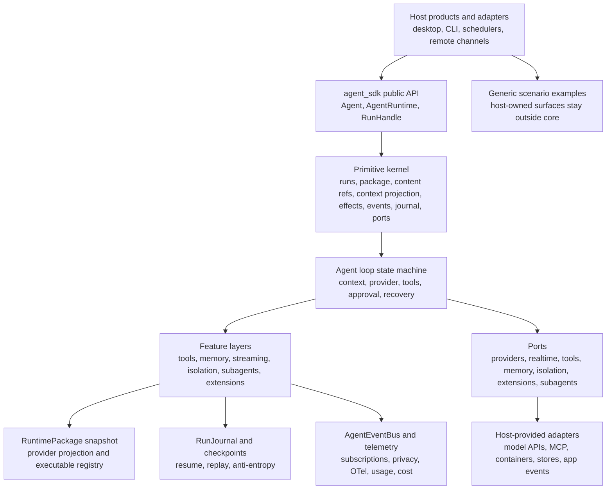

# Standalone Agent SDK

This workspace is the authoritative planning and implementation packet for a new Rust-first Agent SDK. It is intentionally product-neutral: examples may describe host shapes such as desktop apps, CLIs, schedulers, remote channels, or external runtimes, but no product host is allowed to become SDK architecture.

## Repository Shape

This is a monorepo with separable Rust crates:

- `crates/agent-sdk-core`: the lightweight SDK kernel for users who only want agent primitives, records, runtime packages, ports, deterministic fakes, and conformance helpers.
- `crates/agent-sdk-eval`: an optional evaluation framework crate for users who want post-hoc run, turn, session, expected-outcome, cited-support, deterministic metrics, and comparison evaluation primitives.
- `crates/agent-sdk-toolkit`: an optional add-on crate for users who want concrete workspace tools, shell/resource helpers, discovery, and ACP/MCP protocol conformance scaffolding.
- `crates/agent-sdk-provider`: an optional aggregate crate for live OpenAI, Anthropic, and Gemini provider adapters layered over `ProviderAdapter`, plus deterministic transport hooks for tests.
- `crates/clawdia-sdk`: an unpublished local convenience facade that re-exports the split crates through one import path for checkout-based examples and onboarding.

Keep this package boundary deliberate. New capabilities with heavy parser/runtime/provider dependencies should live in optional crates layered over `agent-sdk-core`, not as default core dependencies. Core must remain usable by hosts that only need the primitive SDK contracts.

The current public alpha release is available from crates.io:

```toml
[dependencies]
agent-sdk-core = "0.1.0-alpha.3"
agent-sdk-eval = { version = "0.1.0-alpha.3", optional = true }
agent-sdk-toolkit = { version = "0.1.0-alpha.3", optional = true }
agent-sdk-provider = { version = "0.1.0-alpha.3", optional = true }
```

Consumers can also depend on these crates from the repository:

```toml
[dependencies]
agent-sdk-core = { git = "https://github.com/heyclawdia/clawdia_sdk.git", package = "agent-sdk-core" }
agent-sdk-eval = { git = "https://github.com/heyclawdia/clawdia_sdk.git", package = "agent-sdk-eval", optional = true }
agent-sdk-toolkit = { git = "https://github.com/heyclawdia/clawdia_sdk.git", package = "agent-sdk-toolkit", optional = true }
agent-sdk-provider = { git = "https://github.com/heyclawdia/clawdia_sdk.git", package = "agent-sdk-provider", optional = true }
```

Checkout-based examples can use the unpublished facade for import convenience:

```toml
[dependencies]
clawdia-sdk = { path = "crates/clawdia-sdk", default-features = false }
```

The repository checkout can be ahead of the latest published alpha. Treat
crate-level READMEs and tests as the source of truth for current local API
surfaces, then publish only after the release-readiness gates pass.

## Quickstarts

Start from a live provider and keep the canonical runtime path visible:

1. [Live provider quickstart](docs/examples/live-provider-quickstart.md): one text run through `AgentRuntime`, `RuntimePackage`, a real `ProviderAdapter`, event bus, and journal.
2. [Typed-output quickstart](docs/examples/typed-output-quickstart.md): ergonomic typed output helper lowering into `RunRequest` plus `OutputContract`, with provider-native schema hints when the schema is inline and safe to project.
3. [Tool-approval quickstart](docs/examples/tool-approval-quickstart.md): tool route, policy, journal intent/result, and effect records without direct callback execution.

For run triage and evals, use `agent-sdk-eval::TraceMetrics` or
`agent_sdk_toolkit::AgentTraceEvaluation::compare_sessions` to compute local
started/ended/elapsed time, provider calls, token totals, tool calls, tool
status counts, and per-tool elapsed time from supplied traces. Optional
provider-backed evaluators are explicit post-hoc checks; normal agent runs do
not spend extra evaluator tokens.

The crate family intentionally does not publish a crate named `agent-sdk`.
Public crates.io consumers should depend on the split crates explicitly:
`agent-sdk-core` for the primitive kernel, `agent-sdk-eval` for optional
post-hoc evaluation framework primitives, `agent-sdk-toolkit` for optional
concrete helpers, and `agent-sdk-provider` for provider adapters. Local
checkout users can depend on unpublished `clawdia-sdk` for one import path while
the split crates remain authoritative. Future adapter families should use clear
optional crates such as `agent-sdk-mcp`, `agent-sdk-browser-toolkit`,
`agent-sdk-isolation`, `agent-sdk-otel`, and `agent-sdk-workflow`, with
backend-specific crates added only when dependency weight, platform constraints,
release cadence, licensing, or SemVer pressure justify the split.

## Core Map



## First Reading Path

1. [Start Here](docs/start-here.md): posture, thesis, non-goals, and navigation.
2. [Coding Standards](coding_standards.md): root standards entry point and required validation posture.
3. [Architecture Proposal](docs/architecture/architecture-proposal.md): module layout, state machine, flows, and conceptual Rust skeletons.
4. [Primitive Map](docs/architecture/primitive-map.md): ownership, responsibilities, decision ladder, and must-not-own boundaries.
5. [Contracts](docs/contracts/README.md): normative implementation contracts.
6. [Contract Workstreams](docs/workstreams/README.md): completed documentation-packet ownership rules and phase structure.
7. [Implementation Workstreams](docs/implementation-workstreams/README.md): Rust coding launch map, phase exit reports, and parallel-safe phase folders.
8. [Validation Gates](docs/workstreams/validation-gates.md): shared proof requirements for each workstream.
9. [Toolkit Adapter Roadmap](docs/agent-sdk-toolkit/README.md): optional live provider, OpenAI-compatible provider, ACP, MCP, isolation, browser/web, MLX, and llama.cpp adapter plan.
10. [Feature To Primitive Matrix](docs/reference/feature-to-primitive-matrix.md): how features layer over the shared kernel.
11. [Simplicity Audit](docs/reference/simplicity-audit.md): current simplification opportunities without losing features.
12. [Decision Register](docs/reference/open-questions-and-ambiguities.md): resolved decisions, deferred details, and non-questions for the first Rust slice.

## Agent Crawl Protocol

Agents auditing or building on this SDK should follow the current implementation
path before reading historical phase evidence:

1. Read `AGENTS.md`, this README, [Start Here](docs/start-here.md), and [Coding Standards](coding_standards.md).
2. For current Rust work, use [Implementation Workstreams](docs/implementation-workstreams/README.md), the matching phase exit report, and the exact launch target that owns the files being edited.
3. For API/user ergonomics, start from [API Review](docs/implementation-workstreams/12-scenario-verification/12b-api-review.md), [Simplicity Audit](docs/reference/simplicity-audit.md), `crates/agent-sdk-core/src/lib.rs`, `crates/agent-sdk-core/tests/domain/public_api.rs`, and the unpublished facade in `crates/clawdia-sdk`.
4. For release or broad handoff checks, use [Release Readiness](docs/implementation-workstreams/13-release-readiness/13a-release-readiness.md), the feature flag matrix, the contract-to-code traceability matrix, and `scripts/public-release-audit.sh`.
5. Treat [Contract Workstreams](docs/workstreams/README.md) as historical contract-packet evidence unless a task explicitly asks to reopen contract planning.

The checkout facade import path for first examples is
`clawdia_sdk::prelude::*`. Split-crate users should use
`agent_sdk_core::prelude::*` for common core types and explicit crate-root
items, `agent_sdk_core::ports`, or `agent_sdk_core::testing` when implementing
host ports or conformance tests.

## What Is Normative

| Area | Path | Authority |
| --- | --- | --- |
| Architecture posture | [docs/architecture](docs/architecture) | SDK design direction, primitive kernel, feature layers, and conceptual skeletons |
| Implementation contracts | [docs/contracts](docs/contracts/README.md) | Normative contract packet |
| Contract workstream ownership and validation | [docs/workstreams](docs/workstreams/README.md) | Completed documentation-packet phase sequencing, owner roles, write boundaries, and validation gates |
| Implementation workstream launch map | [docs/implementation-workstreams](docs/implementation-workstreams/README.md) | Rust coding phases, parallel launch targets, phase dependencies, and implementation exit gates |
| Optional adapter/toolkit roadmap | [docs/agent-sdk-toolkit](docs/agent-sdk-toolkit/README.md) | Live provider, OpenAI-compatible provider, ACP, MCP, isolation runtime, browser/web access, MLX, and llama.cpp adapter planning |
| Persistence ownership | [docs/reference/persistence-ownership-map.md](docs/reference/persistence-ownership-map.md) | Journal, checkpoint, content, event cursor, agent pool, tool execution, and provider-argument store boundaries |
| Standards and review | [coding_standards.md](coding_standards.md), [docs/reference/sdk-review-checklist.md](docs/reference/sdk-review-checklist.md) | Coding posture and SDK review rubric |
| Simplicity audit | [docs/reference/simplicity-audit.md](docs/reference/simplicity-audit.md) | Simplification guidance that preserves capability |
| Scenario coverage | [docs/examples](docs/examples/README.md) | Generic host workflows and boundary examples, not SDK core |

## Parallelization Rule

Every non-README launch file inside the current numbered implementation phase folder is parallel-safe with its siblings by contract. Single-target phases serialize naturally. The stitching role owns the primitive kernel, shared names, IDs, event and journal alignment, package fingerprints, public indices, phase structure, and final validation.

Agents working in parallel should only edit the files listed in their launch doc and owner role doc. Cross-cutting changes go through the stitching owner; scenario and non-stitching work should record proposals in their handoff unless their writable list explicitly includes [docs/reference/cross-cutting-proposals.md](docs/reference/cross-cutting-proposals.md).

For contract-packet review, use [docs/workstreams](docs/workstreams/README.md). For Rust implementation, launch from [docs/implementation-workstreams](docs/implementation-workstreams/README.md). Run numbered phase folders in order; every launch file inside the current numbered folder can run in parallel.

## Current Implementation Posture

The documentation contract packet has exited final review, and the first Rust implementation handoff now lives under `crates/agent-sdk-core`, `crates/agent-sdk-eval`, `crates/agent-sdk-toolkit`, `crates/agent-sdk-provider`, and the unpublished `crates/clawdia-sdk` facade. The implementation history and release-readiness evidence live in [docs/implementation-workstreams](docs/implementation-workstreams/README.md).

This checkout includes deterministic fake/test-kit support, optional toolkit helpers, and live provider adapters for OpenAI Responses, Anthropic Messages, and Gemini generateContent in the aggregate `agent-sdk-provider` crate. It does not claim concrete container/runtime, product UI, remote channel, network telemetry exporter, marketplace, workflow-engine, or product-specific host-adapter support.
