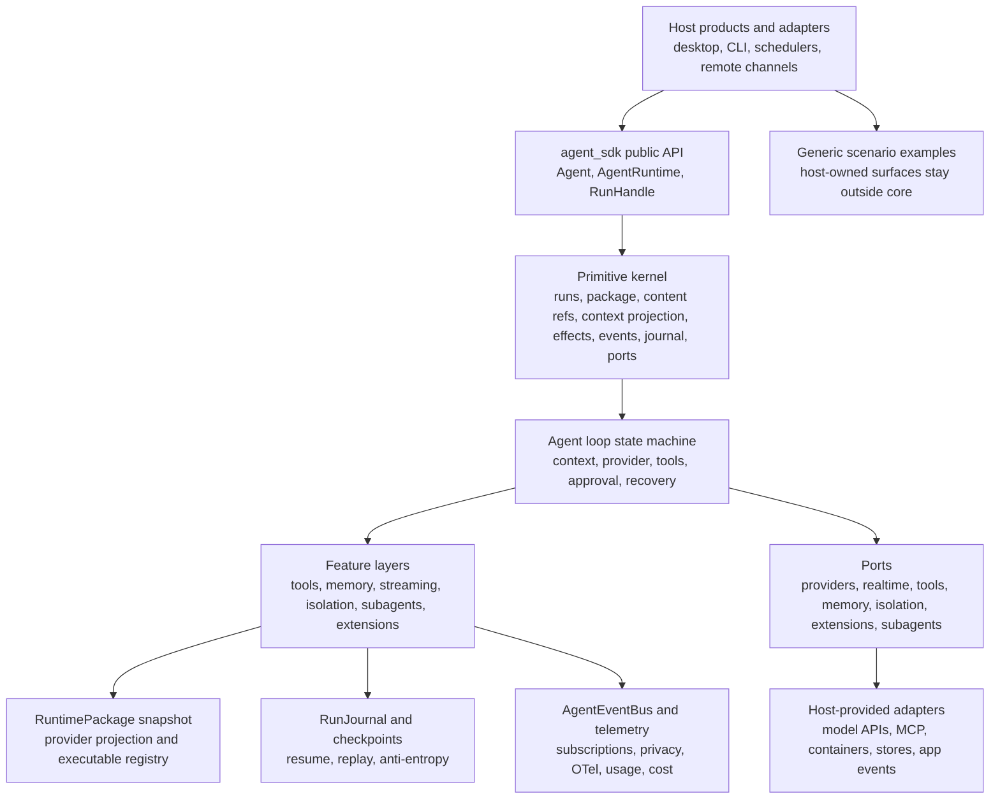

# Standalone Agent SDK

This workspace is the authoritative planning packet for a new Rust-first Agent SDK. It is intentionally product-neutral: examples may describe host shapes such as desktop apps, CLIs, schedulers, remote channels, or external runtimes, but no product host is allowed to become SDK architecture.

## Core Map

## First Reading Path

1. [Start Here](docs/start-here.md): posture, thesis, non-goals, and navigation.
2. [Coding Standards](coding_standards.md): root standards entry point and required validation posture.
3. [Architecture Proposal](docs/architecture/architecture-proposal.md): module layout, state machine, flows, and conceptual Rust skeletons.
4. [Primitive Map](docs/architecture/primitive-map.md): ownership, responsibilities, decision ladder, and must-not-own boundaries.
5. [Contracts](docs/contracts/README.md): normative implementation contracts.
6. [Contract Workstreams](docs/workstreams/README.md): completed documentation-packet ownership rules and phase structure.
7. [Implementation Workstreams](docs/implementation-workstreams/README.md): future Rust coding launch map with parallel-safe phase folders.
8. [Validation Gates](docs/workstreams/validation-gates.md): shared proof requirements for each workstream.
9. [Feature To Primitive Matrix](docs/reference/feature-to-primitive-matrix.md): how features layer over the shared kernel.
10. [Simplicity Audit](docs/reference/simplicity-audit.md): current simplification opportunities without losing features.
11. [Decision Register](docs/reference/open-questions-and-ambiguities.md): resolved decisions, deferred details, and non-questions for the first Rust slice.

## What Is Normative

| Area | Path | Authority |
| --- | --- | --- |
| Architecture posture | [docs/architecture](docs/architecture) | SDK design direction, primitive kernel, feature layers, and conceptual skeletons |
| Implementation contracts | [docs/contracts](docs/contracts/README.md) | Normative contract packet |
| Contract workstream ownership and validation | [docs/workstreams](docs/workstreams/README.md) | Completed documentation-packet phase sequencing, owner roles, write boundaries, and validation gates |
| Implementation workstream launch map | [docs/implementation-workstreams](docs/implementation-workstreams/README.md) | Future Rust coding phases, parallel launch targets, phase dependencies, and implementation exit gates |
| Standards and review | [coding_standards.md](coding_standards.md), [docs/reference/sdk-review-checklist.md](docs/reference/sdk-review-checklist.md) | Coding posture and SDK review rubric |
| Simplicity audit | [docs/reference/simplicity-audit.md](docs/reference/simplicity-audit.md) | Simplification guidance that preserves capability |
| Scenario coverage | [docs/examples](docs/examples/README.md) | Generic host workflows and boundary examples, not SDK core |

## Parallelization Rule

Every non-README launch file inside the current numbered implementation phase folder is parallel-safe with its siblings by contract. Single-target phases serialize naturally. The stitching role owns the primitive kernel, shared names, IDs, event and journal alignment, package fingerprints, public indices, phase structure, and final validation.

Agents working in parallel should only edit the files listed in their launch doc and owner role doc. Cross-cutting changes go through the stitching owner; scenario and non-stitching work should record proposals in their handoff unless their writable list explicitly includes [docs/reference/cross-cutting-proposals.md](docs/reference/cross-cutting-proposals.md).

For contract-packet review, use [docs/workstreams](docs/workstreams/README.md). For future Rust implementation, launch from [docs/implementation-workstreams](docs/implementation-workstreams/README.md). Run numbered phase folders in order; every launch file inside the current numbered folder can run in parallel.

## Current Implementation Posture

The documentation contract packet has exited final review. Future SDK code should start from [docs/implementation-workstreams](docs/implementation-workstreams/README.md), follow the numbered phases in order, and produce the tests, fixtures, smoke checks, scenario checks, and reviewer evidence named by each launch target.
