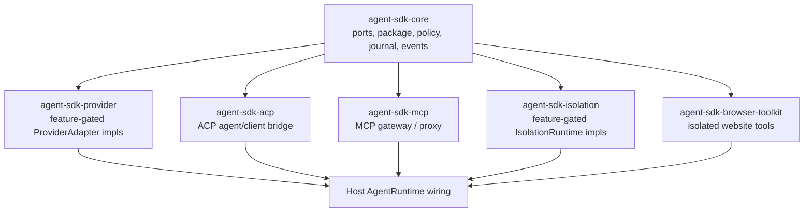
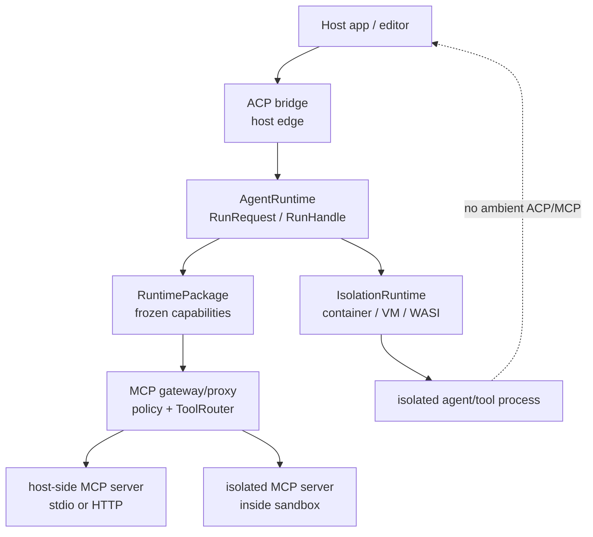

# Adapter And Runtime Plan

## Objective

Plan the optional Agent SDK toolkit layer for:

- live model provider adapters;
- OpenAI-compatible provider adapters;
- ACP interoperability adapters;
- MCP host-proxy and in-isolation gateway adapters;
- secure containerized agents with controlled website/network access;
- local Apple-silicon acceleration using MLX where it belongs;
- reusable test kits and conformance gates for SDK consumers.

This is a documentation-only plan. It creates no Rust source, executable tests, package manifests, fixtures, branches, publish actions, or tags.

## Relevant Existing Context

- [../architecture/coding-standards.md](../architecture/coding-standards.md) requires domain-first package organization, mockability, deterministic fakes, and SDK-consumer test-kit APIs.
- [../architecture/primitive-map.md](../architecture/primitive-map.md) says new behavior must first try existing kernel primitives, typed sidecars, optional adapters, or host-owned refs before adding new primitives.
- [../contracts/api-contracts.md](../contracts/api-contracts.md) already reserves optional crates for toolkit tools, isolation, extension, OTel, host adapters, and workflow.
- [../contracts/tool-pack-contract.md](../contracts/tool-pack-contract.md) keeps read/search/edit/write/shell/resource/browser-like tools outside core and requires policy, content refs, and effect lineage.
- [../contracts/isolation-runtime-contract.md](../contracts/isolation-runtime-contract.md) makes concrete runtimes optional `IsolationRuntime` adapters with capability reports, intent-before-effect records, cleanup, and fail-closed downgrade rules.
- [../contracts/extension-sdk-contract.md](../contracts/extension-sdk-contract.md) keeps JSON-RPC bridges and host manifests outside core, while core sees SDK-facing capabilities after policy.
- [../contracts/output-delivery-contract.md](../contracts/output-delivery-contract.md) keeps product channel UX out of core and treats every output delivery as a sink effect.
- [../contracts/run-handle-reconnect-contract.md](../contracts/run-handle-reconnect-contract.md) defines reconnectable event streams that an ACP or HTTP/SSE host can expose without changing core cursor semantics.
- Existing tool/MCP contracts route MCP discovery and execution through `McpRegistry`, `ToolRouter`, `ToolPack`, package snapshots, approval, and effect records; an isolated process must not inherit ambient MCP roots, server processes, auth, or sockets.
- Existing host-memory guidance says product-specific ACP memory policy must audit every ACP entrypoint and should route durable memory through native host memory tools, not ad hoc files. That is a product host-adapter concern, not a generic SDK-core rule.
- Existing isolation guidance warns that a host process runner is not secure isolation. A runtime is not secure until a real adapter proves its capability report and enforcement behavior.

## External Source Lessons

- Apple Containerization is a Swift package for Linux containers on macOS using `Virtualization.framework` on Apple silicon, and it exposes image, filesystem, lightweight-VM, process, and Rosetta-related APIs. Its README says each container runs in its own lightweight VM and notes macOS 26/Apple silicon requirements. See [apple/containerization](https://github.com/apple/containerization) and [apple/container](https://github.com/apple/container).
- MLX is an Apple machine-learning framework for Apple silicon with Python/C++/C/Swift APIs, lazy computation, dynamic graphs, CPU/GPU support, and examples for LLM generation and other workloads. It is a provider/model acceleration path, not an isolation boundary. See [ml-explore/mlx](https://github.com/ml-explore/mlx).
- llama.cpp is a C/C++ local inference project with GGUF model support, `llama-cli`, `llama-server`, direct Hugging Face model loading, and broad hardware backends including Apple silicon, x86, CUDA, Vulkan, SYCL, and hybrid CPU/GPU execution. It is a strong cross-platform local provider backend, especially for GGUF models. See [ggml-org/llama.cpp](https://github.com/ggml-org/llama.cpp).
- Firecracker provides lightweight microVMs combining hardware virtualization isolation with container-like speed/flexibility, with a minimalist VMM intended to reduce attack surface. See [firecracker-microvm/firecracker](https://github.com/firecracker-microvm/firecracker).
- gVisor provides a userspace application kernel and an OCI runtime (`runsc`) for Docker/Kubernetes/direct use, reducing direct host-kernel exposure for sandboxed containers. See [gVisor docs](https://gvisor.dev/docs/).
- Wasmtime/WebAssembly is useful for small untrusted plugins/tools with capability-based WASI filesystem access, but it is not a general Linux/browser/container runtime. See [Wasmtime security](https://docs.wasmtime.dev/security.html).
- ACP is an open editor-agent interoperability protocol. Zed describes it as a way for agents to integrate with editing environments, the official SDK docs distinguish agent-side and client-side connections, and the transport spec defines UTF-8 JSON-RPC over stdio as the primary local transport with streamable HTTP still draft. The official Rust and TypeScript libraries both cover agent/client sides, and the ACP registry provides agent discovery metadata that hosts may choose to consume. See [Zed ACP](https://zed.dev/acp), the [ACP Rust library](https://agentclientprotocol.com/libraries/rust), the [ACP TypeScript library](https://agentclientprotocol.com/libraries/typescript), [ACP transports](https://agentclientprotocol.com/protocol/transports), and [ACP registry](https://agentclientprotocol.com/registry).
- MCP uses UTF-8 JSON-RPC and defines stdio plus Streamable HTTP transports. Stdio launches the MCP server as a subprocess over newline-delimited JSON-RPC, while Streamable HTTP is the remote/multi-connection transport. See [MCP transports](https://modelcontextprotocol.io/specification/draft/basic/transports).
- OpenAI's Responses API is a reasonable first live-provider candidate because the official docs expose typed semantic streaming events, tool/function-call events, and structured-output streaming. This remains an optional provider adapter, not SDK-core behavior. See [Responses streaming](https://platform.openai.com/docs/guides/streaming-responses), [Responses API reference](https://platform.openai.com/docs/api-reference/responses), and [Structured Outputs](https://platform.openai.com/docs/guides/structured-outputs).
- Provider model catalogs need normalized SDK-owned metadata because official sources expose different shapes. OpenAI exposes model listing and model-family docs; Anthropic exposes a model list plus separate capability docs for vision, context windows, thinking, tools, and partner platforms; Kiro CLI exposes model docs, ACP usage, model selection, and `chat --list-models`; Bedrock exposes `ListFoundationModels` fields such as modalities, streaming, provider, inference type, customization, and lifecycle; Google Cloud exposes Google/partner/open model families in Model Garden / Gemini Enterprise Agent Platform docs; Azure exposes Azure OpenAI accessible models, Foundry model catalog, and a common model inference API with modality concepts. See [OpenAI models](https://platform.openai.com/docs/api-reference/models/list), [Anthropic models](https://docs.anthropic.com/en/api/models-list), [Kiro models](https://kiro.dev/docs/cli/models/), [Kiro CLI commands](https://kiro.dev/docs/cli/reference/cli-commands/), [Kiro ACP](https://kiro.dev/docs/cli/acp/), [Bedrock ListFoundationModels](https://docs.aws.amazon.com/bedrock/latest/APIReference/API_ListFoundationModels.html), [Google models](https://cloud.google.com/vertex-ai/generative-ai/docs/models), [Azure OpenAI models list](https://learn.microsoft.com/en-us/rest/api/azureopenai/models/list?view=rest-azureopenai-2024-10-21), and [Azure AI Model Inference API](https://learn.microsoft.com/en-us/rest/api/aifoundry/modelinference/).

## Design Thesis

The toolkit should make real deployments easy without making core own deployments.



Rules:

- Provider adapters are `ProviderAdapter` implementations plus provider-specific projection/stream mapping.
- ACP is an interoperability bridge, not a model provider by default. The toolkit may expose provider-like ergonomics such as `AcpAgentProvider`, but that facade lowers to `ExternalAgentAdapter` or a supervised subagent route, not a raw model `ProviderAdapter`.
- MCP is a capability import and execution gateway, not ambient tool authority for isolated processes.
- Container/browser tooling is a tool pack plus `IsolationRuntime` selection, not shell access with nicer names.
- MLX is a local provider/acceleration backend. It can power model inference on Apple silicon, but it does not sandbox untrusted code or website access.
- A "containerized agent" is a composed preset: runtime package + provider route + tool packs + isolation sidecar + web/network policy + output sinks + conformance tests.

Practical complexity rules:

- Ship a small set of opinionated presets first, and expand only when real deployments need more shapes.
- Keep preset helpers stateless and minimal; no central authoritative toolkit object.
- Require conformance and fake-harness coverage before adding provider, ACP, MCP, browser, or isolation variants.
- Prefer host-managed services for risky local integrations when capability reporting, lifecycle control, credential handling, and cleanup are clearer outside the workload.
- Keep a documented default path for common deployments so most users do not need to assemble components manually.

## Shared Primitive Surface

Toolkit work reuses the existing SDK primitive kernel. It must not create a second runtime, package registry, event stream, journal, policy path, context path, telemetry truth store, or side-effect path.

| Toolkit surface | Existing primitives reused | Optional crate owns | Host-owned |
| --- | --- | --- | --- |
| Live provider adapters | `ProviderAdapter`, `ProviderEventMapper`, `RuntimePackage`, `ContextProjection`, `ModelAttemptRecord`, `AgentEvent`, `RunJournal`, `EffectIntent`, `EffectResult`, `PolicyRef`, `ContentRef` | provider request projection, stream chunk mapping, retry/error classification, usage extraction, fake HTTP harness | credentials, provider selection UI, billing account, raw secret resolution, provider account policy |
| OpenAI-compatible providers | `ProviderAdapter`, `ProviderEventMapper`, `ProviderRouteSnapshot`, `RuntimePackage`, `ModelRef`, `AgentEvent`, `RunJournal`, `PolicyRef`, `ContentRef` | compatibility profile, base-URL transport adapter, dialect capability report, streaming/tool/structured-output normalization, conformance fakes, public model-catalog schema and checked-in public metadata | endpoint allowlist, credentials, account policy, private catalog overlays, endpoint-visible availability, billing/rate limits |
| ACP bridge | `RunRequest`, `RunHandle`, `EventFrame`, `EventCursor`, `OutputSink`, `ExternalAgentAdapter`, `ToolPack`, `EffectIntent`, `EffectResult`, `RunJournal`, `AgentEvent`, `PolicyRef`, `ContentRef` | protocol mapping, fake ACP client/server, optional external-agent adapter, provider-like `AcpAgentProvider` facade that lowers into external-agent primitives | editor UI, workspace handles, terminal handles, approval UX, durable memory policy, session store |
| MCP bridge | `McpRegistry`, `ToolRouter`, `ToolPack`, `CapabilitySpec`, `RuntimePackage`, `ContentRef`, `EffectIntent`, `EffectResult`, `RunJournal`, `AgentEvent`, `PolicyRef` | MCP client/proxy adapters, host-side and isolated MCP server launch helpers, transport-level fakes, capability projection | MCP server installation, server auth, root selection, resource backing stores, remote service accounts |
| Isolation runtimes | `ExecutionEnvironment`, `IsolationRequirement`, `IsolationRuntime`, `ProcessSpec`, `IsolationRecord`, `ChildLifecycleRecord`, `EffectIntent`, `EffectResult`, `RunJournal`, `AgentEvent`, `PolicyRef` | adapter capability reports and runtime lifecycle implementation | runtime installation, image credentials, host paths, network plumbing, process inspector UX |
| Browser and website tooling | `ToolPack`, `CapabilitySpec`, `ExecutionEnvironment`, `ToolRecord`, `EffectIntent`, `EffectResult`, `RunJournal`, `AgentEvent`, `ContentRef`, `PolicyRef` | browser runner port, fetch/navigation/action/download tools, fake web harness | host browser profile, cookies/credentials, user approval surface, product remote-control UX |
| Local MLX / llama.cpp providers | `ProviderAdapter`, `ProviderEventMapper`, `RuntimePackage`, `ModelAttemptRecord`, `AgentEvent`, `RunJournal`, `PolicyRef`, `ContentRef`, `ArtifactRef` | local provider transport, device/model capability reporting, artifact resolver hooks, deterministic fake backend | model/runtime artifact policy, local process supervision policy, hardware availability, privacy posture |
| Model/runtime artifact resolution | `ArtifactRef`, `ContentRef`, `EffectIntent`, `EffectResult`, `RunJournal`, `AgentEvent`, `PolicyRef`, `IdempotencyKey`, `DedupeKey` | artifact resolver adapters, cache validators, optional runtime installers, fake cache/download harnesses | private model catalogs, mirrors, license acceptance policy, local cache location, enterprise controls |
| Toolkit conformance | public testing namespace or optional conformance crate, fake providers/tools/sinks/runtimes, golden event/journal expectations | reusable SDK-consumer harnesses and hostile scenario scripts | downstream adapter implementation choices |

No row above introduces a new primitive. If implementation discovers a real gap, Phase A must record the primitive decision ladder result and update the owning contract before code starts.

## Stateless Toolkit Facades

The toolkit may expose ergonomic presets, but presets are not authority. A facade such as `ProviderPreset`, `BrowserPreset`, or `ContainerizedAgentPreset` is a namespace or stateless helper that returns existing SDK builders, typed sidecars, adapter registration helpers, `ToolPack`s, or `IsolationRequirement`s.

Forbidden facade behavior:

- storing credentials, provider clients, package registries, runtime registries, journals, event buses, policy engines, context state, telemetry stores, or side-effect queues;
- running an agent, launching a process, sending an ACP message, opening a browser, or making a provider request during preset construction;
- changing package contents after the package snapshot is built;
- bypassing deterministic fakes or conformance harnesses with fake-only shortcuts.

Common path sketch:

```rust
// Non-compiling design sketch.
let access = AccessProfile::repo_readonly()
    .workspace(WorkspaceRef::current_dir())
    .runtime(RuntimePreset::auto_secure_local())
    .acp(AcpAccess::host_bridge().stdio_transport())
    .mcp(McpAccess::host_proxy(McpServerRef::new("server.git"))
        .allow_tools(["git.status", "git.diff"]))
    .mcp(McpAccess::host_proxy(McpServerRef::new("server.docs"))
        .allow_resources(["docs://rust-sdk"]))
    .build()?;

let provider = ProviderPreset::openai_responses()
    .auth(AuthRef::env("OPENAI_API_KEY"))
    .build_adapter()?;

let compatible_provider = ProviderPreset::openai_compatible()
    .endpoint(EndpointRef::host_configured("provider.compat.responses"))
    .auth(AuthRef::host_secret("provider.compat.api_key"))
    .compatibility(OpenAiCompatibility::responses_strict())
    .build_adapter()?;

let acp_agent_provider = AcpAgentProvider::builder()
    .command(AcpAgentCommandRef::host_configured("agent.acp.external"))
    .transport(AcpTransport::stdio())
    .io_policy(AcpIoPolicy::content_refs_only())
    .build_agent_provider()?;

let local_provider = LocalModelPreset::auto()
    .prefer_backend(LocalBackend::MlxOnAppleSilicon)
    .fallback_backend(LocalBackend::LlamaCpp)
    .model(ModelArtifactRef::catalog("qwen-small-instruct-q4"))
    .artifact_policy(ModelArtifactPolicyRef::new("policy.local-models"))
    .build_adapter()?;

let web_pack = BrowserPreset::research_readonly()
    .allow_sites(["https://docs.rs"])
    .build_tool_pack()?;

let isolation = ContainerizedAgentPreset::local_lightweight_vm()
    .prefer(IsolationRuntimeRef::new("isolation.apple.container"))
    .build_requirement()?;

let package = RuntimePackage::for_agent(agent.snapshot())
    .provider_route(provider.route_ref())
    .access_profile(access)
    .tool_pack(web_pack)
    .isolation_requirement(isolation)
    .build()?;

let external_agent_package = RuntimePackage::for_agent(agent.snapshot())
    .agent_provider_route(acp_agent_provider.route_ref())
    .access_profile(access)
    .isolation_requirement(isolation)
    .build()?;
```

Each helper returns ordinary SDK configuration. The host still registers adapters on `AgentRuntime`, owns credentials and policy, and starts runs through `RunRequest` / `RunHandle`. The sketches show two different package shapes: one model-backed package and one external-agent-backed package. A single run must not have ambiguous generation authority.

## Provider And Model Routing

Every agent must have an explicit effective route for how it generates work. The simple API can make this feel like "pick a provider and model," but the canonical output is still a frozen `RuntimePackage` route snapshot.

Route kinds:

| Route kind | User-facing helper | Lowered primitive | Notes |
| --- | --- | --- | --- |
| Live model provider | `ProviderPreset::openai_responses`, concrete provider builders | `ProviderRouteSnapshot` + `ProviderAdapter` | Model calls, streaming chunks, usage, structured output, tool-call projection. |
| OpenAI-compatible provider | `ProviderPreset::openai_compatible().compatibility(...)` | `ProviderRouteSnapshot` + compatibility sidecar + `ProviderAdapter` | Requires endpoint allowlist, dialect capability report, fake compatibility suite, and typed unsupported-feature errors. |
| Local model provider | `LocalModelPreset::auto`, `MlxLocalProvider`, `LlamaCppProvider` | `ProviderRouteSnapshot` + local model/artifact sidecars | Backend setup errors happen before provider attempts. |
| ACP agent provider | `AcpAgentProvider::builder` | agent-provider route sidecar + `ExternalAgentAdapter` | Provider-like ergonomics, external-agent semantics. ACP model/provider selection is mapped through policy if the ACP agent supports it. |

### Effective Generation Route

Every run has exactly one primary generation route in its effective `RuntimePackage`. That route may be a model-provider route or an external-agent/ACP route, but it is never both by accident.

Rules:

- `Agent` defaults and toolkit presets are inputs to package construction. The resolved package snapshot is the authority.
- If no primary route can be resolved, package validation fails with a typed setup error before `RunStarted`.
- If both a model-provider route and an external-agent route are configured as primary routes, package validation fails with `AmbiguousGenerationRoute` unless a future contract adds an explicit ordered failover policy.
- Fallback is policy, not magic. A host that wants "try provider A, then provider B" must model that as an ordered route-selection policy with stable route refs, setup-attempt records, retry limits, and journaled final selection before the first provider or external-agent attempt.
- External agents, subagents, or MCP tools may be available as callable capabilities only when they are lowered into `CapabilitySpec` entries or typed sidecars. That does not make them alternate primary generation routes.
- Route summaries must be comparable for observability: route kind, stable provider or agent-provider ref, selected model/catalog ref when applicable, compatibility profile, capability-report hash, policy refs, and package fingerprint. They exclude credentials, raw endpoints unless policy marks them public, ACP session IDs, process IDs, request IDs, volatile health, and provider-native transient handles.
- ACP provider-like helpers lower to external-agent lifecycle records and policy paths. They must not implement a raw model `ProviderAdapter` path or bypass `RunHandle`, event cursor, output sink, approval, or journal semantics.

### Provider Model Catalog

Provider/model support changes too frequently to scatter through adapters. `agent-sdk-provider` should have one checked-in, versioned source-of-truth catalog file, for example `crates/agent-sdk-provider/provider-model-catalog.toml`, and generated typed accessors may be built from it.

The catalog owns supported model metadata:

- provider ID, route family, canonical model ID, provider-native model name, aliases, and deprecation/sunset status;
- endpoint family such as Responses, chat-completions-compatible, embeddings, image generation, local MLX, local llama.cpp, or ACP agent-provider session config;
- input and output modalities: text, image, audio, video, file, embedding, structured JSON, tool calls, and provider-native artifacts;
- reasoning/thinking capabilities: unsupported, hidden/internal, reasoning summaries, configurable effort/budget, visible chain restrictions, and redaction defaults;
- tool and output support: function/tool calling, parallel tool calls, structured output, JSON schema subset, streaming tool arguments, refusals, citations, and usage reporting;
- limits and behavior: context window, max output, image sizes, file limits, rate-limit class, streaming support, batch support, cache/prefix support, and known incompatibilities;
- compatibility notes for OpenAI-compatible endpoints: strict Responses-compatible, chat-completions-only, degraded streaming, missing usage, nonstandard tools, or unsupported structured output.

Rules:

- Provider adapters must read model capability decisions from the catalog or a typed generated view of it. They must not hardcode supported model names or capability booleans in provider modules, examples, or tests.
- Runtime packages contain stable model refs, provider route refs, catalog version/hash, and policy refs. They do not contain raw API endpoints, credentials, volatile health, live availability, or pricing-account state.
- A selected model must fail package validation or provider setup with a typed error when the catalog says the requested feature is unsupported.
- Catalog updates are reviewed data changes with conformance fallout. Adding, renaming, deprecating, or changing a model capability requires fake/golden coverage for route selection and projection.
- Every catalog entry records source refs or host probes used to derive it so model metadata can be audited, refreshed, and diffed without hiding provider drift inside adapter code.
- Hosts may overlay private model catalogs, but overlays must merge through the same schema and produce a new catalog hash rather than mutating global provider behavior ambiently.

Initial research targets:

| Provider surface | Source/probe | Catalog normalization |
| --- | --- | --- |
| OpenAI | Models API plus model-family docs for Responses, Realtime, Audio, Images, Embeddings, structured output, tools, and reasoning. | API listing gives availability, while SDK capability fields still need reviewed annotations for modalities, reasoning effort, tool calls, structured output, image/audio, and specialized endpoints. |
| Anthropic | Models API plus capability docs for vision, context windows, extended/adaptive thinking, tool use, streaming, structured output, and cloud-platform differences. | Catalog must separate API model IDs from capability flags such as image input limits, thinking modes, tool/parallel-tool support, output limits, and Bedrock/Vertex restrictions. |
| Kiro CLI | Kiro model docs, `kiro-cli chat --list-models`, `kiro-cli chat --list-models --format json`, `kiro-cli settings chat.defaultModel`, and ACP model/session methods. | Treat as an ACP agent-provider catalog source. Kiro-selected models become host/ACP session config refs, not direct model-provider refs, and updates come from a host probe or checked-in fixture. |
| Amazon Bedrock | `ListFoundationModels` / `GetFoundationModel` and regional account access. | Normalize `modelId`, provider, ARN, input/output modalities, streaming support, inference types, customization support, lifecycle/status, and region/account overlays. |
| Google Cloud | Gemini Enterprise Agent Platform / Vertex Model Garden pages, model-version docs, and partner/open model docs. | Normalize first-party Gemini, media models, embeddings, partner models, open models, preview/deprecation state, modalities, context, thinking/reasoning, tool/structured-output support, and region/project access overlays. |
| Microsoft Azure | Azure OpenAI accessible models API, Azure OpenAI model concepts, Foundry model catalog, and Azure AI Model Inference modality docs. | Normalize Azure resource-visible models separately from global support; include deployment type, region/data-zone availability, model version policy, task/modality, OpenAI-compatible surface, and Foundry partner model caveats. |

Catalog file sketch:

```toml
# Non-normative sketch. Exact schema belongs to Phase B before code.
catalog_version = "2026-05-24.1"
schema_version = 1

[[models]]
provider = "openai"
route_family = "responses"
canonical_model = "model.openai.gpt.example"
native_name = "gpt-example"
aliases = ["gpt-example-latest"]
status = "stable" # stable | preview | deprecated | retired
input_modalities = ["text", "image"]
output_modalities = ["text", "structured_json"]
context_window_tokens = 128000
max_output_tokens = 16000
streaming = true
tool_calling = "supported"
parallel_tool_calling = "unknown"
structured_output = "json_schema_subset"
reasoning = { mode = "configurable_effort", summaries = true, visible_chain = false }
image = { input = true, output = false }
source_refs = ["provider-docs.openai.models", "provider-docs.openai.responses"]

[[models]]
provider = "kiro-cli"
route_family = "acp_agent_provider"
canonical_model = "model.kiro.host.selected"
native_name = "host-selected"
status = "stable"
source_mode = "host_probed"
input_modalities = ["text", "file_ref"]
output_modalities = ["text", "patch_ref"]
reasoning = { mode = "agent_owned", summaries = "acp_stream" }
source_refs = ["host-probe.kiro.chat-list-models", "provider-docs.kiro.acp"]
```

Per-agent defaults:

```rust
// Non-compiling design sketch.
let reviewer = Agent::builder()
    .id(AgentId::new("agent.review"))
    .default_provider_route(ProviderRouteRef::new("provider.openai.compat"))
    .default_model(ModelRef::new("model.review.default"))
    .build()?;

let coder = Agent::builder()
    .id(AgentId::new("agent.coder"))
    .default_agent_provider_route(AgentProviderRouteRef::new("agent-provider.acp.external"))
    .default_model(ModelRef::new("model.host.selected"))
    .build()?;

let package = RuntimePackage::for_agent(reviewer.snapshot())
    .provider_route(
        ProviderRouteSnapshot::builder()
            .provider(ProviderRef::new("provider.openai.compat"))
            .model(ModelRef::new("model.review.default"))
            .policy(PolicyRef::new("policy.provider.review"))
            .build()?,
    )
    .build()?;
```

Rules:

- `Agent` defaults are convenience inputs. The effective `RuntimePackage` route snapshot is the execution authority for a run.
- A run may select or tighten provider/model policy before start, but it cannot mutate the active package after `RunStarted`.
- Model refs are stable host/catalog refs backed by the provider model catalog. Runtime packages do not store raw endpoint URLs, API keys, account IDs, volatile health, or provider session IDs.
- ACP agent providers may expose model/provider selection only when the ACP agent advertises that capability and host policy allows it. The selection is represented as stable refs and journaled ACP session configuration effects, not ambient session mutation.
- Provider-like helpers for live, compatible, local, and ACP-backed routes must all produce comparable route summaries for observability, but their lowered primitives stay distinct.

## Prebuilt Access Profiles

Access profiles are the intended simple interface for common isolated-agent setups. They are stateless presets that lower into `RuntimePackage`, `ExecutionEnvironment`, `ToolPack`, `CapabilitySpec`, mount/network/credential sidecars, and policy refs.

Profiles must be safe by default:

- No profile defaults to the user's home directory. A host may default to the current project/workspace when it has an explicit `WorkspaceRef`, but `~` requires explicit opt-in and approval.
- Read-only is the default filesystem mode. Write/edit profiles require explicit approval policy.
- Network is disabled unless the profile takes an allowlist or a named policy ref.
- Browser credentials and host browser profiles are absent unless the host provides explicit credential refs under policy.
- ACP and MCP authority is absent unless the profile takes explicit bridge/server refs and allowed capability policy.
- Runtime fallback is fail-closed. If a profile requests container/VM isolation and no acceptable runtime is available, the SDK returns a setup error unless policy explicitly allows host-process fallback.

Prebuilt profiles:

| Profile | Caller supplies | Defaults | Lowers into |
| --- | --- | --- | --- |
| `AccessProfile::repo_readonly()` | `WorkspaceRef` or host current workspace ref | read/search tools, read-only mount or content-ref resolver, no network, isolated runtime auto-selected | `ToolPack::workspace_readonly`, read-only mount policy, `IsolationRequirement`, package policy refs |
| `AccessProfile::repo_edit_with_approval()` | `WorkspaceRef`, approval policy | read/search/edit tools, write actions require approval, no network unless added | workspace read/edit tool packs, write approval policy, effect intent/result records |
| `AccessProfile::web_research()` | URL/domain allowlist | browser/fetch read-only tools, no cookies, no host profile, isolated browser runtime | browser tool pack, network allowlist sidecar, content-ref capture policy |
| `AccessProfile::mcp_host_proxy()` | MCP server refs plus exact allowed tool/resource/prompt IDs | host-mediated MCP capabilities, no raw server auth or roots in isolation, no whole-server exposure by default | `McpRegistry`, `ToolPack::mcp`, filtered `CapabilitySpec`s, tool/effect records |
| `AccessProfile::mcp_inside_isolation()` | isolated MCP server spec, mounts/network policy | MCP server launched inside selected runtime, no host roots except explicit mounts | `ExecutionEnvironment`, MCP sidecar, filtered capabilities, isolation/process records |
| `AccessProfile::container_task()` | image/rootfs or runtime artifact ref, optional workspace mounts | no network, read-only root, bounded process limits, cleanup on cancel | `ExecutionEnvironment`, mount/network/resource sidecars, isolation lifecycle records |
| `AccessProfile::local_model_research()` | model artifact/catalog ref or provider route | local provider route, no tool/file/network access unless added | provider route sidecar, model artifact policy refs, provider conformance requirements |
| `AccessProfile::custom()` | explicit fields | no implicit filesystem, network, credentials, shell, or browser | manually selected primitive builders |

Example:

```rust
// Non-compiling design sketch.
let access = AccessProfile::web_research()
    .workspace(WorkspaceRef::current_dir().read_only())
    .allow_sites(["https://developer.apple.com", "https://docs.rs"])
    .runtime(RuntimePreset::auto_secure_local())
    .build()?;
```

### Runtime Auto Selection

`RuntimePreset::auto_secure_local()` is a resolver, not a security claim. It asks registered runtime adapters for capability reports and chooses the first adapter that satisfies the requested `IsolationRequirement`, policy, platform, and workload shape.

Recommended first resolver policy:

| Platform/workload | Preferred runtime | Fallback posture |
| --- | --- | --- |
| Supported Apple silicon/macOS for local Linux container workloads | Apple Containerization / `container` with lightweight-VM isolation | deny if unsupported, unless host policy explicitly allows another registered runtime |
| Linux OCI/browser/CLI workload where Docker/Kubernetes compatibility matters | gVisor through `agent-sdk-isolation::gvisor` | deny or consider Firecracker when VM isolation is required |
| Linux multi-tenant/server workload requiring stronger VM boundary | Firecracker through `agent-sdk-isolation::firecracker` | deny if kernel/rootfs/network/jailer prerequisites are missing |
| Small plugin/tool workload with explicit WASI capabilities | Wasmtime through `agent-sdk-isolation::wasmtime` | deny for browser/general Linux workloads |
| Tests/trusted local-only workflows | fake runtime or explicit host process test policy | never satisfies production container/VM isolation by default |

The resolver considers security requirements before speed. "Fastest available" is acceptable only among runtimes that already satisfy class, trust, network, mount, cleanup, stats, redaction, and audit requirements. Any downgrade emits journal-backed policy evidence and fails closed unless the active package and host policy accept it.

## Adapter Registration, Readiness, And Setup Failures

Adapters are registered with `AgentRuntime` by the host. Optional toolkit crates expose builders, adapters, fakes, and conformance harnesses, but registration is not runtime-package authority. The active package contains stable refs, policy refs, sidecars, and fingerprints; the runtime resolves those refs to host-registered adapter instances before executing.

Setup must fail before side effects:

- Missing provider, ACP, MCP, browser, isolation, artifact, content, journal, event, approval, or output-sink adapters produce typed setup errors. They do not silently fall back to host process, ambient network, raw filesystem, default browser profile, or a different provider.
- Host credential and endpoint resolution happens at the adapter edge through `AuthRef`, `EndpointRef`, or host secret refs. Raw tokens, refresh tokens, account IDs, private base URLs, and credential profile names never enter package fingerprints, journals, events, golden fixtures, or model context.
- Credential refresh is host-owned. If a refresh is needed during an adapter call, the adapter records only redacted status, stable auth ref, policy decision ref, and retry classification.
- Capability and health checks are bounded, cancellable, and policy-scoped. Stable capability-report schema/version/hash can affect setup decisions; volatile health, latency, process IDs, temporary paths, and live request IDs are not package fingerprint inputs.
- Setup records distinguish `HostConfigurationNeeded`, `AdapterUnavailable`, `CapabilityUnsupported`, `PolicyDenied`, `ArtifactUnavailable`, `ArtifactValidationFailed`, `UnsupportedModelCapability`, and `AmbiguousGenerationRoute` instead of collapsing everything into provider failure.
- A setup failure before the first provider/external-agent attempt does not create a fake model attempt. It emits/journals setup and package-validation facts through the existing event/journal families named by Phase A.
- Cancellation during setup must cancel or clean up any started child process, artifact download, browser process, isolated session, or protocol subprocess through the same child-lifecycle and effect-result paths.

Conformance harnesses must include setup-only scenarios. A live smoke that succeeds cannot replace fake coverage for missing adapter, missing credentials, denied endpoint, unsupported model capability, failed artifact validation, failed capability report, ambiguous route selection, cancellation during setup, and journal append failure before setup-side effects.

## Canonical Lowering Matrix

Every adapter implementation goal must expand this matrix into concrete contract rows before coding. A row is incomplete if it lacks helper/API, lowered primitive, sidecar/capability, policy/effect/journal path, event/cursor/content refs, and fake/conformance harness.

| Adapter family | Helper/API | Lowered primitive | Sidecar/capability/fingerprint | Policy, effect, journal | Event, cursor, content refs | Fake/conformance gate |
| --- | --- | --- | --- | --- | --- | --- |
| Live provider | `ProviderPreset::*`, concrete `*Provider::builder`, runtime provider registration | `ProviderAdapter`, `ProviderEventMapper`, `ProviderRouteSnapshot`, `ContextProjection` | Stable provider route ref, model ref, provider model catalog version/hash, projection/redaction/retry policy refs, provider capability version. Exclude credentials, HTTP clients, account IDs, request IDs, and volatile health. | `ModelAttemptRecord { provider_request_intent }` before transport, `EffectKind::ProviderRequest`, terminal attempt/result record after completion/failure/cancel. Missing journal or policy fails closed. Unsupported model/catalog capabilities fail before provider request when detectable. | Existing `ProviderRequestProjected`, `ModelAttemptStarted`, `ModelStreamDelta`, `ModelMessageCompleted`, `ModelUsageRecorded`, `ModelAttemptFailed`, `ModelAttemptCancelled`; deltas carry `EventCursor` and content refs/redacted summaries. | Fake HTTP transport, scripted chunks, malformed chunks, partial close, retry/error classifier, usage extraction, cancellation, redaction, auth absence, catalog lookup, unsupported capability, deprecated alias. |
| OpenAI-compatible provider | `ProviderPreset::openai_compatible`, `OpenAiCompatibleProvider::builder` | `ProviderAdapter`, `ProviderEventMapper`, `ProviderRouteSnapshot`, compatibility sidecar | Stable endpoint ref, compatibility profile, supported endpoint family, model ref, provider model catalog version/hash, capability report hash, projection/retry/redaction policy refs. Exclude raw base URL unless host policy marks it public, raw auth, account IDs, health probes, request IDs, and provider-specific volatile headers. | Same provider request intent/result path as live providers. Unsupported compatibility features fail before provider request when detectable; transport errors preserve retry classification without inventing provider-specific control flow. | Same model event family as live providers, with compatibility diagnostics in redacted summaries/content refs when policy allows. | Fake OpenAI-compatible server with strict and degraded dialects: Responses-compatible stream, chat-completions-only endpoint, missing usage, malformed SSE/event names, nonstandard tool-call shape, structured-output refusal, auth absence, base-URL denial, cancellation, unsupported-feature error, catalog mismatch. |
| ACP agent-side server | `AcpAgentServer::builder().serve_stdio()` or transport-specific serve helper | ACP `session/prompt` -> `RunRequest`; `session/cancel` notification -> `RunHandle::cancel`; `session/update` stream -> `EventFrame` / `OutputSink`; client-side `fs/read_text_file`, `terminal/create`, and `session/request_permission` requests -> package capabilities | ACP bridge sidecar with protocol version, exposed workspace refs, transport mode, allowed capability refs, and policy refs. Exclude editor handles, terminal IDs, raw paths, session tokens. | ACP sends that cross process/editor boundaries are effect intents/results or output-dispatch intents/results. File/tool/terminal operations use normal tool/approval/effect records. | Existing run/tool/output events plus ACP supplement events that Phase A must name before code: session opened/closed, prompt received, reconnect requested, protocol message rejected. ACP reconnect maps to `EventCursor`, not ACP session ID truth. | Transport-level fake ACP client and fake ACP agent communicating over newline-delimited JSON-RPC stdio as the mandatory first harness; `initialize`, `session/new`, `session/prompt`, `session/update`, `session/cancel`, malformed frames, reconnect, duplicate events, `fs/read_text_file` denial, `terminal/create` denial, `session/request_permission`, and approval timeout must cross that transport boundary. No in-process helper-only fake can satisfy conformance. |
| ACP client-side external agent | `AcpExternalAgentAdapter::builder()` | `ExternalAgentAdapter` or subagent/tool capability over core events and content refs | External-agent sidecar with command/transport ref, protocol version, session scope, allowed output/tool refs, and policy refs. Exclude process IDs, editor handles, raw session tokens. | Launch/send/cancel/retire are journaled external-agent or effect intent/result records before adapter calls. Tool/action requests re-enter package-resolved policy paths. | Existing `Subagent*`, `RunMessage*`, `Tool*`, `OutputDispatch*`, and ACP supplement protocol events; stream frames carry event cursors and content refs. | Fake external ACP subprocess using the same JSON-RPC stdio framing as real ACP agents, plus optional custom/HTTP transport fakes once supported. Cases include scripted protocol responses, denied action, dropped connection, replay from cursor, duplicate terminal event, malformed message, and non-ACP stdout noise. |
| MCP host-proxy bridge | `McpAccess::host_proxy(server).allow_tools([...])`, `McpRegistry::from_servers`, `ToolPack::mcp` | Selected MCP tools/resources/prompts -> `CapabilitySpec` and typed sidecars in `RuntimePackage`; tool calls -> `ToolRouter` / `ToolExecutor`; resources -> `ContentRef` | MCP sidecar includes server ref, transport mode, protocol version, exact allowed tools/resources/prompts, roots refs, auth policy refs, and redaction policy. Exclude server process IDs, raw auth tokens, raw roots, remote session IDs. Whole-server import is denied unless a separate policy explicitly allows it. | Server launch, remote HTTP calls, and tool invocations are effect intents/results before transport calls. Tool calls use normal approval policy. Resource reads become content refs under policy. | Existing `ToolRequested/Started/Completed/Failed`, `ContextContribution*`, `OutputDispatch*`, and isolation events when server is isolated; Phase A names MCP supplement events for server started/stopped, capability imported/rejected, protocol rejected, and resource denied. | Transport-level fake MCP server over JSON-RPC stdio as first harness plus Streamable HTTP fake for remote mode. Cases include `initialize`, required `notifications/initialized`, lifecycle rejection before initialization, `tools/list`, selected `tools/call`, denied unselected `tools/call`, `resources/list/read`, roots denied, prompt denied, malformed frames, non-MCP stdout noise, duplicate responses, dropped connection, cancellation, and approval denial. |
| MCP isolated-server bridge | `McpAccess::inside_isolation`, isolated MCP server sidecar | `ExecutionEnvironment` plus `McpRegistry` import from a server launched inside the isolated runtime | Same MCP sidecar plus isolation sidecar. Server can see only mounted roots and allowed network from the isolation policy. Exclude host paths and host auth by default. | Isolation prepare/start records happen before MCP initialization. MCP discovery output is policy-filtered before becoming package capabilities. MCP tool calls still use normal effect/journal records. | Isolation lifecycle events plus tool/context events. MCP server stdout/stderr are content refs/redacted summaries. | Fake isolated MCP server launched through fake runtime with denied mount, denied network, malformed stdout, discovery rejection, cleanup on cancel, and replay/recovery cases. |
| Isolation runtime | `IsolationRequirement::at_least(...).prefer(...)`, concrete runtime adapter registration | `ExecutionEnvironment`, `IsolationRuntime`, `ProcessSpec`, `IsolationCapabilityReport` | Isolation sidecar/fingerprint includes class, trust vector, required capabilities, adapter preferences, fallback policy, image/rootfs/mount/network/secret/resource policy hashes, cleanup policy. Exclude adapter health, PIDs, temp paths, live stats. | `IsolationRecord::*Intent/Result` maps to `EffectIntent`/`EffectResult` before image/rootfs/session/mount/network/secret/process/cleanup adapter calls. Downgrades fail closed unless policy explicitly allows. | Existing `IsolationRequested`, `IsolationAdapterHealthChecked`, `IsolationCapabilityMatched`, `IsolationProcessStarted`, `IsolationProcessStatsRecorded`, `IsolationProcessExited`, `IsolationCleanupCompleted/Failed`, `IsolationFailed`; process I/O uses content refs/redacted summaries. | Fake runtime, unsupported host, missing kernel/rootfs, network denied, egress allowlist, read-only root, mount escape denial, stats, cancellation, cleanup failure, downgrade denial. |
| Browser/web toolkit | `BrowserPreset::*`, `BrowserToolPack::builder`, `web_fetch_readonly`, `browser_readonly`, `browser_interactive_with_approval` | `ToolPack`, `CapabilitySpec`, `ToolExecutor`, `ExecutionEnvironment`, `ContentRef` | Tool sidecars name network policy, action policy, credential scope, capture policy, download policy, isolation requirement, and policy refs. Fingerprint includes stable policies and excludes cookies/browser profile/session IDs. | Navigation/action/download/upload/form submit use `ToolRecord` plus `EffectIntent`/`EffectResult`; visible external actions require approval policy. Journal intent append failure prevents browser action. | Existing `ToolRequested`, `ToolApprovalRequired`, `ToolStarted`, `ToolProgress`, `ToolCompleted`, `ToolFailed`, `ToolCancelled`, isolation events for browser process; DOM/screenshot/download/network logs are content refs. If browser-specific event names are needed, Phase A names them before code. | Fake local website, fake browser driver, egress allowlist, no cookies, read-only navigation, form approval, download content ref, redirect loop, popup, invalid TLS, slow page, cancellation. |
| Local MLX / llama.cpp provider | `LocalModelPreset::auto`, `MlxLocalProvider::builder`, `LlamaCppProvider::builder` | `ProviderAdapter`, `ProviderEventMapper`, provider capability report, `ModelAttemptRecord`, `ArtifactRef` / `ContentRef` for model assets | Stable local model ref, backend preference, tokenizer/capability version, context-window policy, device preference, artifact policy refs, expected size/hash/license refs. Exclude model bytes, raw local paths, host process IDs, raw prompts, hardware health. | Same provider request effect/journal path as live providers. Model/runtime artifact download is a separate `ModelArtifactResolveIntent/Result` or existing artifact/download effect record before provider start. Local process start is host-owned or isolation-owned; it cannot bypass tool/browser/approval/isolation policy. | Same model event family as live providers, plus Phase A must name artifact resolver events before coding if existing artifact/download records are insufficient. Content refs/redacted summaries only by default. | Deterministic fake backend, fake artifact resolver, cache-hit/cache-miss, checksum/size mismatch, unsupported backend, no-network, cancellation, structured-output path, no raw prompt/model-weight fixture leakage. |
| Model/runtime artifact resolution | `ModelArtifactResolver`, `RuntimeArtifactInstaller`, cache policy helpers | `ArtifactRef`, `ContentRef`, `EffectIntent`, `EffectResult`, `RunJournal`, `AgentEvent` | Artifact sidecar names catalog ref, expected size/hash/signature when available, license/terms refs, cache policy, download policy, allowed mirrors, byte limits, and validation policy. Exclude raw local paths, raw URLs when policy marks them private, credentials, tokens, temp paths, and model bytes. | Resolve, download, validate, install, mount/copy, and cache-update operations are intent/result records before provider or runtime start. Failure returns setup errors such as `ArtifactUnavailable` or `ArtifactValidationFailed`; a failed artifact setup does not create a model attempt. | Existing artifact/content/download/setup events if accepted by Phase A; otherwise Phase A names artifact resolver supplement events before code. Content refs and redacted summaries only by default. | Fake cache and fake downloader: cache hit/miss, no-network, denied mirror, bad hash/signature, wrong size, license denied, cancellation, partial download cleanup, journal append failure, and no raw model-weight fixture leakage. |
| Toolkit conformance | `ProviderConformanceHarness`, `AcpConformanceHarness`, `IsolationConformanceHarness`, `BrowserConformanceHarness`, `MlxConformanceHarness` | Public testing namespace or optional conformance crate over existing ports | No production sidecar authority. Fixture schema versions and expected event/journal shapes are stable test assets when code exists. | Harnesses assert policy failure, effect intent/result ordering, journal append failure behavior, and recovery states without live services. | Golden event/journal expectations use existing event families and content-ref/redaction defaults. | SDK consumers can run harnesses against their own adapters without live providers, real containers, real editors, real browsers, wall-clock IDs, or random ordering. |

## Proposed Adapter Crates

Start with aggregate adapter crates and feature-gated modules. Split a backend into its own crate only when dependency weight, platform build constraints, release cadence, licensing, or SemVer pressure proves the aggregate crate is hurting SDK users. If a split happens later, keep the aggregate crate as the stable public facade that re-exports the backend behind a feature.

| Crate | Owns | Must not own |
| --- | --- | --- |
| `agent-sdk-provider` | Feature-gated live, compatible, and local provider modules such as `provider::openai`, `provider::openai_compatible`, `provider::anthropic`, `provider::google`, `provider::ollama`, `provider::local::mlx`, and `provider::local::llama_cpp`; request projection, streaming chunk mapping, usage extraction, retry classification, provider conformance fixtures. | Core run loop, approval, content admission, raw secret persistence, provider-specific package registries, hidden model downloads, accepting arbitrary compatible endpoints without host policy. |
| `agent-sdk-acp` | ACP agent-side server bridge and ACP client bridge over core runs, events, files, tools, terminals, plans, and session lifecycle; `AcpAgentProvider` provider-like facade for users who want to register an ACP agent the same way they register a model/local provider. | Editor UI, product memory policy, product approval UI, hidden filesystem authority, durable host conversation store, or treating ACP as a raw model `ProviderAdapter` that bypasses external-agent lifecycle. |
| `agent-sdk-mcp` | Feature-gated MCP client/proxy modules for stdio, Streamable HTTP, host-proxy, isolated-server, and conformance harnesses. | Approval decisions, MCP server install UX, raw server auth, ambient roots, direct provider context injection, or bypassing `ToolRouter` / `RuntimePackage`. |
| `agent-sdk-isolation` | Feature-gated `IsolationRuntime` modules such as `isolation::apple_container`, `isolation::gvisor`, `isolation::firecracker`, `isolation::wasmtime`, plus shared capability reports and conformance. `agent-sdk-container` may be a convenience alias only if it does not hide non-container runtimes. | Runtime package authority, policy downgrade decisions, product process inspector UX, universal security claims. |
| `agent-sdk-browser-toolkit` | Browser/website tool pack over isolated runtimes: fetch, browse, DOM snapshot, screenshot refs, form actions, downloads, network allowlists. | Host browser profile access by default, ambient cookies, UI automation outside policy, unrestricted internet. |
| `agent-sdk-toolkit-conformance` | Reusable adapter test-kit macros/harnesses, fake HTTP/ACP/browser/runtime services, hostile scenario suites. | Production adapter behavior or hidden bypasses around public ports. |

Optional crate topology rules:

- Each optional crate keeps `src/lib.rs` as a small public facade over responsibility modules. Real implementation does not accumulate in the facade.
- Feature flags are additive and explicit. Disabling one backend must not remove shared conformance helpers or change core contract semantics for another backend.
- Heavy, platform-specific, generated, or protocol-derived code lives behind named modules or subcrates with a hand-written public facade and SemVer review notes.
- Public test-kit APIs stay under a documented `testing` or conformance namespace so SDK consumers can validate their own adapters without depending on private fixture paths.
- Split an aggregate crate only when dependency weight, platform constraints, licensing, release cadence, or public API stability makes the split a user benefit.

## High-Level API Sketch

### Live Provider Adapters

```rust
// Non-compiling design sketch.
let provider = OpenAiProvider::builder()
    .auth(AuthRef::env("OPENAI_API_KEY"))
    .http_client(testable_http_client)
    .streaming(StreamMapping::canonical_events())
    .content_policy(ContentPolicy::refs_and_redacted_summaries())
    .build()?;

let package = RuntimePackage::builder(RuntimePackageId::new("package.agent.live"))
    .agent(agent.snapshot())
    .provider_route(ProviderRouteSnapshot::new(
        "provider.openai.responses",
        "model.host.selected",
    ))
    .policy(PolicyRef::new("policy.provider.live"))
    .build()?;

let runtime = AgentRuntime::builder()
    .default_package(package)
    .provider("provider.openai.responses", provider)?
    .journal(journal)
    .event_bus(event_bus)
    .content(content_resolver)
    .build()?;
```

Adapter requirements:

- `AuthRef` points to host-owned credential resolution. Runtime packages contain stable refs and policy refs, never raw secrets.
- Provider streams map into `StreamDelta` and `AgentEvent` with content refs/redacted summaries.
- Tool-call arguments, structured-output hints, usage, stop reasons, and provider errors are normalized into core records.
- Provider request side effects keep intent/result ordering where the core contract requires it.
- Every provider crate ships `ProviderConformanceHarness` cases: malformed chunks, rate limits, cancellation, bad JSON/tool calls, missing usage, partial stream close, retryable vs non-retryable errors, and redaction checks.

### Local Model Providers: MLX And llama.cpp

```rust
// Non-compiling design sketch.
let local = LocalModelProvider::builder()
    .selection(LocalBackendSelection::prefer([
        LocalBackend::MlxOnAppleSilicon,
        LocalBackend::LlamaCpp,
    ]))
    .model(ModelArtifactRef::catalog("qwen-small-instruct-q4"))
    .artifact_policy(ModelArtifactPolicyRef::new("policy.local-models"))
    .artifact_resolver(host_model_artifact_resolver)
    .allow_download(ModelDownloadMode::AskOrUseCached)
    .build()?;
```

```rust
// Non-compiling design sketch.
let mlx = MlxLocalProvider::builder()
    .model(ModelArtifactRef::catalog("mlx.qwen-small-instruct"))
    .device(MlxDevicePreference::GpuThenCpu)
    .server(MlxHostProcessPolicy::host_managed_service())
    .context_window(TokenBudget::tokens(32_000))
    .build()?;

let llama_cpp = LlamaCppProvider::builder()
    .model(ModelArtifactRef::catalog("gguf.qwen-small-instruct-q4"))
    .server(LlamaCppServerPolicy::host_managed_service())
    .gpu(LlamaCppGpuPolicy::auto())
    .context_window(TokenBudget::tokens(32_000))
    .build()?;
```

Local backend guidance:

- Use MLX for fast native model inference on Apple silicon, especially local privacy-sensitive model routes.
- Use llama.cpp as the cross-platform local provider backend, especially for GGUF models and non-Apple or mixed hardware.
- `LocalBackendSelection::auto()` should be a host-policy-aware convenience: prefer MLX on supported Apple silicon, prefer llama.cpp/GGUF where MLX is unavailable or a selected model is only available as GGUF, and fail with a typed unavailable error when neither backend satisfies the request.
- Do not treat MLX, llama.cpp, or any local model server as a sandbox. If a local model process can run tools or browse, those tools still require the normal tool/approval/isolation policy.
- On macOS, MLX GPU/Metal access may be easier as a host-managed provider service than inside a Linux container. The SDK should model this as provider capability reporting, not as isolation.
- `agent-sdk-provider::local::mlx` and `agent-sdk-provider::local::llama_cpp` should each have a fake backend and deterministic tokenizer/output harness before any real model smoke is considered release-blocking.

Model and runtime artifact responsibility:

- SDK core does not silently download models, model runtimes, or provider binaries.
- Optional toolkit crates may provide `ModelArtifactResolver` and `RuntimeArtifactInstaller` ports plus default adapters for common caches, but hosts must opt in through policy.
- A missing model can be resolved through an explicit artifact policy: `Deny`, `UseCachedOnly`, `AskOrUseCached`, or `AutoDownloadAllowed`.
- Downloads are side effects. They require source allowlists, expected size, hash/checksum or signature when available, license/terms metadata, byte limits, cancellation, cache location policy, and validation before reuse.
- Runtime packages contain stable refs and policy refs such as model catalog ID, backend preference, expected artifact hash, tokenizer/capability version, and artifact policy ref. They never contain raw model bytes, local absolute paths, transient process IDs, live server URLs, or download tokens.
- If an artifact is needed inside a container or VM, the artifact resolver creates a policy-approved `ArtifactRef` / `ContentRef` and the isolation adapter mounts or copies it through normal mount policy. The model asset is not smuggled through provider context.
- If auto-download is disabled or validation fails, the provider returns a typed setup error such as `ModelArtifactUnavailable`, `ModelArtifactValidationFailed`, or `HostConfigurationNeeded` before a provider attempt starts.

### ACP Bridge

ACP has two useful directions:

| Direction | Use case | SDK mapping |
| --- | --- | --- |
| Agent-side ACP server | Let ACP clients/editors drive an SDK agent. | ACP prompt turn -> `RunRequest`; ACP session -> host session ref; ACP stream -> `EventFrame` / `OutputSink`; ACP cancel -> `RunHandle::cancel`; ACP file/tool/terminal requests -> package-resolved tool/output/approval paths. |
| Client-side ACP adapter | Let SDK hosts supervise or delegate to external ACP-compatible agents. | ACP external agent -> `ExternalAgentAdapter` or subagent/tool capability; ACP responses -> `AgentEvent`/content refs; ACP actions -> effect intents/results; ACP session persistence -> host-owned refs. |

```rust
// Non-compiling design sketch.
let acp_server = AcpAgentServer::builder()
    .runtime(runtime.clone())
    .agent(agent.clone())
    .session_store(host_session_store)
    .workspace_policy(WorkspacePolicyRef::new("policy.workspace.acp"))
    .approval_dispatcher(host_approval_dispatcher)
    .build()?;

acp_server.serve_stdio().await?;
```

```rust
// Non-compiling design sketch.
let external = AcpExternalAgentAdapter::builder()
    .command(AcpAgentCommandRef::host_configured("agent.acp.external"))
    .session_scope(AcpSessionScope::RepoAndAgent)
    .io_policy(AcpIoPolicy::content_refs_only())
    .build()?;
```

ACP rules:

- ACP is not a shortcut around `RuntimePackage`. Every exposed file operation, terminal, tool, or edit must resolve to a package capability, tool pack, output sink, or host policy.
- ACP session IDs, editor handles, terminal IDs, and file handles are host-owned refs. They are never package fingerprint inputs unless represented by stable SDK-facing refs.
- ACP approval UI remains host-owned. Extension/external agent self-approval is denied.
- Product-specific memory policy stays in the product adapter. Hosts with durable memory products must audit both interactive and scheduled ACP entrypoints when changing prompt/memory behavior.
- ACP conformance tests must run without a real editor but must still cross a real transport boundary: fake client and fake agent process communicate through ACP JSON-RPC stdio by default. `session/cancel` is a notification, streamed output uses `session/update`, and client-side actions use ACP method names such as `fs/read_text_file`, `terminal/create`, and `session/request_permission`. Reconnect/cancel, file permission denial, terminal denial, streamed output, malformed protocol messages, duplicate events, non-ACP stdout noise, and approval cases must be encoded as protocol frames, not direct in-process calls.

#### Calling An External Agent Through ACP

When an SDK host wants to call an ACP-compatible agent, the SDK should let users configure it with provider-like ergonomics while modeling it internally as an `ExternalAgentAdapter` or supervised subagent capability. ACP remains the wire protocol; `RuntimePackage`, policy, journals, and events remain the SDK authority.

The user-facing rule is simple: "define an ACP agent like a provider, execute it like an external agent."

Call flow:

1. The host registers an `AcpAgentProvider` or `AcpExternalAgentAdapter` with a host-configured command or transport ref, client callbacks, workspace policy, approval dispatcher, and optional isolation requirement.
2. The active `RuntimePackage` exposes a specific external-agent capability or subagent route that points at that adapter. The package contains stable refs and policy refs, not raw process IDs, editor handles, session tokens, or command-line secrets.
3. On run start, the adapter launches or connects to the ACP agent over stdio first, negotiates initialization, and creates or restores a host-owned ACP session ref.
4. The SDK lowers the delegated turn into an ACP prompt request. Prompt content uses SDK messages and `ContentRef`s after normal context admission; ACP-specific session IDs do not become the event cursor truth.
5. Streaming ACP responses map into `AgentEvent`s and `ContentRef`s. ACP file, terminal, tool, and approval requests re-enter the same package-resolved tool/output/approval paths as any other SDK run.
6. `RunHandle::cancel()` maps to ACP cancel and cascades through the run child-lifecycle policy. Reconnect uses `EventCursor` / journal replay, not ACP session IDs.

```rust
// Non-compiling design sketch.
let acp_provider = AcpAgentProvider::builder()
    .transport(AcpTransport::stdio())
    .command(AcpAgentCommandRef::host_configured("agent.acp.external"))
    .client_callbacks(
        AcpClientCallbacks::builder()
            .workspace_policy(WorkspacePolicyRef::new("policy.workspace.acp"))
            .approval_dispatcher(host_approval_dispatcher)
            .build()?,
    )
    .io_policy(AcpIoPolicy::content_refs_only())
    .build_agent_provider()?;

let package = RuntimePackage::for_agent(supervisor.snapshot())
    .agent_provider_route(acp_provider.route_ref())
    .policy(PolicyRef::new("policy.external-agent.acp"))
    .build()?;

let handle = runtime.start_run(
    RunRequest::builder()
        .runtime_package(RuntimePackageRef::from_package(&package))
        .agent_provider(acp_provider.route_ref())
        .input(AgentInput::text("Review this change against the SDK contracts."))
        .build()?,
).await?;

for frame in handle.stream_from(None)? {
    host_render(frame.event.redacted_summary());
}
```

`AcpAgentProvider` is a facade, not a new authority. It must lower to the same package sidecars, external-agent refs, policy refs, effect records, and event/journal paths as explicit `AcpExternalAgentAdapter` wiring. Low-level ACP client helpers may exist for host adapters and conformance tests, but SDK-owned delegation should prefer the provider-like facade or explicit `ExternalAgentAdapter` path so prompt, cancel, tool, approval, event, journal, and replay behavior stay unified.

### ACP And MCP With Isolation

ACP, MCP, and isolation are three different boundaries:

- ACP is the host/editor control plane for driving or observing an agent session.
- MCP is a tool/resource/prompt protocol that can add callable capabilities.
- Isolation is the execution boundary for risky processes, browsers, tools, local runtimes, or external agents.

When they overlap, the SDK should insert a policy gateway instead of handing the isolated process raw protocol authority.



Supported topologies:

| Topology | Use when | How it works | Hard rule |
| --- | --- | --- | --- |
| Host-proxy MCP | MCP server needs host credentials, local apps, host files, or remote service accounts. | Host runs or connects to MCP server, imports selected tools/resources/prompts into `RuntimePackage`, and exposes only package-approved calls to the isolated agent through `ToolRouter`. | Isolated process never receives raw MCP server auth, host roots, server handles, session IDs, or direct sockets. Any relay is the SDK MCP gateway, not a raw protocol tunnel. |
| In-isolation MCP server | MCP server itself is untrusted or should see only sandbox mounts/network. | Isolation runtime starts the MCP server inside the environment, discovery is policy-filtered, and only accepted capabilities become package entries. | Server can access only mounted roots and allowed network from the isolation sidecar. |
| Remote MCP over Streamable HTTP | MCP server is a remote service. | Host or isolated runtime connects only through egress allowlist and auth policy; server session IDs are host-owned refs. | Remote endpoint, headers, and session IDs are never package fingerprint inputs or provider context. |
| ACP external agent inside isolation | External agent speaks ACP and should run isolated. | Host launches it through `IsolationRuntime`, connects to its ACP stdio transport, and maps ACP events/actions back through `RunHandle`, `AgentEvent`, `OutputSink`, approval, and tool paths. | ACP is still a host-edge bridge; editor/workspace handles are not mounted or passed through raw. |

Simple profile sketch:

```rust
// Non-compiling design sketch.
let access = AccessProfile::repo_readonly()
    .workspace(WorkspaceRef::current_dir())
    .runtime(RuntimePreset::auto_secure_local())
    .mcp(McpAccess::host_proxy(McpServerRef::new("server.git"))
        .allow_tools(["git.status", "git.diff"]))
    .mcp(McpAccess::host_proxy(McpServerRef::new("server.docs"))
        .allow_tools(["docs.search"]))
    .build()?;
```

```rust
// Non-compiling design sketch.
let access = AccessProfile::container_task()
    .runtime(RuntimePreset::auto_secure_local())
    .mcp(McpAccess::inside_isolation(
        IsolatedMcpServerSpec::new("server.project-index")
            .mounts(MountPolicy::workspace_readonly("project"))
            .network(NetworkIsolationPolicy::Disabled),
    ))
    .build()?;
```

Rules:

- MCP discovery is not model authority. Discovery results are candidates until host policy filters them into `CapabilitySpec` entries in the effective `RuntimePackage`.
- MCP ergonomic helpers default to exact selection: `allow_tools`, `allow_resources`, and `allow_prompts` import only those names from a server. Unselected tools/resources/prompts are hidden from provider projection and denied if called by ID.
- MCP resources become `ContentRef`s or `ContextContribution`s. They do not enter provider context until context admission and projection policy allow them.
- MCP tool calls are normal tool executions: approval, intent-before-effect journal records, terminal results, events, idempotency, redaction, and replay rules still apply.
- MCP roots map to workspace/mount refs. Raw host paths are not exposed to isolated processes by default.
- MCP sampling, elicitation, logging, or server-to-client requests are denied by default unless a host adapter explicitly supports and policy-gates them.
- ACP cannot grant extra MCP or filesystem authority. ACP-originated tool/file/terminal actions still resolve through the same package capabilities and policy.
- An MCP relay is only allowed when it is the SDK gateway itself: package sidecar and fingerprinted policy, no raw auth/root/socket/session material in the isolated process, all calls routed through `ToolRouter` / `ToolExecutor`, `EffectIntent` / `EffectResult`, `RunJournal`, `AgentEvent`, redaction, cancellation, and the same stdio/HTTP fake matrix.
- Protocol fakes must cross the real transport boundary: MCP stdio/HTTP fake servers and ACP stdio fake agents, not direct helper calls.

### Containerized Agent Presets

```rust
// Non-compiling design sketch.
let isolation = IsolationRequirement::at_least(IsolationClass::LightweightVm)
    .prefer(IsolationRuntimeRef::new("isolation.apple.container"))
    .fallback(IsolationFallback::Deny)
    .require(IsolationCapability::EgressAllowlist)
    .require(IsolationCapability::ReadOnlyRootfs)
    .require(IsolationCapability::ProcessStats);

let web = BrowserToolPack::builder()
    .egress_allowlist([
        "https://docs.rs",
        "https://github.com",
    ])
    .credential_scope(CredentialScope::None)
    .observation_mode(WebObservationMode::DomAndScreenshotRefs)
    .download_policy(DownloadPolicy::ContentRefsOnly)
    .build()?;

let package = RuntimePackage::builder(RuntimePackageId::new("package.agent.web"))
    .agent(agent.snapshot())
    .provider_route(local_or_live_provider)
    .tool_pack(web.lower_to_tool_pack()?)
    .isolation_requirement(isolation)
    .policy(PolicyRef::new("policy.containerized.web.agent"))
    .build()?;
```

Security defaults:

- No internet by default. Website access requires egress allowlists, DNS policy, timeout, byte limits, content-type limits, and approval policy for forms/downloads/uploads.
- No host browser profile by default. Cookies, credentials, client certificates, password managers, and local browser storage require explicit host-managed refs and approval.
- DOM, screenshot, downloaded files, console logs, and network logs become `ContentRef`s with privacy/retention metadata. Provider projection needs context admission policy.
- Browser actions are tool executions with intent/result records. Form submit, click that causes navigation, upload, download, and network send are mutating or externally visible side effects.
- Long-running browsers are agent-owned child artifacts by default and are killed or cleaned up on cancellation unless explicit detach policy allows otherwise.

Runtime selection guidance:

| Runtime | Good first use | Caution |
| --- | --- | --- |
| Apple Containerization / `container` | Local Apple-silicon Linux container workloads, browser agents, CLI tools with lightweight-VM isolation. | macOS 26 and Apple silicon constraints; active source-stability caveats; not portable to older Macs. |
| gVisor | Linux hosts where Docker/Kubernetes/OCI compatibility and stronger-than-runc isolation matter. | Not a full VM; workload compatibility and syscall support must be capability-reported. |
| Firecracker | Linux/server environments needing microVM isolation and multi-tenant workload posture. | More operational plumbing: kernels/rootfs/network/jailer lifecycle must be adapter-owned and tested. |
| Wasmtime/WASI | Small plugin/tool execution with explicit capabilities and fast startup. | Not a general Linux/browser runtime. Do not claim containerized browser support through Wasm alone. |
| Host process | Tests, trusted local tools, and explicitly approved host workflows. | Not secure isolation. Cannot satisfy production isolation requirements unless policy explicitly allows `HostProcess`. |

### Website Access Tool Pack

```rust
// Non-compiling design sketch.
let browser = BrowserToolPack::preset(BrowserPreset::ResearchReadOnly)
    .network(WebNetworkPolicy::allowlist(["https://developer.apple.com", "https://docs.rs"]))
    .capture(WebCapturePolicy::metadata_dom_and_screenshot_refs())
    .actions(WebActionPolicy::read_only())
    .isolation(IsolationRequirementRef::new("isolation.web.readonly"))
    .build()?;
```

The browser toolkit is not a new browser automation product. It is a policy and tool-pack wrapper around a replaceable `BrowserEngineAdapter`.

The SDK-facing contract controls what the model can ask to do on the web:

- network policy: disabled by default, allowlisted hosts by default when enabled, DNS/redirect/byte/time limits, and no ambient internet;
- credential policy: no host browser profile, cookies, password manager, client certificates, or logged-in browser state unless the host passes explicit credential refs under approval;
- action policy: read-only navigation by default, with clicks, typing, forms, uploads, downloads, and externally visible sends modeled as tool side effects with approval;
- observation policy: DOM, screenshots, downloaded files, console logs, and network logs become `ContentRef`s with privacy/retention metadata before they can enter model context.

Existing browser automation engines or "browser-use" style libraries can be adapters behind this port. The SDK should not duplicate their click/DOM implementation; it should standardize policy, isolation, event/journal records, redaction, replay, and test harnesses around them.

Potential packs:

- `web_fetch_readonly`: HTTP fetch with content-type, byte, redirect, robots/terms policy hooks, and content refs.
- `browser_readonly`: isolated browser navigation, DOM/screenshot refs, no cookies by default.
- `browser_interactive_with_approval`: typed click/type/form/download actions with approval and journaled side effects.
- `browser_test_runner`: deterministic local test-server and browser harness for SDK consumers.
- `browser_engine_adapter`: Playwright/WebDriver/WebKit/browser-use-compatible adapter boundary, with the same policy and journal contract.

Out of scope for the first web toolkit:

- User profile reuse by default.
- CAPTCHA bypass.
- Credential harvesting.
- Stealth scraping.
- Browser extension installation.
- Reimplementing browser automation engines that can sit behind `BrowserEngineAdapter`.
- Product-specific browser UI or remote-control UX.

## Implementation Workstreams

### Phase A: Adapter Contract Supplements

Deliver docs and tests that make adapter crates predictable before live integrations:

- Provider adapter conformance contract.
- ACP bridge contract.
- MCP bridge/gateway contract for host-proxy and in-isolation server topologies.
- Browser website access contract.
- Isolation adapter conformance matrix.
- Toolkit crate naming and feature-gating policy.
- Effective-generation-route and adapter-readiness/setup-failure contract.
- Adapter-family canonical lowering matrices with event/journal names, package sidecars, fingerprint fields, policy refs, and conformance harness import paths.
- Optional-crate source topology and public-facade audit checklist.
- Stateless facade rules for every preset/helper exposed by optional toolkit crates.

Exit gate:

- docs link/path audit;
- no new core primitive unless the primitive decision ladder proves it;
- no authoritative toolkit object, adapter registry, policy path, journal, event bus, context path, telemetry truth store, or side-effect path;
- exactly one primary generation route per run, with ambiguous or missing routes failing package validation before start;
- typed setup-failure taxonomy for missing adapters, denied policy, unsupported model/capability, artifact validation failure, and cancelled setup;
- conformance test list for every adapter family;
- named fake/conformance harness API surface for SDK consumers;
- optional-crate topology audit proving facades, feature flags, generated/protocol code, and testing namespaces match the SDK package architecture gate;
- independent review of host-owned boundaries.

### Phase B: Provider Adapter Test Kit

Implement `agent-sdk-toolkit-conformance` helpers first:

- fake HTTP transport;
- fake OpenAI-compatible server profiles for strict Responses compatibility, chat-completions-only compatibility, degraded streaming, malformed tool calls, missing usage, and unsupported structured output;
- provider model catalog schema parser/golden fixture and generated-accessor smoke proving route selection, model aliases, modalities, reasoning/thinking capability flags, image support, deprecation status, and unsupported-feature errors come from the catalog;
- fake model artifact resolver and runtime artifact installer;
- deterministic streaming chunk scripts;
- provider error classifier cases;
- usage/cost extraction fixtures;
- cache hit, cache miss, no-network, checksum/size mismatch, unsupported backend, denied license/terms, and cancellation cases for local provider artifacts;
- tool-call and structured-output projection cases;
- auth resolver fake that proves raw secrets never enter packages, journals, events, or fixtures;
- setup-only scripts for missing adapter, missing credentials, denied endpoint, unsupported model capability, catalog mismatch, ambiguous route, cancellation during setup, and journal append failure before adapter setup side effects.

Exit gate:

- provider conformance tests run without live providers;
- setup-only conformance tests pass without creating fake model attempts;
- provider adapters do not hardcode supported model names or capability booleans outside the catalog or generated typed view;
- core continues to build without provider crates;
- provider docs show helper and explicit configuration lowering to the same core contracts.

### Phase C: First Live Provider Adapter

Implement OpenAI Responses first, then the OpenAI-compatible adapter profile after the test kit. Selection criteria for any additional provider:

- stable official API;
- streaming and structured output support;
- easy fake HTTP coverage;
- no host product assumptions;
- clear rate-limit and retry semantics.

Exit gate:

- all conformance tests pass with fake HTTP;
- OpenAI-compatible providers pass strict/degraded compatibility profiles and return typed unsupported-feature errors instead of silently pretending every endpoint supports every OpenAI feature;
- route/model selection uses the single provider model catalog source of truth, including alias resolution, deprecated models, modality checks, reasoning/thinking capability checks, and image/tool/structured-output support checks;
- live smoke is opt-in and skipped by default without credentials;
- provider adapter does not import UI, ACP, isolation, or product code.

### Phase D: ACP Bridge

Implement ACP after provider conformance exists, because ACP should drive SDK runs rather than become the agent runtime.

Deliver:

- ACP agent-side bridge over `AgentRuntime`;
- ACP client-side external-agent adapter;
- transport-level fake ACP client/server harness over newline-delimited JSON-RPC stdio, using subprocess or pipe-backed stdin/stdout rather than direct helper calls;
- session, cancel, stream, file, terminal, tool, and malformed-message cases;
- product-specific memory/approval examples only as external host examples, not generic SDK behavior.

Exit gate:

- stdio fake harness proves `initialize`, `session/new`, `session/prompt`, `session/update`, `session/cancel` notification, reconnect, `fs/read_text_file` denial, `terminal/create` denial, `session/request_permission`, malformed protocol, duplicate events, dropped connection, and non-ACP stdout noise through encoded ACP frames;
- any future Streamable HTTP or custom transport fake must preserve ACP JSON-RPC message format and lifecycle requirements, and must run the same scenario matrix as stdio;
- no direct file/terminal authority without package capabilities and policy;
- cancel/reconnect maps to `RunHandle` and event cursor semantics;
- ACP actions use normal approval/effect/journal paths;
- no in-process fake-only shortcut counts as ACP conformance;
- no raw product memory policy in generic ACP crate.

### Phase D2: MCP Gateway

Implement MCP after the package/tool/approval spine exists, because MCP capabilities must lower into normal package and tool paths.

Deliver:

- `agent-sdk-mcp` host-proxy client over stdio and Streamable HTTP;
- in-isolation MCP server launch helper over `IsolationRuntime`;
- transport-level fake MCP servers for stdio and HTTP;
- filtered MCP discovery import into `RuntimePackage`;
- exact tool/resource/prompt allowlisting helpers so SDK users can expose one or a few MCP capabilities without exposing the whole server;
- root/resource/tool/prompt policy mapping;
- denial defaults for sampling, elicitation, logging, and server-to-client requests until explicitly supported.

Exit gate:

- MCP tools/resources/prompts are not model-visible until filtered into package capabilities or content refs;
- exposing one MCP tool from a server does not expose sibling tools, resources, prompts, roots, or sampling by accident;
- host-proxy mode does not pass raw server auth, host roots, sockets, or session IDs into isolation;
- in-isolation mode proves server access is limited by mount/network/secret policy;
- fake MCP servers exercise `initialize`, required `notifications/initialized`, lifecycle rejection before initialization, `tools/list`, `tools/call`, `resources/list/read`, roots denied, prompt denied, malformed frames, non-MCP stdout noise, duplicate responses, dropped connection, cancellation, and approval denial through JSON-RPC transport;
- MCP calls use normal approval/effect/journal/event paths.

### Phase E: Isolation Runtime Adapters

Implement one local developer runtime and one Linux/server runtime behind the same `IsolationRuntime` conformance suite.

Recommended order:

1. `agent-sdk-isolation::apple_container` for Apple-silicon local development where macOS 26 is available.
2. `agent-sdk-isolation::gvisor` or `agent-sdk-isolation::firecracker` for Linux/server deployment depending on target host constraints.
3. `agent-sdk-isolation::wasmtime` for small plugin-style tools, not browser agents.

Exit gate:

- capability report tests for unsupported host, missing kernel/rootfs, no network, egress allowlist, read-only root, mounts, process stats, cleanup, and cancellation;
- adapter start/process/cleanup calls are journal-gated;
- class/capability/trust downgrade tests fail closed;
- concrete runtime smoke is skipped when host prerequisites are absent and recorded as non-release-blocking.

### Phase F: Containerized Web Agent Toolkit

Build `agent-sdk-browser-toolkit` after an isolation adapter exists.

Deliver:

- isolated browser runner port;
- read-only navigation pack;
- interactive browser pack with approval;
- local fake web server fixtures;
- screenshot/DOM/network/download content refs;
- egress allowlist and credential scope tests;
- replay/recovery tests for partial actions and download/result append failures.

Exit gate:

- no ambient internet;
- no host browser profile by default;
- every externally visible browser action has intent/result records;
- weird scenarios are covered: redirect loops, downloads, popups, cross-origin forms, file uploads denied, slow pages, blocked mixed content, invalid TLS, cookie denial, and cancellation.

### Phase G: Local MLX And llama.cpp Providers

Build local model providers once the provider test kit and artifact resolver tests exist.

Deliver:

- backend selection helper that can prefer MLX on Apple silicon and llama.cpp elsewhere without making either backend core-owned;
- MLX provider adapter for native Apple-silicon inference;
- llama.cpp provider adapter for GGUF / cross-platform local inference;
- host-managed local model service or in-process provider adapter where appropriate;
- explicit `ModelArtifactResolver` / `RuntimeArtifactInstaller` contract, or a documented decision to keep installer adapters host-owned for the first release;
- capability report for device, context window, tokenizer, model family, structured-output support, and streaming support;
- deterministic fake MLX and llama.cpp backends for tests;
- fake artifact resolver tests for cache hit, cache miss, no-network, checksum/size mismatch, denied license/terms, cancellation, and invalid existing files;
- optional local smoke gated on Apple silicon and installed MLX model assets;
- optional local smoke gated on installed llama.cpp runtime and GGUF model assets.

Exit gate:

- MLX and llama.cpp are documented as acceleration/provider compute, not isolation;
- model/runtime downloads are explicit, policy-gated, validated side effects, never silent core behavior;
- local model process cannot bypass tool, browser, approval, or isolation policy;
- no model weights or private prompts in fixtures.

## Validation Matrix

| Adapter family | Required fake/conformance tests | Optional live smoke |
| --- | --- | --- |
| Cross-family setup and registration | missing adapter, missing credential, denied endpoint, unsupported capability, failed capability report, artifact validation failure, ambiguous generation route, setup cancellation, and journal append failure before setup side effects | none; setup correctness is fake-first |
| Provider adapters | projection, streaming chunks, cancellation, retry/error classification, usage, structured output, redaction, auth absence, malformed responses, OpenAI-compatible strict/degraded dialects, provider model catalog schema/golden/accessor tests, unsupported-feature errors | credential-gated provider call with safe prompt |
| ACP | transport-level fake client/server over JSON-RPC stdio; `initialize`, `session/new`, `session/prompt`, `session/update`, `session/cancel` notification, reconnect, `fs/read_text_file` denial, `terminal/create` denial, `session/request_permission`, malformed protocol frames, non-ACP stdout noise, dropped connection, duplicate events | editor smoke only when client is installed; future HTTP/custom transport smoke only after stdio matrix passes |
| MCP | transport-level fake stdio and HTTP servers; `initialize`, `notifications/initialized`, lifecycle rejection before initialization, `tools/list`, selected `tools/call`, denied unselected `tools/call`, `resources/list/read`, roots denied, prompt denied, malformed protocol frames, non-MCP stdout noise, dropped connection, duplicate responses, cancellation, approval denial, in-isolation server with denied mount/network | live MCP server smoke only with explicit server refs and credentials; no live server required for conformance |
| Isolation | capability report, unsupported host, side-effect journal gating, cleanup, no-network, egress allowlist, mounts, stats, cancellation, downgrade denial | runtime-specific process in a disposable environment |
| Browser toolkit | local fake website, DOM/screenshot refs, egress allowlist, no cookies, read-only navigation, form submit approval, download content ref, cancellation | optional controlled public site read-only smoke |
| Local MLX / llama.cpp | fake backend, fake artifact resolver, tokenizer/capability report, backend selection, cache hit/miss, checksum/size mismatch, streaming, structured-output path, cancellation, no raw prompt/model-weight fixture leakage | Apple-silicon MLX local model smoke; llama.cpp/GGUF local model smoke |

## Risk And Gotcha Carry-Forward

- Do not call a host process "sandboxed" unless an `IsolationRuntime` capability report proves the selected isolation class and policy accepted it.
- Do not put live provider credentials, ACP editor handles, cookies, browser profiles, registry credentials, container session IDs, or raw model prompts into `RuntimePackage` fingerprints, journals, events, or fixtures.
- Do not make ACP a second run loop. ACP drives or observes SDK runs through `RunRequest`, `RunHandle`, `AgentEvent`, `OutputSink`, and package-resolved tool capabilities.
- Do not accept in-process ACP fakes as conformance proof. The fake client and fake agent must communicate through ACP JSON-RPC transport, with stdio as the mandatory first harness.
- Do not let MCP bypass package/tool policy just because the server is reachable from inside an isolated runtime. MCP discovery produces candidates; only filtered package capabilities are model-visible or executable.
- Do not expose a whole MCP server when the caller selected one tool. Sibling tools, prompts, resources, roots, sampling, elicitation, and logging stay hidden or denied unless selected and policy-approved.
- Do not pass raw MCP roots, auth tokens, server handles, session IDs, or direct protocol sockets into isolated processes. A policy-approved MCP relay is still the mediated SDK gateway and must preserve package, tool-router, journal/effect, event, redaction, cancellation, and conformance semantics.
- Do not make browser access a provider feature. Browser access is a tool pack with isolation, network policy, content refs, approvals, and journaled effects.
- Do not use MLX or llama.cpp as the answer to secure execution. They answer local model acceleration; containers/VMs/Wasm answer execution isolation for different workload classes.
- Do not silently download model weights, runtime binaries, or browser images from core. Artifact resolution belongs to explicit toolkit/host adapters with policy, validation, cancellation, and test fakes.
- Do not default to the user's real browser profile. Start with empty ephemeral profiles and explicit credential refs.
- Do not treat a provider's native structured-output mode as sufficient validation. The SDK still runs local validation and repair accounting.
- Do not treat an OpenAI-compatible endpoint as fully OpenAI-compatible without a capability report and conformance profile. Compatibility differences must become typed setup/projection/unsupported-feature errors, not hidden runtime drift.
- Do not hardcode model names, aliases, modalities, context limits, reasoning/thinking support, image support, tool support, or structured-output support across provider code. The provider model catalog is the source of truth, and route snapshots record the selected catalog version/hash.
- Do not accept live-service tests as the first proof. Deterministic fake/conformance tests are the release gate; live smokes are opt-in.
- Do not introduce an authoritative `AgentToolkit` object. Toolkit presets are stateless lowering helpers over existing SDK builders and ports.
- Do not start coding an adapter until its canonical lowering matrix names helper/API, primitive, sidecar/capability, fingerprint impact, policy/effect/journal path, event/cursor/content refs, and fake/conformance harness.
- Do not let a run start with ambiguous generation authority. A package with both a model-provider route and an ACP/external-agent route as primary routes must fail validation unless an explicit route-selection contract has been accepted.
- Do not treat missing adapters, missing credentials, failed capability checks, artifact validation failures, or denied endpoints as provider attempts. Setup failures happen before provider/external-agent attempts and must be typed, journaled, and fake-tested.
- Do not let optional adapter crates grow product-shaped roots. Keep public facades small, feature gates explicit, generated/protocol code isolated, and conformance helpers available through documented testing namespaces.

## Resolved Defaults And Deferred Variants

These defaults answer the current open decisions for the first toolkit implementation path. They are not permanent exclusions; they are the boring path until conformance evidence proves more variants are safe.

| Decision | First default | Deferred variants | Release gate |
| --- | --- | --- | --- |
| First live and compatible provider adapters | `agent-sdk-provider::openai` over the Responses API after the provider conformance harness exists, followed by `agent-sdk-provider::openai_compatible` with explicit compatibility profiles. | Additional live providers, local host services, and direct provider SDK integrations. | Fake HTTP conformance first; all supported model names/capabilities come from the single provider model catalog; compatible endpoints require strict/degraded dialect harnesses and typed unsupported-feature errors; live smoke opt-in only; no provider credentials, endpoint secrets, request IDs, account IDs, or raw prompts in package fingerprints, journals, events, or fixtures. |
| First Linux isolation runtime | `agent-sdk-isolation::gvisor` for the first Linux OCI/browser/CLI-compatible runtime because it is easier to fit into common container workflows while still improving host-kernel exposure over plain runc. | `agent-sdk-isolation::firecracker` for stronger server/multi-tenant VM isolation; `wasmtime` for small WASI tools. | Same `IsolationRuntime` capability report and downgrade-denial suite across runtimes; Firecracker follows when kernel/rootfs/network/jailer lifecycle can be tested cleanly. |
| ACP implementation language and ergonomics | Rust ACP bridge first for SDK-native hosts, exposed through both explicit `AcpExternalAgentAdapter` wiring and a provider-like `AcpAgentProvider` facade. The official TypeScript SDK remains a protocol reference, comparison fixture source, or optional host-side helper where useful. | TypeScript-first bridge with Rust bindings if a host integration proves that path is materially faster or safer. | Stdio JSON-RPC fake client/agent harness passes before any editor smoke; no product-specific command examples in generic docs; `AcpAgentProvider` lowers to external-agent primitives rather than a raw model provider path. |
| MCP gateway shape | Host-proxy MCP first for host credentials, local apps, remote service accounts, and exact tool/resource/prompt allowlisting. | In-isolation MCP server for untrusted/project-local servers after isolation runtime conformance exists. | Selected capability only: unselected sibling tools/resources/prompts denied; all calls through `ToolRouter`, approval, effects, journal, events, and transport fakes. |
| Browser engine | Playwright-compatible `BrowserEngineAdapter` first because it gives broad local fake-site coverage and can sit behind the SDK policy boundary. | WebKit-first native driver for Apple-focused hosts; runtime-specific browser images for container/server deployments. | Browser contract remains engine-neutral; no ambient internet or host browser profile; fake local website suite passes before public-site smoke. |
| Local backend selection | `LocalBackendSelection::auto()` prefers MLX on supported Apple silicon when the selected model/artifact supports it, otherwise llama.cpp/GGUF for cross-platform local inference. | Ollama or another host-managed model service when the host already owns lifecycle, cache, and health reporting; direct backend-specific overrides. | Backend decision is a provider-route setup result, not isolation; unsupported backend returns a typed setup error before provider attempt. |
| Local model artifact installer ownership | Core owns no downloads. Toolkit may provide optional `ModelArtifactResolver` / `RuntimeArtifactInstaller` adapters for cache validation and explicit `UseCachedOnly`, `AskOrUseCached`, or `AutoDownloadAllowed` policies. | Fully host-owned installers for products with their own model catalogs, licenses, mirrors, or enterprise controls. | Downloads are side effects with allowlist, expected size/hash/signature where available, license metadata, byte limits, cancellation, cache policy, validation, and deterministic fakes. |
| MLX process model | Host-managed MLX service first on macOS because Metal/GPU access, process health, lifecycle control, and cleanup are clearer outside a Linux container. | In-process Rust/Swift/Python bridge once safety, cancellation, memory pressure, and packaging behavior are proven; isolated wrapper only when it does not claim GPU sandboxing. | Capability report includes device, model, tokenizer, context window, streaming, and structured-output support; fake backend passes before local smoke. |
