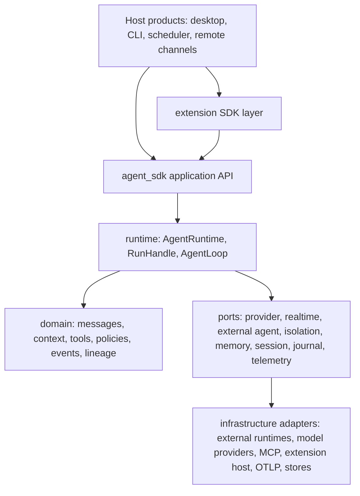
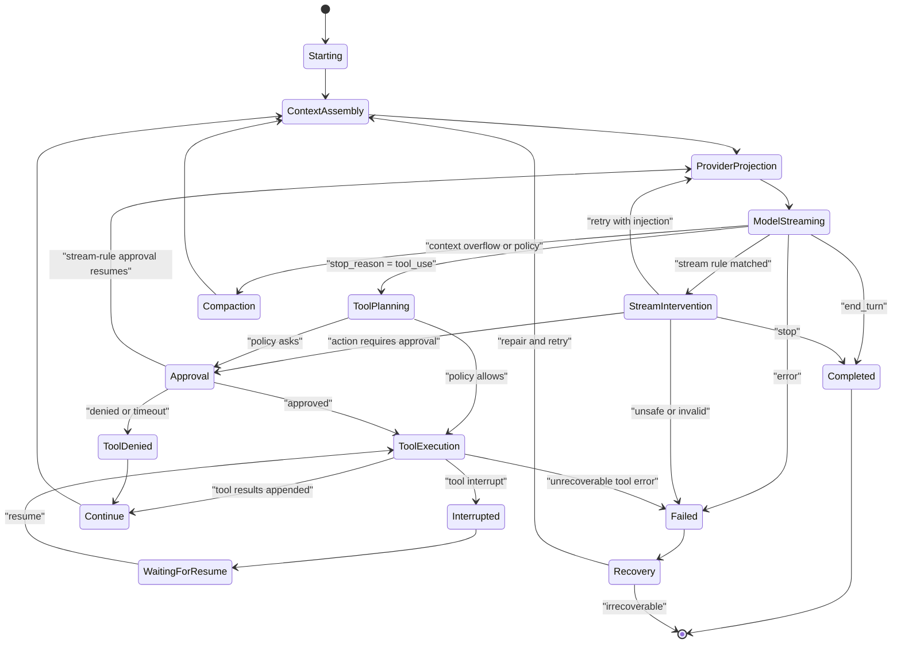
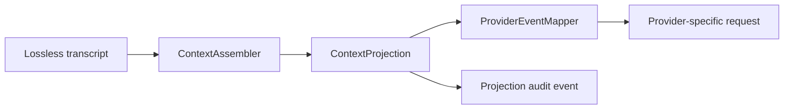
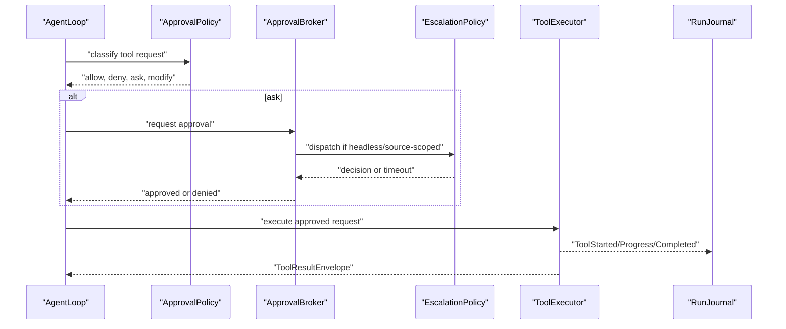
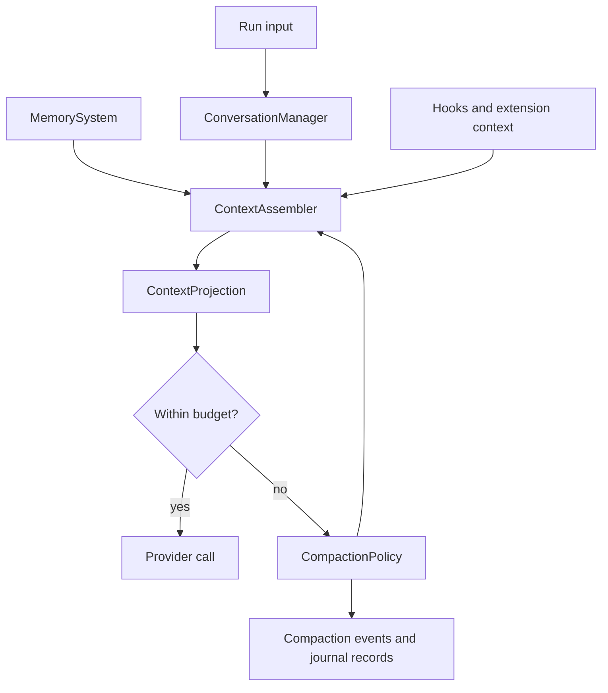

# Architecture Proposal

This is a middle-level proposal for a future Rust-first `agent_sdk` crate and extension SDK layer. The Rust snippets are non-compiling conceptual sketches.


## Layering



The SDK core should be product-neutral. Host code chooses adapters, wires policies, connects UI/CLI/headless output sinks, and preserves product runtime boundaries.

## Proposed Future Crate Layout

```text
agent_sdk/
  src/
    lib.rs
    agent/
      builder.rs
      runtime.rs
      run_handle.rs
      loop_state.rs
      result.rs
    domain/
      ids.rs
      message.rs
      context.rs
      lineage.rs
      event.rs
      errors.rs
      usage.rs
      structured_output.rs
      stream_rule.rs
      execution_environment.rs
    package/
      runtime_package.rs
      fingerprint.rs
      projection.rs
    providers/
      adapter.rs
      realtime.rs
      external_agent.rs
      event_mapper.rs
    stream/
      delta.rs
      observer.rs
      rule_engine.rs
      intervention.rs
    tools/
      registry.rs
      router.rs
      executor.rs
      strategy.rs
      result.rs
      mcp.rs
      toolkit.rs
      discovery.rs
      builtin/
        read.rs
        search.rs
        edit.rs
        write.rs
        shell.rs
        resource_uri.rs
    isolation/
      environment.rs
      runtime.rs
      container.rs
      mounts.rs
      network.rs
      process.rs
    policy/
      approval.rs
      permission.rs
      sandbox.rs
      escalation.rs
      autonomy.rs
    context/
      assembler.rs
      conversation.rs
      compaction.rs
      memory.rs
    hooks/
      bus.rs
      events.rs
      response.rs
    session/
      manager.rs
      checkpoint.rs
      journal.rs
      replay.rs
    telemetry/
      sink.rs
      otel.rs
      redaction.rs
      cost.rs
    subagents/
      supervisor.rs
      topology.rs
      handoff.rs
    channels/
      remote.rs
      output_sink.rs
    recovery/
      invariant.rs
      policy.rs
      anti_entropy.rs
```

Extension SDK layering should be a separate crate/package that depends on stable `agent_sdk` contracts:

```text
agent_extension_sdk/
  manifest contracts
  JSON-RPC process protocol
  tool/hook/subagent provider adapters
  app-event observation types
  host action submission types
  browser-safe helper subpaths
```

The extension SDK runtime fallback remains a host packaging concern. Public subpath exports and browser-safe helpers must be smoke tested from outside the monorepo.

## Request/Response Flow

```mermaid
sequenceDiagram
  participant Host
  participant Runtime as "AgentRuntime"
  participant Loop as "AgentLoop"
  participant Context as "ContextAssembler"
  participant Provider as "ProviderAdapter"
  participant Tools as "ToolExecutor"
  participant Journal as "RunJournal"

  Host->>Runtime: "start_run(request)"
  Runtime->>Journal: "RunStarted"
  Runtime->>Loop: "drive"
  Loop->>Context: "assemble turn context"
  Context-->>Loop: "ContextProjection"
  Loop->>Provider: "stream(projected request)"
  Provider-->>Loop: "model deltas and stop reason"
  Loop->>Journal: "Model events"
  Loop->>Tools: "execute tool calls if needed"
  Tools-->>Loop: "tool events and results"
  Loop->>Journal: "Tool and message events"
  Loop->>Loop: "continue or stop"
  Loop-->>Runtime: "RunResult"
  Runtime-->>Host: "final result and stream completion"
```

## Agent Loop State Machine



## Conceptual API Sketch

```rust
// Non-compiling sketch.
pub struct Agent {
    id: AgentId,
    name: AgentName,
    defaults: AgentDefaults,
}

impl Agent {
    pub fn builder() -> AgentBuilder;

    pub async fn run(
        &self,
        input: AgentInput,
        runtime: &AgentRuntime,
    ) -> Result<RunResult, AgentError>;

    pub fn stream(
        &self,
        input: AgentInput,
        runtime: &AgentRuntime,
    ) -> Result<RunHandle, AgentError>;
}

pub struct AgentRuntime {
    providers: ProviderRegistry,
    runtime_package: RuntimePackage,
    policies: RuntimePolicies,
    session: Arc<dyn SessionManager>,
    journal: Arc<dyn RunJournal>,
    telemetry: TelemetryFanout,
}

impl AgentRuntime {
    pub async fn start_run(&self, request: RunRequest) -> Result<RunHandle, AgentError>;
    pub async fn resume_run(&self, resume: ResumeRequest) -> Result<RunHandle, AgentError>;
    pub async fn cancel_run(&self, run_id: RunId) -> Result<(), AgentError>;
}

pub struct RunHandle {
    pub run_id: RunId,
    pub events: AgentEventStream,
    pub final_result: RunResultReceiver,
}
```

## Loop Transition Sketch

```rust
// Non-compiling sketch.
pub enum LoopState {
    Starting,
    ContextAssembly,
    ProviderProjection,
    ModelStreaming,
    StreamIntervention,
    ToolPlanning,
    Approval,
    ToolDenied,
    ToolExecution,
    Interrupted,
    WaitingForResume,
    Compaction,
    Continue,
    Recovery,
    Completed,
    Failed,
}

pub enum LoopTransition {
    Continue(LoopState),
    Emit(AgentEvent),
    Wait(WaitReason),
    Stop(RunResult),
    Fail(AgentError),
}

pub trait AgentLoop {
    async fn step(&mut self, cx: &mut RunContext) -> Result<LoopTransition, AgentError>;
}
```

Important responsibilities:

- `RunContext` owns run-scoped IDs, package, policies, cancellation, journal, telemetry, and session references.
- `TurnContext` owns per-turn projection, attempts, usage, and outcome.
- `AgentLoop` asks other ports to do work. It does not know how a provider network client, MCP server, extension subprocess, or UI approval prompt is implemented.
- The transition table in Phase 2 must be executable and must include cancel, max-iteration, denied-tool, interrupted-tool, stream-rule, and resume edges. The Mermaid state diagram and Rust enum are one contract; if one changes, the other changes in the same review.

## Runtime Package

```rust
// Non-compiling sketch.
pub struct RuntimePackage {
    pub id: RuntimePackageId,
    pub fingerprint: RuntimePackageFingerprint,
    pub model_route: ModelRoute,
    pub tools: ToolSnapshot,
    pub toolkits: ToolPackSnapshot,
    pub mcp: McpSnapshot,
    pub hooks: HookSnapshot,
    pub stream_rules: StreamRuleSnapshot,
    pub isolation: IsolationSnapshot,
    pub subagents: SubagentSnapshot,
    pub policies: PolicySnapshot,
    pub extension_capabilities: ExtensionCapabilitySnapshot,
}

impl RuntimePackage {
    pub fn provider_tool_specs(&self) -> Vec<ProviderToolSpec>;
    pub fn executable_tool_registry(&self) -> ToolRegistryView;
    pub fn assert_projection_matches_execution(&self) -> Result<(), PackageError>;
}
```

Key invariant: if a tool is visible to a provider, the executable registry and policy layers know exactly how that tool will be routed, approved, and traced.

## Provider Projection



Projection rules:

- Strip internal metadata unless explicitly mapped.
- Preserve media by references and provider-compatible descriptors.
- Convert tool specs from `RuntimePackage`, not live discovery.
- Record a projection audit event with omitted item counts and redaction policy.
- Keep provider response mapped back to internal `AgentMessage` with lineage.

## Structured Output

Structured output should be easy for hosts to request without making every product invent its own parser/retry loop. If a user or host provides a required shape, the SDK should treat that shape as a run contract.

```rust
// Non-compiling sketch.
pub struct OutputContract {
    pub schema_id: OutputSchemaId,
    pub schema: OutputSchema,
    pub mode: OutputMode,
    pub validation: ValidationPolicy,
    pub repair: RepairPolicy,
}

pub enum OutputMode {
    BestEffortText,
    JsonValue,
    TypedObject,
    TypedList,
}

pub trait StructuredOutputValidator: Send + Sync {
    async fn validate(
        &self,
        output: &ModelOutputCandidate,
        contract: &OutputContract,
    ) -> Result<ValidatedOutput, ValidationErrorReport>;
}
```

Flow:

1. Host attaches an `OutputContract` to `RunRequest` or `TurnContext`.
2. `ContextAssembler` includes concise instructions for the shape, while `ProviderAdapter` uses provider-native structured-output or JSON-schema support when available.
3. Provider output maps into `ModelOutputCandidate`, not directly into final `RunResult`.
4. `StructuredOutputValidator` parses and validates locally against the requested schema, required fields, enum values, ranges, discriminators, and host-defined semantic checks.
5. If validation fails and retry budget remains, the loop emits validation failure events, appends the failure to the journal, sends a narrow repair prompt with the validation errors, and starts a new model attempt.
6. Only a valid `ValidatedOutput` becomes the typed run result. Invalid final output returns a typed validation error with the raw content redacted or referenced by policy.

Important boundaries:

- Provider-native structured output is an optimization, not the source of truth. The SDK still validates locally.
- Validation retries are model attempts, not hidden string post-processing. Usage, latency, errors, and repair prompts are observable.
- Repair prompts should include only schema and validation errors, not hidden/private context unless projection policy allows it.
- The final typed output should preserve lineage back to the output contract, model attempts, validation attempts, and repair attempts.
- Hosts can render the validated structure nicely in desktop, CLI, remote replies, or workflow nodes without each surface writing its own parser.

## Streaming Rule Matching And Interventions

The SDK should provide an out-of-the-box primitive for matching model streams while they are still being produced. Hosts should be able to say "stop this agent if the assistant starts emitting text matching this regex" or "pause when a tool-call argument stream contains this pattern" without building a custom provider wrapper.

This is inspired by oh-my-pi's rulebook and TTSR-style stream interruption, but the SDK version should be a smaller, host-neutral primitive: a typed stream observer plus policy-gated interventions. It is not a product rulebook UI.

```rust
// Non-compiling sketch.
pub struct StreamRule {
    pub id: StreamRuleId,
    pub version: RuleVersion,
    pub matcher: StreamMatcher,
    pub channels: Vec<StreamChannel>,
    pub scope: StreamRuleScope,
    pub action: StreamAction,
    pub repeat: RepeatPolicy,
    pub privacy: MatchPrivacyPolicy,
}

pub enum StreamMatcher {
    Literal { text: String, case_sensitive: bool },
    Regex { pattern: String, flags: RegexFlags, window: StreamWindow },
    SemanticMarker { marker: MarkerId },
}

pub enum StreamChannel {
    AssistantText,
    ReasoningSummary,
    ProviderExposedReasoning,
    ToolCallArguments,
    ToolResultText,
    RealtimeTranscript,
}

pub enum StreamAction {
    StopRun { reason: StopReason },
    AbortAndRetry { injected_context: ContextInjectionSpec },
    PauseForApproval { approval: ApprovalRequestSpec },
    EmitOnly,
    MaskAndContinue { replacement: RedactionReplacement },
}

pub trait StreamRuleEngine: Send + Sync {
    fn observe_delta(
        &mut self,
        delta: &StreamDelta,
        cx: &StreamMatchContext,
    ) -> Result<Option<StreamIntervention>, StreamRuleError>;
}
```

Important semantics:

- Rules are compiled during `RuntimePackage` assembly. Invalid regexes fail package validation or are disabled with an explicit warning event; they do not fail mid-stream.
- Matching is over typed channels, not unstructured logs. A host can target assistant text, provider-exposed reasoning summaries, tool-call argument deltas, tool result text, or realtime transcripts separately.
- Hidden chain-of-thought is not made observable by this primitive. If a provider exposes reasoning tokens or summaries as a typed stream channel, hosts may match that channel under policy; raw hidden reasoning is not logged or projected by default.
- Regex matching uses bounded rolling windows, size limits, timeouts, and safe-regex/backtracking guards. A matcher cannot hold the entire model output forever.
- `StopRun` stops the stream and returns a typed stopped result. `AbortAndRetry` cancels the current model attempt, records whether partial output was kept or discarded, injects a policy-owned context item, and starts a new attempt if retry policy allows it.
- `PauseForApproval` crosses the same approval broker as tools. Streaming rules cannot silently execute external side effects.
- Every match and intervention is evented and journaled with rule ID, version, channel, cursor, action, privacy class, and a redacted snippet/hash. Raw matched text is opt-in content capture.

Built-in rule helpers should cover the common cases:

- `stop_on_literal("...")`
- `stop_on_regex(pattern)`
- `abort_and_retry_on_regex(pattern, injection_template)`
- `pause_for_approval_on_regex(pattern, approval_spec)`
- `mask_and_continue_on_secret_like_text()`
- `emit_event_on_regex(pattern)` for analytics or UI notice without control flow changes.

## Tool Execution And Approval



Approval rules:

- Broker owns request lifecycle.
- UI, CLI, external-runtime, headless, and extension-submitted approvals use dispatchers.
- Headless/source-scoped runs deny if no dispatcher can deliver the approval prompt.
- Out-of-band escalation parks the broker receiver and resumes after finite YES/NO style decision tokens or timeout.
- Tool risk and mutating status come from metadata and policies, not string matching.

### Policy And Approval Edge Cases

- Phase 1 intentionally specifies a safer SDK contract than some legacy product compatibility paths. Interactive approval transports may have historical fail-open behavior when event wiring is unavailable, and some older headless paths may fail open when no escalation channel exists. The SDK target is fail-closed for missing dispatchers. Any compatibility behavior must remain behind host adapters until a reviewed compatibility plan flips those paths.
- Headless runs with no approval dispatcher deny the requested action, emit `ApprovalDispatchUnavailable` and `ApprovalDenied`, and continue only if the tool result policy allows a denied tool result. They never fall back to desktop UI silently.
- Headless dispatcher timeouts emit `ApprovalTimedOut`, resolve the broker decision as denied, cancel any parked receiver, and append the timeout before the loop continues or fails.
- Source-scoped remote runs dispatch only through the source-approved channel or a configured host escalation route. If neither exists, they deny.
- Escalation has no ambient default. Host policy must declare the escalation channel, finite decision tokens, timeout, source attribution, and destination attribution.
- UI runs with a missing or unhealthy dispatcher deny unless the runtime package explicitly marks the action as pre-approved for that source and scope.
- Extension-submitted actions can request and observe, but extensions cannot answer their own approvals. Host policy and the broker own the decision.
- YOLO/autonomy mode is an explicit policy layer, not an approval-broker bypass. It still emits policy decisions, tool risk metadata, usage, and cost events.
- Cancellation during approval appends cancellation, closes the approval request, and returns a cancelled result to the loop without executing the tool.
- Phase 2 must define a single SDK decision enum, then map host compatibility terms such as `approve`, `approve_for_session`, and `deny` into that enum at the adapter edge.

## Built-In Tool Packs

The SDK should ship reusable tool-pack primitives that a host can include in a `RuntimePackage`. These tools make it easy to build a Pi-like coding harness or workflow agent, but they remain opt-in SDK utilities rather than a full coding-agent product.

Recommended phase-one tool packs:

| Tool pack | Example tools | Default posture |
| --- | --- | --- |
| `workspace_readonly` | `read`, `list`, `grep`, `glob`, `ast_grep`, internal-resource `read` for `memory://`, `artifact://`, `rule://`, `skill://`, and `mcp://`. | Safe to offer by default only inside a host-declared workspace and read policy. Network and private stores require separate permission. |
| `workspace_edit` | anchored `edit`, `apply_patch`, structural `ast_edit`, diff preview, formatter/diagnostic integration. | Mutating. Requires approval or an explicit autonomy policy. Must journal before/after hashes and diffs. |
| `workspace_write` | create/overwrite file, archive entry, or structured row where host enables it. | Higher-risk than anchored edit. Disabled unless the host grants create/overwrite scope. |
| `shell` | command, PTY, long-running job, process cancellation, stdout/stderr streaming. | Disabled by default. Requires sandbox, timeout, env, cwd, network, and approval policy. |
| `resource_readers` | document, image, archive, SQLite, URL, notebook, and generated artifact readers. | Read-only but sensitivity-aware. Emits source metadata, size, truncation, and retention fields. |
| `tool_discovery` | search and activate available tools by description/schema/source. | Optional prompt-size control. Activations become runtime-package deltas or next-turn package snapshots, never ambient global mutation. |

Lessons to carry over from oh-my-pi's tools:

- A unified `read` tool can be extremely ergonomic if it accepts files, directories, archives, SQLite databases, notebooks, documents, images, URLs, and internal resource URLs through one path-like contract. The SDK should make this reusable while preserving policy checks per backing resource.
- `read` and `search` output should carry stable anchors, source paths, truncation, limits, hashes, and display metadata so follow-up edits and UIs can reason about what the model saw.
- Anchored edits are safer than blind replacement. The SDK should provide an edit planner/applier that validates anchors before mutation, records the read/search snapshot used, and attempts bounded stale-anchor recovery only when the before-state is known.
- Structural search/edit should be preview-first for broad AST rewrites. Apply should be a separate policy decision or resolver action.
- Mutating tools should expose reversible-effect metadata when possible: before hash, after hash, diff, created/deleted paths, idempotency key, and a host-visible inverse patch candidate. This supports undo/recovery/lineage without turning the SDK into a product-specific self-improvement system.
- Tool discovery can keep the model prompt smaller by exposing a small essential set and letting the model search for specialized tools. The host still owns which tools are discoverable and whether activation requires approval.

Conceptual API:

```rust
// Non-compiling sketch.
pub enum BuiltinToolPack {
    WorkspaceReadOnly,
    WorkspaceEdit,
    WorkspaceWrite,
    Shell,
    ResourceReaders,
    ToolDiscovery,
}

impl RuntimePackageBuilder {
    pub fn add_tool_pack(
        self,
        pack: BuiltinToolPack,
        policy: ToolPackPolicy,
    ) -> Result<Self, PackageError>;
}

pub trait ToolPack {
    fn id(&self) -> ToolPackId;
    fn tool_specs(&self) -> Vec<ToolSpec>;
    fn register_handlers(&self, registry: &mut ToolRegistry) -> Result<(), ToolError>;
    fn required_permissions(&self) -> PermissionSet;
}
```

Key boundary: hosts may give these tools to agents by default, but "default" means default for that host/runtime package, not globally available across the SDK. Every tool remains source-attributed, permission-scoped, approval-aware, cancellable where possible, bounded, and journaled.

## Execution Isolation And Containerized Agents

Agents and tool packs need first-class execution isolation. This should be modeled as an SDK primitive, but concrete runtimes such as Apple Containerization, Docker, Firecracker, a remote sandbox, or a local process sandbox should stay behind host-provided adapters.

Apple's [Containerization](https://github.com/apple/containerization) package is a strong macOS-specific design input. It is a Swift package for running Linux containers on Apple silicon through `Virtualization.framework`. It exposes APIs for OCI images, registries, ext4 root filesystems, lightweight VM lifecycle, Linux process lifecycle, mounts, networking, Rosetta 2, signals, stdio, terminal resize, and resource configuration. Its key architectural lesson is not "make the Rust SDK depend on Swift." The lesson is that an agent SDK should describe the workload contract and let a host pick the isolation runtime.

```rust
// Non-compiling sketch.
pub struct ExecutionEnvironment {
    pub id: ExecutionEnvironmentId,
    pub kind: ExecutionEnvironmentKind,
    pub image: Option<ContainerImageRef>,
    pub resources: ResourceLimits,
    pub filesystem: FilesystemIsolationPolicy,
    pub network: NetworkIsolationPolicy,
    pub secrets: SecretExposurePolicy,
    pub lifecycle: EnvironmentLifecyclePolicy,
}

pub enum ExecutionEnvironmentKind {
    HostProcess,
    MacosAppSandbox,
    LinuxContainer,
    LightweightVm,
    RemoteSandbox,
}

pub trait IsolationRuntime: Send + Sync {
    async fn prepare(&self, spec: EnvironmentSpec) -> Result<PreparedEnvironment, IsolationError>;
    async fn start_process(&self, env: &PreparedEnvironment, spec: ProcessSpec) -> Result<IsolatedProcess, IsolationError>;
    async fn stream_io(&self, process: &IsolatedProcess) -> Result<ProcessIoStream, IsolationError>;
    async fn signal(&self, process: &IsolatedProcess, signal: Signal) -> Result<(), IsolationError>;
    async fn collect_stats(&self, env: &PreparedEnvironment) -> Result<EnvironmentStats, IsolationError>;
    async fn cleanup(&self, env: PreparedEnvironment, mode: CleanupMode) -> Result<(), IsolationError>;
}
```

How this composes with agents:

- `RuntimePackage` declares the isolation requirements and acceptable adapters for shell/edit/write/code-execution tools, subagents, and risky extension tools.
- `RuntimePackage` declares the default child lifecycle policy and allowed detach policy refs. A run can select or tighten them before start, and the effective policy is journaled in `RunRecord`.
- `SandboxPolicy` decides whether the requested workload can run on the host, must run in an isolated environment, or is denied.
- `ToolExecutor` asks `IsolationRuntime` to prepare and run workloads; tools do not directly spawn host commands.
- `SubagentSupervisor` may assign a child run its own execution environment, but the parent owns environment policy, budget, cleanup, and usage rollup.
- Manual run cancellation cascades to agent-owned tool processes, isolated processes, subagents, realtime sessions, approval waits, and hook invocations by default.
- A long-running process can outlive a parent run only after explicit detach intent, policy/user/host acknowledgement when required, durable detach records, and a reclaim policy.
- Hosts can offer an Apple Containerization adapter on supported macOS machines, a remote sandbox adapter elsewhere, or a no-op/local adapter for tests.

Apple Containerization details that should shape the adapter contract:

- one Linux container per lightweight VM is a useful isolation and trace boundary;
- image reference, rootfs size, writable layer, read-only mode, CPU, memory, rlimits, Linux capabilities, `no_new_privileges`, working directory, environment, terminal mode, and command arguments must be typed policy fields;
- network, DNS, hosts, dedicated IPs, socket relays, mounts, kernel selection, and Rosetta are explicit environment capabilities;
- process lifecycle needs start, stream stdout/stderr/stdin, close stdin, wait with timeout, kill/signal, resize terminal, delete, and collect stats;
- first-run kernel/init image fetches and registry authentication are adapter readiness concerns and must be surfaced as health events;
- single-file mounts can require sharing the parent directory into the guest VM before bind mounting the requested file, so mount expansion must be auditable and policy-visible.

Boundaries:

- The SDK should not promise every agent runs in a container. Isolation is a policy-selected execution environment.
- The core SDK should not assume macOS 26, Apple silicon, Swift, a local kernel, a `container` service, or Docker compatibility.
- Containerization does not replace approvals. A container can reduce blast radius, but filesystem mounts, network access, secrets, host sockets, registry pulls, and long-running processes still require policy and audit.
- Reversibility remains best-effort. The SDK can snapshot filesystems, record diffs, and cleanup environments, but external effects from network calls or mounted writable paths may not be reversible.

## Memory, Context, And Compaction



Important boundaries:

- Memory retrieval and storage are ports.
- Context assembler decides what enters the provider projection.
- Compaction emits before/after events and preserves protected items.
- UI and extensions can request or propose context, but backend policy owns the final projection.

## Bidirectional Realtime

```mermaid
sequenceDiagram
  participant Host
  participant RT as "RealtimeProviderAdapter"
  participant Loop as "RealtimeAgentLoop"
  participant Tool as "ToolExecutor"
  participant Sink as "Event sinks"

  Host->>Loop: "start realtime run"
  Loop->>RT: "connect"
  Host->>Loop: "send text/audio/image"
  Loop->>RT: "provider input"
  RT-->>Loop: "transcript/audio/tool events"
  Loop->>Tool: "execute tool when requested"
  Tool-->>Loop: "tool result"
  Loop->>RT: "send tool result"
  Loop->>Sink: "realtime events with lineage"
  RT-->>Loop: "timeout"
  Loop->>RT: "restart with gated sends"
```

Realtime-specific requirements:

- Separate send and receive halves.
- Bounded event queues.
- Connection IDs and restart events.
- Interruption events with response IDs.
- Media format metadata and `ArtifactRef` / `ContentRef` support.
- Shared tool and approval policies.

## Subagent Supervision

```rust
// Non-compiling sketch.
pub struct SubagentSupervisor {
    topology: AgentTopology,
    depth_budget: DepthBudget,
    default_handoff_policy: ContextHandoffPolicy,
    default_tool_policy: SubagentToolPolicy,
}

impl SubagentSupervisor {
    pub async fn start_child(
        &self,
        parent: &RunContext,
        request: SubagentRequest,
    ) -> Result<ChildRunHandle, AgentError>;

    pub async fn cancel_child(&self, child_run_id: RunId) -> Result<(), AgentError>;
    pub fn wrap_child_event(&self, event: AgentEvent) -> AgentEvent;
}
```

Subagents are parent-owned:

- Child agents are not directly user-chatable.
- Child packages do not receive tools that create further subagents by default.
- Parent owns routing, cancellation, context handoff policy, tool policy, approval inheritance, depth, and usage rollup.
- Child events are wrapped with parent and child lineage.

## External Runtime Adapter

Stateful external runtimes should be adapters over core concepts:

```rust
// Non-compiling sketch.
pub trait ExternalAgentAdapter: Send + Sync {
    async fn launch(&self, request: ExternalLaunchRequest) -> Result<ExternalSession, AgentError>;
    async fn restore(&self, key: RestoreKey) -> Result<ExternalSession, AgentError>;
    async fn send(&self, session: &ExternalSession, input: ExternalInput) -> Result<(), AgentError>;
    fn receive(&self, session: &ExternalSession) -> ExternalEventStream;
    async fn retire(&self, session: ExternalSession) -> Result<(), AgentError>;
}
```

Adapter boundary:

- SDK can define launch/restore/send/receive/retire.
- Host adapters still own runtime-session cache, restore-key policy, prewarm, retirement scheduling, and UI routing.
- Adapter events map into `AgentEvent` and `RunJournal` records.

## Extension SDK Layer

Extensions should use stable host contracts:

- Manifest declares tools, hooks, providers, subagents, app-event subscriptions, commands, UI surfaces, and action permissions.
- Extension process communicates through JSON-RPC with typed envelopes.
- Host resolves extension capabilities into `RuntimePackage`.
- Hooks are core lifecycle primitives represented by `HookSpec`, `HookPoint`, and typed `HookResponse` values. Extension hooks are ordered, source-attributed executors for that same core contract.
- Hook inputs default to envelope fields, content refs, and redacted summaries. Raw content requires explicit policy.
- Hook delivery is nonblocking by default; blocking security hooks must fail by deny, interrupt, or fail-run rather than fail open.
- Extension-submitted actions cross approval and permission policy.
- Extension app events are metadata-bounded unless host policy allows content.

The packaged extension SDK fallback must remain predictable:

- Host fallback path is appended after extension-local paths.
- Public subpath exports need runtime shims and smoke tests.
- Browser-safe helper subpaths must not become a general browser dependency injector.
- Node ESM support through fallback resolution is unsupported until a loader, import-map, or installation strategy is implemented and smoked from outside the repo.
- Node ESM package shape is valid when the SDK is reachable through normal `node_modules` resolution; smoke tests should cover root, browser-safe helper, and process-only media subpaths.
- Bun fallback resolution must be verified for root, browser-safe helper, and process-only media subpaths before it is documented as supported.
- CommonJS `require` is not a supported extension SDK contract for Phase 1 because the package is ESM and has no `require` export.
- The active browser-safe helper surface is `@agent-sdk/extension-sdk/browser-safe`; root and media exports remain process/native surfaces unless a later browser-safe subpath explicitly says otherwise.
- Packaging smokes should import `.`, `./browser-safe`, and `./media` with Bun from outside the repo only when the fallback strategy is supported; import the same subpaths with Node ESM through normal local `node_modules` resolution; verify `@agent-sdk/extension-sdk/browser-safe` has no Node/process/native dependency in browser use; and prove extension-local dependencies win over the host fallback.

## Harness Buildability Check

A Pi-like coding-agent harness should be easy to build on top:

- Use `AgentRuntime` and `RunHandle` for run orchestration.
- Provide a host `OutputSink` for terminal/TUI rendering.
- Provide tools through `RuntimePackage`, including opt-in SDK tool packs for read/search/edit/write/shell/resource-reader behavior.
- Add coding-agent policies for filesystem, shell, network, approval, and sandboxing.
- Route shell/code-execution tools through `IsolationRuntime` when host policy requires containerized or VM-backed execution.
- Persist sessions with `RunJournal` and `CheckpointStore`.
- Use `TelemetrySink` for trace UI.
- Use `StreamRuleEngine` for stop-on-regex, abort-and-retry reminders, and policy pauses while streaming.
- Keep TUI, diff viewer, editor integration, and chat automation outside `agent_sdk`.

This keeps the core reusable for desktop hosts, CLI tools, scheduled tasks, remote agents, coding agents, and test harnesses.

## Performance And Robustness Check

- Low-overhead event envelopes: IDs, references, and summaries before raw payloads.
- Bounded streaming: every event sink declares capacity and overflow behavior.
- Minimal hot-path cloning: messages and media use references, projections, or copy-on-write.
- Predictable cancellation: providers, tools, subagents, realtime loops, and extension calls share cancellation handles.
- Child lifecycle cleanup: manual cancellation appends shutdown intent before signalling/cancelling child work; normal completion cannot leave implicit orphan work.
- Hook execution: nonblocking observe hooks cannot slow the loop; blocking hooks have bounded deadlines and typed failure policy.
- Durable recovery: journal append before side-effect completion where possible; checkpoints at turn boundaries; replay validates invariants.
- Tool ordering: strategy declares whether output order follows model request order, completion order, or explicit dependency graph.
- Stream rule matching: matchers use bounded rolling windows, compile-time validation, regex timeouts, and redacted match events.
- Isolation runtime overhead: environment preparation, image pulls, rootfs creation, kernel readiness, and first-run artifact fetches are explicit events and can be cached by host policy without becoming hidden global state.
- Context growth: context assembler enforces token, byte, item, media, and time budgets.
- Telemetry failure isolation: sink failures degrade to local logging/journal and never crash the loop.
- Fast tests: mock providers and scripted streams exercise loops without live network calls.

## Migration Path

1. Keep existing product runtime behavior unchanged.
2. Turn accepted docs into phase-2 Rust API tests and fixtures only after user approval.
3. Prototype `agent_sdk` as a separate crate with mock provider, mock tools, event stream, and journal.
4. Add adapters for external runtime concepts only after core contracts are proven with fakes.
5. Add concrete external-runtime adapters only after runtime package/fingerprint and event mapping contracts are proven.
6. Add extension SDK bridge after host-owned fallback, manifests, and subpath smoke tests are specified.
7. Route product host surfaces through the SDK only through an explicit integration plan; host dispatch boundaries remain host-owned until replacement is explicitly approved.

## Tradeoffs

- A rich event model has upfront complexity, but prevents later observability retrofits.
- A lossless internal transcript plus provider projection costs design effort, but avoids metadata leaks and provider lock-in.
- Runtime package snapshots constrain dynamic discovery, but make replay, approval, and tool visibility coherent.
- Parent-owned subagents limit free-form agent societies, but keep control, cost, safety, and trace shape understandable.
- Host-owned approval keeps UI/headless concerns outside core, but requires every host to provide explicit dispatchers.
- Generic side-effect lineage can support host features that need reversibility or audit, but the SDK must not become a self-improvement product. It records what happened and exposes safe apply/replay/recovery contracts; hosts decide what to propose, evaluate, approve, show, or revert.
- First-class isolation makes tool execution safer and more portable, but adapter capabilities vary widely. The SDK should expose portable policy/lifecycle contracts and let Apple Containerization, Docker, remote sandboxes, or local process adapters declare what they actually support.

## Open Questions Answered For Phase 1

- `AgentRuntime` should support many independent `RunHandle`s. Scheduling, admission control, prioritization, and host UI routing belong above the core runtime. Phase 2 should define executor/backpressure traits and run-admission tests.
- Hooks should split by performance sensitivity. Pure observe hooks are nonblocking and allocation-light; blocking lifecycle hooks are explicit, bounded, and return typed mutation responses. Code hooks and config hooks lower into the same `HookSpec` runtime package capability.
- Stable v1 event fields are event family, event kind, schema version, event ID, timestamp, run ID, agent ID, optional turn/attempt/message/tool/approval/stream-rule/hook/child-artifact/execution-environment/subagent IDs, trace context, source, destination, parent event, correlation keys, tags, privacy class, delivery semantics, runtime package fingerprint, and payload schema version. Phase 2 should freeze payload field schemas with golden tests.
- Runtime-wide event listening is part of core: `subscribe_all`, `subscribe_run`, `subscribe_agent`, and typed `subscribe_events` over compiled envelope/index filters. `RunHandle::stream_from` remains the run-scoped convenience path, not the only event API.
- `EventCursor` is the live/recent stream cursor and `JournalCursor` is the durable replay cursor. Run-scoped replay comes from the run journal; cross-run/all-event replay requires an indexed archive/journal view.
- OTel-compatible message/tool events can carry IDs, roles, sizes, MIME types, hashes, summaries, usage, latency, policy decisions, and status by default. Raw prompt/model/tool/memory content is off by default and requires explicit host policy plus retention declaration.
- Run journals default to append-only metadata, causal IDs, redacted summaries, hashes, sizes, content references, projection audits, and side-effect records. Raw content belongs in a separate content-addressed store only when sensitivity and retention policy allow it.
- Child lifecycle journal records are required for shutdown intent/result, process signal intent/result, detach intent/ack, and reclaim. Live events alone cannot prove lifecycle ownership.
- Host products must publish a runtime telemetry declaration naming enabled sinks, retention windows, content-capture scope, redaction policy, child-agent inclusion, extension inclusion, and whether cost is estimated or provider-reported.
