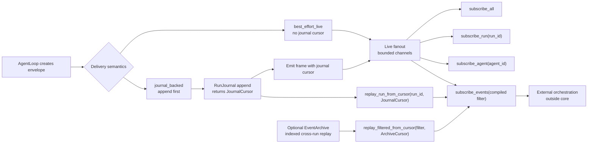
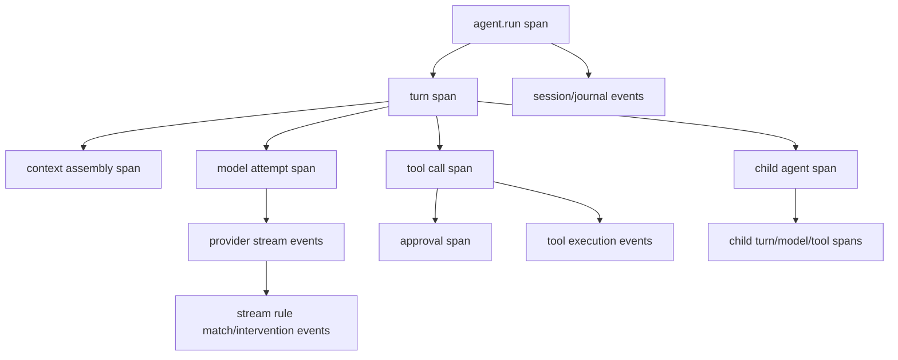
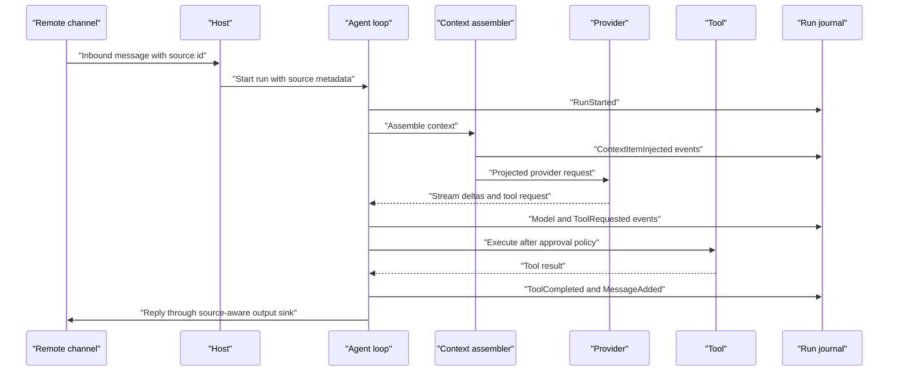
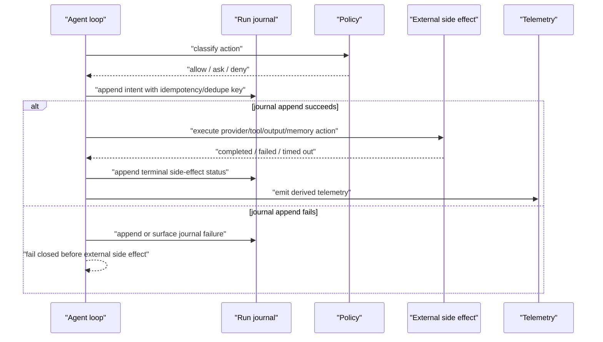
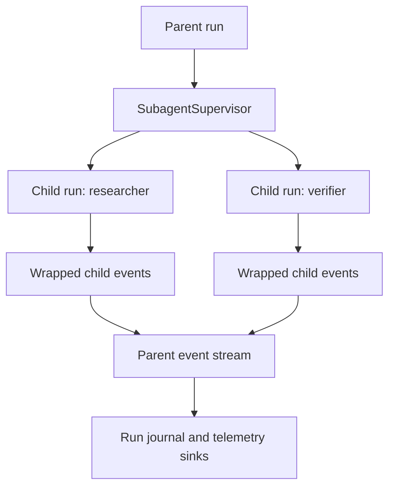

# Observability And Lineage

Observability must be designed into the SDK from day one. The SDK should record not just that "a message happened," but where it came from, where it was sent, which policies touched it, which context projection included it, and which parent/child agent edge caused it.

## Goals

- Preserve source and destination for every run, turn, message, context item, tool call, approval, and agent-to-agent handoff.
- Keep internal lineage rich while default telemetry remains content-safe.
- Support desktop, CLI, external-runtime, headless, scheduled, remote, extension, MCP, and subagent runs with one event vocabulary.
- Let SDK users subscribe to lifecycle events directly for observability and external orchestration without creating a product-specific event bus.
- Make every context injection auditable: user input, system/developer instruction, memory, compaction summary, hook mutation, extension context, remote metadata, tool result, child-agent result, provider output, and replay.
- Align with OpenTelemetry GenAI spans without depending on raw content capture.
- Keep live UI events bounded and durable analytics journal-backed.

## Identity Model

| ID | Meaning |
| --- | --- |
| `RunId` | One agent execution request, including headless and external runtime adapter requests. |
| `TurnId` | One loop turn inside a run. |
| `AttemptId` | A model or tool attempt, including retries. |
| `MessageId` | One internal transcript message. |
| `ContextItemId` | One item assembled into a provider context projection. |
| `ContextProjectionId` | A provider-specific view of selected messages/context/tools. |
| `ToolCallId` | One model-requested or host-requested tool call. |
| `ApprovalRequestId` | One broker-owned approval request. |
| `AgentId` | Logical agent identity. |
| `SubagentRunId` | Child run identity with parent `RunId`. |
| `TraceId` / `SpanId` | OpenTelemetry trace context. |
| `RuntimePackageFingerprint` | Snapshot that produced provider-visible schemas and executable tools. |

These IDs must remain distinct. A conversation ID, session snapshot ID, runtime session ID, trace ID, app event ID, and remote message ID can be linked, but they are not interchangeable.

## Source And Destination

Every observable record should carry:

- `source.kind`: user, system, developer, memory, tool, model, hook, extension, remote_channel, scheduled_task, cli, desktop, external_runtime, subagent, replay, compaction, policy, stream_rule, isolation_runtime.
- `source.id`: stable ID when available, such as extension ID, MCP server ID, remote channel ID, tool name, agent ID, session ID, or message ID.
- `source.surface`: desktop, CLI, headless, external_runtime, remote, scheduled, extension, test, or unknown.
- `destination.kind`: provider, tool, memory, session, user, remote_channel, child_agent, parent_agent, telemetry, journal, UI, external_runtime, isolation_runtime.
- `destination.id`: provider ID, tool name, child agent ID, channel handle, store ID, or span ID.
- `caused_by`: parent event, message, tool call, approval request, or handoff.
- `policy_refs`: approval, permission, sandbox, MCP allowlist, retention, privacy, and autonomy decisions.

## Message Lineage

Conceptual non-compiling sketch:

```rust
pub struct AgentMessage {
    pub id: MessageId,
    pub role: MessageRole,
    pub parts: Vec<MessagePart>,
    pub lineage: Lineage,
    pub metadata: MessageMetadata,
}

pub struct MessageMetadata {
    pub sensitivity: SensitivityClass,
    pub retention: RetentionPolicy,
    pub projection: ProjectionStatus,
    pub usage: Option<Usage>,
    pub metrics: Option<ModelMetrics>,
    pub custom: BTreeMap<String, MetadataValue>,
}

pub struct Lineage {
    pub origin: OriginRef,
    pub injected_by: Option<InjectorRef>,
    pub destination: Option<DestinationRef>,
    pub parent: Option<LineageRef>,
    pub run_id: RunId,
    pub turn_id: Option<TurnId>,
    pub trace: Option<TraceContext>,
    pub policy_refs: Vec<PolicyDecisionRef>,
}
```

Provider adapters receive a projection, not the full `AgentMessage`. Metadata is stripped unless a projection policy maps a safe subset.

## Context Item Lineage

Messages and context are related but not identical. A model context projection may include:

- User message text.
- System/developer instruction.
- Retrieved memory summary.
- Compaction summary.
- Tool result.
- File/image/audio/video reference.
- Extension-provided context.
- Hook-injected guardrail or steering content.
- Remote-channel metadata.
- Subagent handoff instruction.
- Replay repair note.

Each `ContextItem` is admitted from a `ContextContribution`. Content-bearing data stays behind `ArtifactRef` / `ContentRef` until a policy decision admits it into provider context. Each admitted item needs source, destination, retention, sensitivity, policy decision, selection reason, lineage, and projection status.

```rust
pub struct ContextItem {
    pub id: ContextItemId,
    pub kind: ContextItemKind,
    pub contribution_id: Option<ContextContributionId>,
    pub content_ref: Option<ContentRef>,
    pub redacted_summary: RedactedSummary,
    pub lineage: Lineage,
    pub budget: ContextBudgetClass,
    pub selection: ContextSelectionDecision,
    pub projection_policy: ProjectionPolicy,
}
```

## Event Envelope

`AgentEvent` is the canonical live event. It can feed UI, logs, journals, and telemetry sinks.

The normative envelope lives in [../contracts/event-schema.md](../contracts/event-schema.md). This sketch is intentionally aligned with that contract.

```rust
pub struct EventEnvelope<T> {
    pub schema_version: u16,
    pub event_id: EventId,
    pub event_seq: u64,
    pub event_family: EventFamily,
    pub event_kind: EventKind,
    pub payload_schema_version: u16,
    pub timestamp: Timestamp,
    pub recorded_at: Timestamp,
    pub run_id: RunId,
    pub agent_id: AgentId,
    pub turn_id: Option<TurnId>,
    pub attempt_id: Option<AttemptId>,
    pub message_id: Option<MessageId>,
    pub context_item_id: Option<ContextItemId>,
    pub trace_id: TraceId,
    pub span_id: SpanId,
    pub parent_event_id: Option<EventId>,
    pub caused_by: Option<CausalRef>,
    pub subject_ref: EntityRef,
    pub related_refs: Vec<EntityRef>,
    pub causal_refs: Vec<CausalRef>,
    pub correlation: EventCorrelation,
    pub tags: Vec<EventTag>,
    pub source: SourceRef,
    pub destination: Option<DestinationRef>,
    pub policy_refs: Vec<PolicyDecisionRef>,
    pub journal_cursor: Option<JournalCursor>,
    pub state_before: Option<LoopStateName>,
    pub state_after: Option<LoopStateName>,
    pub delivery_semantics: EventDeliverySemantics,
    pub privacy: EventPrivacy,
    pub content_capture: ContentCaptureMode,
    pub redaction_policy_id: RedactionPolicyId,
    pub runtime_package_fingerprint: RuntimePackageFingerprint,
    pub payload: T,
}

pub enum EventPrivacy {
    PublicMetadata,
    SensitiveMetadata,
    ContentSummary,
    RawContentAllowed,
}
```

The envelope should be cheap to create. Slow sinks should receive events through bounded channels with declared overflow policy.

## Lifecycle Event Subscriptions

The core SDK should expose direct lifecycle event subscriptions:

- subscribe to all events;
- subscribe to one `RunId`;
- subscribe to all runs for one `AgentId`;
- subscribe with a typed/precompiled filter over envelope fields.

Filterable fields include run ID, agent ID, turn ID, attempt ID, message ID, context item ID, event family, event kind, source, destination, entity ref kind/ID, correlation keys, tags, privacy class, and delivery semantics. These fields must be indexed and available on the envelope so listeners can route events without payload parsing.

Payload access is opt-in. Default listeners receive envelope data, content refs, and bounded redacted summaries. Full payload or raw content access requires an explicit content-capture policy and must still respect sink/retention/privacy limits.

Event streams yield `EventFrame { event, cursor, archive_cursor, overflow }`. `EventCursor` is the live or recently buffered stream cursor. `JournalCursor` is the per-run durable replay cursor. `ArchiveCursor` belongs to optional indexed archives for cross-run replay. Run-scoped replay is guaranteed from the run journal; all-run, agent-scoped, or arbitrary filtered durable replay requires a host archive or indexed journal view.



Higher-level orchestration can listen for terminal run events, child-agent completion, approval decisions, or tagged/correlated event sets and then decide what to do next. Feature-specific entities are matched through `subject_ref` and `related_refs`, not ad hoc optional envelope fields. The SDK owns event delivery/filter/replay primitives; workflow engines, DAG schedulers, barrier joins, product UI, and business logic stay outside core or in an optional layer.

The live filter path must not parse event payload JSON, copy raw content, query content stores, or scan the journal. Slow subscribers use bounded queues and explicit overflow policies; terminal catch-up uses journal cursors when available.

`best_effort_live` diagnostics and progress frames may fan out without a journal cursor. `journal_backed` frames must append first and include the returned `JournalCursor`; if append fails, the SDK emits only a `diagnostic_only` frame without a journal cursor and must not execute side effects that require durable audit.

## Stable Phase 1 Event Taxonomy

Phase 1 stabilizes the event families, event kind names, and envelope fields. Payload fields remain versioned and can be extended in Phase 2, but renaming a family or event kind requires an explicit migration note.

| Family | Stable event kinds | Journal requirement |
| --- | --- | --- |
| Run lifecycle | `RunStarted`, `RunCheckpointed`, `RunCompleted`, `RunFailed`, `RunCancelled`, `RunCancelRequested`, `RunResumeRequested`, `RunResumeFailed`. | Append for every run, including failed starts and cancelled runs. |
| Turn lifecycle | `TurnStarted`, `ContextAssembled`, `ProviderRequestProjected`, `TurnCompleted`, `TurnFailed`. | Append at turn boundaries and before provider calls. |
| Model | `ModelAttemptStarted`, `ModelStreamDelta`, `ModelMessageCompleted`, `ModelUsageRecorded`, `ModelAttemptRetried`, `ModelAttemptFailed`, `ModelAttemptCancelled`. | Append attempts and final usage without overwriting prior attempts. |
| Message | `MessageAccepted`, `MessagePartAdded`, `MessageCommitted`, `MessageRedacted`, `MessageProjected`, `MessageDropped`. | Append message identity, role, part kinds, lineage, content refs, projection status, redaction status, and terminal commit/drop status. |
| Streaming rules | `StreamRuleRegistered`, `StreamRuleCompileFailed`, `StreamRuleMatched`, `StreamInterventionRequested`, `StreamInterventionApplied`, `StreamInterventionFailed`, `StreamRuleInjectionAppended`. | Append rule ID/version, channel, stream cursor, redacted match metadata, action, repeat decision, and any injected context refs. |
| Structured output | `StructuredOutputRequested`, `StructuredOutputValidationStarted`, `StructuredOutputValidationFailed`, `StructuredOutputRepairRequested`, `StructuredOutputValidated`, `StructuredOutputFailed`. | Append schema ID, validation attempt, repair attempt, redacted errors, and source model attempt IDs. |
| Tool | `ToolRequested`, `ToolApprovalRequired`, `ToolStarted`, `ToolProgress`, `ToolCompleted`, `ToolFailed`, `ToolRetried`, `ToolCancelled`, `ToolInterrupted`. | Append request, approval edge, attempt, result, and retry/cancel records. |
| Isolation | `IsolationRequested`, `IsolationAdapterHealthChecked`, `IsolationImageResolved`, `IsolationEnvironmentPrepared`, `IsolationProcessStarted`, `IsolationProcessIo`, `IsolationStatsRecorded`, `IsolationProcessExited`, `IsolationSignalRequested`, `IsolationSignalSent`, `IsolationSignalFailed`, `IsolationCleanupStarted`, `IsolationCleanupCompleted`, `IsolationFailed`, `IsolationProcessDetached`. | Append environment ID, adapter, capability report, image/rootfs refs, mount/network policy, process ID, exit status, stats, cleanup status, process ownership, detach status, and redacted I/O metadata. |
| Approval | `ApprovalRequested`, `ApprovalDispatched`, `ApprovalDispatchUnavailable`, `ApprovalResponded`, `ApprovalTimedOut`, `ApprovalDenied`, `ApprovalCancelled`. | Append broker lifecycle records even when no UI prompt is shown. |
| Hook | `HookRegistered`, `HookInvoked`, `HookCompleted`, `HookFailed`, `HookTimedOut`, `HookCancelled`, `HookResponseApplied`, `HookResponseRejected`. | Append hook ID, point, source, timeout/failure policy, mutation rights, response class, and redacted response summary. |
| Child lifecycle | `ChildShutdownRequested`, `ChildShutdownCompleted`, `ChildShutdownFailed`, `ChildDetachRequested`, `ChildDetached`, `ChildReclaimRequested`, `ChildReclaimed`, `ChildReclaimFailed`. | Append child artifact ID, kind, owner run, shutdown behavior, detach ack, reclaim policy, terminal status, and recovery refs. |
| Memory/context | `MemoryRetrieved`, `ContextContributionReceived`, `ContextContributionSelected`, `ContextContributionOmitted`, `MemoryStored`, `ContextItemInjected`, `ContextCompactionStarted`, `ContextCompactionCompleted`, `ContextProjectionAudited`. | Append contribution, selection, injection, and projection records with source, destination, policy, and redaction fields. |
| Realtime | `RealtimeConnected`, `RealtimeInputSent`, `RealtimeOutputReceived`, `RealtimeInterrupted`, `RealtimeRestartRequested`, `RealtimeRestartStarted`, `RealtimeRestartCompleted`, `RealtimeRestartFailed`, `RealtimeConnectionRestarted`, `RealtimeClosed`, `RealtimeBackpressureApplied`. | Append connection lifecycle, restart phase, failure, and backpressure decisions. |
| Subagent | `SubagentStarted`, `SubagentHandoff`, `SubagentEvent`, `SubagentParentMessageSent`, `SubagentParentMessageRead`, `SubagentClarificationRequested`, `SubagentClarificationResponded`, `SubagentCompleted`, `SubagentFailed`, `SubagentCancelled`, `SubagentUsageRolledUp`. | Append parent and child IDs plus wrapped child events, mailbox records, clarification records, and usage rollup. |
| Extension | `ExtensionCapabilityLoaded`, `ExtensionHookInvoked`, `ExtensionToolRequested`, `ExtensionEventObserved`, `ExtensionActionSubmitted`, `ExtensionActionDenied`. | Append extension ID, capability, action, policy decision, and metadata-bound payload. |
| Output delivery | `OutputDispatchRequested`, `OutputDispatchCompleted`, `OutputDispatchFailed`, `OutputDispatchDeduped`. | Append destination, dedupe key, source message, and ack/failure status for UI, CLI, and remote replies. |
| Telemetry/cost | `TelemetrySinkFailed`, `TelemetrySinkRecovered`, `UsageRecorded`, `CostEstimated`, `CostCorrected`. | Append sink health, usage, cost, correction, and export cursor records. |
| Recovery | `InvariantFailed`, `JournalAppendFailed`, `RecoveryPlanned`, `ReplayStarted`, `ReplayCompleted`, `ReplayFailed`, `AntiEntropyRepairSuggested`. | Append repair plan and replay mode before mutating recovered state. |

Stable envelope fields:

- `schema_version`, `event_id`, `event_seq`, `event_kind`, `event_family`, `timestamp`, and `recorded_at`.
- `run_id`, `agent_id`, optional `turn_id`, optional `attempt_id`, optional `message_id`, and optional `context_item_id`.
- `trace_id`, `span_id`, optional `parent_event_id`, `caused_by`, `subject_ref`, `related_refs`, `causal_refs`, `source`, `destination`, and `policy_refs`.
- `correlation`, `tags`, optional `journal_cursor`, optional `state_before`, optional `state_after`, and `delivery_semantics`.
- `privacy`, `content_capture`, `redaction_policy_id`, `runtime_package_fingerprint`, and `payload_schema_version`.
- Payloads can add optional fields, but consumers must be able to route, redact, replay, and correlate from the envelope alone.

## Isolation Observability

An isolated workload is a side-effect boundary. The SDK should be able to explain not only that a shell or code-execution tool ran, but where it ran and what it could reach.

Every isolation event should carry:

- `execution_environment_id`, `isolation_runtime_id`, adapter kind, adapter version, and runtime package fingerprint.
- Capability report: platform support, image formats, architecture, emulation/Rosetta support, network mode, mount support, stats support, cleanup guarantees, and missing requirements.
- Requested image/rootfs/kernel/init references as IDs, digests, paths, or redacted refs.
- Resource limits: CPU, memory, timeout, rlimits, process count, file-size limits, and terminal/PTY mode.
- Filesystem policy: root read-only/writable layer, workspace snapshot, mount list, secret mounts, and expanded mount audit. Single-file mounts must record any parent-directory exposure.
- Network policy: disabled/enabled, DNS, hosts, egress scope, socket relays, exposed ports, dedicated IPs, and approval refs.
- Process metadata: command summary, cwd, user, environment key names, stdio wiring, process ID, signal, exit status, and cleanup result.
- Stats and cost inputs: runtime duration, CPU/memory samples when available, bytes read/written, network counters when reported, image pull/cache hit markers, and cleanup bytes reclaimed.

Raw stdout/stderr/stdin and environment values are content by policy. Defaults should capture stream sizes, hashes, truncation, MIME hints, and redacted summaries instead of raw data.

## Stream Rule Observability

Streaming rule matching is a control-plane feature, so it needs the same audit quality as approvals and tools.

Every rule-related event should carry:

- `stream_rule_id`, rule version, runtime package fingerprint, and rule source: host policy, extension, skill/plugin, user workflow, or test.
- Target channel: assistant text, reasoning summary, provider-exposed reasoning, tool-call arguments, tool result text, or realtime transcript.
- Stream cursor: run, turn, attempt, message/tool call ID, byte/token offset when known, and rolling-window sequence.
- Matcher kind and safe metadata: literal/regex/marker, flags, window size, timeout budget, and compile status.
- Redacted match details: summary, hash, length, and optional raw snippet only when content-capture policy allows it.
- Requested and applied action: stop, abort-and-retry, pause for approval, mask-and-continue, or emit-only.
- Context handling: whether partial model output was kept, discarded, masked, or left as partial; any injected context item IDs.
- Repeat-policy state: first match, once-only suppression, after-gap eligibility, and restored persisted state after resume.

Rules may observe provider-exposed reasoning channels, but this does not create a right to record hidden chain-of-thought. If a provider does not expose reasoning as a typed channel, there is nothing for the rule engine to inspect. If a provider does expose reasoning text, raw content remains redacted by default and the event carries only bounded summaries/hashes unless policy opts in.

## Trace Shape



Recommended span attributes. The Phase 2 exporter contract pins OpenTelemetry GenAI semantic conventions `1.41.0` in `gen_ai_latest_experimental` mode; SDK-specific lineage remains under `agent_sdk.*`.

- `gen_ai.operation.name`
- `gen_ai.provider.name`
- `gen_ai.agent.name`
- `gen_ai.request.model`
- `gen_ai.response.model`
- `gen_ai.tool.name`
- `gen_ai.tool.call.id`
- `gen_ai.usage.input_tokens`
- `gen_ai.usage.output_tokens`
- `agent_sdk.run.id`
- `agent_sdk.turn.id`
- `agent_sdk.runtime_package.fingerprint`
- `agent_sdk.source.kind`
- `agent_sdk.destination.kind`
- `agent_sdk.privacy`
- `agent_sdk.content_capture`

Raw content should be opt-in. Default traces should use summaries, hashes, sizes, MIME types, and IDs.

## Source-To-Destination Flow



## Journal And Replay Guarantees

The run journal is the durable source for audit, resume, and recovery. Live UI streams are useful but are not the source of truth.

Think of the journal as the run's append-only ledger. It records the facts the SDK would need to answer:

- What did the host ask the agent to do?
- Which runtime package, policies, tools, memory, hooks, and provider route were active?
- Which context items were injected, projected, omitted, or redacted?
- Which model, tool, approval, extension, subagent, and output side effects were requested?
- Which side effects completed, failed, timed out, were cancelled, or are unknown after a crash?
- Which user-visible or remote-channel output was actually dispatched?
- Which telemetry/cost records can be regenerated if an exporter fails?

The journal is related to events and telemetry, but it is not the same thing:

| Surface | Purpose | Durability | Failure behavior |
| --- | --- | --- | --- |
| Live event stream | Feed desktop UI, CLI, realtime panels, and immediate subscribers. | Bounded and ephemeral. Subscribers can miss events. | A slow or failed subscriber must not stop the run. |
| Run journal | Reconstruct run state, audit decisions, resume safely, and repair derived views. | Durable append-only records. | If the journal cannot record a required side-effect boundary, the loop fails closed before executing that side effect. |
| Checkpoint store | Speed up resume by saving compact state at safe boundaries. | Durable snapshots, replaceable by journal replay. | If a checkpoint is missing or corrupt, replay from the journal. |
| Telemetry sink | Export spans, metrics, logs, usage, and cost to abstract host-declared telemetry destinations. | Sink-dependent and derived. | Sink failure records health events and can be repaired from the journal. |
| Content store | Hold raw or large content only when policy allows. | Durable according to retention policy. | Missing content references make resume fail or require repair; raw content is never assumed present. |

The journal should not become a second transcript blob or an analytics warehouse. It should store enough typed records to rebuild the transcript metadata, causality graph, projection decisions, side-effect status, and terminal outcome.

The journal is also not an Evolution or self-improvement engine. It can record generic side-effect lineage and recovery metadata that a host may use to explain or reverse a safe change, but product-specific proposal generation, scoring, benchmark comparison, review UI, and automatic improvement policy remain outside `agent_sdk`.

Core anti-entropy repair is limited to rebuilding and validating derived internal views: event indexes, cursors, projections, checkpoints, and telemetry summaries. It must not execute tools, mutate memory, send output, call extensions, compensate workflows, or apply product-facing reversions. Those actions require a host or optional workflow layer with explicit approval and durable trigger state.

Journal guarantees:

- Append-only records. Corrections are represented as later records, not in-place mutation.
- Side-effect intent is recorded before execution when possible; completion, failure, timeout, or cancellation is recorded after the side effect returns or is abandoned.
- Run, turn, model, tool, approval, projection, subagent, and extension records preserve stable IDs and causal links.
- Raw content is not required for replay; replay can use content references, hashes, redacted summaries, and projection audits.
- Checkpoints are written at run start, turn boundaries, before non-idempotent side effects where practical, after completed tool batches, and at terminal run states.
- Journal sealing marks terminal `RunCompleted`, `RunFailed`, or `RunCancelled` state and prevents accidental continuation without an explicit resume/clone policy.

Minimal record kinds:

| Record kind | What it captures | Why it matters |
| --- | --- | --- |
| `RunRecord` | Run start, source surface, agent ID, runtime package fingerprint, root trace, terminal status. | Reconnect, audit, and top-level trace correlation. |
| `TurnRecord` | Turn start/end, input summary, context projection ID, outcome. | Rebuild loop progress without parsing messages. |
| `ContextRecord` | Injected context items, projection audit, omissions, redaction, compaction. | Explain what reached the model and why. |
| `MessageRecord` | Message IDs, roles, part kinds, content references, summaries, lineage. | Reconstruct transcript safely without requiring raw content. |
| `ModelAttemptRecord` | Provider/model, attempt ID, stream cursor, final message ID, stop reason, usage, error. | Retry safely and keep partial streams distinct from completed messages. |
| `StreamRuleRecord` | Rule compile status, match cursor, redacted match details, intervention action, partial-output handling, injected context refs, repeat-state changes. | Explain why a model stream stopped, retried, masked, or asked for approval while output was still being generated. |
| `StructuredOutputRecord` | Output contract schema ID, validation attempt, validation errors, repair prompt refs, validated output ref, source model attempts. | Return typed structures reliably without hiding retries or parser failures. |
| `ApprovalRecord` | Approval request, dispatcher, timeout, decision, actor/source, policy refs. | Prove who allowed or denied a side effect. |
| `ToolRecord` | Tool intent, idempotency key, approval ref, attempt, result envelope, retry/cancel status. | Prevent duplicate destructive tools after crash. |
| `IsolationRecord` | Environment request, adapter health, image/rootfs/kernel refs, mount/network/resource policy, process lifecycle, stats, and cleanup state. | Resume or repair shell/code-execution workloads without guessing what ran or what was exposed. |
| `OutputDispatchRecord` | UI/CLI/remote output intent, destination, dedupe key, ack/failure. | Avoid double-sending remote replies on resume. |
| `SubagentRecord` | Parent/child run IDs, handoff context IDs, policy, usage rollup, terminal status. | Keep child work observable without making it a normal chat. |
| `TelemetryRecord` | Usage, cost, sink health, export cursor, correction records. | Re-export or repair analytics without rerunning the agent. |
| `RecoveryRecord` | Replay mode, invariant failures, repair plan, resume cursor, unsafe-pending work. | Make recovery decisions inspectable. |

Replay modes:

| Mode | Purpose | Side-effect behavior |
| --- | --- | --- |
| Audit replay | Reconstruct the trace, transcript metadata, projections, approvals, usage, and terminal state for inspection. | Never re-executes providers, tools, extension actions, remote sends, or memory writes. |
| Resume replay | Reconstruct state up to the last safe checkpoint and continue an interrupted run. | Re-executes only steps classified as idempotent or explicitly approved for retry. |
| Repair replay | Rebuild derived indexes, projections, or telemetry after corruption or sink failure. | Does not emit user-visible sends or external side effects. |

Resume, cancel, and failure paths:

- Resume starts with `RunResumeRequested`, validates the runtime package fingerprint, loads the latest checkpoint, replays journal records, and emits `ReplayStarted` / `ReplayCompleted`. If the package or content references are unavailable, it emits `RunResumeFailed` instead of guessing.
- A pending approval resumes as pending only if the approval request has not timed out or been cancelled. Otherwise replay records the final denied/cancelled decision.
- A pending provider stream resumes from the last complete model attempt unless the provider adapter has a resumable cursor. Partial deltas remain visible but do not become a completed message without `ModelMessageCompleted`.
- A pending tool call resumes only when the tool has an idempotency key or host policy explicitly approves retry. Non-idempotent tools surface a repair-needed failure.
- Cancel emits `RunCancelRequested`, interrupts in-flight hooks, appends shutdown/signal intent records, cancels provider streams, tools, realtime connections, approval requests, child agents, and isolated processes, then appends `RunCancelled` after cleanup reaches a bounded timeout.
- Failure emits the most specific failed event, preserves partial events and usage, classifies retryability, and appends `RunFailed` when recovery cannot safely continue.

### Append Order Around Side Effects

For any side effect, the SDK should record intent before execution and terminal status after execution:



This is especially important for remote messages, shell commands, file writes, memory writes, and extension-submitted actions. A crash after intent but before completion leaves a visible pending side effect that recovery can classify instead of guessing.

### Recovery Rules

- If a UI subscriber fails, the run continues. A reconnecting UI can request replay from the latest journal cursor and receive summarized events.
- If a telemetry exporter fails, the run continues. The sink health event is journaled; a host or sink-owned repair path can re-export from durable records when that sink declares idempotent replay support.
- If a provider stream fails before `ModelMessageCompleted`, partial deltas remain partial. Retry creates a new `ModelAttemptRecord`; the failed attempt is not overwritten.
- If structured-output validation fails, retry creates a new model attempt with a narrow repair prompt and records `StructuredOutputValidationFailed` plus `StructuredOutputRepairRequested`. The run commits typed output only after `StructuredOutputValidated` or fails with `StructuredOutputFailed` when the retry budget is exhausted.
- If a stream rule matches, the journal records the match before applying the intervention. Stop/abort/pause/mask actions append their terminal intervention status so replay can explain why the stream ended or why a retry was injected.
- If an isolated environment is prepared but the process has not started, resume can cleanup or reuse it only if adapter policy declares that safe. If a process started but lacks terminal status, recovery checks process state and idempotency before rerunning.
- If a tool crashes after `ToolStarted` but before terminal status, recovery checks its idempotency key and tool-specific reconciliation hook. If the tool is non-idempotent or unknown, the run surfaces repair-needed instead of rerunning blindly.
- If approval is pending during crash or cancel, replay applies the approval timeout/cancel rules before any tool executes.
- If a run resumes after stream-rule interruption, the rule engine restores persisted repeat state and partial-output handling from `StreamRuleRecord`s. Audit replay does not re-run regex matching; resume replay uses the recorded intervention unless it starts a new model attempt.
- If a remote output send has intent but no ack, recovery uses the output dedupe key and channel adapter reconciliation before sending again.
- If the journal itself is unavailable, the SDK can still emit local diagnostic logs, but it must not execute non-idempotent side effects that require durable audit.

## Agent-To-Agent Observability

Parent-to-child communication must be explicit:

- Parent run ID and turn ID.
- Child agent ID and child run ID.
- Triggering tool call or supervisor action.
- Context policy: inherited, summarized, selected files only, memory only, or none.
- Tool policy: inherited, allowlist, read-only, no subagents, no tools.
- Approval policy: inherited, host-mediated, ask parent, or disabled.
- Handoff message/context item IDs.
- Child event wrapping policy.
- Usage and cost rollup.
- Cancellation and timeout policy.



## Live Events Vs Durable Analytics

Live event streams exist for UI and immediate consumers. They should be bounded, ephemeral, and privacy-aware.

Durable analytics come from the run journal, checkpoints, and telemetry sinks. Host analytics stores should ingest summarized event/journal records, not reconstruct truth from UI state.

## Projection Audit Fields

Every provider projection should emit `ContextProjectionAudited` with:

- `context_projection_id`, `run_id`, `turn_id`, provider route, model ID, runtime package fingerprint, and tool spec hash.
- Included item counts by kind and source.
- Omitted item counts by reason: budget, policy, sensitivity, unsupported modality, duplicate, expired retention, or host-disabled.
- Redaction policy ID, content-capture mode, maximum bytes/tokens/items, media counts, and whether summaries or hashes replaced raw content.
- Policy decision refs for memory, extension, hook, remote-channel, tool-result, and subagent context injections.
- Provider-facing tool names and executable registry fingerprint used to prove projection/execution alignment.

## Metadata Limits

Custom metadata is useful for hosts and extensions, but it must stay bounded:

- Metadata keys are namespaced by owner, such as `agent_sdk.*`, `host.*`, `extension.<id>.*`, or `mcp.<server>.*`.
- Values must be scalar, small arrays, small maps, IDs, hashes, sizes, MIME types, timestamps, or redacted summaries. Large content moves to content references.
- Secret values, credentials, auth headers, raw file bytes, raw remote messages, and raw memory bodies are never valid custom metadata.
- Hosts define maximum custom keys, maximum value bytes, and maximum total metadata bytes per message/event/context item.
- Projection policies must strip unknown custom metadata before provider calls unless a field is explicitly allowlisted.

## Redaction And Content Capture

Default behavior:

- Capture IDs, roles, part kinds, sizes, MIME types, token usage, stop reasons, tool names, status, latency, and policy decisions.
- Capture summaries or hashes when useful.
- Do not capture raw user text, system prompt, model response, tool input, tool output, memory content, remote message content, or file bytes unless policy allows.
- Keep provider-redacted content redacted in all sinks.

Opt-in content capture must state:

- Scope.
- Retention.
- Sink.
- Redaction policy.
- User/host approval if required.
- Whether child-agent and extension content is included.

## Minimal Telemetry And Cost Guarantees

Hosts should be able to rely on these Phase 1 telemetry and accounting guarantees:

- Every run emits a root trace/span identity, runtime package fingerprint, source surface, terminal status, start time, end time, and duration.
- Every model attempt emits provider, model, attempt ID, latency, stop reason, retry classification, input/output/cache token usage when reported, and a marker when usage is estimated.
- Every tool attempt emits tool source, canonical tool name, approval decision ref, execution strategy, latency, status, retry count, and cancellation/timeout status.
- Every isolated workload emits environment ID, adapter kind/version, capability/health status, image/rootfs refs, resource policy, mount/network policy hash, process latency, exit status, cleanup status, and resource stats when available.
- Usage records are monotonic per run: later corrections append adjustment records instead of mutating prior records silently.
- Cost records include provider or tool source, model/tool identifier, units, currency, rate-table version, estimate-vs-reported marker, and child-agent rollup fields.
- Subagent cost rolls up to the parent through `SubagentUsageRolledUp` while preserving child run IDs.
- Telemetry sinks are non-blocking. Sink failure emits health/failure events and falls back to journal/local logging without failing the agent loop.
- Raw content is never required for cost accounting; token counts, byte counts, media duration, tool units, hashes, and IDs are sufficient.

## Minimal Phase-2 Tests

- Message metadata is stripped before provider calls.
- Context item lineage survives projection and compaction.
- Tool retry emits two attempts with one final tool result.
- Structured output validation failure emits validation and repair events, retries within budget, and commits only validated output.
- Stream rule matching over assistant text/tool-argument/reasoning-summary channels emits match and intervention events, stops or retries deterministically, and redacts matched content by default.
- Isolated shell/code execution emits environment lifecycle events, redacts process I/O by default, records mount expansion, and cleanup is replay-safe.
- Headless approval emits requested, dispatched, timed out, and denied events without UI dependency.
- Subagent events carry parent and child IDs.
- OTel sink failure does not fail the run.
- Raw content remains omitted under default telemetry policy.
