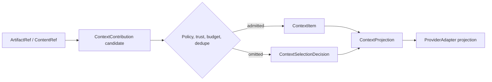

# Context And Memory Contract

This contract defines how the SDK turns user input, history, host context, retrieved memory, tool results, skills, subagent outputs, artifacts, and compaction output into provider context without letting any of them become a shadow run state owner.

Context is a projection pipeline, not the universal SDK primitive. Content may exist as an `ArtifactRef` or `ContentRef` without being provider-visible. Only policy-admitted candidates become `ContextItem` values, and only selected items enter a `ContextProjection`.

## Primitive Boundary

| Primitive | Owns | Must not own |
| --- | --- | --- |
| `AgentMessage` | Lossless internal messages, parts, roles, lineage, privacy, retention, and projection status. | Provider-specific wire shape as the only transcript representation. |
| `ArtifactRef` / `ContentRef` | Stable reference to text, media, files, tool results, generated artifacts, schemas, or external content with scope, version, MIME/type, storage service, privacy, retention, and redacted summary. | Provider visibility, memory ownership, or raw-byte copying through events. |
| `ContextContribution` | Candidate context from memory, tool results, skills, host input, remote channels, subagents, compaction, or files before admission. | Provider-ready projection or durable memory write authority. |
| `ContextItem` | One policy-admitted injectable unit of context with source, destination, policy, sensitivity, retention, trust, projection role, and lineage. | Durable memory write authority or arbitrary artifact storage. |
| `ContextProjection` | The provider-ready prompt/message projection, token/media budgets, omitted item summaries, and projection audit fields. | Provider transport or durable transcript storage. |
| `ContextSelectionDecision` | Inclusion, omission, compaction, redaction, dedupe, budget, and policy reasoning for each candidate. | Product-specific ranking UX or provider transport. |
| `MemoryPort` | Retrieval and storage port for host or SDK memory backends. | UI memory browsing, product ranking UX, or extension-owned shadow memory. |
| `ContextAssembler` | Deterministic assembly from messages, context items, memory results, output contracts, tools, and budget policy. | Policy bypass, provider calls, or hidden prompt injection. |
| `CompactionPolicy` | When and how to summarize or compact context, plus protected-item preservation. | Silent deletion or unjournaled memory mutation. |

## MVP Profile

The MVP slice needs only:

- user text `AgentMessage`;
- host-provided `ContextContribution` values;
- pre-admitted `ContextItem` values only when they already carry a `ContextSelectionDecision`, policy refs, lineage, and a projection audit record from a trusted assembler;
- deterministic `ContextProjection` with token/item budget summaries;
- local output-schema projection hints;
- no ambient memory store unless a fake `MemoryPort` is supplied;
- no raw content in events by default.

Long-term memory retrieval, detail expansion, semantic ranking, compaction hooks, media context, and write-back policies are feature layers over the same primitives.

## Contract Rules

- Provider projection starts from `AgentMessage` and admitted `ContextItem` values, never from host UI strings, telemetry payloads, raw tool output blobs, or arbitrary memory records.
- `ArtifactRef` and `ContentRef` are the content-bearing primitives. They can point to large, binary, generated, retrieved, or external content without making that content provider-visible.
- `ContextContribution` values are candidates. Memory, tool results, skills, files, host input, remote channels, subagents, hooks, and compaction may produce candidates.
- `ContextAssembler` is the only component that admits candidates into `ContextItem` and `ContextProjection`. Host input normally arrives as `ContextContribution`; if a host supplies a pre-admitted `ContextItem`, the SDK must validate its selection decision, policy refs, lineage, trust class, and projection audit before accepting it.
- Every injected context item has a source, destination, producer ref, source ref, policy ref, privacy class, retention class, trust class, projection role, content ref or bounded inline summary, and lineage refs.
- Every projection has an audit record that explains included, omitted, compacted, redacted, policy-denied, budget-denied, duplicate, trust-denied, missing-ref, and protected-item outcomes without copying raw content.
- `MemoryPort` is optional. Missing memory access means no memory retrieval, not a fallback to host globals.
- Memory retrieval may return candidates; `ContextAssembler` decides inclusion under budget and policy.
- Compaction creates a new context item or message summary with lineage to the inputs it summarized.
- Protected context can be omitted only by explicit policy or terminal failure.
- Raw memory content is not emitted in live events or telemetry unless a content-capture policy allows it.
- Extensions and remote channels may submit memory/context candidates only through typed ports and host policy.

## Contribution Pipeline



The pipeline records decisions even for omitted items. That makes provenance and debugging available without leaking raw content into model input, live events, or telemetry by default.

Selection reasons are finite:

- `Required`
- `Pinned`
- `Relevant`
- `Recent`
- `ToolResultRequired`
- `Compacted`
- `Redacted`
- `OmittedBudget`
- `OmittedPolicy`
- `OmittedDuplicate`
- `OmittedTrust`
- `OmittedStale`
- `OmittedMissingRef`
- `ProtectedOmittedByPolicy`

## Projection Audit

`ContextProjection` includes the provider-ready message parts plus a separate audit surface. Provider adapters consume the projected parts; replay, debugging, tests, and events consume the audit. The audit is journaled as a `ContextRecord::ProjectionAudit` before provider streaming starts and can be summarized into `ContextProjectionAudited`.

```rust
// Non-compiling contract sketch.
pub struct ContextProjectionAudit {
    pub projection_id: ContextProjectionId,
    pub source_message_ids: Vec<MessageId>,
    pub candidate_count: u32,
    pub included_count: u32,
    pub omitted_count: u32,
    pub compacted_count: u32,
    pub redacted_count: u32,
    pub policy_denied_count: u32,
    pub budget_denied_count: u32,
    pub missing_ref_count: u32,
    pub protected_omitted_count: u32,
    pub decisions: Vec<ContextSelectionDecision>,
    pub budget: ContextBudgetSummary,
    pub policy_refs: Vec<PolicyRef>,
    pub redaction_policy_id: RedactionPolicyId,
    pub runtime_package_fingerprint: RuntimePackageFingerprint,
}

pub struct ContextSelectionDecision {
    pub contribution_id: Option<ContextContributionId>,
    pub context_item_id: Option<ContextItemId>,
    pub reason: ContextSelectionReason,
    pub producer_ref: EntityRef,
    pub source_ref: SourceRef,
    pub content_ref: Option<ContentRef>,
    pub policy_refs: Vec<PolicyRef>,
    pub privacy_class: PrivacyClass,
    pub retention_class: RetentionClass,
    pub trust_class: TrustClass,
    pub redacted_summary: RedactedSummary,
}
```

Audit rules:

- `ContextProjectionAudited` is emitted after the audit journal record exists and before `ProviderRequestProjected`.
- A projection with any `ProtectedOmittedByPolicy` or required `OmittedMissingRef` decision fails closed unless the run policy explicitly allows repair or omission.
- Omitted decisions remain part of the audit even when their raw content is unavailable or policy-denied.
- The audit uses `ContentRef`, hashes, counts, policy refs, and redacted summaries. It is not a provider prompt and not a substitute for memory storage.

## Context Item Envelope

Every admitted item carries the fields below, either directly or through refs:

```rust
// Non-compiling contract sketch.
pub struct ContextItemEnvelope {
    pub context_item_id: ContextItemId,
    pub contribution_id: Option<ContextContributionId>,
    pub kind: ContextItemKind,
    pub producer_ref: EntityRef,
    pub source_ref: SourceRef,
    pub destination_ref: DestinationRef,
    pub content_ref: Option<ContentRef>,
    pub derived_from: Vec<EntityRef>,
    pub projection_role: ProjectionRole,
    pub policy_refs: Vec<PolicyRef>,
    pub privacy_class: PrivacyClass,
    pub retention_class: RetentionClass,
    pub trust_class: TrustClass,
    pub budget_hint: Option<ContextBudgetHint>,
    pub selection: ContextSelectionDecision,
    pub redacted_summary: RedactedSummary,
}
```

`kind` is finite and source-qualified, for example `UserInput`, `HostContext`, `MemoryRecall`, `ToolResult`, `SkillResult`, `FileContext`, `RemoteChannel`, `SubagentHandoff`, `CompactionSummary`, `SystemInstruction`, or `OutputSchemaHint`.

## Events And Journal Records

Events may use the reserved `memory_context` family only when the implementing workstream emits those kinds and provides fixtures:

- `MemoryRetrieved`
- `ContextContributionReceived`
- `ContextContributionSelected`
- `ContextContributionOmitted`
- `MemoryStored`
- `ContextItemInjected`
- `ContextCompactionStarted`
- `ContextCompactionCompleted`
- `ContextProjectionAudited`

Journal records:

- `MessageRecord`
- `ContextRecord`

`ContextRecord` is the top-level journal kind for context and memory payloads. It has typed payload variants for `MemoryRetrieval`, `ContextContributionReceived`, `ContextSelection`, `ProjectionAudit`, `Compaction`, `MemoryWriteIntent`, and `MemoryWriteResult`. Memory writes are side effects: `MemoryWriteIntent` contains or maps one-to-one to `EffectIntent { kind: MemoryWrite }`, and `MemoryWriteResult` contains or maps one-to-one to the matching `EffectResult`.

## Acceptance Tests

- `context_projection_uses_context_items_not_host_ui_strings`
- `memory_port_absent_means_no_memory_lookup`
- `context_item_requires_source_destination_policy_privacy_and_lineage`
- `context_contribution_is_not_projected_without_admission`
- `artifact_ref_does_not_imply_provider_visibility`
- `context_selection_records_omitted_policy_budget_duplicate_and_trust_reasons`
- `projection_budget_records_included_and_omitted_counts`
- `projection_audit_records_compacted_redacted_policy_budget_and_missing_ref_counts`
- `projection_audit_precedes_provider_request_projected`
- `protected_missing_context_fails_closed_or_requests_repair`
- `compaction_preserves_lineage_to_source_items`
- `memory_retrieval_event_has_no_raw_content_by_default`
- `memory_write_intent_precedes_store_call`
- `context_helper_and_explicit_projection_emit_equivalent_events`

## Complete Example

Typed shape:

```rust
// Non-compiling contract sketch.
let message = AgentMessage::user_text("Summarize the release notes")
    .with_source(SourceRef::host_surface("surface.chat"))
    .with_privacy(PrivacyClass::ContentRefsOnly);

let content_ref = ContentRef::artifact("artifact.release_notes.v1")
    .with_mime("text/markdown")
    .with_privacy(PrivacyClass::ContentRefsOnly);

let contribution = ContextContribution::builder(ContextContributionId::new())
    .producer(EntityRef::memory("memory.release_notes"))
    .source(SourceRef::host_surface("surface.context"))
    .content_ref(content_ref)
    .trust(TrustClass::HostProvided)
    .policy(PolicyRef::new("policy.context.standard"))
    .summary("release notes context")
    .build()?;

let context_item = ContextAssembler::new()
    .candidate(contribution)
    .admit(ContextSelectionReason::Required)?
    .context_item(ContextItemId::new())
    .source(SourceRef::host_surface("surface.context"))
    .destination(DestinationRef::provider_context("provider.prompt"))
    .policy(PolicyRef::new("policy.context.standard"))
    .privacy(PrivacyClass::RedactedSummary)
    .retention(RetentionClass::RunScoped)
    .lineage(LineageRef::from_message(message.id()))
    .build()?;

let projection = ContextAssembler::new()
    .message(message)
    .context_item(context_item)
    .budget(ContextBudget::tokens(8_000))
    .build_projection(&runtime_package)?;
```

Wiring:

1. Host or SDK creates messages and content/artifact refs with explicit source and policy.
2. Optional `MemoryPort`, tools, skills, remote channels, subagents, and compaction produce `ContextContribution` candidates.
3. `ContextAssembler` selects, redacts, compacts, dedupes, and orders context under budget and policy.
4. Provider adapter receives only `ContextProjection`.
5. Events and journal records capture projection counts, lineage, privacy, and omitted-item summaries.

SDK owns / Host owns:

- SDK owns message/context/projection shapes, budget enforcement, lineage requirements, and no-raw-content defaults.
- Host owns memory backend choice, memory browsing UI, retention policy, and product-specific ranking.
