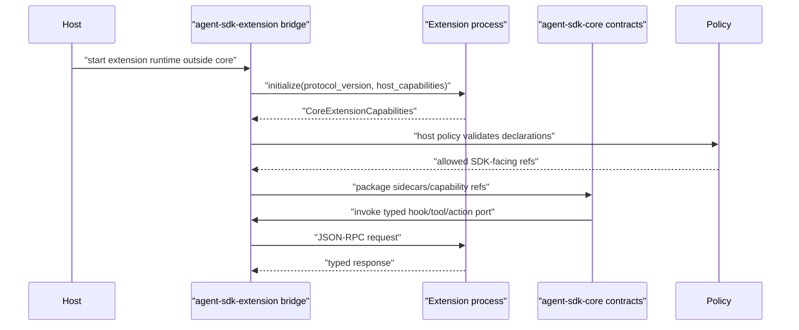

# Extension SDK Contract

The extension SDK is a layer over stable Agent SDK contracts. Extensions can observe, declare SDK-facing capabilities, and submit actions through host policy. They do not own approval, memory, provider routing, telemetry, app-event durability, subprocess lifecycle, or durable run state.

`agent-sdk-core` does not own the extension subprocess runtime, app-event fanout or transport, UI surfaces, marketplace, install flow, package compatibility checks, browser-safe export validation, trust scoring, or action-permission grants. Core sees only typed `CoreExtensionCapabilities`, runtime-package sidecars/capability refs resolved after host policy, policy-crossing action requests, and event/journal records. The optional `agent-sdk-extension` crate may define helper DTOs, JSON-RPC protocol types, and packaging smoke-test surfaces, but those helpers are not execution authority inside core.

## External Lessons

- Cursor and Claude SDKs show that MCP, hooks, skills, and subagents need first-class extension surfaces.
- Pi keeps product harnesses and automation outside the core. Extensions should remain host-level capabilities layered over SDK ports.
- Existing extension runtimes commonly have JSON-RPC subprocesses, hook merge rules, app events, and packaged fallback concerns. The SDK should clarify these contracts, not hide them.

## Core Capability Vs Host Manifest Boundary

`CoreExtensionCapabilities` must remain SDK-facing. The SDK sees extension-provided capabilities only after a host or optional extension bridge has validated host manifest data, runtime compatibility, trust state, action permissions, and policy. Keep two shapes distinct:

- `CoreExtensionCapabilities`: product-neutral declarations for tools, hooks, provider adapters, subagents, and extension actions. These declarations are inputs to package resolution, not live authority.
- `HostExtensionManifest`: host-owned or optional-extension-package metadata such as marketplace identity, UI surfaces, app-event subscriptions, process runtime, packaging, browser-safe exports, compatibility ranges, trust state, install metadata, and transport.

Core must not ingest a host manifest as authority to mutate run state. The host resolves allowed core capabilities into the package after policy and records only SDK-facing refs, sidecars, catalog snapshots, policies, and package fingerprint inputs.

```rust
// Non-compiling contract sketch.
pub struct CoreExtensionCapabilities {
    pub extension_id: ExtensionId,
    pub version: Semver,
    pub tools: Vec<ToolCapability>,
    pub hooks: Vec<HookCapability>,
    pub providers: Vec<ProviderCapability>,
    pub subagents: Vec<SubagentCapability>,
    pub actions: Vec<ExtensionActionCapability>,
}

pub struct ExtensionActionCapability {
    pub action_id: ExtensionActionId,
    pub action_kind: ExtensionActionKind,
    pub requested_destination: DestinationRef,
    pub risk_class: RiskClass,
    pub input_schema_ref: Option<SchemaRef>,
    pub idempotency: ExtensionActionIdempotency,
}

pub struct ResolvedExtensionCapabilitySnapshot {
    pub extension_id: ExtensionId,
    pub version: Semver,
    pub source_ref: SourceRef,
    pub catalog_snapshot_ref: CatalogSnapshotId,
    pub package_sidecars: Vec<PackageSidecarRef>,
    pub capability_refs: Vec<CapabilityId>,
    pub hook_refs: Vec<HookId>,
    pub provider_adapter_refs: Vec<ProviderAdapterRef>,
    pub subagent_refs: Vec<SubagentDefinitionRef>,
    pub policy_refs: Vec<PolicyRef>,
}

pub struct ResolvedExtensionActionSidecar {
    pub action_id: ExtensionActionId,
    pub action_kind: ExtensionActionKind,
    pub source_ref: SourceRef,
    pub destination: DestinationRef,
    pub executor_ref: ExtensionBridgeRef,
    pub policy_refs: Vec<PolicyRef>,
    pub approval_policy_ref: PolicyRef,
    pub redaction_policy_id: RedactionPolicyId,
}

// Host-owned or optional extension-package sketch. This is not an
// agent-sdk-core execution DTO.
pub struct HostExtensionManifest {
    pub extension_id: ExtensionId,
    pub version: Semver,
    pub runtime: ExtensionRuntimeKind,
    pub core_capabilities: CoreExtensionCapabilities,
    pub app_event_subscriptions: Vec<AppEventSubscription>,
    pub commands: Vec<HostCommandContribution>,
    pub ui_surfaces: Vec<HostUiSurfaceContribution>,
    pub action_permissions: Vec<ActionPermission>,
    pub browser_safe_exports: Vec<BrowserSafeSubpath>,
    pub package_compatibility: PackageCompatibility,
    pub trust_state: TrustState,
}
```

## Core Capability Fields

`CoreExtensionCapabilities` is the only SDK/package-facing extension declaration primitive:

- extension ID/version
- tool declarations that can lower into `CapabilitySpec { kind: Tool }` plus extension tool sidecars
- hook declarations that can lower into core `HookSpec` sidecars with extension executor refs
- provider adapter declarations that can lower into provider-adapter refs or provider-capability sidecars without owning provider routing or credentials
- subagent declarations that can lower into subagent sidecars or `AgentAsTool` capabilities after handoff policy
- extension action declarations that can lower into `CapabilitySpec { kind: ExtensionAction }` plus action sidecars

## Host Manifest Fields

`HostExtensionManifest` is host-owned or optional extension-package metadata and is never projected directly into `agent-sdk-core`:

- runtime kind and transport details
- app-event subscriptions
- commands and UI surfaces
- action permissions and trust state
- browser-safe exports and package compatibility range
- installation, marketplace, packaging, and process-management metadata

Rules:

- Host manifest fields are never fields on `CoreExtensionCapabilities`, `CapabilitySpec`, `HookSpec`, or extension runtime-package sidecars.
- If trust, compatibility, or action-permission state affects activation, the host records the resulting `PolicyRef`, `SourceRef`, and `CapabilityCatalogSnapshot` refs in the resolved runtime package. Core does not receive the product trust enum, marketplace metadata, install record, or raw manifest as authority.
- Browser-safe export declarations and package compatibility ranges belong to optional extension package smoke tests and host install policy. They do not change the core capability DTO.
- App-event transport, storage, replay, and fanout stay host-owned. Core may see only metadata-bounded observation events after policy.
- Extension subprocess lifecycle stays outside `agent-sdk-core`. The optional extension crate or host adapter may own protocol helpers, but process placement, restart policy, resource location, and install lifecycle are host concerns.

## Runtime Package Resolution

Extension declarations become active only through runtime-package resolution:

1. Host or optional extension bridge validates the host manifest, package/runtime compatibility, trust state, action permissions, and install/runtime policy outside core.
2. Host evaluates permission, sandbox, approval, escalation, redaction, retention, provider-route, subagent handoff, and app-event policies against the declared `CoreExtensionCapabilities`.
3. The allowed declarations are normalized into a `CapabilityCatalogSnapshot` with source-qualified refs and activation policy.
4. The next `RuntimePackage` snapshot receives only typed sidecars/capabilities:
   - extension tools as `CapabilitySpec { kind: Tool }` plus extension tool sidecars and executor refs;
   - extension hooks as core `HookSpec` sidecars with `HookSource::Extension` and extension bridge executor refs;
   - extension provider adapters as provider sidecars/adapter refs that hosts may choose in provider route policy;
   - extension subagents as subagent sidecars or `AgentAsTool` capabilities after parent-owned handoff policy;
   - extension actions as `CapabilitySpec { kind: ExtensionAction }` plus extension action sidecars.
5. Package fingerprint inputs include extension ID/version, SDK-facing declared capability IDs, executor or bridge refs, policy refs, package sidecar refs, source refs, and catalog snapshot refs. They exclude host manifest runtime fields, install paths, marketplace metadata, browser-safe export lists, raw trust state, and app-event transport details.

Package validation fails closed when an extension-declared tool, hook, provider, subagent, or action is missing a policy ref, missing sidecar, unresolved executor/bridge ref, invalid namespace, missing source ref, or unsupported active reserved capability variant.

## JSON-RPC Runtime



Rules:

- JSON-RPC 2.0 over NDJSON protocol helpers are owned by `agent-sdk-extension` or the host adapter, not `agent-sdk-core`; concrete subprocess lifecycle and runtime management remain host-owned.
- Initialize handshake declares protocol version and capabilities.
- Request/response IDs must match.
- Known finite values use typed enums.
- stderr is drained.
- Hook timeouts follow core hook timeout/failure policy. Nonblocking observe-only hooks may fail open; security-relevant hooks cannot fail open.
- Tool/action timeouts follow tool/approval/effect policy.
- Extension-submitted actions cannot self-approve.
- JSON-RPC request IDs, process IDs, install paths, and runtime handles are not package fingerprint inputs unless represented by stable SDK-facing refs selected by host policy.

## Extension Action Approval And Effects

An extension action is externally visible behavior requested by an extension and executed or routed by a host adapter. It is never a direct callback into host UI or host state.

Required flow:

1. Resolve the submitted action against the active `RuntimePackage` by `ExtensionActionId`, extension ID/version, package fingerprint, `CapabilitySpec { kind: ExtensionAction }`, sidecar ref, executor/bridge ref, source ref, destination ref, and policy ref.
2. Missing package entry, missing policy, missing executor/bridge, stale package fingerprint, undeclared action kind, or namespace collision denies before approval dispatch or host action execution.
3. Evaluate permission, sandbox/isolation when relevant, approval, autonomy, escalation, redaction, retention, and sink/host-action policy. Host action permission is an input to these policies; it is not authority inside core.
4. If policy returns `Ask`, use the normal `ApprovalBroker` and host `ApprovalDispatcher`. Dispatch appends `ApprovalRecord { dispatch_intent }` with `EffectIntent { kind: ApprovalDispatch }` before contacting the dispatcher and appends terminal `EffectResult` before any host action starts.
5. Reject any approval response whose actor/source is the same extension, same extension process, same extension bridge request, or an untrusted delegate of the requesting extension. Extension observers may see redacted approval lifecycle events only when policy allows; they cannot answer.
6. Append an action intent before host action execution:

```rust
// Non-compiling contract sketch.
EffectIntent {
    kind: EffectKind::ExtensionAction,
    subject_ref: EntityRef::extension_action(action_id),
    source: SourceRef::extension(extension_id),
    destination: Some(requested_destination),
    policy_refs,
    idempotency_key,
    dedupe_key,
    content_refs,
    redacted_summary,
}
```

7. Execute only the package-resolved action route through the host action adapter or extension bridge.
8. Append terminal `EffectResult` for every appended action intent: completed, failed, timed-out, cancelled, or unknown-status outcomes. If policy denies before any action intent is appended, record `ExtensionActionDenied`, policy decision refs, and approval records when applicable, and do not contact the host action route. If the external host action may have happened but terminal append fails, recovery blocks further non-idempotent extension actions until reconciled.

Extension action records must carry `RunJournal`, `AgentEvent`, `PolicyRef` / `PolicyDecisionRef`, `SourceRef`, `DestinationRef`, `EntityRef::ExtensionAction`, runtime package fingerprint, privacy, retention, redaction policy, idempotency/dedupe keys where available, and a reconciliation ref such as an extension request ID or host action receipt.

## Hook Mutation Rights

Core hook semantics are defined in [hook-lifecycle-contract.md](hook-lifecycle-contract.md). This section describes extension-provided hooks only: they are `HookSpec` executors routed through an optional extension bridge or host adapter.

| Hook | May mutate? | Notes |
| --- | --- | --- |
| `beforeModelCall` | only through typed projection response | no raw transcript mutation |
| `afterModelCall` | may request retry through typed response | retry is observable |
| `beforeToolCall` | may deny/modify only through typed response | first deny wins by policy |
| `afterToolCall` | may request retry or output rewrite by typed response | output rewrite is journaled |
| app-event observer | no runtime mutation | best-effort metadata-bounded |

## Security-Relevant Hook Capability Rules

Security decisions cannot depend on fail-open extension hooks.

Rules:

- Approval, permission, sandbox, isolation downgrade, retention, and content-capture decisions are host policy decisions.
- Extension hooks may propose deny/modify/retry only where their resolved `CoreExtensionCapabilities`, `HookSpec`, mutation rights, and policy refs allow it.
- A nonblocking hook timeout cannot turn deny into allow.
- A blocking security hook must declare fail behavior: deny or interrupt. It cannot fail open.
- `beforeModelCall` from SDK extensions is observation or bounded projection response only; capability marketing belongs in skills, not hidden system-prompt injection.
- Extension hooks cannot grant themselves tools, memory access, network access, or approval authority.
- Hook mutation responses are journaled with extension ID, hook kind, timeout policy, and redacted diff/summary.
- Extension hook responses lower into the normal hook response matrix. They do not enqueue generic extension effects or mutate transcript/provider/tool state directly.

## Packaging Compatibility

Required smokes:

- Bun packaged fallback imports `.`, `./browser-safe`, and `./media` from outside the repo only when a supported fallback strategy is implemented.
- Node ESM normal `node_modules` imports `.`, `./browser-safe`, and `./media`.
- Node ESM `NODE_PATH` packaged fallback remains unsupported until a loader/import-map/install strategy is implemented and smoked.
- CommonJS `require` is unsupported unless added explicitly.
- Browser-safe helper subpaths are explicit. The active generic helper subpath is `@agent-sdk/extension-sdk/browser-safe`.
- Extension-local dependencies win over host fallback.

These smokes belong to `agent-sdk-extension` packaging tests or host install tests. `agent-sdk-core` cannot depend on Node, Bun, subprocess, filesystem probing, package export maps, or runtime fallback behavior.

## Browser-Safe Subpath Contract

Browser-safe means no transitive dependency on:

- `node:fs`
- `node:child_process`
- `node:net`
- `node:tls`
- `node:worker_threads`
- `process` runtime globals except safe feature detection
- native `.node` addons
- filesystem path probing
- subprocess spawning

`@agent-sdk/extension-sdk/browser-safe` is browser-safe. Root and media exports are not browser-safe unless separately declared and tested.

## App Events

Extension app events are host-owned live observations:

- metadata-bounded
- optional source extension identity
- optional origin/target surface
- no durable analytics authority
- no approval/tool execution authority
- no startup trigger for stopped extensions unless host policy says so

Durable analytics flow through journal/telemetry/trace adapters, not host display events.

Core or optional extension helper types may describe an observed event envelope with IDs, surface refs, bounded summaries, privacy, retention, and policy refs. They must not own app-event transport, delivery guarantees, durable storage, startup behavior, replay, fanout, or product display semantics.

## Phase 05 Emitted Kinds, Redaction, And Fixtures

This section names the Phase 05d extension emitted-kind and fixture inputs that stitching can use to close the Phase 04 OTel extension deferral. It does not update shared event or OTel matrices directly.

| Extension path | Phase 05 extension-family kinds | Journal/effect backing | Required fixture names |
| --- | --- | --- | --- |
| capability resolution | `ExtensionCapabilityLoaded` | package catalog snapshot, package sidecar refs, runtime-package fingerprint | `extension_capability_loaded_no_manifest_fields.golden.json`, `extension_capability_loaded_redacted.golden.json` |
| extension hook executor | `ExtensionHookInvoked` plus core hook events | `HookRecord` and any lowered target-domain record | `extension_hook_invoked_content_refs_only.golden.json`, `extension_hook_projection_patch_redacted.golden.json` |
| extension tool route | `ExtensionToolRequested` plus core tool/approval events | `ToolRecord` with `EffectIntent { kind: ToolExecution }` / `EffectResult` | `extension_tool_requested_args_redacted.golden.json`, `extension_tool_result_content_ref.golden.json` |
| extension app-event observation | `ExtensionEventObserved` | best-effort event by default; journal only if a separate host policy records a durable SDK fact | `extension_event_observed_metadata_only.golden.json`, `extension_event_observed_no_transport_state.golden.json` |
| extension action request | `ExtensionActionSubmitted`, `ExtensionActionStarted`, `ExtensionActionCompleted`, `ExtensionActionFailed`, `ExtensionActionDenied` | `ApprovalRecord` when approval dispatch is required; `EffectIntent { kind: ExtensionAction }` before host action; terminal `EffectResult` for each appended action intent | `extension_action_submitted_policy_refs_only.golden.json`, `extension_action_started_effect_intent.golden.json`, `extension_action_denied_self_approval.golden.json`, `extension_action_denied_missing_policy.golden.json`, `extension_action_completed_effect_result_redacted.golden.json`, `extension_action_failed_effect_result_redacted.golden.json` |

Stitching accepted `ExtensionActionStarted`, `ExtensionActionCompleted`, and `ExtensionActionFailed` so extension action telemetry does not infer terminal status only from generic `EffectResult` payloads. Phase 05d tests must still prove terminal `EffectResult` fixtures exist and that `ExtensionActionDenied` covers denied-before-execution.

Default redaction:

- Extension capability events include extension ID/version, SDK-facing capability IDs/kinds, source refs, policy refs, package sidecar refs, runtime package fingerprint, and bounded summaries. They exclude host manifest runtime, install path, marketplace, trust enum, package compatibility, browser-safe export list, and app-event transport fields.
- Extension hook/tool/action payloads include typed refs, statuses, policy decision refs, risk/effect class, idempotency/dedupe keys, content refs, and redacted summaries. They exclude raw hook input, prompt/model output, tool args/results, file bytes, process I/O, environment values, auth headers, credentials, and raw app-event payloads by default.
- Extension app-event observation payloads include event type, source extension ref, origin/target surface refs, counts, hashes, privacy, retention, policy refs, and redacted summary. They exclude durable app-event store IDs unless the host explicitly exposes a stable alias by policy.
- OTel projection fixtures for this family should be named `otel_extension_capability_loaded_redacted_span.golden.json`, `otel_extension_hook_invoked_redacted_span.golden.json`, `otel_extension_tool_requested_redacted_span.golden.json`, `otel_extension_action_effect_redacted_span.golden.json`, and `otel_extension_event_observed_metadata_only_log.golden.json`.

## Acceptance Tests

- `core_extension_capabilities_exclude_host_manifest_fields`
- `host_extension_manifest_never_enters_agent_sdk_core_as_authority`
- `host_policy_resolves_extension_tools_hooks_providers_subagents_actions_into_runtime_package`
- `extension_provider_declaration_does_not_own_provider_routing_or_credentials`
- `extension_subagent_declaration_lowers_after_handoff_policy`
- `extension_action_capability_lowers_to_runtime_package_extension_action_sidecar`
- `extension_action_records_effect_intent_before_host_action`
- `extension_action_records_effect_result_for_terminal_status`
- `extension_action_missing_policy_or_dispatcher_denies`
- `initialize_rejects_unsupported_protocol_version`
- `json_rpc_response_id_mismatch_fails_request`
- `extension_hook_timeout_fails_open_when_nonblocking`
- `extension_action_crosses_host_approval`
- `extension_cannot_self_approve`
- `bun_packaged_fallback_subpath_smoke`
- `node_esm_node_modules_subpath_smoke`
- `node_path_esm_fallback_remains_unsupported_until_changed`
- `browser_safe_helper_has_no_node_native_dependency`
- `extension_local_dependency_wins_over_host_fallback`
- `security_policy_cannot_depend_on_fail_open_extension_hook`
- `blocking_policy_hook_timeout_denies_or_interrupts_by_policy`
- `browser_safe_bundle_has_no_node_process_fs_child_process_native_imports`
- `root_and_media_exports_fail_browser_safe_check`
- `core_capability_helper_lowers_to_explicit_capability_fields`
- `core_capability_helper_and_explicit_capabilities_emit_equivalent_extension_events`
- `extension_event_golden_payload_exists_for_each_emitted_kind`
- `extension_redaction_matrix_has_no_raw_content_by_default`
- `extension_otel_mapping_inputs_name_all_phase05_extension_kinds`
- `agent_sdk_core_has_no_extension_runtime_or_app_event_imports`
- `agent_sdk_core_has_no_node_bun_subprocess_or_package_export_imports`

## Ergonomics

Simple API:

```rust
// Non-compiling contract sketch.
let capabilities = CoreExtensionCapabilities::builder("com.example.reviewer")
    .version("1.2.0")
    .tool("review_notes")
    .before_model_call_nonblocking()
    .action("submit_ui_effect")
    .build()?;
```

Advanced API:

```rust
// Non-compiling contract sketch.
let capabilities = CoreExtensionCapabilitiesBuilder::new(ExtensionId::new("com.example.reviewer"))
    .tool(ToolCapability::new("review_notes"))
    .hook(HookCapability::before_model_call_nonblocking())
    .action(ExtensionActionCapability::submit_ui_effect())
    .build()?;
```

Canonical lowering:

- Core capability helpers lower into explicit `CoreExtensionCapabilities` fields.
- Host resolves declared `CoreExtensionCapabilities` into `RuntimePackage` sidecars/capabilities only after policy checks.
- Resolved extension tools, hooks, providers, subagents, and actions use normal `CapabilitySpec`, `HookSpec`, provider adapter, subagent, policy, event, journal, and effect paths.
- Browser-safe exports and package compatibility are declared by `HostExtensionManifest` or optional extension crate packaging tests, not by core capability refs.

Equivalence:

- Helper and explicit core-capability paths produce the same `CoreExtensionCapabilities`, host policy resolution inputs, package sidecar refs, capability load events, and package capability records.
- Helpers cannot grant approval, memory, provider routing, or telemetry authority.

SDK owns / Host owns:

- SDK owns core capability field shape, helper lowering, policy-crossing event/journal/effect contracts, and typed refs.
- Optional extension crate or host adapter owns JSON-RPC protocol helpers and package smoke surfaces.
- Host owns extension installation, process lifecycle, marketplace UX, app-event transport/fanout, trust/action permission policy, and packaged fallback resolution.

Tests:

- `core_capability_helper_lowers_to_explicit_capability_fields`
- `core_capability_helper_and_explicit_capabilities_emit_equivalent_extension_events`
- `extension_cannot_self_approve`

## Complete Example

Typed shape:

```rust
// Non-compiling contract sketch.
let manifest = HostExtensionManifest {
    extension_id: ExtensionId::new("com.example.reviewer"),
    version: Semver::new(1, 2, 0),
    runtime: ExtensionRuntimeKind::SubprocessJsonRpcNdjson,
    core_capabilities: CoreExtensionCapabilities {
        extension_id: ExtensionId::new("com.example.reviewer"),
        version: Semver::new(1, 2, 0),
        tools: vec![ToolCapability::new("review_notes")],
        hooks: vec![HookCapability::before_model_call_nonblocking()],
        providers: vec![],
        subagents: vec![],
        actions: vec![ExtensionActionCapability::submit_ui_effect()],
    },
    app_event_subscriptions: vec![AppEventSubscription::prefix("agent.host.event.*")],
    commands: vec![],
    ui_surfaces: vec![],
    action_permissions: vec![ActionPermission::SubmitUiEffect],
    browser_safe_exports: vec![BrowserSafeSubpath::new("@agent-sdk/extension-sdk/browser-safe")],
    package_compatibility: PackageCompatibility::range("^1.0.0"),
    trust_state: TrustState::HostTrusted,
};
```

Replaceable ports:

- `ExtensionHost` can be subprocess, remote, or test fake if it speaks the same protocol.
- Core extension capabilities become runtime package sidecars/capabilities through the builder.
- Browser-safe helper subpaths are package exports with separate smoke tests.

Wiring:

1. Host or `agent-sdk-extension` loads manifest and starts JSON-RPC runtime.
2. Extension initializes and returns capabilities.
3. Host policy validates host manifest/runtime/trust/action permissions and extracts allowed `CoreExtensionCapabilities`.
4. Host or extension bridge resolves allowed declarations into `RuntimePackage` sidecars/capability refs.
5. Core invokes hooks/tools only through typed ports when the package includes them.
6. Extension-submitted actions cross host policy and approval through `EffectIntent { kind: ExtensionAction }` and terminal `EffectResult`.

Events:

- `ExtensionCapabilityLoaded`
- `ExtensionHookInvoked`
- `ExtensionToolRequested`
- `ExtensionActionSubmitted`
- `ExtensionActionDenied`
- `ExtensionEventObserved`
- `ExtensionActionStarted`
- `ExtensionActionCompleted`
- `ExtensionActionFailed`

Journal:

- `ContextRecord` for hook projection mutation summary.
- `ToolRecord` for extension tool execution.
- `ApprovalRecord` for extension-submitted host actions.
- `EffectIntent` / `EffectResult` for extension-submitted actions, using `EffectKind::ExtensionAction`.
- `RecoveryRecord` for protocol failure that affects run state.
- runtime-package catalog snapshot / sidecar records for resolved extension declarations.

Policies and failures:

- Unsupported protocol version fails initialization.
- Nonblocking hook timeout fails open only for non-security hooks.
- Blocking security hook timeout denies or interrupts by policy.
- Extension cannot approve its own action.
- Root/media exports fail browser-safe checks until explicitly declared safe.

SDK owns / Host owns:

- SDK owns stable core extension capability mapping, hook/tool/action event shapes, and policy crossing rules.
- Host owns extension installation, process lifecycle, marketplace UX, app-event fanout, and packaged fallback resolution.

Tests:

- `initialize_rejects_unsupported_protocol_version`
- `extension_action_crosses_host_approval`
- `browser_safe_bundle_has_no_node_process_fs_child_process_native_imports`
