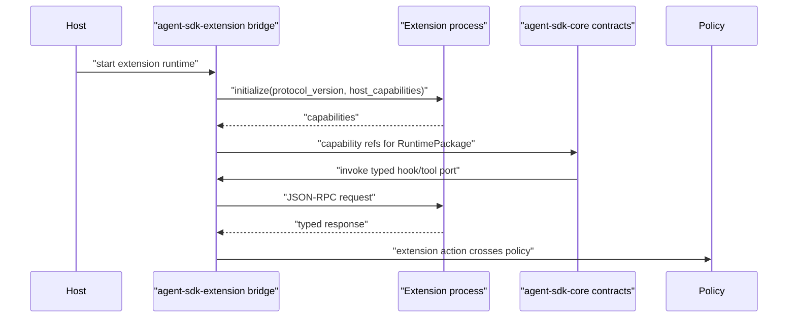

# Extension SDK Contract

The extension SDK is a layer over stable Agent SDK contracts. Extensions can observe, provide capabilities, and submit actions through host policy. They do not own approval, memory, provider routing, telemetry, or durable run state.

`agent-sdk-core` does not own the extension subprocess runtime, app-event fanout, UI surfaces, marketplace, or action transport. Core sees only typed manifest/capability DTOs, hook/tool/provider/subagent ports, runtime-package capability refs, policy-crossing action requests, and event/journal records. The optional `agent-sdk-extension` crate or host adapter owns JSON-RPC process management.

## External Lessons

- Cursor and Claude SDKs show that MCP, hooks, skills, and subagents need first-class extension surfaces.
- Pi keeps product harnesses and automation outside the core. Extensions should remain host-level capabilities layered over SDK ports.
- Existing extension runtimes commonly have JSON-RPC subprocesses, hook merge rules, app events, and packaged fallback concerns. The SDK should clarify these contracts, not hide them.

## Core Capability Vs Host Manifest Boundary

The SDK sees extension-provided capabilities only after a host or optional extension bridge has validated the host manifest, runtime, trust state, and policy. Keep two shapes distinct:

- `CoreExtensionCapabilities`: product-neutral capability declarations that can be resolved into `RuntimePackage` sidecars/capabilities.
- `HostExtensionManifest`: host-owned installation/runtime/package metadata such as marketplace identity, UI surfaces, app-event subscriptions, process runtime, packaging, and transport.

Core must not ingest a host manifest as authority to mutate run state. The host resolves allowed core capabilities into the package after policy.

```rust
// Non-compiling contract sketch.
pub struct CoreExtensionCapabilities {
    pub extension_id: ExtensionId,
    pub version: Semver,
    pub tools: Vec<ToolCapability>,
    pub hooks: Vec<HookCapability>,
    pub providers: Vec<ProviderCapability>,
    pub subagents: Vec<SubagentCapability>,
    pub actions: Vec<ExtensionActionCapability>,
}

pub struct HostExtensionManifest {
    pub extension_id: ExtensionId,
    pub version: Semver,
    pub runtime: ExtensionRuntimeKind,
    pub core_capabilities: CoreExtensionCapabilities,
    pub app_event_subscriptions: Vec<AppEventSubscription>,
    pub commands: Vec<HostCommandContribution>,
    pub ui_surfaces: Vec<HostUiSurfaceContribution>,
    pub action_permissions: Vec<ActionPermission>,
    pub browser_safe_exports: Vec<BrowserSafeSubpath>,
    pub package_compatibility: PackageCompatibility,
    pub trust_state: TrustState,
}
```

## Core Capability Fields

`CoreExtensionCapabilities` is the only SDK/package-facing extension primitive:

- extension ID/version
- tools
- hooks
- providers
- subagents
- extension action capabilities

## Host Manifest Fields

`HostExtensionManifest` is host-owned and never projected directly into `agent-sdk-core`:

- runtime kind and transport details
- app-event subscriptions
- commands and UI surfaces
- action permissions and trust state
- browser-safe exports and package compatibility range
- installation, marketplace, packaging, and process-management metadata

## JSON-RPC Runtime



Rules:

- JSON-RPC 2.0 over NDJSON for subprocess runtime is owned by `agent-sdk-extension` or the host adapter, not `agent-sdk-core`.
- Initialize handshake declares protocol version and capabilities.
- Request/response IDs must match.
- Known finite values use typed enums.
- stderr is drained.
- Hook timeouts fail open unless explicitly blocking.
- Tool/action timeouts follow tool/approval policy.
- Extension-submitted actions cannot self-approve.

## Hook Mutation Rights

Core hook semantics are defined in [hook-lifecycle-contract.md](hook-lifecycle-contract.md). This section describes extension-provided hooks only: they are `HookSpec` executors routed through an optional extension bridge or host adapter.

| Hook | May mutate? | Notes |
| --- | --- | --- |
| `beforeModelCall` | only through typed projection response | no raw transcript mutation |
| `afterModelCall` | may request retry through typed response | retry is observable |
| `beforeToolCall` | may deny/modify only through typed response | first deny wins by policy |
| `afterToolCall` | may request retry or output rewrite by typed response | output rewrite is journaled |
| app-event observer | no runtime mutation | best-effort metadata-bounded |

## Security-Relevant Hook Capability Rules

Security decisions cannot depend on fail-open extension hooks.

Rules:

- Approval, permission, sandbox, isolation downgrade, retention, and content-capture decisions are host policy decisions.
- Extension hooks may propose deny/modify/retry only where their manifest capability allows it.
- A nonblocking hook timeout cannot turn deny into allow.
- A blocking security hook must declare fail behavior: deny or interrupt. It cannot fail open.
- `beforeModelCall` from SDK extensions is observation or bounded projection response only; capability marketing belongs in skills, not hidden system-prompt injection.
- Extension hooks cannot grant themselves tools, memory access, network access, or approval authority.
- Hook mutation responses are journaled with extension ID, hook kind, timeout policy, and redacted diff/summary.

## Packaging Compatibility

Required smokes:

- Bun packaged fallback imports `.`, `./browser-safe`, and `./media` from outside the repo.
- Node ESM normal `node_modules` imports `.`, `./browser-safe`, and `./media`.
- Node ESM `NODE_PATH` packaged fallback remains unsupported until a loader/import-map/install strategy is implemented and smoked.
- CommonJS `require` is unsupported unless added explicitly.
- Browser-safe helper subpaths are explicit. The active generic helper subpath is `@agent-sdk/extension-sdk/browser-safe`.
- Extension-local dependencies win over host fallback.

## Browser-Safe Subpath Contract

Browser-safe means no transitive dependency on:

- `node:fs`
- `node:child_process`
- `node:net`
- `node:tls`
- `node:worker_threads`
- `process` runtime globals except safe feature detection
- native `.node` addons
- filesystem path probing
- subprocess spawning

`@agent-sdk/extension-sdk/browser-safe` is browser-safe. Root and media exports are not browser-safe unless separately declared and tested.

## App Events

Extension app events are host-owned live observations:

- metadata-bounded
- optional source extension identity
- optional origin/target surface
- no durable analytics authority
- no approval/tool execution authority
- no startup trigger for stopped extensions unless host policy says so

Durable analytics flow through journal/telemetry/trace adapters, not host display events.

## Acceptance Tests

- `initialize_rejects_unsupported_protocol_version`
- `json_rpc_response_id_mismatch_fails_request`
- `extension_hook_timeout_fails_open_when_nonblocking`
- `extension_action_crosses_host_approval`
- `extension_cannot_self_approve`
- `bun_packaged_fallback_subpath_smoke`
- `node_esm_node_modules_subpath_smoke`
- `node_path_esm_fallback_remains_unsupported_until_changed`
- `browser_safe_helper_has_no_node_native_dependency`
- `extension_local_dependency_wins_over_host_fallback`
- `security_policy_cannot_depend_on_fail_open_extension_hook`
- `blocking_policy_hook_timeout_denies_or_interrupts_by_policy`
- `browser_safe_bundle_has_no_node_process_fs_child_process_native_imports`
- `root_and_media_exports_fail_browser_safe_check`
- `manifest_helper_lowers_to_explicit_capability_fields`
- `manifest_helper_and_explicit_manifest_emit_equivalent_extension_events`
- `agent_sdk_core_has_no_extension_runtime_or_app_event_imports`

## Ergonomics

Simple API:

```rust
// Non-compiling contract sketch.
let capabilities = CoreExtensionCapabilities::builder("com.example.reviewer")
    .version("1.2.0")
    .tool("review_notes")
    .before_model_call_nonblocking()
    .action("submit_ui_effect")
    .build()?;
```

Advanced API:

```rust
// Non-compiling contract sketch.
let capabilities = CoreExtensionCapabilitiesBuilder::new(ExtensionId::new("com.example.reviewer"))
    .tool(ToolCapability::new("review_notes"))
    .hook(HookCapability::before_model_call_nonblocking())
    .action(ExtensionActionCapability::submit_ui_effect())
    .build()?;
```

Canonical lowering:

- Core capability helpers lower into explicit `CoreExtensionCapabilities` fields.
- Host resolves declared `CoreExtensionCapabilities` into `RuntimePackage` sidecars/capabilities only after policy checks.
- Browser-safe exports and package compatibility are declared by `HostExtensionManifest` or optional extension crate packaging tests, not by core capability refs.

Equivalence:

- Helper and explicit core-capability paths produce the same JSON-RPC initialization, capability load events, and package capability records.
- Helpers cannot grant approval, memory, provider routing, or telemetry authority.

SDK owns / Host owns:

- SDK owns core capability field shape, helper lowering, protocol compatibility, and policy-crossing event contracts.
- Host owns extension installation, process lifecycle, marketplace UX, and app-event fanout.

Tests:

- `core_capability_helper_lowers_to_explicit_capability_fields`
- `core_capability_helper_and_explicit_capabilities_emit_equivalent_extension_events`
- `extension_cannot_self_approve`

## Complete Example

Typed shape:

```rust
// Non-compiling contract sketch.
let manifest = HostExtensionManifest {
    extension_id: ExtensionId::new("com.example.reviewer"),
    version: Semver::new(1, 2, 0),
    runtime: ExtensionRuntimeKind::SubprocessJsonRpcNdjson,
    core_capabilities: CoreExtensionCapabilities {
        extension_id: ExtensionId::new("com.example.reviewer"),
        version: Semver::new(1, 2, 0),
        tools: vec![ToolCapability::new("review_notes")],
        hooks: vec![HookCapability::before_model_call_nonblocking()],
        providers: vec![],
        subagents: vec![],
        actions: vec![ExtensionActionCapability::submit_ui_effect()],
    },
    app_event_subscriptions: vec![AppEventSubscription::prefix("agent.host.event.*")],
    commands: vec![],
    ui_surfaces: vec![],
    action_permissions: vec![ActionPermission::SubmitUiEffect],
    browser_safe_exports: vec![BrowserSafeSubpath::new("@agent-sdk/extension-sdk/browser-safe")],
    package_compatibility: PackageCompatibility::range("^1.0.0"),
    trust_state: TrustState::HostTrusted,
};
```

Replaceable ports:

- `ExtensionHost` can be subprocess, remote, or test fake if it speaks the same protocol.
- Core extension capabilities become runtime package sidecars/capabilities through the builder.
- Browser-safe helper subpaths are package exports with separate smoke tests.

Wiring:

1. Host or `agent-sdk-extension` loads manifest and starts JSON-RPC runtime.
2. Extension initializes and returns capabilities.
3. Host or extension bridge extracts allowed `CoreExtensionCapabilities` and resolves them into `RuntimePackage` sidecars/capability refs.
4. Core invokes hooks/tools only through typed ports when the package includes them.
5. Extension-submitted actions cross host policy and approval through `EffectIntent { kind: ExtensionAction }` and terminal `EffectResult`.

Events:

- `ExtensionCapabilityLoaded`
- `ExtensionHookInvoked`
- `ExtensionToolRequested`
- `ExtensionActionSubmitted`
- `ExtensionActionDenied`
- `ExtensionEventObserved`

Journal:

- `ContextRecord` for hook projection mutation summary.
- `ToolRecord` for extension tool execution.
- `ApprovalRecord` for extension-submitted host actions.
- `EffectIntent` / `EffectResult` for extension-submitted actions, using `EffectKind::ExtensionAction`.
- `RecoveryRecord` for protocol failure that affects run state.

Policies and failures:

- Unsupported protocol version fails initialization.
- Nonblocking hook timeout fails open only for non-security hooks.
- Blocking security hook timeout denies or interrupts by policy.
- Extension cannot approve its own action.
- Root/media exports fail browser-safe checks until explicitly declared safe.

SDK owns / Host owns:

- SDK owns stable core extension capability mapping, hook/tool/action event shapes, and policy crossing rules.
- Host owns extension installation, process lifecycle, marketplace UX, app-event fanout, and packaged fallback resolution.

Tests:

- `initialize_rejects_unsupported_protocol_version`
- `extension_action_crosses_host_approval`
- `browser_safe_bundle_has_no_node_process_fs_child_process_native_imports`
