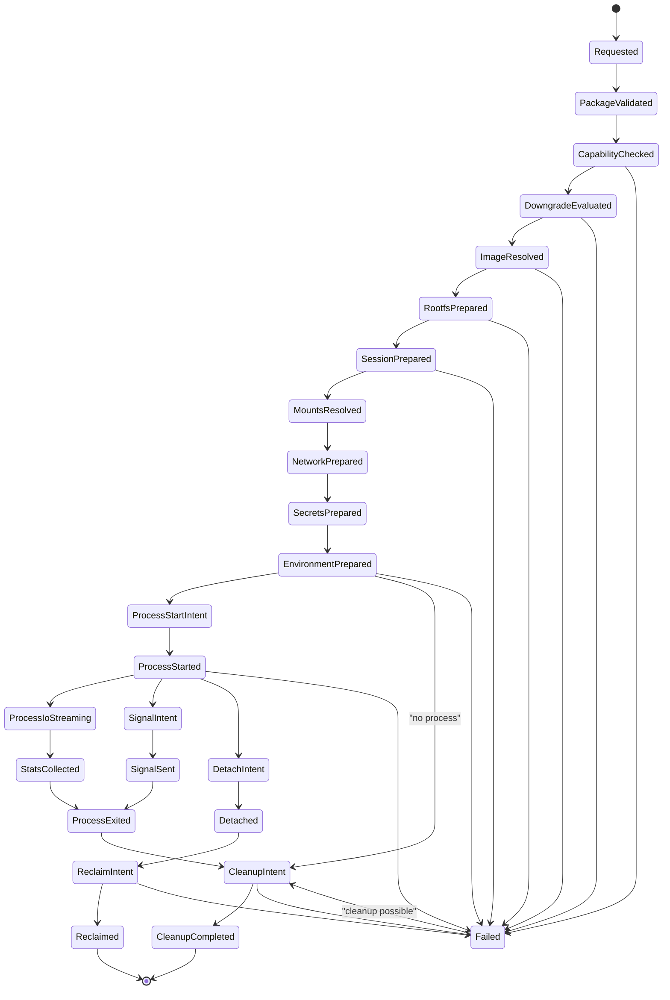

# Isolation Runtime Contract

Isolation is a portable execution contract. Concrete runtimes are host adapters.

## Contract Authority And Placement

Isolation is a feature layer over the primitive kernel:

- `RuntimePackage` is the source of truth for isolation requirements, typed sidecars, policy refs, child lifecycle policy refs, redaction policy refs, and fingerprint inputs.
- `ExecutionEnvironment` is the typed request for one workload environment. It does not select or implement a concrete runtime by itself.
- `IsolationRuntime` is an adapter port for capability reporting, environment preparation, process control, I/O, stats, cleanup, detach, and reclaim.
- `RunJournal` is durable truth for environment/process/session lifecycle, downgrade decisions, effect intents/results, cleanup, detach, and recovery.
- `AgentEvent` is the live observation surface derived from journal-backed isolation and child-lifecycle facts.
- `PolicyRef`, `PolicyDecisionRef`, `SourceRef`, `DestinationRef`, `EntityRef`, `ContentRef`, and typed refs are required on every isolation boundary.

Isolation data belongs in package fields or typed sidecars unless it is exposed as a callable or discoverable capability through an existing feature such as a tool, subagent, or extension action. Isolation is not a new `CapabilityKind` by default and must not create a parallel package registry, policy path, event stream, journal, or side-effect ledger.

Core owns portable schemas, validation, downgrade semantics, event/journal names, redaction defaults, replay/recovery rules, and helper lowering. Hosts and optional crates own runtime installation, platform APIs, credentials, image stores, mount resolution, network plumbing, process inspectors, and concrete cleanup/reclaim implementations.

## External Lessons

- Apple Containerization shows a strong local model: one Linux container per lightweight VM, explicit image/rootfs/process lifecycle, mounts, networking, Rosetta, and stats.
- Docker, Firecracker, OS sandboxes, and remote sandboxes show that class labels alone are not enough. Adapter selection must compare class, capability, and trust vectors.
- The SDK should learn the lifecycle shape, not depend on Swift, macOS 26, Apple silicon, Xcode, Docker, Firecracker, or a specific remote service.
- Hosts need isolation for shell/code execution and risky subagents, but approvals and permissions remain separate policy layers.

## Runtime Package Sidecars

The active package contains isolation sidecars before a run starts. Tool specs, subagent specs, extension actions, or host run requests reference those sidecars by typed ref.

```rust
// Non-compiling contract sketch.
pub struct IsolationRequirementSnapshot {
    pub requirement_ref: IsolationRequirementRef,
    pub sidecar_ref: PackageSidecarRef,
    pub schema_version: u16,
    pub requirement: IsolationRequirement,
    pub lifecycle_defaults: EnvironmentLifecyclePolicy,
    pub process_defaults: ProcessOwnershipPolicy,
    pub redaction_policy_ref: PolicyRef,
    pub allowed_downgrade_policy_refs: Vec<PolicyRef>,
    pub cleanup_policy_ref: PolicyRef,
    pub child_lifecycle_policy_ref: RunChildLifecyclePolicyRef,
    pub fingerprint_fields: IsolationFingerprintFields,
}

pub struct ExecutionEnvironment {
    pub environment_id: ExecutionEnvironmentId,
    pub requirement_ref: IsolationRequirementRef,
    pub sidecar_ref: PackageSidecarRef,
    pub spec: EnvironmentSpec,
    pub source: SourceRef,
    pub destination: DestinationRef,
    pub policy_refs: Vec<PolicyRef>,
    pub runtime_package_fingerprint: RuntimePackageFingerprint,
}

pub struct IsolationFingerprintFields {
    pub minimum_class: IsolationClass,
    pub trust: IsolationTrustRequirement,
    pub required_capabilities_hash: ContentHash,
    pub preferred_adapter_refs: Vec<IsolationRuntimeRef>,
    pub fallback_policy: IsolationFallback,
    pub image_policy_hash: Option<ContentHash>,
    pub rootfs_policy_hash: Option<ContentHash>,
    pub mount_policy_hash: ContentHash,
    pub network_policy_hash: ContentHash,
    pub secret_policy_hash: ContentHash,
    pub resource_policy_hash: ContentHash,
    pub cleanup_policy_ref: PolicyRef,
    pub child_lifecycle_policy_ref: RunChildLifecyclePolicyRef,
    pub redaction_policy_ref: PolicyRef,
}
```

Fingerprint includes every execution-affecting isolation field: class, trust vector, required capabilities, adapter preferences, fallback policy, policy refs, image/rootfs/mount/network/secret/resource policy hashes, cleanup policy, child lifecycle policy, redaction policy, and sidecar schema version. Fingerprint excludes volatile adapter health, process IDs, session IDs, timestamps, temp paths, live stats values, and cleanup attempts.

Package validation fails closed when an executable capability references an unknown isolation sidecar, when a sidecar lacks a `PolicyRef`, when a package tries to expose an isolation-requiring tool without an executable route, or when a helper would loosen the package's isolation or child lifecycle defaults.

## Typed Refs

Isolation records use typed refs rather than strings:

- `ExecutionEnvironmentId`
- `IsolationRequirementRef`
- `IsolationRuntimeRef`
- `IsolationSessionId`
- `IsolationSessionRef`
- `IsolationAdapterSessionRef`
- `IsolationCapabilityReportRef`
- `ImageRef`
- `RootfsRef`
- `MountRef`
- `NetworkNamespaceRef`
- `SecretRef`
- `SecretMountRef`
- `PreparedEnvironmentRef`
- `IsolatedProcessId`
- `IsolatedProcessRef`
- `ProcessIoStreamRef`
- `ProcessStatsSnapshotRef`
- `CleanupPlanRef`
- `ReclaimTicketRef`
- `ChildArtifactId`
- `RunChildLifecyclePolicyRef`
- `EffectId`
- `PolicyRef`
- `PolicyDecisionRef`
- `PackageSidecarRef`

Raw adapter handles, PIDs, registry credentials, host paths, socket names, credential profile names, and remote sandbox URLs are host-owned. They may appear only as redacted, hashed, or host-aliased refs according to policy.

## Environment Schema

```rust
// Non-compiling contract sketch.
pub struct EnvironmentSpec {
    pub environment_id: ExecutionEnvironmentId,
    pub kind: ExecutionEnvironmentKind,
    pub requirement: IsolationRequirement,
    pub image: Option<ImageRequest>,
    pub rootfs: Option<RootfsRequest>,
    pub resources: ResourceLimits,
    pub filesystem: FilesystemIsolationPolicy,
    pub network: NetworkIsolationPolicy,
    pub secrets: SecretExposurePolicy,
    pub lifecycle: EnvironmentLifecyclePolicy,
    pub ownership: ProcessOwnershipPolicy,
    pub accepted_adapters: Vec<IsolationAdapterRequirement>,
    pub io_policy: ProcessIoPolicy,
    pub stats_policy: ProcessStatsPolicy,
}

pub struct IsolationRequirement {
    pub minimum_class: IsolationClass,
    pub trust: IsolationTrustRequirement,
    pub preferred_adapters: Vec<IsolationRuntimeRef>,
    pub fallback: IsolationFallback,
    pub required_capabilities: IsolationCapabilitySet,
}

pub struct IsolationTrustRequirement {
    pub locality: LocalityRequirement,
    pub tenancy: TenantBoundaryRequirement,
    pub auditability: AuditabilityRequirement,
    pub cleanup: CleanupGuaranteeRequirement,
    pub data_residency: DataResidencyRequirement,
    pub secret_isolation: SecretIsolationRequirement,
}

pub enum IsolationClass {
    HostProcess,
    Sandbox,
    Container,
    LightweightVm,
    RemoteSandbox,
}

pub enum IsolationFallback {
    Deny,
    AllowIfPackageAndPolicyApprove {
        accepted_classes: Vec<IsolationClass>,
        accepted_capability_downgrades: IsolationCapabilityDowngradeSet,
        accepted_trust_downgrades: IsolationTrustDowngradeSet,
        required_policy_refs: Vec<PolicyRef>,
    },
    TestOnlyHostProcess,
}

pub struct ProcessOwnershipPolicy {
    pub child_artifact_id: ChildArtifactId,
    pub owner_run_id: RunId,
    pub ownership_class: ProcessOwnershipClass,
    pub on_parent_cancel: ChildShutdownBehavior,
    pub on_parent_complete: ChildShutdownBehavior,
    pub detach_policy: DetachPolicy,
    pub reclaim_policy: ReclaimPolicy,
}

pub enum ProcessOwnershipClass {
    AgentOwned,
    HostManaged,
    DetachedByIntent,
}
```

`ExecutionEnvironmentKind` is descriptive. The portable security claim is `IsolationRequirement`. Adapter refs are host-owned selectors and preferences. A preferred adapter is never enough by itself; the selected adapter must satisfy class, capability, trust, policy, cleanup, and redaction requirements from the active package.

`TestOnlyHostProcess` is accepted only under a test readiness profile with a fake adapter and explicit test policy refs. It cannot satisfy production isolation requirements.

## Adapter Port

`IsolationRuntime` is an optional adapter port. The SDK can define and validate the trait shape without making a concrete runtime a core dependency.

```rust
// Non-compiling contract sketch.
pub trait IsolationRuntime {
    async fn capability_report(&self) -> Result<IsolationCapabilityReport, IsolationError>;
    async fn prepare_session(&self, request: SessionPrepareRequest) -> Result<IsolationSessionRef, IsolationError>;
    async fn resolve_image(&self, request: ImageResolveRequest) -> Result<ImageResolution, IsolationError>;
    async fn prepare_rootfs(&self, request: RootfsPrepareRequest) -> Result<RootfsRef, IsolationError>;
    async fn resolve_mounts(&self, request: MountResolveRequest) -> Result<MountPlan, IsolationError>;
    async fn configure_network(&self, request: NetworkPrepareRequest) -> Result<NetworkNamespaceRef, IsolationError>;
    async fn prepare_secrets(&self, request: SecretPrepareRequest) -> Result<SecretMaterializationPlan, IsolationError>;
    async fn prepare_environment(&self, request: EnvironmentPrepareRequest) -> Result<PreparedEnvironmentRef, IsolationError>;
    async fn start_process(&self, request: ProcessStartRequest) -> Result<IsolatedProcessRef, IsolationError>;
    async fn stream_io(&self, request: ProcessIoRequest) -> Result<ProcessIoFrame, IsolationError>;
    async fn signal_process(&self, request: ProcessSignalRequest) -> Result<ProcessSignalResult, IsolationError>;
    async fn collect_stats(&self, request: ProcessStatsRequest) -> Result<ProcessStatsSnapshot, IsolationError>;
    async fn cleanup(&self, request: CleanupRequest) -> Result<CleanupResult, IsolationError>;
    async fn detach(&self, request: DetachTransferRequest) -> Result<DetachTransferResult, IsolationError>;
    async fn reclaim(&self, request: ReclaimRequest) -> Result<ReclaimResult, IsolationError>;
}
```

Side-effecting adapter calls require intent-before-effect ordering. The SDK appends the relevant `IsolationRecord` or `ChildLifecycleRecord` intent containing or mapping one-to-one to `EffectIntent`, calls the adapter only after the append succeeds, and appends a terminal record containing or mapping one-to-one to `EffectResult`. If intent append fails, the adapter call is not made. If the adapter may have performed an external operation but terminal append fails, the run enters recovery before another non-idempotent side effect starts.

Concrete adapters such as Apple Containerization, Docker, Firecracker, OS sandbox helpers, SSH/remote runners, or managed sandboxes implement this port in optional crates or hosts. Core must not assume their APIs, daemon model, image store, kernel, network stack, account model, or cleanup behavior.

## Capability Report

Required adapter capability fields:

- adapter ref, adapter kind, adapter version, and host-owned capability version
- health state and unsupported-host prerequisites
- supported `IsolationClass` values
- platform, OS, CPU architecture, and emulation/Rosetta support
- image formats, registry auth mode, and content verification support
- rootfs support, read-only root support, writable layer support, and snapshot/reuse support
- mount support, path-bound policy support, single-file expansion support, symlink policy support, and read-only enforcement
- network enforcement mode, egress allowlist support, DNS/hosts support, exposed-port support, socket relay support, and no-network guarantee
- secret isolation support, secret mount support, env-secret support, secret redaction support, and secret teardown guarantee
- process start, PTY, signal, timeout, rlimit, UID/GID/user, and cwd support
- stdout/stderr/stdin streaming support, content-ref capture support, truncation support, and I/O redaction support
- stats support for CPU, memory, process count, filesystem bytes, network bytes, and exit status
- cleanup guarantees, detach support, reclaim support, and anti-entropy reconciliation support
- auditability fields, log retention class, and unsupported requirement list

Capability reports are journaled facts for a selection attempt but are not package fingerprint inputs because adapter health is volatile. Capability report schema version and adapter capability version are included in events and journal records for replay diagnostics.

## Class, Capability, And Trust Matching

`IsolationClass` is a coarse containment family, not a universal security total order. A remote sandbox, local VM, local container, and host sandbox can differ across locality, tenancy, data residency, mount enforcement, network enforcement, secret isolation, process limits, cleanup guarantees, auditability, latency, and host-control semantics.

Adapter selection compares:

1. active `RuntimePackage` isolation sidecar and fingerprint;
2. requested `IsolationRequirement`;
3. capability report from candidate adapters;
4. `IsolationTrustRequirement`;
5. mount/network/secret/resource enforcement requirements;
6. effective child lifecycle policy;
7. package-declared fallback policy;
8. concrete `PolicyDecisionRef` values for this selection.

Rules:

- Missing package sidecar, missing `PolicyRef`, missing adapter registry, missing adapter health, or missing capability report fails closed.
- Class downgrade fails closed unless the package sidecar explicitly lists the selected class in `IsolationFallback::AllowIfPackageAndPolicyApprove` and the current policy decision allows that exact class downgrade.
- Capability downgrade fails closed unless the package sidecar lists the missing capability in `accepted_capability_downgrades` and the current policy decision allows that exact missing capability.
- Trust-vector downgrade fails closed unless the package sidecar lists the exact locality, tenancy, auditability, cleanup, data-residency, or secret-isolation delta and the current policy decision allows it.
- `HostProcess` and fake/no-op adapters are security downgrades for any package requiring `Sandbox`, `Container`, `LightweightVm`, or `RemoteSandbox`.
- `RemoteSandbox` does not automatically satisfy `LightweightVm`, and `LightweightVm` does not automatically satisfy `RemoteSandbox`. Locality, tenancy, auditability, cleanup, mount, network, secret, data-residency, and process-limit requirements must all match or be explicitly accepted by package and policy.
- If a package requires `Sandbox`, another class may satisfy it only when the adapter capability report covers the requested trust vector and enforcement requirements.
- A hook, helper, run request, extension action, or tool argument may narrow or deny isolation, but cannot silently downgrade class, capability, trust, process ownership, cleanup, or detach behavior.
- Losing network enforcement, read-only mount enforcement, secret isolation, process limits, stats, content-ref I/O, cleanup, reclaim, or auditability is a downgrade.
- Downgrade approval is never implied by approval to run a tool. It is a separate policy decision with its own `PolicyDecisionRef`.

Downgrade decisions emit journal-backed events with adapter ref, missing capability/trust field, requested class, selected class, selected locality/tenancy, cleanup/auditability delta, package sidecar ref, policy refs, and policy decision refs. Registry credentials never enter provider projection, model context, raw events, or telemetry attributes.

## Lifecycle



Every lifecycle phase records typed refs, policy refs, privacy/retention, runtime package fingerprint, and redacted summary. Adapter-specific IDs stay behind typed refs.

| Phase | SDK-owned record | Effect mapping | Required refs |
| --- | --- | --- | --- |
| package validation | `IsolationRecord::Requested` | no external effect | environment, package sidecar, source, destination, policy refs |
| capability check | `IsolationRecord::AdapterCapabilityReported` | no external effect unless adapter health probe is external; if external, intent/result required | adapter, capability report, environment, policy refs |
| downgrade evaluation | `IsolationRecord::DowngradeDecision` | no external effect | requested class/vector, selected class/vector, policy decision refs |
| image resolve | `IsolationRecord::ImageResolveIntent/Result` | effect intent/result for registry or image-store access | image ref, adapter, content hash, credential alias ref |
| rootfs prepare | `IsolationRecord::RootfsPrepareIntent/Result` | effect intent/result | rootfs ref, image ref, adapter session |
| session prepare | `IsolationRecord::SessionPrepareIntent/Result` | effect intent/result | isolation session, adapter session, cleanup plan |
| mount resolve | `IsolationRecord::MountResolveIntent/Result` | effect intent/result when host/adapter creates snapshots or bind plans | mount refs, expanded exposure audit, workspace refs |
| network prepare | `IsolationRecord::NetworkPrepareIntent/Result` | effect intent/result | network namespace ref, allowlist/deny policy hash |
| secret prepare | `IsolationRecord::SecretPrepareIntent/Result` | effect intent/result | secret refs only, no raw values |
| environment prepare | `IsolationRecord::EnvironmentPrepareIntent/Result` | effect intent/result | prepared environment ref, cleanup plan |
| process start | `IsolationRecord::ProcessStartIntent/Result` | `EffectIntent/EffectResult { kind: IsolatedProcessStart }` | isolated process, process spec, stdio refs |
| process I/O | `IsolationRecord::ProcessIoFrame` | no new effect for passive capture; content refs and redaction required | stream ref, cursor, content refs, hashes |
| stats | `IsolationRecord::ProcessStatsSnapshot` | no external effect unless stats collection is adapter call; if external, intent/result required | stats snapshot ref, process, adapter |
| signal/terminate | `IsolationRecord::ProcessSignalIntent/Result` | `EffectIntent/EffectResult { kind: ProcessSignal }` | process, signal, grace policy |
| cleanup | `IsolationRecord::CleanupIntent/Result` | effect intent/result for cleanup or child-artifact shutdown | cleanup plan, process/env/session refs |
| detach | `ChildLifecycleRecord::DetachIntent/Detached` | `EffectIntent/EffectResult { kind: DetachTransfer }` | child artifact, host ack, reclaim policy |
| reclaim | `ChildLifecycleRecord::ReclaimIntent/Result` | effect intent/result for reclaim/child-artifact shutdown | child artifact, reclaim ticket, host owner |

Stitching accepts typed `IsolationRecord::*Intent/Result` payloads as the Phase 05 mapping for image/rootfs/session/mount/network/secret/environment cleanup side effects. Each record must preserve the common effect fields one-to-one. A future implementation may propose narrower shared `EffectKind` variants only with stitching review and emitted-kind fixtures.

## Image, Rootfs, Session, Mount, Network, And Secret Rules

Image and rootfs:

- Image references are typed `ImageRef` values with source, digest or version, expected architecture, trust policy, and credential alias refs.
- Registry credentials are adapter readiness data. They never enter provider projection, model context, raw events, telemetry attributes, or process environment summaries.
- Rootfs creation records image digest, rootfs ref, read-only root state, writable layer ref, architecture/emulation choice, and cleanup policy.
- Image pulls, rootfs creation, and first-run kernel/init artifact fetches are bounded, cancellable where possible, and journaled.

Session:

- `IsolationSessionId` is SDK-visible. Adapter-native session handles are host-owned and represented by `IsolationAdapterSessionRef`.
- Session reuse is allowed only when the package sidecar and adapter capability report declare safe reuse and the journal proves compatible policy refs, image/rootfs refs, trust vector, and cleanup state.
- Session IDs are volatile and excluded from package fingerprints. Session policy and reuse constraints are fingerprint inputs.

Mounts:

- Mounts are resolved by host policy, not prompt text.
- Single-file mounts record expanded parent-directory exposure, symlink decisions, host path aliases, read-only/write mode, and cleanup mode.
- Workspace mount mode is explicit: snapshot, live read-only, live writable, generated scratch, or no workspace.
- Host absolute paths are redacted or host-aliased by default.
- A requested mount outside package/host policy fails closed before adapter preparation.

Network:

- Network mode is explicit: disabled, allowlist, egress-scoped, socket relay, exposed ports, or adapter-defined denied.
- Losing network enforcement is a downgrade. "Adapter has no network controls" cannot satisfy a restricted network requirement.
- DNS, hosts file, socket relay, and exposed-port behavior are adapter capability fields and journaled policy facts.

Secrets:

- Ambient secrets are denied by default.
- Secret access uses typed refs, policy refs, destination refs, and secret materialization plans.
- Secret values, registry credentials, auth headers, and unredacted environment values are never emitted in raw events, telemetry, process output, or provider context.
- Secret teardown status is part of cleanup/recovery.

## Process Spec, I/O, And Stats

```rust
// Non-compiling contract sketch.
pub struct IsolatedProcessSpec {
    pub process_id: IsolatedProcessId,
    pub argv: Vec<String>,
    pub cwd: WorkspacePathRef,
    pub env: RedactedEnv,
    pub user: Option<RuntimeUserRef>,
    pub terminal_mode: TerminalMode,
    pub timeout_ms: u64,
    pub rlimits: ResourceLimits,
    pub stdin: StdinPolicy,
    pub stdout_policy: ProcessIoCapturePolicy,
    pub stderr_policy: ProcessIoCapturePolicy,
    pub stats_policy: ProcessStatsPolicy,
    pub ownership: ProcessOwnershipPolicy,
}

pub struct ProcessIoCapturePolicy {
    pub default_capture: ContentCaptureMode,
    pub max_bytes: u64,
    pub truncation_policy: TruncationPolicy,
    pub content_ref_mode: ContentRefMode,
    pub redaction_policy_ref: PolicyRef,
}
```

Rules:

- Prefer structured argv over shell strings. Raw shell strings require high-risk policy and approval from the tool/approval path before process intent.
- `cwd`, user, env keys, terminal mode, timeout, rlimits, stdin/stdout/stderr wiring, and network policy are typed fields.
- Process start appends intent before adapter start. Timeout, signal, terminate, cleanup, detach, and reclaim also append intent before adapter calls.
- stdout/stderr raw content is off by default. Records capture byte counts, hashes, truncation state, MIME hints, content refs when policy allows, and bounded redacted summaries.
- Process I/O events can be coalesced as progress, but terminal stdout/stderr refs, exit status, and truncation state must be journaled.
- Stats snapshots include only structured resource counters and refs by default: CPU, memory, process count, filesystem bytes, network bytes, signal, exit code, duration, and adapter status.
- Timeout sends the configured signal, waits a bounded grace period, then escalates according to adapter capability and child lifecycle policy.
- A process with unknown terminal status blocks later non-idempotent side effects until reconciliation records a terminal state or repair-needed status.

## Cleanup, Detach, And Reclaim

Isolation uses the effective `RunChildLifecyclePolicy` from the active package. Run requests may select or tighten policy within package-declared bounds; they cannot loosen cleanup, detach, or reclaim rules.

Defaults:

- Agent-owned isolated processes are cancelled, signalled, or terminated on manual parent run cancel.
- Non-detached agent-owned processes must exit, be cleaned up, or enter a typed repair state before a successful parent run seals.
- `detach_policy.allowed = false` unless package and host policy explicitly enable it.
- Cleanup is required for ephemeral environments unless policy and adapter capability declare safe reuse.

Rules:

- A process can outlive the parent run only after `ChildLifecycleRecord::DetachIntent`, required policy/user/host acknowledgement, and `ChildLifecycleRecord::Detached` are durably appended.
- Detach approval is separate from tool approval and separate from isolation downgrade approval.
- Missing or failed host acknowledgement denies detach and either cancels/terminates the child artifact or records repair-needed according to child lifecycle policy.
- Detached children retain `ChildArtifactId`, owner refs, reclaim policy, health-check policy, and host ack refs in the journal.
- Reclaim is host-implemented but SDK-journaled: append reclaim intent, call host/adapter reclaim, append terminal result or repair-needed.
- Implicit orphaning is denied. Returning tool success while a non-detached process continues running is a contract violation.
- Host-managed processes require an explicit owner, policy ref, and destination before start. They are not the default for SDK tool, extension, or subagent work.

## Recovery

| State at crash | Resume behavior |
| --- | --- |
| image resolved, rootfs missing | retry only if image operation is idempotent or policy approves; otherwise cleanup/repair |
| rootfs prepared, no session | cleanup or reuse only if adapter declares safe and journal policy matches |
| session prepared, no environment | cleanup session or resume preparation from journaled refs |
| environment prepared, no process | cleanup or reuse only if adapter declares safe and package policy allows |
| process started, no terminal status | query adapter/reclaimer for process state before retry |
| process exited, terminal append missing | append recovery record and reconcile `EffectResult`/exit status |
| detached child without reclaim status | preserve child and schedule host-owned reclaim check from journaled policy |
| cleanup missing | anti-entropy tries cleanup if safe, otherwise records host action required |
| cleanup failed | record `RepairNeeded` with cleanup plan, adapter diagnostics, and host action refs |

Recovery replay never reruns non-idempotent process, cleanup, detach, reclaim, secret materialization, or network side effects without an idempotency key or explicit repair policy.

## Phase 05 Event, Journal, Redaction, And Fixture Names

The isolation contract owns the `isolation` event family and the `child_lifecycle` event kinds for isolated process artifacts. Subagent-specific child-run wrapping remains with the subagent owner, but the shared names below let stitching close the Phase 04 OTel deferral for isolated process cleanup, detach, and reclaim.

All events use the standard envelope:

- `subject_ref = EntityRef::ExecutionEnvironment(environment_id)` for environment/session/process phases, or `EntityRef::ChildArtifact(child_artifact_id)` for detach/reclaim/shutdown phases.
- `related_refs` include package sidecar refs, adapter refs, policy decision refs, effect intent/result refs, process refs, content refs, and cleanup/reclaim refs as applicable.
- `causal_refs` link to the tool call, subagent request, extension action, hook response, run cancellation, or policy decision that caused the lifecycle action.
- `delivery_semantics = journal_backed` after the matching journal append succeeds.
- Payloads contain refs, statuses, hashes, counts, and redacted summaries. Raw process I/O, raw env values, registry credentials, host absolute paths, and secret values are absent by default.

Isolation event kinds and future fixture names:

| Event kind | Journal record | Redaction case fixture | Golden event fixture |
| --- | --- | --- | --- |
| `IsolationRequested` | `IsolationRecord::Requested` | `phase05_isolation_requested_redaction_v1` | `phase05_isolation_requested_event_v1` |
| `IsolationAdapterHealthChecked` | `IsolationRecord::AdapterCapabilityReported` | `phase05_isolation_adapter_health_redaction_v1` | `phase05_isolation_adapter_health_event_v1` |
| `IsolationCapabilityMatched` | `IsolationRecord::CapabilityMatch` | `phase05_isolation_capability_match_redaction_v1` | `phase05_isolation_capability_match_event_v1` |
| `IsolationDowngradeDenied` | `IsolationRecord::DowngradeDecision` | `phase05_isolation_downgrade_denied_redaction_v1` | `phase05_isolation_downgrade_denied_event_v1` |
| `IsolationDowngradeApproved` | `IsolationRecord::DowngradeDecision` | `phase05_isolation_downgrade_approved_redaction_v1` | `phase05_isolation_downgrade_approved_event_v1` |
| `IsolationImageResolved` | `IsolationRecord::ImageResolveResult` | `phase05_isolation_image_resolved_redaction_v1` | `phase05_isolation_image_resolved_event_v1` |
| `IsolationRootfsPrepared` | `IsolationRecord::RootfsPrepareResult` | `phase05_isolation_rootfs_prepared_redaction_v1` | `phase05_isolation_rootfs_prepared_event_v1` |
| `IsolationSessionPrepared` | `IsolationRecord::SessionPrepareResult` | `phase05_isolation_session_prepared_redaction_v1` | `phase05_isolation_session_prepared_event_v1` |
| `IsolationMountsResolved` | `IsolationRecord::MountResolveResult` | `phase05_isolation_mounts_resolved_redaction_v1` | `phase05_isolation_mounts_resolved_event_v1` |
| `IsolationNetworkPrepared` | `IsolationRecord::NetworkPrepareResult` | `phase05_isolation_network_prepared_redaction_v1` | `phase05_isolation_network_prepared_event_v1` |
| `IsolationSecretsPrepared` | `IsolationRecord::SecretPrepareResult` | `phase05_isolation_secrets_prepared_redaction_v1` | `phase05_isolation_secrets_prepared_event_v1` |
| `IsolationEnvironmentPrepared` | `IsolationRecord::EnvironmentPrepareResult` | `phase05_isolation_environment_prepared_redaction_v1` | `phase05_isolation_environment_prepared_event_v1` |
| `IsolationProcessStarted` | `IsolationRecord::ProcessStartResult` | `phase05_isolation_process_started_redaction_v1` | `phase05_isolation_process_started_event_v1` |
| `IsolationProcessIoCaptured` | `IsolationRecord::ProcessIoFrame` | `phase05_isolation_process_io_redaction_v1` | `phase05_isolation_process_io_event_v1` |
| `IsolationProcessStatsRecorded` | `IsolationRecord::ProcessStatsSnapshot` | `phase05_isolation_process_stats_redaction_v1` | `phase05_isolation_process_stats_event_v1` |
| `IsolationProcessSignalled` | `IsolationRecord::ProcessSignalResult` | `phase05_isolation_process_signalled_redaction_v1` | `phase05_isolation_process_signalled_event_v1` |
| `IsolationProcessExited` | `IsolationRecord::ProcessExitResult` | `phase05_isolation_process_exited_redaction_v1` | `phase05_isolation_process_exited_event_v1` |
| `IsolationCleanupStarted` | `IsolationRecord::CleanupIntent` | `phase05_isolation_cleanup_started_redaction_v1` | `phase05_isolation_cleanup_started_event_v1` |
| `IsolationCleanupCompleted` | `IsolationRecord::CleanupResult` | `phase05_isolation_cleanup_completed_redaction_v1` | `phase05_isolation_cleanup_completed_event_v1` |
| `IsolationCleanupFailed` | `IsolationRecord::CleanupResult` | `phase05_isolation_cleanup_failed_redaction_v1` | `phase05_isolation_cleanup_failed_event_v1` |
| `IsolationFailed` | `IsolationRecord::Failed` | `phase05_isolation_failed_redaction_v1` | `phase05_isolation_failed_event_v1` |

Child lifecycle event kinds for isolated process artifacts and future fixture names:

| Event kind | Journal record | Redaction case fixture | Golden event fixture |
| --- | --- | --- | --- |
| `ChildLifecycleShutdownRequested` | `ChildLifecycleRecord::ShutdownIntent` | `phase05_child_lifecycle_shutdown_requested_redaction_v1` | `phase05_child_lifecycle_shutdown_requested_event_v1` |
| `ChildLifecycleShutdownCompleted` | `ChildLifecycleRecord::ShutdownResult` | `phase05_child_lifecycle_shutdown_completed_redaction_v1` | `phase05_child_lifecycle_shutdown_completed_event_v1` |
| `ChildLifecycleShutdownFailed` | `ChildLifecycleRecord::ShutdownResult` | `phase05_child_lifecycle_shutdown_failed_redaction_v1` | `phase05_child_lifecycle_shutdown_failed_event_v1` |
| `ChildLifecycleDetachRequested` | `ChildLifecycleRecord::DetachIntent` | `phase05_child_lifecycle_detach_requested_redaction_v1` | `phase05_child_lifecycle_detach_requested_event_v1` |
| `ChildLifecycleDetachAcknowledged` | `ChildLifecycleRecord::DetachAck` | `phase05_child_lifecycle_detach_ack_redaction_v1` | `phase05_child_lifecycle_detach_ack_event_v1` |
| `ChildLifecycleDetached` | `ChildLifecycleRecord::Detached` | `phase05_child_lifecycle_detached_redaction_v1` | `phase05_child_lifecycle_detached_event_v1` |
| `ChildLifecycleDetachDenied` | `ChildLifecycleRecord::DetachDenied` | `phase05_child_lifecycle_detach_denied_redaction_v1` | `phase05_child_lifecycle_detach_denied_event_v1` |
| `ChildLifecycleReclaimRequested` | `ChildLifecycleRecord::ReclaimIntent` | `phase05_child_lifecycle_reclaim_requested_redaction_v1` | `phase05_child_lifecycle_reclaim_requested_event_v1` |
| `ChildLifecycleReclaimed` | `ChildLifecycleRecord::ReclaimResult` | `phase05_child_lifecycle_reclaimed_redaction_v1` | `phase05_child_lifecycle_reclaimed_event_v1` |
| `ChildLifecycleReclaimFailed` | `ChildLifecycleRecord::ReclaimResult` | `phase05_child_lifecycle_reclaim_failed_redaction_v1` | `phase05_child_lifecycle_reclaim_failed_event_v1` |

Required Phase 05 fixture suites:

- `phase05_isolation_capability_matrix_fixture_v1`
- `phase05_isolation_downgrade_matrix_fixture_v1`
- `phase05_isolation_lifecycle_journal_fixture_v1`
- `phase05_isolation_process_io_redaction_fixture_v1`
- `phase05_isolation_cleanup_recovery_fixture_v1`
- `phase05_child_lifecycle_detach_reclaim_fixture_v1`
- `phase05_isolation_otel_projection_fixture_v1`

OTel projections for these families use journal-backed isolation/child lifecycle events. They export environment/process/session IDs, adapter refs, capability report versions, policy refs, stats counters, cleanup status, detach/reclaim status, and redaction policy IDs. They do not export raw process I/O, raw argv beyond policy-approved redacted summaries, raw env values, host absolute paths, secrets, registry credentials, or adapter-native handles.

## Acceptance Tests

- `unsupported_adapter_denies_without_allowed_fallback`
- `missing_isolation_sidecar_denies_before_adapter_call`
- `capability_or_trust_gap_requires_package_and_policy_decision`
- `remote_sandbox_does_not_satisfy_local_vm_without_policy`
- `container_required_denies_hostprocess_fallback`
- `test_only_hostprocess_rejected_outside_test_profile`
- `downgrade_approval_is_separate_from_tool_approval`
- `single_file_mount_expansion_is_audited`
- `mount_outside_policy_fails_before_adapter_prepare`
- `secret_env_values_are_not_logged`
- `registry_credentials_never_enter_projection_events_or_otel`
- `network_denied_blocks_fake_process_egress`
- `image_resolve_records_digest_and_redacted_credential_alias`
- `rootfs_prepare_records_readonly_and_writable_layer_policy`
- `session_reuse_requires_matching_package_policy_and_journal_state`
- `process_timeout_records_signal_and_exit_status`
- `process_io_uses_content_refs_hashes_and_redacted_summaries`
- `process_stats_fixture_contains_counters_not_raw_output`
- `prepared_environment_without_process_can_cleanup_if_safe`
- `started_process_without_terminal_status_requires_reconciliation`
- `cleanup_failure_creates_repair_needed_record`
- `apple_containerization_unsupported_host_reports_missing_macos26_apple_silicon_xcode26`
- `isolated_helper_lowers_to_environment_spec`
- `isolated_helper_and_explicit_spec_emit_equivalent_lifecycle_events`
- `manual_cancel_sends_signal_to_agent_owned_isolated_process`
- `explicit_detach_survives_parent_run_completion`
- `implicit_orphan_process_is_denied_by_default`
- `detached_process_has_host_ack_and_reclaim_policy`
- `process_signal_intent_is_journaled_before_adapter_call`
- `before_isolation_process_hook_cannot_silently_downgrade_environment`
- `before_tool_hook_cannot_silently_detach_process`
- `isolation_event_golden_payload_exists_for_each_emitted_kind`
- `isolation_journal_fixture_exists_for_each_record_kind`
- `child_lifecycle_detach_reclaim_fixtures_match_effect_intent_result`
- `phase05_isolation_otel_projection_uses_redacted_refs_only`

## Ergonomics

Simple API:

```rust
// Non-compiling contract sketch.
let env = ExecutionEnvironment::require(
    IsolationRequirement::at_least(IsolationClass::Sandbox)
        .prefer(IsolationRuntimeRef::new("mlx.macos-sandbox"))
        .fallback(IsolationFallback::Deny),
)
    .image("ubuntu:24.04")
    .workspace(WorkspaceRef::host("primary"))
    .allow_network(["github.com", "crates.io"])
    .ephemeral()
    .build()?;
```

Advanced API:

```rust
// Non-compiling contract sketch.
let env = EnvironmentSpecBuilder::new(ExecutionEnvironmentId::new())
    .kind(ExecutionEnvironmentKind::LightweightVm)
    .requirement(
        IsolationRequirement::at_least(IsolationClass::LightweightVm)
            .prefer(IsolationRuntimeRef::new("apple-containerization"))
            .fallback(IsolationFallback::Deny),
    )
    .image(ImageRequest::oci(ImageRef::new("ubuntu:24.04")))
    .rootfs(RootfsRequest::from_image_readonly())
    .filesystem(FilesystemIsolationPolicy::workspace_mount(
        WorkspaceMount::live_readonly("/workspace"),
    ))
    .network(NetworkIsolationPolicy::Allowlist(vec!["github.com".into(), "crates.io".into()]))
    .secrets(SecretExposurePolicy::NoAmbientSecrets)
    .ownership(ProcessOwnershipPolicy::agent_owned(parent_run_id))
    .accepted_adapter(IsolationAdapterRequirement::class(IsolationClass::LightweightVm))
    .build()?;
```

Canonical lowering:

- `ExecutionEnvironment::require(...)` creates an `EnvironmentSpecBuilder` with an explicit `IsolationRequirement`.
- `.prefer(adapter_ref)` records a host-owned adapter preference; it is not a portable security claim.
- `.fallback(...)` records whether downgrade is denied or package-and-policy-gated.
- `.workspace(...)` asks the host mount resolver for a policy-approved mount; the helper does not inject raw prompt paths into model context.
- `.allow_network(...)` lowers into `NetworkIsolationPolicy::Allowlist`.
- `.ephemeral()` lowers into cleanup-required lifecycle policy and the package's effective child lifecycle policy.
- `.build()` returns the same `EnvironmentSpec` used by advanced callers and must be stored through the active `RuntimePackage` sidecar path before execution.

Equivalence:

- Helper and explicit spec paths emit the same isolation lifecycle events and journal records.
- Both paths use adapter capability negotiation and package-plus-policy downgrade rules.
- Both paths deny `HostProcess` fallback unless the package and current policy explicitly accept that downgrade.
- Both paths use the same process I/O redaction, cleanup, detach, reclaim, and recovery records.

SDK owns / Host owns:

- SDK owns helper-to-`EnvironmentSpec` lowering, runtime package sidecar validation, lifecycle contract, downgrade semantics, redaction defaults, effect intent/result mapping, and event/journal names.
- Host owns concrete path resolution, runtime installation, adapter credentials, image registry access, mount aliases, network plumbing, detached process inspectors/reclaim jobs, and adapter-specific cleanup implementation.

Tests:

- `isolated_helper_lowers_to_environment_spec`
- `isolated_helper_and_explicit_spec_emit_equivalent_lifecycle_events`
- `capability_or_trust_gap_requires_package_and_policy_decision`

## Complete Example

Typed shape:

```rust
// Non-compiling contract sketch.
let env = EnvironmentSpec {
    environment_id: ExecutionEnvironmentId::new(),
    kind: ExecutionEnvironmentKind::LightweightVm,
    requirement: IsolationRequirement::at_least(IsolationClass::LightweightVm)
        .prefer(IsolationRuntimeRef::new("apple-containerization"))
        .fallback(IsolationFallback::Deny),
    image: Some(ImageRequest::oci(ImageRef::new("ubuntu:24.04"))),
    rootfs: Some(RootfsRequest::from_image_readonly()),
    resources: ResourceLimits { cpus: 2, memory_mb: 4096, timeout_ms: 120_000 },
    filesystem: FilesystemIsolationPolicy::workspace_mount(
        WorkspaceMount::live_readonly("/workspace"),
    ),
    network: NetworkIsolationPolicy::Allowlist(vec!["github.com".into(), "crates.io".into()]),
    secrets: SecretExposurePolicy::NoAmbientSecrets,
    lifecycle: EnvironmentLifecyclePolicy::EphemeralCleanupRequired,
    ownership: ProcessOwnershipPolicy::agent_owned(parent_run_id),
    accepted_adapters: vec![IsolationAdapterRequirement::class(IsolationClass::LightweightVm)],
    io_policy: ProcessIoPolicy::refs_hashes_and_redacted_summary(),
    stats_policy: ProcessStatsPolicy::default_counters(),
};

let process = IsolatedProcessSpec {
    process_id: IsolatedProcessId::new(),
    argv: vec!["cargo".into(), "test".into()],
    cwd: WorkspacePathRef::new("/workspace"),
    env: RedactedEnv::empty(),
    user: None,
    terminal_mode: TerminalMode::Pipe,
    timeout_ms: 120_000,
    rlimits: ResourceLimits::default(),
    stdin: StdinPolicy::Closed,
    stdout_policy: ProcessIoCapturePolicy::summary_hash_and_content_ref(),
    stderr_policy: ProcessIoCapturePolicy::summary_hash_and_content_ref(),
    stats_policy: ProcessStatsPolicy::default_counters(),
    ownership: ProcessOwnershipPolicy::agent_owned(parent_run_id),
};
```

Replaceable ports:

- `IsolationRuntimeRegistry` selects host-provided or optional adapters by capability report and policy.
- `ImageResolver`, `RootfsPreparer`, `MountResolver`, `NetworkPolicyEnforcer`, `SecretMaterializer`, `ProcessRunner`, `StatsCollector`, `CleanupRunner`, and `ReclaimRunner` are adapter-owned ports behind the SDK contract.
- `HostProcess` is available only when policy explicitly allows that security class for the active package.

Wiring:

1. Tool, subagent, extension action, or run request references an isolation sidecar in the active `RuntimePackage`.
2. Registry health-checks candidate adapters and journals the capability report.
3. SDK validates class/capability/trust match; package and policy must both allow any downgrade.
4. SDK appends lifecycle intents before side-effecting adapter calls.
5. Adapter prepares image/rootfs/session/mount/network/secret/environment state and starts process.
6. Process I/O and stats are recorded as refs, counters, hashes, truncation state, and redacted summaries.
7. Cleanup, detach, or reclaim is journaled according to child lifecycle policy.

Policies and failures:

- Missing Apple Containerization prerequisites produce unsupported-host capability fields, not silent fallback.
- Losing network/mount/secret/process/stats/cleanup/reclaim enforcement is a downgrade and requires package plus policy approval.
- Crash after process start requires adapter reconciliation before retry.
- Manual parent cancellation signals or terminates agent-owned processes by default.
- Explicit detachment requires detach intent, acknowledgement, and reclaim policy before parent completion.

SDK owns / Host owns:

- SDK owns portable environment/process schema, process ownership policy, capability/downgrade semantics, isolation and child-lifecycle event names, journal records, redaction defaults, and effect intent/result ordering.
- Host owns concrete runtime installation, image credentials, workspace mount resolution, adapter-native handles, detached process inspectors/reclaim jobs, and adapter-specific cleanup implementation.
