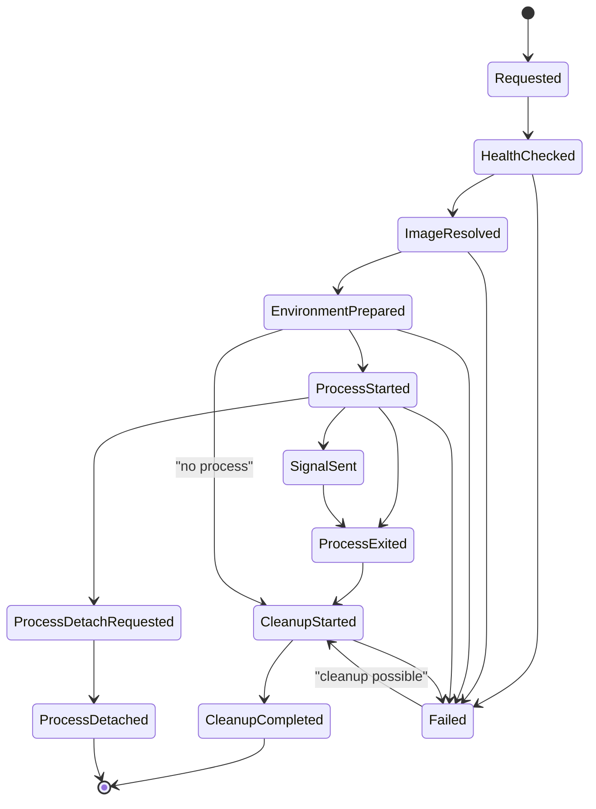

# Isolation Runtime Contract

Isolation is a portable execution contract. Concrete runtimes are host adapters.

## External Lessons

- Apple Containerization shows a strong local model: one Linux container per lightweight VM, explicit image/rootfs/process lifecycle, mounts, networking, Rosetta, and stats.
- The SDK should learn the lifecycle shape, not depend on Swift, macOS 26, Apple silicon, Xcode, or a specific service.
- Hosts need isolation for shell/code execution and risky subagents, but approvals and permissions remain separate.

## Environment Schema

```rust
// Non-compiling contract sketch.
pub struct EnvironmentSpec {
    pub environment_id: ExecutionEnvironmentId,
    pub kind: ExecutionEnvironmentKind,
    pub requirement: IsolationRequirement,
    pub image: Option<ImageRef>,
    pub resources: ResourceLimits,
    pub filesystem: FilesystemIsolationPolicy,
    pub network: NetworkIsolationPolicy,
    pub secrets: SecretExposurePolicy,
    pub lifecycle: EnvironmentLifecyclePolicy,
    pub ownership: ProcessOwnershipPolicy,
    pub accepted_adapters: Vec<IsolationAdapterRequirement>,
}

pub struct IsolationRequirement {
    pub minimum_class: IsolationClass,
    pub trust: IsolationTrustRequirement,
    pub preferred_adapters: Vec<IsolationRuntimeRef>,
    pub fallback: IsolationFallback,
    pub required_capabilities: IsolationCapabilitySet,
}

pub struct IsolationRuntimeRef(String);

pub struct IsolationTrustRequirement {
    pub locality: LocalityRequirement,
    pub tenancy: TenantBoundaryRequirement,
    pub auditability: AuditabilityRequirement,
    pub cleanup: CleanupGuaranteeRequirement,
}

pub enum IsolationClass {
    HostProcess,
    Sandbox,
    Container,
    LightweightVm,
    RemoteSandbox,
}

pub enum IsolationFallback {
    Deny,
    AllowIfPolicyApproved {
        accepted_classes: Vec<IsolationClass>,
        required_capabilities: IsolationCapabilitySet,
    },
    TestOnlyHostProcess,
}

pub struct ProcessOwnershipPolicy {
    pub owner_run_id: RunId,
    pub ownership_class: ProcessOwnershipClass,
    pub on_parent_cancel: ChildShutdownBehavior,
    pub on_parent_complete: ChildShutdownBehavior,
    pub detach_policy: DetachPolicy,
}

pub enum ProcessOwnershipClass {
    AgentOwned,
    HostManaged,
    DetachedByIntent,
}
```

Adapter fallback is allowed only if `requirement.fallback` and `accepted_adapters` declare it.

## Isolation Class Versus Adapter Ref

Isolation classes are SDK-owned enums with portable security meaning. Adapter refs are host-owned stable identifiers that select a registered implementation.

Use `IsolationClass` for policy:

- `HostProcess`: no isolation boundary beyond the host process.
- `Sandbox`: host OS sandbox or equivalent constrained helper.
- `Container`: local container runtime.
- `LightweightVm`: local VM-backed isolation.
- `RemoteSandbox`: remote sandbox or managed isolated runner.

Use `IsolationRuntimeRef` for concrete registered adapters:

- `apple-containerization`
- `docker.local`
- `firecracker.remote`
- `vercel-sandbox`
- `mlx.macos-sandbox`
- `company.secure-runner`

The SDK contract must not require hosts to use those example strings. They are custom identifiers in the host adapter registry. The portable decision is the enum class and required capability set; the adapter ref is a preference or exact selector for a host-registered runtime.

## Lifecycle



## Capability Report

Required fields:

- adapter kind/version
- platform support
- image formats
- CPU architecture
- emulation/Rosetta support
- network enforcement mode
- mount support
- read-only root support
- writable layer support
- stats support
- signal support
- cleanup guarantees
- unsupported requirement list

Capability or trust-vector downgrade requires policy approval or denial.

## Capability/Trust Matching And Downgrade Rules

`IsolationClass` is a coarse containment family, not a universal security total order. A remote sandbox, local VM, local container, and host sandbox can differ across tenancy, locality, mount enforcement, network enforcement, secret isolation, cleanup guarantees, auditability, latency, and data-residency constraints. Adapter selection compares the requested class plus capability/trust vector against the adapter capability report.

`HostProcess` and fake/no-op adapters are security downgrades for any package requiring container, VM, or remote sandbox isolation.

Rules:

- If a package requires `LightweightVm`, `Container` is a containment downgrade and `HostProcess` is denied unless explicit policy says otherwise.
- `RemoteSandbox` does not automatically satisfy `LightweightVm`, and `LightweightVm` does not automatically satisfy `RemoteSandbox`. Locality, tenancy, auditability, cleanup, mount, network, secret, and process-limit requirements must all match or be explicitly accepted by fallback policy.
- If a package requires `Sandbox`, another class may satisfy it only when the adapter capability report covers the requested trust vector and enforcement requirements.
- A preferred `IsolationRuntimeRef` is not enough by itself. The selected adapter must report a class and capabilities that satisfy `IsolationRequirement`.
- Fake adapters are test-only and cannot satisfy production isolation requirements.
- Losing network enforcement, read-only mount enforcement, secret isolation, process limits, stats, or cleanup guarantees is a capability downgrade.
- Downgrade decisions emit events and journal records with adapter, missing capability/trust field, requested class, selected class, selected locality/tenancy, cleanup/auditability delta, and policy ref.
- Registry credentials never enter provider projection, model context, raw events, or telemetry attributes.

## Mount And Secret Rules

- Mounts are resolved by host policy, not prompt text.
- Single-file mounts must record expanded parent-directory exposure.
- Workspace mount mode is explicit: snapshot, live read-only, live writable, generated scratch.
- Secret mounts and environment values are redacted by default.
- Registry credentials are adapter readiness data, not model-visible context.

## Process Rules

- Prefer structured argv over shell string.
- cwd, user, env keys, terminal mode, timeout, rlimits, and network policy are typed fields.
- stdout/stderr raw content is off by default. Capture size, hash, truncation, MIME hint, and redacted summary.
- Timeout sends configured signal, waits bounded grace period, then escalates according to adapter capability.
- Agent-owned processes are cancelled, signalled, or terminated on manual parent run cancel by default.
- Non-detached agent-owned processes must exit or be cleaned up before a successful parent run seals.
- A process can outlive the parent run only after `ChildLifecycleRecord::DetachIntent`, required policy/user/host acknowledgement, and `ChildLifecycleRecord::Detached` journal records.
- Process signal, terminate, cleanup, detach, and reclaim operations append intent records before adapter calls and terminal records after adapter responses.
- Host-managed processes require an explicit owner and policy ref before start; they are not the default for SDK tool or subagent work.

## Recovery

| State at crash | Resume behavior |
| --- | --- |
| environment prepared, no process | cleanup or reuse only if adapter declares safe |
| process started, no terminal status | query adapter for process state before retry |
| process exited, terminal append missing | append recovery record and reconcile result |
| cleanup missing | anti-entropy tries cleanup if safe, otherwise host action required |

## Acceptance Tests

- `unsupported_adapter_denies_without_allowed_fallback`
- `capability_or_trust_gap_requires_policy_decision`
- `remote_sandbox_does_not_satisfy_local_vm_without_policy`
- `single_file_mount_expansion_is_audited`
- `secret_env_values_are_not_logged`
- `network_denied_blocks_fake_process_egress`
- `process_timeout_records_signal_and_exit_status`
- `prepared_environment_without_process_can_cleanup_if_safe`
- `started_process_without_terminal_status_requires_reconciliation`
- `cleanup_failure_creates_repair_needed_record`
- `container_required_denies_hostprocess_fallback`
- `apple_containerization_unsupported_host_reports_missing_macos26_apple_silicon_xcode26`
- `registry_credentials_never_enter_projection_or_events`
- `isolated_helper_lowers_to_environment_spec`
- `isolated_helper_and_explicit_spec_emit_equivalent_lifecycle_events`
- `manual_cancel_sends_signal_to_agent_owned_isolated_process`
- `explicit_detach_survives_parent_run_completion`
- `implicit_orphan_process_is_denied_by_default`
- `detached_process_has_host_ack_and_reclaim_policy`
- `process_signal_intent_is_journaled_before_adapter_call`
- `before_isolation_process_hook_cannot_silently_downgrade_environment`

## Ergonomics

Simple API:

```rust
// Non-compiling contract sketch.
let env = ExecutionEnvironment::require(
    IsolationRequirement::at_least(IsolationClass::Sandbox)
        .prefer(IsolationRuntimeRef::new("mlx.macos-sandbox"))
        .fallback(IsolationFallback::Deny),
)
    .image("ubuntu:24.04")
    .workspace(WorkspaceRef::host("primary"))
    .allow_network(["github.com", "crates.io"])
    .ephemeral()
    .build()?;
```

Advanced API:

```rust
// Non-compiling contract sketch.
let env = EnvironmentSpecBuilder::new(ExecutionEnvironmentId::new())
    .kind(ExecutionEnvironmentKind::LightweightVm)
    .requirement(
        IsolationRequirement::at_least(IsolationClass::LightweightVm)
            .prefer(IsolationRuntimeRef::new("apple-containerization"))
            .fallback(IsolationFallback::Deny),
    )
    .image(ImageRef::oci("ubuntu:24.04"))
    .filesystem(FilesystemIsolationPolicy::workspace_mount(WorkspaceMount::live_readonly("/workspace")))
    .network(NetworkIsolationPolicy::Allowlist(vec!["github.com".into(), "crates.io".into()]))
    .ownership(ProcessOwnershipPolicy::agent_owned(parent_run_id))
    .accepted_adapter(IsolationAdapterRequirement::class(IsolationClass::LightweightVm))
    .build()?;
```

Canonical lowering:

- `ExecutionEnvironment::require(...)` creates an `EnvironmentSpecBuilder` with an explicit `IsolationRequirement`.
- `IsolationRequirement::at_least(class)` records the minimum SDK-owned isolation class.
- `.prefer(adapter_ref)` records a host-owned adapter preference; it is not a portable security claim.
- `.fallback(...)` records whether downgrade is denied or policy-gated.
- `.workspace(...)` asks the host mount resolver for a policy-approved mount; the helper does not inject raw prompt paths into model context.
- `.allow_network(...)` lowers into `NetworkIsolationPolicy::Allowlist`.
- `.build()` returns the same `EnvironmentSpec` used by advanced callers.

Equivalence:

- Helper and explicit spec paths emit the same isolation lifecycle events and journal records.
- Both paths use adapter capability negotiation and downgrade policy.
- Both paths deny `HostProcess` fallback unless explicitly accepted.

SDK owns / Host owns:

- SDK owns the helper-to-`EnvironmentSpec` lowering, lifecycle contract, downgrade semantics, and redaction defaults.
- Host owns concrete path resolution, runtime installation, adapter credentials, and whether the helper is available on a surface.

Tests:

- `isolated_helper_lowers_to_environment_spec`
- `isolated_helper_and_explicit_spec_emit_equivalent_lifecycle_events`
- `capability_downgrade_requires_policy_decision`

## Complete Example

Typed shape:

```rust
// Non-compiling contract sketch.
let env = EnvironmentSpec {
    environment_id: ExecutionEnvironmentId::new(),
    kind: ExecutionEnvironmentKind::LightweightVm,
    requirement: IsolationRequirement::at_least(IsolationClass::LightweightVm)
        .prefer(IsolationRuntimeRef::new("apple-containerization"))
        .fallback(IsolationFallback::Deny),
    image: Some(ImageRef::oci("ubuntu:24.04")),
    resources: ResourceLimits { cpus: 2, memory_mb: 4096, timeout_ms: 120_000 },
    filesystem: FilesystemIsolationPolicy::workspace_mount(
        WorkspaceMount::live_readonly("/workspace"),
    ),
    network: NetworkIsolationPolicy::Allowlist(vec!["github.com".into(), "crates.io".into()]),
    secrets: SecretExposurePolicy::NoAmbientSecrets,
    lifecycle: EnvironmentLifecyclePolicy::EphemeralCleanupRequired,
    ownership: ProcessOwnershipPolicy::agent_owned(parent_run_id),
    accepted_adapters: vec![IsolationAdapterRequirement::class(IsolationClass::LightweightVm)],
};

let process = IsolatedProcessSpec {
    argv: vec!["cargo".into(), "test".into()],
    cwd: "/workspace",
    env: RedactedEnv::empty(),
    stdout_policy: IoCapturePolicy::SummaryHashAndContentRef,
    stderr_policy: IoCapturePolicy::SummaryHashAndContentRef,
};
```

Replaceable ports:

- `IsolationRuntimeRegistry` selects Apple Containerization, Docker, Firecracker, remote sandbox, or fake test adapters by capability report.
- `ImageResolver`, `MountResolver`, `NetworkPolicyEnforcer`, and `ProcessRunner` are adapter-owned ports behind the SDK contract.
- `HostProcess` is available only when policy explicitly allows that security class.

Wiring:

1. Tool or subagent declares `EnvironmentSpec`.
2. Registry health-checks candidate adapters.
3. Policy rejects downgrades or asks for approval.
4. Adapter prepares environment and starts process.
5. Cleanup is journaled even on failure.

Events:

- `IsolationRequested`
- `IsolationAdapterHealthChecked`
- `IsolationImageResolved`
- `IsolationEnvironmentPrepared`
- `IsolationProcessStarted`
- `IsolationProcessExited`
- `IsolationCleanupCompleted` or `IsolationFailed`

Journal:

- `IsolationRecord { requested environment }`
- `IsolationRecord { capability report }`
- `IsolationRecord { process start, stdout/stderr refs }`
- `IsolationRecord { exit status, stats, cleanup status }`

Policies and failures:

- Missing Apple Containerization prerequisites produce unsupported-host capability fields, not silent fallback.
- Losing network/mount/secret/process enforcement is a downgrade and requires policy.
- Registry credentials never enter provider projection, telemetry, or raw events.
- Crash after process start requires adapter reconciliation before retry.
- Manual parent cancellation signals or terminates agent-owned processes by default.
- Explicit detachment requires detach intent, acknowledgement, and reclaim policy before parent completion.

SDK owns / Host owns:

- SDK owns portable environment/process schema, process ownership policy, capability/downgrade semantics, isolation events, and journal records.
- Host owns concrete runtime installation, image credentials, workspace mount resolution, detached process inspectors/reclaim jobs, and adapter-specific cleanup implementation.

Tests:

- `capability_downgrade_requires_policy_decision`
- `apple_containerization_unsupported_host_reports_missing_macos26_apple_silicon_xcode26`
- `started_process_without_terminal_status_requires_reconciliation`
- `manual_cancel_sends_signal_to_agent_owned_isolated_process`
