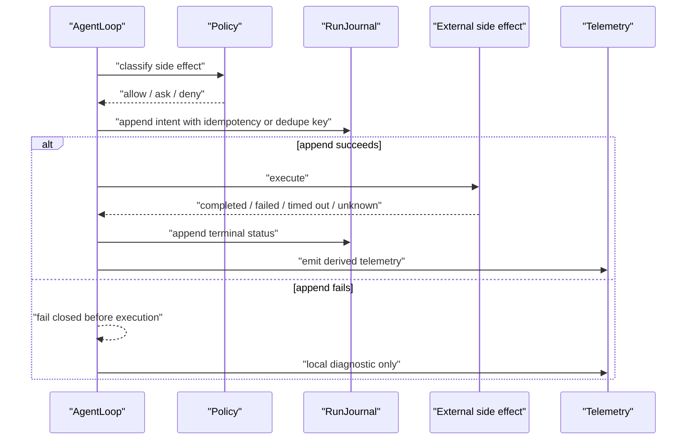
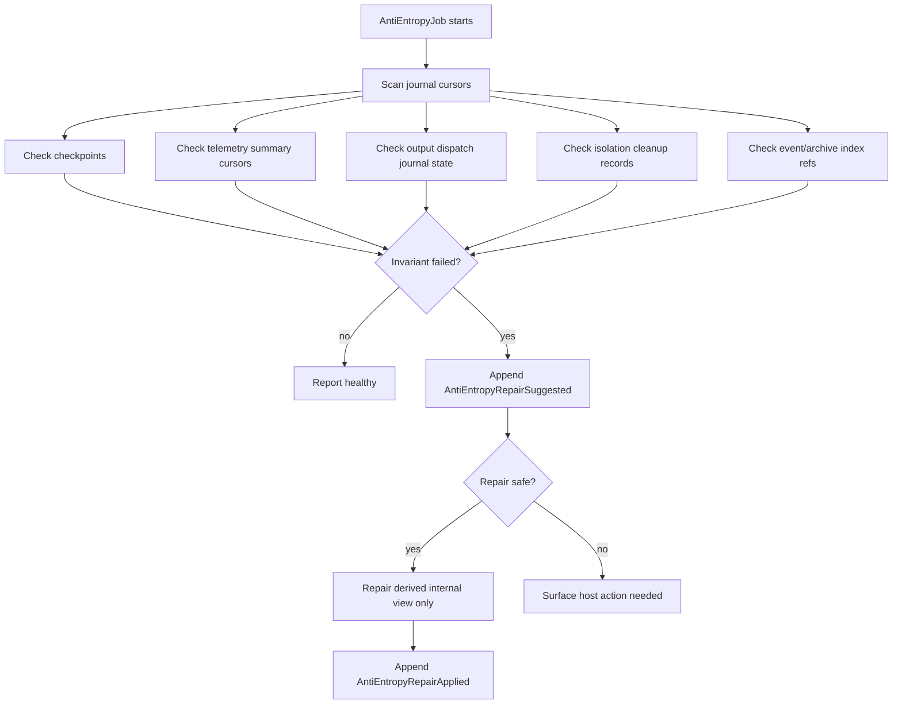

# Journal, Replay, And Anti-Entropy Contract

The run journal is the durable source of truth for audit, resume, repair, and anti-entropy. Live event streams can be lossy; the journal cannot be lossy at side-effect boundaries.

## Journal Record Envelope

Every journal record uses one durable envelope.

```rust
// Non-compiling contract sketch.
pub struct JournalRecordEnvelope<T> {
    pub journal_schema_version: u16,
    pub journal_seq: u64,
    pub record_id: JournalRecordId,
    pub record_kind: JournalRecordKind,
    pub run_id: RunId,
    pub agent_id: AgentId,
    pub turn_id: Option<TurnId>,
    pub attempt_id: Option<AttemptId>,
    pub subject_ref: EntityRef,
    pub related_refs: Vec<EntityRef>,
    pub causal_refs: Vec<CausalRef>,
    pub source: SourceRef,
    pub destination: Option<DestinationRef>,
    pub correlation_keys: Vec<CorrelationKey>,
    pub tags: Vec<EventTag>,
    pub delivery_semantics: EventDeliverySemantics,
    pub event_index: EventIndexProjection,
    pub timestamp: Timestamp,
    pub runtime_package_fingerprint: RuntimePackageFingerprint,
    pub privacy: EventPrivacy,
    pub content_refs: Vec<ContentRef>,
    pub redaction_policy_id: RedactionPolicyId,
    pub idempotency_key: Option<IdempotencyKey>,
    pub dedupe_key: Option<DedupeKey>,
    pub checkpoint_ref: Option<CheckpointRef>,
    pub payload: T,
}

pub struct EventIndexProjection {
    pub run_id: RunId,
    pub agent_id: AgentId,
    pub turn_id: Option<TurnId>,
    pub event_family: EventFamily,
    pub event_kind: EventKind,
    pub source: SourceRef,
    pub destination: Option<DestinationRef>,
    pub subject_ref: EntityRef,
    pub related_refs: Vec<EntityRef>,
    pub correlation_keys: Vec<CorrelationKey>,
    pub tags: Vec<EventTag>,
    pub privacy_class: EventPrivacy,
    pub delivery_semantics: EventDeliverySemantics,
}
```

`journal_seq` is monotonic per run. Wall-clock timestamp is not an ordering source.
Every journal record that can produce an event frame must carry or deterministically derive `EventIndexProjection`. Durable replay and archive filters use this projection, not raw payload parsing.

`subject_ref` and `related_refs` are the durable counterpart to event entity refs. They let replay, anti-entropy, and archive indexes reason about context contributions, artifacts, package sidecars, effect intents/results, child artifacts, output deliveries, extension actions, and future feature entities without adding a new journal envelope field for every feature.

## Storage Ownership Matrix

| Store/surface | Write authority | Replay authority | Retention | Mutation rights |
| --- | --- | --- | --- | --- |
| Run journal | SDK runtime through `RunJournal` port | authoritative | host retention policy | append-only; corrections are later records |
| Checkpoint store | SDK runtime through `CheckpointStore` port | accelerator only | GC policy, never before required journal coverage | replace/prune by policy |
| Session manager | host/session adapter | projection/snapshot only | host session policy | cannot invent journal facts |
| Host conversation store | host adapter | user-visible transcript | conversation policy | host-owned; links to SDK run IDs |
| Content store | host content policy | content refs for replay | sensitivity/retention policy | immutable by hash; delete by retention |
| Live event stream | SDK runtime | none | bounded ephemeral | lossy by overflow policy |
| Event subscription indexes | SDK runtime / event bus | repair from journal where possible | bounded derived state | rebuilt from envelope fields only |
| Host app-event/display event store | host adapter/frontend | none | bounded ephemeral | display-only |
| Host analytics | host telemetry exporter | derived from journal/telemetry | analytics policy | forward-only plus explicit backfill |
| OTel exporter | telemetry sink | derived spans/metrics/logs | sink policy | no run control |

Checkpoint/session/analytics/app-event stores cannot introduce facts that are absent from journal records.

`AgentEventBus::replay_run_from_cursor(run_id, journal_cursor)` is the core durable projection over one run journal. It emits `derived_replay` frames after the cursor, then can tail the live run stream. Replay filtering must use envelope/index fields recorded in or derived from the journal; it must not require raw payload content to reconstruct subscription state.

Cross-run, all-agent, or arbitrary filtered durable replay belongs to an optional `EventArchive` / `IndexedJournalView` port with its own `ArchiveCursor`. Without that port, core returns `UnsupportedReplayScope` or `HostArchiveRequired` instead of pretending a global durable event query exists.

## Record Kinds

| Record | Captures |
| --- | --- |
| `RunRecord` | start, source surface, root trace, package fingerprint, terminal status |
| `TurnRecord` | turn start/end, input summary, projection ID, outcome |
| `ContextRecord` | context contribution intake, memory retrieval, selection/omission, projection audit, compaction, redaction, and memory write intent/result payloads |
| `MessageRecord` | message role, part kinds, lineage, content refs, commit/drop status |
| `ModelAttemptRecord` | provider/model, attempt ID, stream cursor, stop reason, usage, error |
| `StructuredOutputRecord` | schema ID, validation attempts, repair prompts, validated output refs |
| `StreamRuleRecord` | rule compile/match/intervention state, cursor, repeat state |
| `RealtimeSessionRecord` | realtime session connection, input/output cursors, interruption, restart, backpressure, close state |
| `HookRecord` | hook spec hash, invocation, timeout/cancel/failure, response summary, applied mutation refs |
| `ApprovalRecord` | request, dispatcher intent/result, timeout, response actor, policy refs |
| `ToolRecord` | intent, idempotency key, approval ref, attempt, result, effect metadata |
| `IsolationRecord` | environment, adapter, mounts, network, process, stats, cleanup |
| `ChildLifecycleRecord` | child artifact ownership, shutdown intent/result, detach intent/ack, reclaim policy/result |
| `AgentPoolRecord` | pool membership, topics, policy refs, and pool lifecycle state |
| `RunMessageRecord` | run-to-run message delivery, reply correlation, delivery status, timeout, and idempotency |
| `WakeRecord` | event-filter wake registration, trigger, timeout, cancellation, and resume input policy |
| `OutputDispatchRecord` | destination, dedupe key, ack/failure, reconciliation state |
| `SubagentRecord` | higher-order child-run supervision, handoff, child policy, usage rollup, terminal state |
| `TelemetryRecord` | usage, cost, sink health, export cursor, corrections |
| `RecoveryRecord` | invariant failures, replay mode, repair plan, repair status |

## Effect Intent And Result

All mutating or externally visible side effects share a common intent/result shape. Feature-specific journal records may wrap it, but they must not bypass it.

```rust
// Non-compiling contract sketch.
pub struct EffectIntent {
    pub effect_id: EffectId,
    pub kind: EffectKind,
    pub subject_ref: EntityRef,
    pub source: SourceRef,
    pub destination: Option<DestinationRef>,
    pub policy_refs: Vec<PolicyRef>,
    pub idempotency_key: Option<IdempotencyKey>,
    pub dedupe_key: Option<DedupeKey>,
    pub content_refs: Vec<ContentRef>,
    pub redacted_summary: RedactedSummary,
}

pub struct EffectResult {
    pub effect_id: EffectId,
    pub terminal_status: EffectTerminalStatus,
    pub external_operation_id: Option<ExternalOperationId>,
    pub reconciliation_ref: Option<ReconciliationRef>,
    pub error_ref: Option<ErrorRef>,
    pub content_refs: Vec<ContentRef>,
    pub redacted_summary: RedactedSummary,
}

pub enum EffectKind {
    ProviderRequest,
    ToolExecution,
    ApprovalDispatch,
    MemoryWrite,
    ExtensionAction,
    OutputDelivery,
    FileWrite,
    ProcessStart,
    ProcessSignal,
    IsolatedProcessStart,
    ChildAgentStart,
    RunMessageDelivery,
    ChildArtifactShutdown,
    DetachTransfer,
    HookMutation,
}
```

The common effect fields are required for idempotency, dedupe, policy review, privacy, replay, and anti-entropy. Feature contracts may add typed payload fields, but intent-before-effect remains the shared rule.

`RunMessageDelivery` is used only when delivery mutates another run, wakes a
parked run, crosses process/runtime boundaries, or has externally visible
effects. Purely local bookkeeping can stay inside `RunMessageRecord`, but it
must still preserve idempotency, policy refs, content refs, and replay
semantics.

Phase 05 feature layers use existing effect kinds unless stitching explicitly adds a new shared kind. Stream interventions are represented by `StreamRuleRecord` intent/result payloads and by the provider, approval, output-delivery, or realtime effect they trigger; they do not introduce a separate `EffectKind::StreamIntervention`. Isolation adapter operations use typed `IsolationRecord::*Intent/Result` payloads that map one-to-one to the common effect fields until implementation needs narrower shared `EffectKind` variants for image, rootfs, session, mount, network, secret, or cleanup work.

## Side-Effect Atomicity



Required side-effect intent records:

- provider request
- model attempt start
- tool execution
- approval dispatch when a host/user dispatcher is required
- accepted hook proposal lowered to a domain operation
- hook response that mutates run behavior through an existing domain operation
- memory write
- run-message delivery when delivery mutates another run, wakes a parked run, or crosses a runtime boundary
- extension action
- process signal or termination
- isolated process start
- child artifact shutdown
- detach transfer or preserve decision
- detached child reclaim
- remote output send
- file write/edit
- child agent start

Every required side-effect intent record must either contain an `EffectIntent` or map its fields one-to-one in its typed record. Terminal records must contain or map `EffectResult`.

## Checkpoint Contract

Checkpoints are accelerators, not truth.

```rust
// Non-compiling contract sketch.
pub trait CheckpointStore {
    async fn save(&self, checkpoint: RunCheckpoint) -> Result<CheckpointRef, CheckpointError>;
    async fn load_latest(&self, run_id: RunId) -> Result<Option<RunCheckpoint>, CheckpointError>;
    async fn load_at_or_before(&self, run_id: RunId, cursor: JournalCursor) -> Result<Option<RunCheckpoint>, CheckpointError>;
    async fn prune(&self, policy: CheckpointPrunePolicy) -> Result<PruneReport, CheckpointError>;
}

pub struct RunCheckpoint {
    pub checkpoint_id: CheckpointId,
    pub run_id: RunId,
    pub checkpoint_seq: u64,
    pub covers_journal_seq: u64,
    pub loop_state: LoopState,
    pub turn_id: Option<TurnId>,
    pub attempt_id: Option<AttemptId>,
    pub runtime_package_fingerprint: RuntimePackageFingerprint,
    pub pending_side_effects: Vec<PendingSideEffect>,
    pub pending_approvals: Vec<ApprovalRequestId>,
    pub stream_rule_repeat_state: StreamRuleRepeatStateSnapshot,
    pub content_ref_manifest: Vec<ContentRef>,
    pub state_hash: StateHash,
    pub created_at: Timestamp,
    pub writer_id: WriterId,
}
```

- Written at run start, turn boundary, before non-idempotent side effects when practical, after completed tool batches, and terminal state.
- Include journal cursor, loop state, package fingerprint, context projection ref, stream-rule repeat state, pending approvals, pending tool attempts, and content refs needed for resume.
- Corrupt or missing checkpoint falls back to journal replay.
- Checkpoint cannot introduce facts not present in journal records.
- `covers_journal_seq` cannot point past the latest committed journal record.
- `state_hash` covers replay-reconstructed state at `covers_journal_seq`.
- Pruning cannot remove the newest terminal checkpoint, the newest checkpoint before every pending side effect, or checkpoints required by retention policy.

## Replay Modes

| Mode | Purpose | Side effects |
| --- | --- | --- |
| `AuditReplay` | Rebuild trace, transcript metadata, decisions, terminal state. | Never re-executes. |
| `ResumeReplay` | Rebuild to safe point and continue. | Only idempotent or explicitly approved retries. |
| `RepairReplay` | Rebuild derived indexes, projections, telemetry exports. | Never emits user-visible sends or external effects. |

## Resume Rules

- Append `RunResumeRequested`.
- Validate package fingerprint before continuation.
- Load latest valid checkpoint.
- Replay journal records after checkpoint cursor.
- If content refs are missing, append `RunResumeFailed`.
- Pending provider stream resumes from provider cursor only if adapter supports it. Otherwise retry uses a new attempt ID.
- Pending tool retries require idempotency key or host retry approval.
- Pending output sends use dedupe key and channel reconciliation before sending again.
- Pending approval resumes only if not timed out or cancelled.

## Replay Reducer

Replay is a deterministic reducer over ordered journal records.

```rust
// Non-compiling contract sketch.
pub trait ReplayReducer {
    fn apply(&mut self, record: JournalRecordEnvelope<JournalPayload>) -> Result<(), ReplayError>;
    fn finish(self, mode: ReplayMode) -> Result<ReplayResult, ReplayError>;
}
```

Reducer invariants:

- Records must be strictly increasing by `journal_seq`.
- Duplicate records with the same `record_id` and same payload are ignored only when the record kind is idempotent.
- Duplicate non-idempotent records are replay errors.
- Unknown future schema versions fail closed unless a registered migrator handles them.
- Records after a sealed terminal run are replay errors unless an explicit resume/clone record exists.
- Missing checkpoint refs do not fail audit replay; resume replay falls back to journal replay if content refs are present.
- Causality comes from `causal_refs`, not timestamp order.
- Audit replay never calls side-effect ports.
- Resume replay returns the exact next loop state plus pending side-effect manifest.
- Repair replay can mutate only derived stores named in the repair plan.

Strictness:

| Replay mode | Unknown schema | Missing content ref | Duplicate non-idempotent record | Record after seal |
| --- | --- | --- | --- | --- |
| `AuditReplay` | fail unless migrator exists | mark incomplete audit | fail | fail |
| `ResumeReplay` | fail | fail resume | fail | fail unless explicit resume/clone |
| `RepairReplay` | skip only if repair target unaffected | fail affected repair | fail | fail |

## Crash Windows After Side Effects

Intent-before-effect does not eliminate every crash window. If a side effect occurs but terminal status cannot be appended, the run enters recovery and blocks further non-idempotent effects.

Each side-effect family must expose reconciliation metadata:

- `intent_record_id`
- `side_effect_kind`
- `idempotency_key`
- `dedupe_key`
- `external_operation_id`
- `terminal_status`
- `terminal_append_status`
- `reconciliation_adapter`
- `unsafe_pending_reason`

Required reconciliation adapters:

| Side effect | Reconciliation |
| --- | --- |
| provider request | provider cursor or no-resume retry with new attempt |
| tool execution | tool-specific idempotency/reconcile hook |
| file edit/write | before/after hash and filesystem state check |
| memory write | memory store idempotency key or write receipt |
| remote output send | channel dedupe key and ack lookup |
| extension action | extension request ID and host action receipt |
| hook-requested domain operation | that operation's normal side-effect family reconciler |
| isolated process | process status query and cleanup state |
| child agent | child run journal terminal state |
| detached child artifact | lifecycle owner/reclaim adapter and host ack ref |

If terminal append fails after a side effect, recovery must append `RecoveryRecord` on the next durable opportunity. Until then, the live loop must not proceed to another non-idempotent side effect.

## Child Lifecycle Records

Child lifecycle records are the durable authority for work started or owned by a run.

```rust
// Non-compiling contract sketch.
pub enum ChildLifecyclePayload {
    ChildRegistered {
        child_artifact_id: ChildArtifactId,
        kind: ChildArtifactKind,
        owner_run_id: RunId,
        owner_policy_ref: PolicyRef,
    },
    ShutdownIntent {
        child_artifact_id: ChildArtifactId,
        reason: ChildShutdownReason,
        behavior: ChildShutdownBehavior,
        deadline_ms: u64,
    },
    ShutdownCompleted {
        child_artifact_id: ChildArtifactId,
        terminal_status: ChildTerminalStatus,
        cleanup_ref: Option<CleanupRef>,
    },
    ShutdownFailed {
        child_artifact_id: ChildArtifactId,
        unsafe_pending_reason: UnsafePendingReason,
        recovery_ref: RecoveryPlanRef,
    },
    DetachIntent {
        child_artifact_id: ChildArtifactId,
        requested_by: ActorRef,
        policy_ref: PolicyRef,
        reclaim_policy_ref: PolicyRef,
    },
    DetachAcknowledged {
        child_artifact_id: ChildArtifactId,
        host_ack_ref: HostAckRef,
        new_owner: LifecycleOwnerRef,
    },
    Detached {
        child_artifact_id: ChildArtifactId,
        health_check_ref: Option<HealthCheckRef>,
        reclaim_policy_ref: PolicyRef,
    },
    ReclaimIntent {
        child_artifact_id: ChildArtifactId,
        reclaim_reason: ReclaimReason,
    },
    ReclaimCompleted {
        child_artifact_id: ChildArtifactId,
        terminal_status: ChildTerminalStatus,
    },
}
```

Rules:

- Every child artifact that can outlive a loop state is registered before start or acquisition.
- Manual cancellation appends `ShutdownIntent` before signalling, terminating, cancelling, closing, or interrupting a child artifact.
- Normal completion appends `ShutdownIntent` for non-detached agent-owned children or `DetachIntent` before preserving them.
- `DetachIntent` without `DetachAcknowledged` cannot seal a successful run. The run either enters `RepairNeeded` or applies shutdown behavior according to policy.
- `Detached` means lifecycle ownership is explicitly transferred or preserved under a reclaim policy. It never means the process was forgotten.
- Anti-entropy treats detached children as tracked host-owned work, not SDK cleanup leaks.
- Audit replay never reconnects to or kills a detached process. Resume or repair replay may reconcile only through the recorded owner/reclaim adapter.

## Cancel Rules

- Append `RunCancelRequested`.
- Append `ChildLifecycleRecord::ShutdownIntent` or the relevant side-effect intent before each cancellation effect.
- Cancel providers, tools, realtime connections, approval waits, hook invocations, child agents, and isolated processes.
- Append terminal records for cancelled components.
- Cleanup uses bounded timeout.
- Append `RunCancelled` and seal.

## Anti-Entropy

Anti-entropy jobs compare durable records against derived internal stores and adapter health metadata. They never silently mutate external reality.



Safe repairs:

- rebuild checkpoint
- rebuild event subscription indexes
- recompute projection or telemetry summaries from journal records
- refresh idempotent export cursor metadata when the sink contract supports replay
- cleanup prepared environment with no started process when adapter declares safe

Unsafe repairs:

- rerun non-idempotent tool
- resend remote output without channel reconciliation
- invent missing content
- mutate files to match an expected state without approval
- compensate workflow steps or apply product-facing reversions

Required checks:

- journal/checkpoint consistency
- missing content refs
- unsealed terminal runs
- pending side effects without terminal status
- output dedupe intents without ack/reconciliation
- runtime package fingerprint unavailable for replay
- child run terminal state missing from parent rollup
- agent-owned child artifact without terminal shutdown, cleanup, or detach record
- detached child artifact without host ack or reclaim policy
- reclaim policy expired without reclaim result or host action record
- telemetry export cursors behind journal cursor
- isolated environments with missing cleanup result
- stream-rule repeat state missing for a resumed run
- approval requests pending past timeout
- host trace or analytics derived rows missing for journal-backed runs

## Acceptance Tests

- `journal_seq_is_monotonic_per_run`
- `side_effect_intent_precedes_execution`
- `journal_append_failure_prevents_non_idempotent_effect`
- `audit_replay_never_calls_side_effect_ports`
- `resume_replay_refuses_missing_content_ref`
- `resume_replay_refuses_non_idempotent_pending_tool`
- `checkpoint_corruption_falls_back_to_journal`
- `checkpoint_cannot_cover_uncommitted_journal_seq`
- `journal_replay_filters_by_agent_tag_privacy_without_payload_deserialization`
- `terminal_sealed_run_cannot_continue_without_explicit_clone_or_resume_policy`
- `remote_output_pending_uses_dedupe_reconciliation`
- `journal_terminal_append_failure_after_side_effect_enters_recovery_and_blocks_more_side_effects`
- `replay_rejects_out_of_order_or_duplicate_non_idempotent_records`
- `resume_returns_next_loop_state_and_pending_side_effect_manifest`
- `anti_entropy_repairs_telemetry_summary_cursor_without_rerunning_agent`
- `anti_entropy_detects_missing_content_ref_and_suggests_repair_without_resume`
- `anti_entropy_surfaces_host_action_for_unsafe_repair`
- `repair_replay_never_executes_tool_output_memory_or_extension_side_effects`
- `anti_entropy_repair_event_rejects_external_effect_refs`
- `manual_cancel_appends_child_shutdown_intent_before_signal`
- `detach_intent_without_ack_blocks_successful_completion`
- `audit_replay_tracks_detached_child_without_killing_it`
- `anti_entropy_detects_agent_owned_child_without_shutdown_or_detach`
- `hook_response_mutation_is_journaled_before_apply`
- `audit_replay_does_not_reinvoke_hooks`
- `hook_and_child_lifecycle_golden_records_have_no_raw_content_by_default`
- `provider_request_intent_record_precedes_model_attempt_started`

## Complete Example

Typed shape:

```rust
// Non-compiling contract sketch.
let intent = JournalRecordEnvelope {
    journal_schema_version: 1,
    journal_seq: 77,
    record_id: JournalRecordId::new(),
    record_kind: JournalRecordKind::ToolRecord,
    run_id,
    turn_id: Some(turn_id),
    attempt_id: Some(attempt_id),
    causal_refs: vec![CausalRef::event(tool_requested_event)],
    runtime_package_fingerprint,
    idempotency_key: Some(IdempotencyKey::new("read-file-abc")),
    dedupe_key: None,
    checkpoint_ref: Some(checkpoint_ref),
    payload: JournalPayload::ToolIntent(ToolIntentRecord {
        tool_call_id,
        canonical_tool_name: "workspace_read".into(),
        args_ref,
        effect_class: EffectClass::Read,
    }),
    /* timestamp/privacy/content refs */
};

journal.append(intent).await?;
let result = tool_executor.execute(tool_call).await?;
journal.append_tool_terminal(result).await?;

let detach = JournalRecordEnvelope {
    journal_schema_version: 1,
    journal_seq: 91,
    record_id: JournalRecordId::new(),
    record_kind: JournalRecordKind::ChildLifecycleRecord,
    run_id,
    agent_id,
    payload: JournalPayload::ChildLifecycle(ChildLifecyclePayload::DetachIntent {
        child_artifact_id,
        requested_by: ActorRef::user_or_host(),
        policy_ref: PolicyRef::new("policy.detach.long_running_script"),
        reclaim_policy_ref: PolicyRef::new("policy.reclaim.host_shutdown"),
    }),
    /* envelope/index/privacy fields */
};

journal.append(detach).await?;
host_acknowledge_detach(child_artifact_id).await?;
journal.append_child_detached(child_artifact_id, host_ack_ref).await?;
```

Replaceable ports:

- `RunJournal` can be memory, file, SQLite, cloud, or host-backed if it preserves ordering and append semantics.
- `CheckpointStore` accelerates replay but never replaces records.
- `ReplayReducer` is deterministic and can be extended with schema migrators.
- Reconciliation adapters are per side-effect family.

Wiring:

1. Append intent record before the side effect.
2. Execute external operation.
3. Append terminal record.
4. Emit journal-backed event with cursor.
5. On resume, load checkpoint and reduce later records.
6. For detach, append detach intent and acknowledgement before sealing a successful parent run.

Events:

- `JournalAppendFailed`
- `RunCheckpointed`
- `ReplayStarted`
- `ReplayCompleted`
- `ChildLifecycleDetachRequested`
- `ChildLifecycleDetached`
- `HookResponseApplied`
- `AntiEntropyRepairSuggested`
- `AntiEntropyRepairApplied`

Journal:

- `ToolRecord { intent }`
- `ToolRecord { terminal status }`
- `HookRecord { invocation and response }`
- `ChildLifecycleRecord { shutdown intent/result }`
- `ChildLifecycleRecord { detach intent/ack/reclaim policy }`
- `RecoveryRecord` when terminal append is missing after an effect.
- `TelemetryRecord` when host/sink repair updates idempotent export cursor metadata.

Policies and failures:

- Append failure before side effect fails closed.
- Terminal append failure after side effect blocks further non-idempotent effects.
- Resume replay refuses missing content refs and non-idempotent pending tools without approval.
- Detach intent without acknowledgement blocks successful completion or becomes repair-needed.
- Anti-entropy repairs derived stores only unless host action is required.

SDK owns / Host owns:

- SDK owns journal envelope, ordering, replay reducer rules, hook and child lifecycle record semantics, side-effect atomicity, and anti-entropy repair records.
- Host owns physical storage, retention, content store deletion policy, detached process/child inspectors, reclaim adapters, and unsafe repair approvals.

Tests:

- `side_effect_intent_precedes_execution`
- `journal_terminal_append_failure_after_side_effect_enters_recovery_and_blocks_more_side_effects`
- `anti_entropy_repairs_telemetry_summary_cursor_without_rerunning_agent`
- `detach_intent_without_ack_blocks_successful_completion`
- `hook_response_mutation_is_journaled_before_apply`
