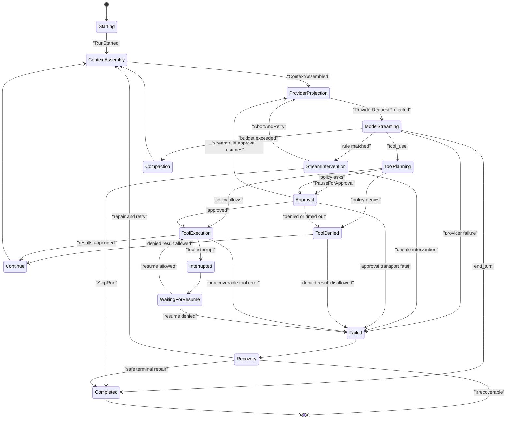
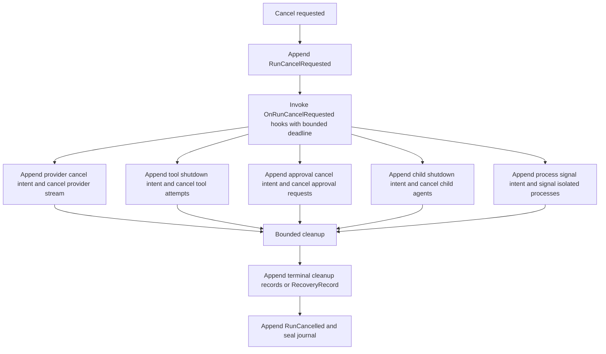
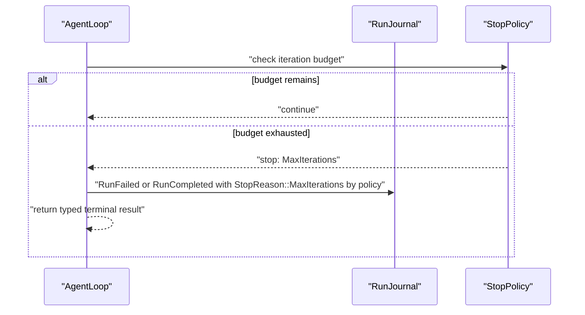

# Loop State Machine Contract

The SDK loop is an explicit state machine. Recursion is allowed internally only when represented as transitions and journaled events.

## States

```rust
// Non-compiling contract sketch.
pub enum LoopState {
    Starting,
    ContextAssembly,
    ProviderProjection,
    ModelStreaming,
    StreamIntervention,
    ToolPlanning,
    Approval,
    ToolDenied,
    ToolExecution,
    Interrupted,
    WaitingForResume,
    Compaction,
    Continue,
    Recovery,
    Completed,
    Failed,
}
```

## Primary Transition Diagram



## Executable Transition Table Contract

The Mermaid diagram is explanatory. The implementation source of truth must be an executable transition table generated from or checked against this contract.

Each transition row must include:

| Field | Meaning |
| --- | --- |
| `from_state` | Current `LoopState`. |
| `trigger` | Typed trigger such as provider stop reason, stream rule match, policy verdict, cancellation, timeout, checkpoint restore, or invariant failure. |
| `guard` | Typed condition that must be true before transition. No prompt text or keyword inference. |
| `events_emitted` | Ordered `AgentEvent` kinds emitted for the transition. |
| `journal_records` | Ordered `JournalRecordKind`s appended before side effects and after terminal status. |
| `checkpoint_policy` | `none`, `before`, `after`, `before_and_after`, or `terminal`. |
| `side_effect_policy` | `none`, `intent_before_effect`, `idempotent_retry_allowed`, `non_idempotent_fail_closed`, or `reconcile_required`. |
| `next_state` | Next `LoopState`. |
| `terminal_result` | Optional terminal result or stop reason. |

Minimum rows that must exist:

| from | trigger | guard | events | journal | checkpoint | side effect | next |
| --- | --- | --- | --- | --- | --- | --- | --- |
| `Starting` | `start_run` | package valid | `RunStarted` | `RunRecord` | `after` | `none` | `ContextAssembly` |
| `ContextAssembly` | `context_ready` | budget valid | `ContextAssembled` | `ContextRecord` | `after` | `none` | `ProviderProjection` |
| `ProviderProjection` | `projection_ready` | package hashes match | `ProviderRequestProjected`, `ModelAttemptStarted` | `ContextRecord`, `ModelAttemptRecord { provider_request_intent }` | `before` | `intent_before_effect` | `ModelStreaming` |
| `ModelStreaming` | `tool_use` | model message has tool calls | `ModelMessageCompleted`, `ToolRequested` | `ModelAttemptRecord`, `ToolRecord` | `after` | `none` | `ToolPlanning` |
| `ModelStreaming` | `stream_rule_match` | rule action allowed | `StreamRuleMatched` | `StreamRuleRecord` | `none` | `none` | `StreamIntervention` |
| `ModelStreaming` | `end_turn` | final message complete | `ModelMessageCompleted` | `ModelAttemptRecord`, `MessageRecord` | `after` | `none` | `Completed` |
| `ToolPlanning` | `policy_allow` | permissions pass | `ToolStarted` | `ToolRecord` | `before` | `intent_before_effect` | `ToolExecution` |
| `ToolPlanning` | `policy_ask` | dispatcher available or escalation configured | `ApprovalRequested` | `ApprovalRecord` | `after` | `none` | `Approval` |
| `ToolPlanning` | `policy_deny` | denied result allowed | `ToolApprovalRequired`, `ApprovalDenied` | `ApprovalRecord`, `ToolRecord` | `after` | `none` | `ToolDenied` |
| `Approval` | `approved` | decision valid | `ApprovalResponded`, `ToolStarted` | `ApprovalRecord`, `ToolRecord` | `before` | `intent_before_effect` | `ToolExecution` |
| `Approval` | `timeout` | timeout elapsed | `ApprovalTimedOut`, `ApprovalDenied` | `ApprovalRecord` | `after` | `none` | `ToolDenied` |
| `ToolDenied` | `continue_with_denied_result` | policy allows denied tool result | `ToolCompleted` | `ToolRecord` | `after` | `none` | `Continue` |
| `ToolDenied` | `fail_on_denied` | policy disallows denied result | `RunFailed` | `RecoveryRecord`, `RunRecord` | `terminal` | `none` | `Failed` |
| `ToolExecution` | `tool_complete` | terminal status appended | `ToolCompleted` | `ToolRecord` | `after` | `none` | `Continue` |
| `ToolExecution` | `tool_interrupt` | interrupt resumable | `ToolInterrupted` | `ToolRecord` | `after` | `reconcile_required` | `Interrupted` |
| `Interrupted` | `wait_for_resume` | resume token required | `RunCheckpointed` | `RecoveryRecord` | `after` | `none` | `WaitingForResume` |
| `WaitingForResume` | `resume_allowed` | checkpoint and package valid | `RunResumeRequested`, `ReplayCompleted` | `RecoveryRecord` | `after` | `idempotent_retry_allowed` | `ToolExecution` |
| `Compaction` | `compaction_complete` | protected context preserved | `ContextCompactionCompleted` | `ContextRecord` | `after` | `none` | `ContextAssembly` |
| `Failed` | `recoverable` | repair plan safe | `RecoveryPlanned` | `RecoveryRecord` | `after` | `reconcile_required` | `Recovery` |
| `Recovery` | `repair_applied` | invariant restored | `ReplayCompleted` | `RecoveryRecord` | `after` | `none` | `ContextAssembly` |

All non-terminal states also have a cancel transition. Tests must fail if a state lacks cancel handling.

## Lifecycle Hook Overlay

Hooks attach to lifecycle points without adding hidden transitions. A hook point is a typed pre/post boundary around an existing state transition.

Rules:

- Each hook point maps to one documented transition edge or cancellation overlay step.
- Code-first hooks and config-file hooks lower into `HookSpec` package sidecars and executor refs before `RuntimePackage` fingerprinting.
- Blocking hooks can delay only the transition they guard. Nonblocking hooks observe through bounded queues and cannot block the agent loop.
- Hook input views are content-ref/redacted-summary by default.
- Hook responses must be one of the response classes allowed for that hook point and hook spec.
- A hook response that changes behavior appends `HookRecord` before the SDK applies the mutation.
- Audit replay never reinvokes hooks. Resume replay restores already-applied hook responses from journal records.
- `OnRunCancelRequested` hooks cannot veto cancellation and cannot extend child shutdown beyond the effective `RunChildLifecyclePolicy`.

Minimum hook point mapping:

| Hook point | Transition boundary |
| --- | --- |
| `RunStarting` | before `Starting -> ContextAssembly` |
| `BeforeContextAssembly` / `AfterContextAssembly` | around `ContextAssembly` |
| `BeforeProviderProjection` / `BeforeModelCall` | before `ProviderProjection -> ModelStreaming` |
| `OnModelDelta` / `AfterModelCall` | during or after `ModelStreaming` |
| `BeforeToolCall` / `AfterToolCall` | around `ToolExecution` |
| `BeforeApprovalRequest` / `AfterApprovalDecision` | around `Approval` |
| `BeforeSubagentStart` / `AfterSubagentTerminal` | around child-run side effects |
| `BeforeIsolationProcessStart` / `AfterIsolationProcessExit` | around isolated process side effects |
| `BeforeStructuredOutputValidation` / `AfterStructuredOutputValidation` | around structured output validation |
| `OnRunCancelRequested` | after `RunCancelRequested`, before child shutdown intents |
| `BeforeRunComplete` / `AfterRunTerminal` | before and after terminal seal |

## Cancellation Overlay

Cancellation can arrive from any non-terminal state.



If cleanup exceeds its bounded timeout, the run still records the timeout and terminal cancellation state. Unknown side effects become recovery records.

Manual cancellation uses the effective `RunChildLifecyclePolicy`. Default behavior cascades to agent-owned child artifacts. Explicitly detached children are not killed during parent cancellation unless their reclaim policy says the parent cancellation should reclaim them.

## Max Iteration Contract

Max iteration is not a generic provider failure.



The host policy chooses whether max iteration is a stopped result or failure. The event kind must make the stop reason explicit.

## Required State Invariants

- `RunStarted` is appended before entering `ContextAssembly`.
- `ContextProjectionAudited` is appended before provider streaming starts.
- `ModelAttemptRecord` for provider request intent is appended before `ModelAttemptStarted` and before provider streaming starts.
- `ModelAttemptStarted` precedes every stream delta.
- `ModelMessageCompleted` is the only event that commits partial model deltas into a message.
- `ToolStarted` never occurs before policy classification and required approval.
- `ToolDenied` never executes the tool.
- `ApprovalTimedOut` is followed by `ApprovalDenied` unless the whole run is cancelled first.
- `StreamInterventionApplied` is appended after `StreamRuleMatched` and before the control action takes effect.
- `Continue` always loops through context assembly. It never mutates provider context directly.
- `Recovery` records a repair plan before mutating recovered state.
- `Completed`, `Failed`, and `RunCancelled` seal the journal unless an explicit resume/clone policy is used.

## Mermaid/Enum/Table Consistency

The contract has three representations:

- Mermaid diagram.
- `LoopState` enum.
- Executable transition table.

Implementation must include a test that extracts or enumerates all state names in the three representations and fails on drift. If this is too costly to automate from Markdown, the Rust crate must keep a generated snapshot copied from this contract and checked into tests.

## Acceptance Tests

- `state_table_allows_documented_transitions`
- `state_table_matches_mermaid_and_loop_enum`
- `all_nonterminal_states_have_cancel_transition`
- `tool_denied_and_interrupted_paths_are_legal_or_removed_from_all_docs`
- `state_table_rejects_undocumented_transition`
- `model_partial_delta_not_committed_without_completion`
- `provider_request_intent_record_precedes_model_attempt_started`
- `tool_denied_never_calls_executor`
- `approval_timeout_records_timeout_then_denied`
- `cancel_from_model_stream_cancels_provider_and_seals`
- `cancel_from_approval_closes_request_without_tool_execution`
- `max_iterations_returns_typed_stop_reason`
- `stream_rule_abort_retries_with_new_attempt_id`
- `recovery_requires_repair_plan_before_mutation`
- `hook_points_map_to_documented_transition_boundaries`
- `blocking_hook_cannot_create_hidden_state_transition`
- `cancel_overlay_records_shutdown_intent_before_child_effects`
- `on_cancel_hook_cannot_veto_cancellation`
- `audit_replay_does_not_reinvoke_hooks`

## Complete Example

Typed shape:

```rust
// Non-compiling contract sketch.
pub struct TransitionInput {
    pub run_id: RunId,
    pub state: LoopState,
    pub trigger: LoopTrigger,
    pub guard_context: GuardContext,
    pub package_fingerprint: RuntimePackageFingerprint,
}

pub struct TransitionOutput {
    pub next_state: LoopState,
    pub events: Vec<EventKind>,
    pub journal_records: Vec<JournalRecordKind>,
    pub checkpoint_policy: CheckpointPolicy,
    pub side_effect_policy: SideEffectPolicy,
    pub terminal_result: Option<TerminalResult>,
}

let output = transition_table.apply(TransitionInput {
    state: LoopState::ModelStreaming,
    trigger: LoopTrigger::ToolUse { tool_call_id },
    guard_context,
    run_id,
    package_fingerprint,
})?;
```

Replaceable ports:

- `ProviderAdapter`, `StreamRuleEngine`, `ToolExecutor`, `ApprovalBroker`, `CheckpointStore`, and `RunJournal` are invoked only through transition outputs.
- Stop/max-iteration policy is a typed policy object, not prompt text.
- Recovery planner is replaceable but must return typed repair plans.

Wiring:

1. Loop reads the current state and typed trigger.
2. Transition table validates guards.
3. Loop appends required journal records before side effects.
4. Loop emits ordered events.
5. Loop executes side effects only when the transition permits them.

Events:

- `ModelMessageCompleted`
- `ToolRequested`
- `ApprovalRequested` or `ToolStarted`
- `RunCheckpointed`
- terminal `RunCompleted`, `RunFailed`, or `RunCancelled`

Journal:

- `ModelAttemptRecord`
- `ToolRecord`
- `ApprovalRecord` when needed
- `RecoveryRecord` for repair or invariant failures
- terminal `RunRecord`

Policies and failures:

- Undocumented transition fails before mutation.
- Every non-terminal state handles cancellation.
- Non-idempotent side effects require intent-before-effect.
- Recovery cannot mutate state before a `RecoveryRecord` names the repair plan.

SDK owns / Host owns:

- SDK owns state names, transition table, guard semantics, checkpoint policy, and event/journal ordering.
- Host owns configured budgets, product-specific stop policy, UI cancellation command, and repair approval for unsafe actions.

Tests:

- `state_table_allows_documented_transitions`
- `all_nonterminal_states_have_cancel_transition`
- `recovery_requires_repair_plan_before_mutation`
