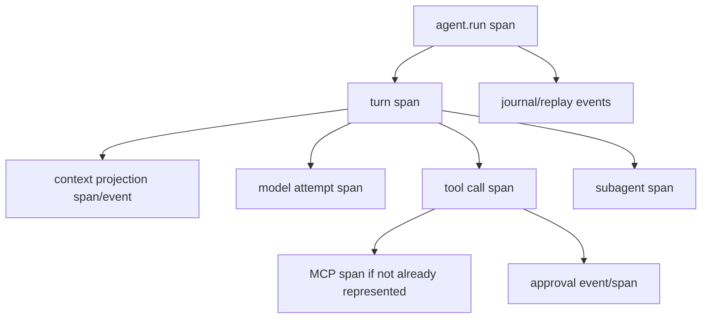

# OpenTelemetry Mapping Contract

The SDK should export OTel-compatible telemetry without making OTel conventions the internal source of truth.

## Stability Posture

OpenTelemetry GenAI semantic conventions are still evolving. Phase 2 pins the first exporter to semantic conventions `1.41.0` in `gen_ai_latest_experimental` mode, verified against the OpenTelemetry docs on 2026-05-23.

Required declaration:

- semconv version: `1.41.0`
- stability opt-in: `gen_ai_latest_experimental`
- schema URL: `https://opentelemetry.io/schemas/1.41.0`
- content capture mode
- MCP span dedupe behavior
- exporter failure behavior

If an implementation library cannot emit this exact schema URL/stability mode, the coding agent must update this contract before writing exporter code. The SDK's internal event and journal schemas remain the source of truth; OTel is an export projection.

Reference sources:

- [OpenTelemetry GenAI semconv](https://opentelemetry.io/docs/specs/semconv/gen-ai/)
- [OpenTelemetry GenAI agent spans](https://opentelemetry.io/docs/specs/semconv/gen-ai/gen-ai-agent-spans/)
- [OpenTelemetry GenAI model/tool spans](https://opentelemetry.io/docs/specs/semconv/gen-ai/gen-ai-spans/)
- [OpenTelemetry MCP semconv](https://opentelemetry.io/docs/specs/semconv/gen-ai/mcp/)

## Span Shape



## Attribute Rules

Use OTel GenAI/MCP attributes only from the pinned table below. Anything not listed stays under `agent_sdk.*` until the contract is updated.

| SDK fact | OTel attribute | Requirement |
| --- | --- | --- |
| run operation | `gen_ai.operation.name` | required on run/model/tool spans; values include `invoke_agent`, `chat`, `execute_tool` |
| provider | `gen_ai.provider.name` | required when known |
| agent ID | `gen_ai.agent.id` | conditional when stable host agent ID exists |
| agent name | `gen_ai.agent.name` | conditional when host provides display name |
| request model | `gen_ai.request.model` | conditional on model attempt spans |
| response model | `gen_ai.response.model` | conditional when provider reports actual model |
| input tokens | `gen_ai.usage.input_tokens` | recommended when provider reports usage |
| output tokens | `gen_ai.usage.output_tokens` | recommended when provider reports usage |
| tool name | `gen_ai.tool.name` | required on tool spans |
| tool call ID | `gen_ai.tool.call.id` | recommended when available |
| tool type | `gen_ai.tool.type` | recommended when known |
| error class | `error.type` | conditional on failures |
| MCP method | `mcp.method.name` | required on MCP spans |
| MCP JSON-RPC request | `jsonrpc.request.id` | conditional for MCP requests |
| MCP protocol version | `mcp.protocol.version` | recommended |
| MCP session | `mcp.session.id` | recommended when known |
| MCP resource URI | `mcp.resource.uri` | conditional and high-cardinality guarded |
| transport protocol | `network.protocol.name` | recommended when applicable |

Opt-in only:

- `gen_ai.system_instructions`
- `gen_ai.tool.call.arguments`
- `gen_ai.tool.call.result`
- raw prompt, model, tool, memory, audio, image, file, or remote-channel content

Use SDK namespace for SDK-specific lineage:

- `agent_sdk.run.id`
- `agent_sdk.turn.id`
- `agent_sdk.attempt.id`
- `agent_sdk.event.id`
- `agent_sdk.event.kind`
- `agent_sdk.runtime_package.fingerprint`
- `agent_sdk.source.kind`
- `agent_sdk.destination.kind`
- `agent_sdk.privacy`
- `agent_sdk.content_capture`
- `agent_sdk.journal.cursor`
- `agent_sdk.policy.decision_ids`
- `agent_sdk.isolation.environment_id`
- `agent_sdk.subagent.child_run_id`

## Golden Span Shape

```json
{
  "schema_url": "https://opentelemetry.io/schemas/1.41.0",
  "span": {
    "name": "invoke_agent example-assistant",
    "kind": "INTERNAL",
    "attributes": {
      "gen_ai.operation.name": "invoke_agent",
      "gen_ai.provider.name": "openai",
      "gen_ai.agent.name": "example-assistant",
      "gen_ai.request.model": "example-model",
      "agent_sdk.run.id": "run_123",
      "agent_sdk.runtime_package.fingerprint": "sha256:...",
      "agent_sdk.content_capture": "off"
    }
  },
  "children": [
    {
      "name": "chat example-model",
      "attributes": {
        "gen_ai.operation.name": "chat",
        "gen_ai.request.model": "example-model",
        "gen_ai.usage.input_tokens": 42,
        "gen_ai.usage.output_tokens": 12,
        "agent_sdk.turn.id": "turn_1"
      }
    },
    {
      "name": "execute_tool workspace_read",
      "attributes": {
        "gen_ai.operation.name": "execute_tool",
        "gen_ai.tool.name": "workspace_read",
        "gen_ai.tool.call.id": "tool_1",
        "agent_sdk.policy.decision_ids": ["policy_decision_1"]
      }
    }
  ]
}
```

Golden spans must prove:

- schema URL and stability mode are declared
- raw content opt-in attributes are absent by default
- SDK lineage fields survive export
- model/tool usage and costs can be joined back to journal records
- MCP calls do not create duplicate tool usage

## MCP Dedupe

If an SDK tool span already represents an MCP call, exporter must not create duplicate nested spans unless MCP instrumentation supplies independent remote trace context. In that case, link spans with trace context rather than double-count usage.

When MCP instrumentation is merged into an existing tool span, add MCP attributes such as `mcp.method.name`, `jsonrpc.request.id`, `mcp.protocol.version`, and `mcp.session.id` to that span. When MCP instrumentation is separate, link the MCP span to the SDK tool span and set one usage owner.

## Content Rules

- Raw prompt/model/tool/memory content is off by default.
- Content opt-in follows telemetry/privacy contract.
- Provider account IDs and credential IDs are hashed or redacted by policy.

## Failure Rules

- Exporter failure emits `TelemetrySinkFailed`.
- Run continues.
- Journal records export cursor so repair replay can re-export.

## Acceptance Tests

- `otel_run_model_tool_subagent_golden_spans`
- `otel_uses_pinned_semconv_declaration`
- `otel_schema_url_is_1_41_0`
- `otel_stability_opt_in_is_gen_ai_latest_experimental`
- `otel_sdk_fields_use_agent_sdk_namespace`
- `otel_golden_span_contains_required_gen_ai_and_agent_sdk_fields`
- `otel_opt_in_content_attributes_absent_by_default`
- `mcp_tool_call_does_not_double_span_under_sdk_tool_span`
- `mcp_attributes_merge_or_link_without_double_counting_usage`
- `otel_raw_content_absent_by_default`
- `otel_sink_failure_does_not_fail_run`

## Complete Example

Typed shape:

```rust
// Non-compiling contract sketch.
let exporter = OTelExporterConfig {
    semconv_version: SemconvVersion::new("1.41.0"),
    stability_opt_in: StabilityOptIn::GenAiLatestExperimental,
    schema_url: "https://opentelemetry.io/schemas/1.41.0".into(),
    content_capture: ContentCaptureMode::Off,
    mcp_dedupe: McpDedupePolicy::MergeOrLinkSingleUsageOwner,
    failure_behavior: ExporterFailureBehavior::EmitTelemetrySinkFailedAndContinue,
};

otel_sink.export_run_span(RunTelemetryProjection {
    run_id,
    trace_id,
    package_fingerprint,
    operation: GenAiOperationName::InvokeAgent,
    provider_name: Some("openai".into()),
    model: Some("example-model".into()),
    usage_ref,
}).await?;
```

Replaceable ports:

- `TelemetrySink` can export to OpenTelemetry, durable trace stores, logs, or test collectors.
- `SpanProjector` maps SDK event/journal facts to OTel attributes.
- `McpSpanDeduper` decides merge vs link without changing tool execution.

Wiring:

1. SDK records journal-backed model/tool/subagent events.
2. Telemetry fanout projects events into spans.
3. OTel exporter adds pinned schema URL and semconv stability.
4. Sink failure emits `TelemetrySinkFailed` and records export cursor for repair.

Events:

- `UsageRecorded`
- `CostEstimated`
- `CostCorrected`
- `TelemetrySinkFailed`
- `TelemetrySinkRecovered`

Journal:

- `TelemetryRecord { usage, cost, export_cursor }`
- `TelemetryRecord { sink failure }`
- `RecoveryRecord { repair replay for export cursor }`

Policies and failures:

- Raw content attributes are opt-in only.
- MCP call represented by SDK tool span gets MCP attributes merged or linked, never double-counted.
- Unsupported semconv/schema URL requires contract update before exporter code.

SDK owns / Host owns:

- SDK owns the projection contract, pinned attribute map, content defaults, and exporter failure behavior.
- Host owns collector endpoint, sampling, retention, dashboard queries, and trace-store-specific storage.

Tests:

- `otel_schema_url_is_1_41_0`
- `otel_golden_span_contains_required_gen_ai_and_agent_sdk_fields`
- `mcp_attributes_merge_or_link_without_double_counting_usage`
