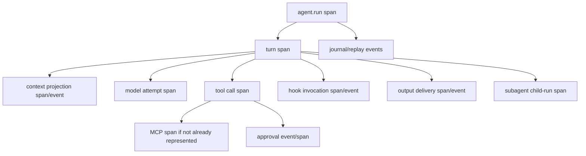

# OpenTelemetry Mapping Contract

The SDK should export OTel-compatible telemetry without making OTel conventions the internal source of truth.

## Projection Authority

OTel spans, metrics, and logs are projections from SDK-owned facts. The exporter reads `AgentEvent` envelopes, `RunJournal` records, usage/cost records, and `PolicyRef` / `PolicyDecisionRef` values. It must not introduce run facts, infer terminal state from exporter delivery, or become a second event stream or ledger.

Rules:

- `RunJournal` remains the durable source of truth for replay, resume, repair, terminal state, and side-effect audit.
- `AgentEvent` remains the canonical live event vocabulary and filter surface.
- `TelemetryRecord` may persist usage, cost, sink health, correction, and export-cursor facts needed to repair derived telemetry, but it cannot mutate run outcome or side-effect status.
- OTel IDs, trace-store IDs, and collector acknowledgements are linked back to SDK IDs; they never replace `RunId`, `EventId`, `JournalCursor`, `EffectId`, or `PolicyRef`.
- Missing or failing telemetry sinks can emit sink-health telemetry and repair records, but they cannot block provider streaming, tool execution, cancellation, journal append, or terminal sealing.

## Stability Posture

OpenTelemetry GenAI semantic conventions are still evolving. The first exporter contract pins semantic conventions `1.41.0` in `gen_ai_latest_experimental` mode, verified against the OpenTelemetry docs on 2026-05-23.

Required declaration:

- semconv version: `1.41.0`
- stability opt-in: `gen_ai_latest_experimental`
- schema URL: `https://opentelemetry.io/schemas/1.41.0`
- content capture mode
- MCP span dedupe behavior
- exporter failure behavior

If an implementation library cannot emit this exact schema URL/stability mode, the coding agent must update this contract before writing exporter code. The SDK's internal event and journal schemas remain the source of truth; OTel is an export projection.

Reference sources:

- [OpenTelemetry GenAI semconv](https://opentelemetry.io/docs/specs/semconv/gen-ai/)
- [OpenTelemetry GenAI agent spans](https://opentelemetry.io/docs/specs/semconv/gen-ai/gen-ai-agent-spans/)
- [OpenTelemetry GenAI model/tool spans](https://opentelemetry.io/docs/specs/semconv/gen-ai/gen-ai-spans/)
- [OpenTelemetry MCP semconv](https://opentelemetry.io/docs/specs/semconv/gen-ai/mcp/)

## Span Shape



## Phase 04 And Phase 05 Emitted-Kind Mapping

This table maps event kinds available through Phase 04 plus Phase 05 feature-layer closures to OTel projections. It is not permission to emit a kind before that kind has the event payload fixture required by [event-schema.md](event-schema.md). Exporters must route from envelope fields and journal/index projections, not raw payload content.

| SDK event family or kinds | OTel projection | Mapping rules |
| --- | --- | --- |
| `RunStarted`, `RunCompleted`, `RunFailed`, `RunCancelled` | root `invoke_agent` span | Start/end the span from journal-backed run lifecycle facts. Terminal status comes from journal-backed terminal events or replay, not collector success. |
| `RunCheckpointed`, `RunCancelRequested`, `RunResumeRequested`, `RunResumeFailed` | root span events or logs | Include `agent_sdk.journal.cursor` when available. Resume/cancel signals do not create a new root span unless a future compatibility note says so. |
| `TurnStarted`, `ContextAssembled`, `ProviderRequestProjected`, `TurnCompleted`, `TurnFailed` | child turn span plus span events | `ContextAssembled` and `ProviderRequestProjected` export context projection IDs, counts, policy refs, and redaction summaries only. |
| `MessageAccepted`, `MessagePartAdded`, `MessageCommitted`, `MessageRedacted`, `MessageProjected`, `MessageDropped` | span events or logs | Message content is represented by part kinds, `ContentRef`, hashes, sizes, redacted summaries, privacy, and retention. Raw content is opt-in only. |
| `ModelAttemptStarted`, `ModelMessageCompleted`, `ModelAttemptRetried`, `ModelAttemptFailed`, `ModelAttemptCancelled` | `chat` model attempt span | One span per attempt. Retries create linked attempts rather than overwriting history. |
| `ModelStreamDelta` | coalesced span events or dropped progress metric | Deltas are progress data. Exporters may coalesce or drop them under fanout policy and must preserve terminal model usage/status. |
| `ModelUsageRecorded` | model usage metrics and span attributes | Usage joins to `ModelAttemptRecord` and `TelemetryRecord`; estimates and provider-reported corrections stay distinguishable. |
| `StructuredOutputRequested`, `StructuredOutputValidationStarted`, `StructuredOutputValidationFailed`, `StructuredOutputRepairRequested`, `StructuredOutputValidated`, `StructuredOutputFailed` | validation span events under the model/turn span | Export schema ID/version, attempt IDs, validation status, repair count, and redacted error summaries. Do not export raw invalid output by default. |
| `ToolRequested`, `ToolApprovalRequired`, `ToolStarted`, `ToolProgress`, `ToolCompleted`, `ToolFailed`, `ToolRetried`, `ToolCancelled`, `ToolInterrupted` | `execute_tool` span | Tool spans link to `EffectIntent` / `EffectResult`, `ToolRecord`, approval refs, idempotency/dedupe keys, and redacted result refs. `ToolProgress` may be coalesced. |
| `ApprovalRequested`, `ApprovalDispatched`, `ApprovalDispatchUnavailable`, `ApprovalResponded`, `ApprovalTimedOut`, `ApprovalDenied`, `ApprovalCancelled` | approval span events under tool/output/hook span or a short approval span | Approval events export broker lifecycle, dispatcher kind, finite decision, actor refs, policy refs, timeout, and denial reason. Approval UI remains host-owned. |
| `HookRegistered`, `HookInvoked`, `HookCompleted`, `HookFailed`, `HookTimedOut`, `HookCancelled`, `HookResponseApplied`, `HookResponseRejected` | hook invocation span/events | Hook telemetry links to package sidecar refs, hook policy refs, mutation rights, timeout/failure policy, and any journaled domain operation produced by the hook. |
| `MemoryRetrieved`, `ContextContributionReceived`, `ContextContributionSelected`, `ContextContributionOmitted`, `MemoryStored`, `ContextItemInjected`, `ContextCompactionStarted`, `ContextCompactionCompleted`, `ContextProjectionAudited` | context/memory span events | Export selection/omission decisions, projection IDs, privacy, retention, and content refs. Memory bodies are not exported by default. |
| `StreamRuleRegistered`, `StreamRuleCompileFailed`, `StreamRuleMatched`, `StreamInterventionRequested`, `StreamInterventionApplied`, `StreamInterventionFailed`, `StreamRuleInjectionAppended` | stream-rule span events under model, tool, realtime, or run span | Export rule ID/version, channel, cursor precision, matcher kind, action, partial-output policy, policy refs, and redaction policy. Matched content stays as hash/length/redacted summary unless content capture explicitly allows raw match capture. |
| `RealtimeConnected`, `RealtimeInputSent`, `RealtimeOutputReceived`, `RealtimeInterrupted`, `RealtimeRestartRequested`, `RealtimeRestartStarted`, `RealtimeRestartCompleted`, `RealtimeRestartFailed`, `RealtimeConnectionRestarted`, `RealtimeClosed`, `RealtimeBackpressureApplied` | realtime session span and span events | Link to `RealtimeSessionRecord`, provider route refs, session/connection refs, send/receive cursors, restart count, backpressure policy, media kind, and content refs. Raw media and transcripts are absent by default. `RealtimeConnectionRestarted` is a compatibility alias projected as a completed restart event. |
| `IsolationRequested`, `IsolationAdapterHealthChecked`, `IsolationCapabilityMatched`, `IsolationDowngradeDenied`, `IsolationDowngradeApproved`, `IsolationImageResolved`, `IsolationRootfsPrepared`, `IsolationSessionPrepared`, `IsolationMountsResolved`, `IsolationNetworkPrepared`, `IsolationSecretsPrepared`, `IsolationEnvironmentPrepared`, `IsolationProcessStarted`, `IsolationProcessIoCaptured`, `IsolationProcessStatsRecorded`, `IsolationProcessSignalled`, `IsolationProcessExited`, `IsolationCleanupStarted`, `IsolationCleanupCompleted`, `IsolationCleanupFailed`, `IsolationFailed` | isolation environment/process spans and logs | Link to `IsolationRecord`, environment/session/process refs, adapter refs, capability report versions, policy decision refs, cleanup status, stats counters, and redaction policy IDs. Raw process I/O, argv/env values, host paths, credentials, adapter handles, and secrets are absent by default. |
| `ChildLifecycleShutdownRequested`, `ChildLifecycleShutdownCompleted`, `ChildLifecycleShutdownFailed`, `ChildLifecycleDetachRequested`, `ChildLifecycleDetachAcknowledged`, `ChildLifecycleDetached`, `ChildLifecycleDetachDenied`, `ChildLifecycleReclaimRequested`, `ChildLifecycleReclaimed`, `ChildLifecycleReclaimFailed` | child artifact lifecycle span events | Link to `ChildLifecycleRecord`, child artifact refs, owner run refs, detach/reclaim policy refs, host acknowledgement refs, terminal status, and error refs. These events do not imply subagent user-chat promotion or detached supervision ownership in core. |
| `SubagentStarted`, `SubagentHandoff`, `SubagentEvent`, `SubagentParentMessageSent`, `SubagentParentMessageRead`, `SubagentClarificationRequested`, `SubagentClarificationResponded`, `SubagentCompleted`, `SubagentFailed`, `SubagentCancelled`, `SubagentUsageRolledUp` | child run span, linked child events, and usage/cost metrics | Start/link a child-run span from journal-backed subagent start records. Handoff, mailbox, clarification, and wrapped child events export policy refs, content refs, counts, child journal cursors, and redaction policy IDs only. Terminal state comes from subagent and child journal records; usage rollup must be idempotent. |
| `ExtensionCapabilityLoaded`, `ExtensionHookInvoked`, `ExtensionToolRequested`, `ExtensionEventObserved`, `ExtensionActionSubmitted`, `ExtensionActionStarted`, `ExtensionActionCompleted`, `ExtensionActionFailed`, `ExtensionActionDenied` | extension capability/action/hook/tool span events | Export SDK-facing extension ID/version, capability IDs/kinds, action kind, package sidecar refs, policy decision refs, effect refs, idempotency/dedupe keys, and redacted summaries. Host manifest runtime fields, install paths, marketplace data, trust enums, browser-safe export lists, raw app-event payloads, and transport state are excluded. |
| `OutputDispatchRequested`, `OutputDispatchCompleted`, `OutputDispatchFailed`, `OutputDispatchDeduped` | output sink span/events | Output delivery telemetry links to `OutputDispatchRecord`, destination refs, dedupe key, ack/failure refs, and sink policy. Product channel UX and copy stay host-owned. |
| `UsageRecorded`, `CostEstimated`, `CostCorrected` | metrics, span attributes, and cost logs | Cost records are monotonic. Corrections append and include rate table/version, estimate status, child rollup refs, and source record refs. |
| `TelemetrySinkFailed`, `TelemetrySinkRecovered` | telemetry sink health logs/metrics | Include sink ID, sink kind, failure reason, last acknowledged export cursor, retry policy, dropped counts when applicable, and `terminal_preserved`. These events never fail the run. |
| `InvariantFailed`, `JournalAppendFailed`, `RecoveryPlanned`, `ReplayStarted`, `ReplayCompleted`, `ReplayFailed`, `AntiEntropyRepairSuggested`, `AntiEntropyRepairApplied` | recovery logs and repair spans | Repair telemetry can rebuild derived exports from journal cursors. It must not rerun providers, tools, output sends, memory writes, extensions, or product compensation. |

Phase 05 closes the Phase 04 mapping deferrals for `stream_rule`, `realtime`, `isolation`, `child_lifecycle`, `subagent`, and `extension`. Implementation is still fixture-gated: a fake adapter may emit only the specific kind that has a golden event payload, redaction fixture, journal fixture, and OTel projection fixture.

## Attribute Rules

Use OTel GenAI/MCP attributes only from the pinned table below. Anything not listed stays under `agent_sdk.*` until the contract is updated.

| SDK fact | OTel attribute | Requirement |
| --- | --- | --- |
| run operation | `gen_ai.operation.name` | required on run/model/tool spans; values include `invoke_agent`, `chat`, `execute_tool` |
| provider | `gen_ai.provider.name` | required when known |
| agent ID | `gen_ai.agent.id` | conditional when stable host agent ID exists |
| agent name | `gen_ai.agent.name` | conditional when host provides display name |
| request model | `gen_ai.request.model` | conditional on model attempt spans |
| response model | `gen_ai.response.model` | conditional when provider reports actual model |
| input tokens | `gen_ai.usage.input_tokens` | recommended when provider reports usage |
| output tokens | `gen_ai.usage.output_tokens` | recommended when provider reports usage |
| tool name | `gen_ai.tool.name` | required on tool spans |
| tool call ID | `gen_ai.tool.call.id` | recommended when available |
| tool type | `gen_ai.tool.type` | recommended when known |
| error class | `error.type` | conditional on failures |
| MCP method | `mcp.method.name` | required on MCP spans |
| MCP JSON-RPC request | `jsonrpc.request.id` | conditional for MCP requests |
| MCP protocol version | `mcp.protocol.version` | recommended |
| MCP session | `mcp.session.id` | recommended when known |
| MCP resource URI | `mcp.resource.uri` | conditional and high-cardinality guarded |
| transport protocol | `network.protocol.name` | recommended when applicable |

Opt-in only:

- `gen_ai.system_instructions`
- `gen_ai.tool.call.arguments`
- `gen_ai.tool.call.result`
- raw prompt, model, tool, memory, audio, image, file, or remote-channel content

Use SDK namespace for SDK-specific lineage:

- `agent_sdk.run.id`
- `agent_sdk.turn.id`
- `agent_sdk.attempt.id`
- `agent_sdk.event.id`
- `agent_sdk.event.family`
- `agent_sdk.event.kind`
- `agent_sdk.runtime_package.fingerprint`
- `agent_sdk.source.kind`
- `agent_sdk.destination.kind`
- `agent_sdk.privacy`
- `agent_sdk.content_capture`
- `agent_sdk.journal.cursor`
- `agent_sdk.policy.decision_ids`
- `agent_sdk.redaction.policy_id`
- `agent_sdk.retention.class`
- `agent_sdk.telemetry.sink.id`
- `agent_sdk.telemetry.export.cursor`
- `agent_sdk.usage.record.id`
- `agent_sdk.cost.record.id`
- `agent_sdk.cost.rate_table.version`
- `agent_sdk.stream.rule.id`
- `agent_sdk.stream.channel`
- `agent_sdk.stream.action`
- `agent_sdk.realtime.session.id`
- `agent_sdk.realtime.restart.count`
- `agent_sdk.isolation.environment_id`
- `agent_sdk.isolation.process.id`
- `agent_sdk.subagent.child_run_id`
- `agent_sdk.extension.id`
- `agent_sdk.extension.action.id`

High-cardinality values such as content hashes, remote handles, filesystem paths, provider account IDs, and credential profile IDs must be omitted, redacted, hashed, or replaced by host-approved aliases according to policy before they become OTel attributes.

## Golden Span Shape

```json
{
  "schema_url": "https://opentelemetry.io/schemas/1.41.0",
  "span": {
    "name": "invoke_agent example-assistant",
    "kind": "INTERNAL",
    "attributes": {
      "gen_ai.operation.name": "invoke_agent",
      "gen_ai.provider.name": "openai",
      "gen_ai.agent.name": "example-assistant",
      "gen_ai.request.model": "example-model",
      "agent_sdk.run.id": "run_123",
      "agent_sdk.runtime_package.fingerprint": "sha256:...",
      "agent_sdk.content_capture": "off"
    }
  },
  "children": [
    {
      "name": "chat example-model",
      "attributes": {
        "gen_ai.operation.name": "chat",
        "gen_ai.request.model": "example-model",
        "gen_ai.usage.input_tokens": 42,
        "gen_ai.usage.output_tokens": 12,
        "agent_sdk.turn.id": "turn_1"
      }
    },
    {
      "name": "execute_tool workspace_read",
      "attributes": {
        "gen_ai.operation.name": "execute_tool",
        "gen_ai.tool.name": "workspace_read",
        "gen_ai.tool.call.id": "tool_1",
        "agent_sdk.policy.decision_ids": ["policy_decision_1"]
      }
    }
  ]
}
```

Golden spans must prove:

- schema URL and stability mode are declared
- raw content opt-in attributes are absent by default
- SDK lineage fields survive export
- model/tool usage and costs can be joined back to journal records
- MCP calls do not create duplicate tool usage

## MCP Dedupe

If an SDK tool span already represents an MCP call, exporter must not create duplicate nested spans unless MCP instrumentation supplies independent remote trace context. In that case, link spans with trace context rather than double-count usage.

When MCP instrumentation is merged into an existing tool span, add MCP attributes such as `mcp.method.name`, `jsonrpc.request.id`, `mcp.protocol.version`, and `mcp.session.id` to that span. When MCP instrumentation is separate, link the MCP span to the SDK tool span and set one usage owner.

## Content Rules

- Raw prompt/model/tool/memory content is off by default.
- Content opt-in follows telemetry/privacy contract.
- Provider account IDs and credential IDs are hashed or redacted by policy.
- Opt-in raw content requires an explicit content-capture policy, redaction policy, retention class/window, sampling decision, sink permission, and policy/approval refs when required.
- Hidden chain-of-thought, credentials, auth headers, and unredacted environment values are never exported as OTel content attributes.

## Failure Rules

- Exporter failure emits `TelemetrySinkFailed`.
- Run continues.
- Journal records export cursor so repair replay can re-export idempotently.
- Exporter retry uses a sink-scoped `TelemetryExportCursor`; it is distinct from `EventCursor`, `JournalCursor`, and optional `ArchiveCursor`.
- A sink acknowledges an export cursor only after the sink-specific delivery contract says the projection is durably accepted or safely deduped.
- Repair replay reads journal-backed records and telemetry records; it does not replay raw content unless the original content-capture policy, sampling decision, retention, and sink permission still allow it.
- Terminal run, usage, cost, sink failure, and recovery cursor projections are preserved under fanout overflow or represented by a repairable sink-health record.

## Acceptance Tests

- `otel_run_model_tool_subagent_golden_spans`
- `otel_uses_pinned_semconv_declaration`
- `otel_schema_url_is_1_41_0`
- `otel_stability_opt_in_is_gen_ai_latest_experimental`
- `otel_phase04_emitted_kind_mapping_has_no_unmapped_active_kind`
- `otel_phase05_emitted_kind_mapping_has_no_unmapped_active_kind`
- `otel_phase05_feature_mappings_require_event_journal_redaction_and_projection_fixtures`
- `otel_sdk_fields_use_agent_sdk_namespace`
- `otel_golden_span_contains_required_gen_ai_and_agent_sdk_fields`
- `otel_opt_in_content_attributes_absent_by_default`
- `otel_content_capture_requires_redaction_retention_sampling_and_sink_permission`
- `mcp_tool_call_does_not_double_span_under_sdk_tool_span`
- `mcp_attributes_merge_or_link_without_double_counting_usage`
- `otel_raw_content_absent_by_default`
- `otel_sink_failure_does_not_fail_run`
- `otel_export_cursor_repairs_from_journal_without_run_control`
- `otel_terminal_usage_and_cost_survive_sink_overflow`

## Complete Example

Typed shape:

```rust
// Non-compiling contract sketch.
let exporter = OTelExporterConfig {
    semconv_version: SemconvVersion::new("1.41.0"),
    stability_opt_in: StabilityOptIn::GenAiLatestExperimental,
    schema_url: "https://opentelemetry.io/schemas/1.41.0".into(),
    content_capture: ContentCaptureMode::Off,
    mcp_dedupe: McpDedupePolicy::MergeOrLinkSingleUsageOwner,
    failure_behavior: ExporterFailureBehavior::EmitTelemetrySinkFailedAndContinue,
};

telemetry_fanout.try_record(TelemetryProjection::otel_span(RunTelemetryProjection {
    run_id,
    trace_id,
    package_fingerprint,
    operation: GenAiOperationName::InvokeAgent,
    provider_name: Some("openai".into()),
    model: Some("example-model".into()),
    usage_ref,
}))?;
```

Replaceable ports:

- `TelemetrySink` can export to OpenTelemetry, durable trace stores, logs, or test collectors.
- `SpanProjector` maps SDK event/journal facts to OTel attributes.
- `McpSpanDeduper` decides merge vs link without changing tool execution.

Wiring:

1. SDK records journal-backed model/tool/subagent events.
2. Telemetry fanout enqueues span projections without awaiting exporter I/O on the run loop.
3. OTel exporter workers drain fanout queues and add pinned schema URL and semconv stability.
4. Sink failure emits `TelemetrySinkFailed` and records export cursor for repair.

Events:

- `UsageRecorded`
- `CostEstimated`
- `CostCorrected`
- `TelemetrySinkFailed`
- `TelemetrySinkRecovered`

Journal:

- `TelemetryRecord { usage, cost, export_cursor }`
- `TelemetryRecord { sink failure }`
- `RecoveryRecord { repair replay for export cursor }`

Policies and failures:

- Raw content attributes are opt-in only.
- MCP call represented by SDK tool span gets MCP attributes merged or linked, never double-counted.
- Unsupported semconv/schema URL requires contract update before exporter code.

SDK owns / Host owns:

- SDK owns the projection contract, pinned attribute map, content defaults, and exporter failure behavior.
- Host owns collector endpoint, sampling, retention, dashboard queries, and trace-store-specific storage.

Tests:

- `otel_schema_url_is_1_41_0`
- `otel_golden_span_contains_required_gen_ai_and_agent_sdk_fields`
- `mcp_attributes_merge_or_link_without_double_counting_usage`
