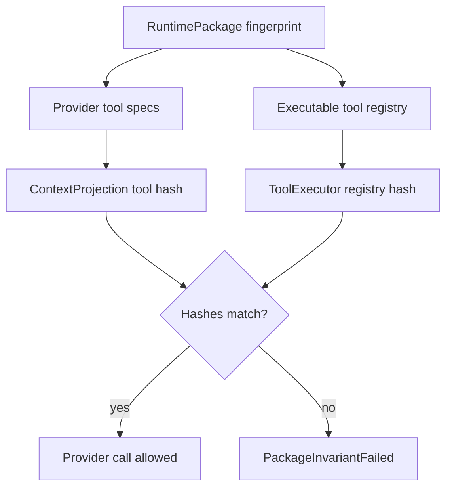

# Runtime Package Schema Contract

`RuntimePackage` is the immutable per-run effective snapshot that binds what the model can see to what the runtime can execute. Package refs, presets, and runtime defaults are inputs to resolution; the resolved effective package is the execution authority and fingerprint source for the run. It prevents provider projection, tool execution, policy, hooks, and tracing from drifting during a run.

## Package And Capability Boundary

`RuntimePackage` is the canonical per-run effective snapshot. It should be small at the center and explicit at the edges:

- package fields hold provider route, policies, output contracts, delivery sinks, lifecycle defaults, and typed sidecar snapshots;
- `CapabilitySpec` describes callable or discoverable capabilities that may be projected to a provider or executed through a registry;
- feature-specific data lives in typed sidecar snapshots keyed by stable IDs;
- host-installed catalogs are captured as source-qualified snapshots before anything becomes active.

`CapabilitySpec` must not become the universal bag for every package concern. If a concept is not callable/discoverable, model-visible, or executable by a registry, it usually belongs in a typed package field or sidecar instead.

The runtime may expose builders, refs, presets, and package templates for ergonomics, but those are not live execution state. `AgentRuntime::start_run` resolves the request package ref, default package ref, host catalogs, and `RunRequest.output_contract` into one effective package before the first provider projection.

```rust
// Non-compiling contract sketch.
pub struct CapabilitySpec {
    pub capability_id: CapabilityId,
    pub kind: CapabilityKind,
    pub source: CapabilitySource,
    pub namespace: CapabilityNamespace,
    pub version: CapabilityVersion,
    pub visibility: CapabilityVisibility,
    pub projection: ProjectionMode,
    pub executor_ref: Option<ExecutorRef>,
    pub policy_ref: PolicyRef,
    pub sidecar_refs: Vec<PackageSidecarRef>,
    pub isolation_ref: Option<IsolationRequirementRef>,
    pub privacy: CapabilityPrivacy,
}

pub enum CapabilityKind {
    Tool,
    McpTool,
    McpResource,
    ToolDiscoveryCandidate,
    AgentAsTool,
    ExtensionAction,
    // Reserved feature-layer variants. They require typed sidecar contracts
    // before any adapter can project or execute them.
    StreamControl,
    RealtimeAction,
}

pub enum ProjectionMode {
    NotProjected,
    DescriptorOnly,
    ProviderToolSchema { schema_ref: SchemaRef },
    ProducesContextItems { allowed_kinds: Vec<ContextItemKind> },
    ProjectsContextRefs { allowed_ref_kinds: Vec<ContentRefKind> },
}
```

Rules:

- Provider-visible capabilities must use a projection mode other than `NotProjected`.
- Executable capabilities must have executor refs.
- Every capability has a policy ref.
- Hidden capabilities can be discovered but not projected until a next-package delta activates them.
- Namespaces prevent MCP, extension, host, built-in, and subagent collisions.
- `CapabilitySpec` is not an untyped bag. Each variant beyond the MVP profile must name a typed sidecar contract, owner role, fingerprint fields, emitted events, journal records, and acceptance tests before an adapter can emit or execute it.
- Variant-specific data lives in typed snapshots referenced by `CapabilitySpec`, not arbitrary per-feature maps.
- Provider route, output contracts, output delivery sinks, hook ordering, guardrails/policy checks, telemetry policy, child lifecycle defaults, and isolation requirements are package fields or sidecars unless they are exposed as callable/discoverable capabilities.

## Source-Qualified Catalog Snapshots

Catalog discovery is not package activation. Hosts may scan SDK tool packs, MCP servers, skills, extension manifests, package catalogs, or child-agent definitions, but the active runtime package records a bounded catalog snapshot before any candidate can be projected or executed.

```rust
// Non-compiling contract sketch.
pub struct CapabilityCatalogSnapshot {
    pub catalog_id: CatalogSnapshotId,
    pub source_kind: CapabilitySourceKind,
    pub source_ref: SourceRef,
    pub version: Option<CapabilityVersion>,
    pub content_hash: Option<ContentHash>,
    pub trust_state: TrustState,
    pub activation_policy_ref: PolicyRef,
    pub inherited_skill_policy: Option<InheritedSkillPolicy>,
    pub candidates: Vec<CapabilityId>,
}
```

Validation rejects outdated static role/tool tables when a source-qualified catalog is required. Activation always creates a package delta for the next turn or run.

## P0/P1 Capability Profile

The P0/P1 slice should support only the variants needed for a fake-provider text or typed run:

| Variant | Required in P0/P1 | Purpose |
| --- | --- | --- |
| `Tool` | optional fake only | Proves provider-visible tool specs match executable routes. |
| `McpTool` / `McpResource` | reserved | Feature layer owned by tools/toolpack workstream. |
| `ToolDiscoveryCandidate` | reserved | Feature layer owned by tools/toolpack workstream. |
| `AgentAsTool` | reserved | Feature layer owned by subagent workstream. |
| `ExtensionAction` | reserved | Feature layer owned by extension workstream. |
| `StreamControl` | reserved | Feature layer owned by streaming workstream. |
| `RealtimeAction` | reserved | Feature layer owned by streaming/realtime workstream. |

Provider route is required in P0, but it is a package field, not a `CapabilityKind`. Typed output is required for P1 typed runs, but `OutputContract` is a run-request authority normalized into an effective package sidecar/fingerprint before execution; it is not a callable capability. Fake output delivery may be present through an output sink sidecar and `OutputSink` port, not a capability variant.

Reserved variants may appear in contract docs before implementation, but they cannot be projected, executed, or emitted by an adapter until their workstream supplies the typed sidecar contract and fixtures.

## Reserved Capability Variant Readiness

Reserved variants are names, not implementation permission. A future workstream may move a variant from reserved to active only after its review packet names every field below and adds the matching contract tests or golden fixtures. Until then, package validation rejects any adapter attempt to project or execute that variant outside a test-only fake profile.

| Variant | Owner role | Typed sidecar contract | Fingerprint fields | Emitted events | Journal records | Future validation |
| --- | --- | --- | --- | --- | --- | --- |
| `McpTool` | [04 Tools](../workstreams/_roles/04-tools-approval-toolpacks.md) | MCP/tool-pack sidecar in [tool-pack-contract.md](tool-pack-contract.md) plus approval policy refs | MCP server ID/version, canonical tool name, namespace, schema refs, executor ref, permission/approval refs, source trust | capability loaded, tool requested, approval requested/decided, tool started/completed/failed | package catalog snapshot, package delta, tool execution intent/result, approval record | MCP allowlist matrix, provider projection fixture, executor route fixture, intent-before-effect journal fixture |
| `McpResource` | [04 Tools](../workstreams/_roles/04-tools-approval-toolpacks.md), [03 Context](../workstreams/_roles/03-context-structured-output.md) | MCP resource sidecar that yields `ContentRef` / `ContextContribution` candidates | MCP server/resource IDs, resource URI, parser/version, permission refs, content privacy/retention policy | resource discovered, resource read, context contribution received/selected/omitted | package catalog snapshot, resource read intent/result, context record | resource allowlist tests, content-ref redaction fixture, context admission/projection audit fixture |
| `ToolDiscoveryCandidate` | [04 Tools](../workstreams/_roles/04-tools-approval-toolpacks.md) | discovery-index sidecar and activation policy refs | discovery index ID/version, candidate capability ID, source ref, activation policy ref, hidden/projection state | discovery searched, candidate returned, package delta requested/accepted/rejected | discovery record, package delta requested/accepted/rejected | hidden candidate not projected fixture, activation creates next snapshot test, no live package mutation test |
| `AgentAsTool` | [07 Subagents](../workstreams/_roles/07-subagents-coordination.md) | subagent helper sidecar lowering to `AgentPool`, `RunMessage`, `WakeCondition`, `SubagentRequest`, and a child `RunRequest` | parent package fingerprint lineage, child agent ID/version, agent-pool policy refs, run-message policy refs, wake policy refs, route policy, selected provider route, context handoff variant/policy refs, retained capability IDs, recursive-strip manifest, lifecycle refs, isolation refs, redaction/content-capture/retention refs | agent-pool message/wake events plus `SubagentStarted`, `SubagentHandoff`, `SubagentEvent`, terminal subagent kinds, usage rollup | child start effect intent/result, agent-pool records, run-message records, wake records, subagent records, child lifecycle records, usage rollup | child package stripping fixture, handoff policy matrix, parent cancel/detach tests, run-message/wake fixtures, event wrapping fixture |
| `ExtensionAction` | [08 Extension SDK](../workstreams/_roles/08-extension-sdk-packaging.md) | SDK-facing `CoreExtensionCapabilities` action/tool sidecar, not host manifest fields | extension ID/version, SDK-facing capability IDs, action capability ID, executor/bridge ref, policy refs, package sidecar refs, source refs, catalog snapshot refs | `ExtensionCapabilityLoaded`, `ExtensionActionSubmitted`, `ExtensionActionStarted`, `ExtensionActionCompleted`, `ExtensionActionFailed`, `ExtensionActionDenied`, approval lifecycle when needed | package catalog snapshot, extension action intent/result, approval record | core capability lowering tests, denied action fixture, extension cannot self-approve test, host-manifest exclusion audit |
| `StreamControl` | [05 Streaming](../workstreams/_roles/05-streaming-realtime-rules.md) | stream-rule sidecar with matcher/intervention policy | stream rule ID/version, matcher kind/hash/limits, channel set, action, repeat policy, source refs, privacy, redaction/content-capture policy refs, intervention policy refs | `StreamRuleRegistered`, `StreamRuleCompileFailed`, `StreamRuleMatched`, `StreamInterventionRequested`, `StreamInterventionApplied`, `StreamInterventionFailed`, `StreamRuleInjectionAppended` | stream rule state, intervention intent/result, approval record where applicable | bounded matcher corpus, redacted match fixture, intervention matrix, resume repeat-state test |
| `RealtimeAction` | [05 Streaming](../workstreams/_roles/05-streaming-realtime-rules.md) | realtime action sidecar plus realtime provider capability refs | realtime provider capability version, action ID, provider route refs, media/channel policy, restart/backpressure/interruption/close policy refs, queue/overflow policy | `RealtimeConnected`, `RealtimeInputSent`, `RealtimeOutputReceived`, `RealtimeInterrupted`, restart sequence, `RealtimeClosed`, `RealtimeBackpressureApplied` | `RealtimeSessionRecord`, stream delta cursor records, intervention intent/result | send/receive fake workflow, restart/backpressure tests, media ref privacy fixture |

Non-callable execution policy remains outside `CapabilitySpec` unless a row above explicitly makes it callable or discoverable. Provider route, output contracts, delivery sinks, telemetry policy, hooks, guardrails, child lifecycle, and isolation requirements remain package fields or typed sidecars with their own fingerprints.

## Required Snapshot Fields

```rust
// Non-compiling contract sketch.
pub struct RuntimePackageCanonicalV1 {
    pub schema_version: u16,
    pub package_id: RuntimePackageId,
    pub agent: AgentSnapshot,
    pub provider_route: ProviderRouteSnapshot,
    pub provider_capabilities: ProviderCapabilitySnapshot,
    pub output_contracts: Vec<OutputContractSnapshot>,
    pub output_sinks: Vec<OutputSinkSnapshot>,
    pub capabilities: Vec<CapabilitySpec>,
    pub sidecars: Vec<PackageSidecarSnapshot>,
    pub isolation_requirements: Vec<IsolationRequirementSnapshot>,
    pub catalogs: Vec<CapabilityCatalogSnapshot>,
    pub child_lifecycle: ChildLifecyclePolicySnapshot,
    pub policies: PolicySnapshot,
    pub fingerprint_inputs: FingerprintInputManifest,
}

pub struct FingerprintInputManifest {
    pub algorithm: FingerprintAlgorithm,
    pub canonical_schema_version: u16,
    pub readiness_profile: ReadinessProfile,
    pub included_groups: Vec<FingerprintInputGroup>,
    pub excluded_groups: Vec<FingerprintExclusionGroup>,
    pub reserved_feature_status: Vec<ReservedFeatureFingerprintStatus>,
}
```

The runtime may keep richer in-memory indexes for fast lookup, but this canonical DTO is the fingerprint source. Typed sidecars include, for example, tool-pack snapshots, isolation requirements, hook specs, stream rules, subagent definitions, extension core capability snapshots, telemetry policy, `PolicyStage` guardrail matrices, and output-delivery policy.

`FingerprintInputManifest` is an audit surface, not a second fingerprint source. It records which canonical DTO groups were included, which volatile groups were excluded, and which reserved feature sidecars are inactive because their owner workstream has not supplied the required contract/fixture set.

## Fingerprint Algorithm

1. Resolve package refs, defaults, catalogs, and `RunRequest.output_contract` into one effective `RuntimePackageCanonicalV1`.
2. Validate that provider-visible tool schemas have matching executable routes.
3. Validate that every non-P0/P1 capability variant is either inactive/reserved or has an accepted readiness row from its owner workstream.
4. Sort maps and lists by stable keys:
   - provider route ID
   - canonical tool name
   - tool source ID
   - MCP server ID
   - hook ID
   - stream rule ID
   - subagent ID
   - extension ID
   - policy ID
   - sidecar ID
   - catalog snapshot ID
5. Serialize to canonical UTF-8 JSON or a named versioned canonical binary encoding.
6. Hash the bytes with an algorithm named in the fingerprint, for example `sha256:runtime-package-canonical-v1:<digest>`.

The algorithm name and schema version are part of the preimage.

## Included In Fingerprint

- Agent ID, name, and default behavior refs that change execution.
- Provider route ID, model ID, provider capability version, realtime capability version.
- Output contract schema IDs, validation policy, repair policy, and local validator version for typed runs.
- Output delivery sink IDs, delivery policy refs, dedupe policy, and sink capability versions.
- Provider-visible tool names, descriptions, input/output schemas, risk/effect metadata.
- Executable tool route IDs, executor refs, source IDs, handler versions, and required permissions.
- Tool pack IDs, versions, source refs/trust, typed sidecar versions, executor refs, schema refs, policy refs, redaction refs, isolation/detach policy, and reconciliation requirements.
- MCP server IDs, exposed tool/resource/prompt names, namespace rules, and capability versions.
- Hook IDs, hook kinds, ordering, execution mode, queue/overflow policy, mutation rights, timeout policy, and source IDs.
- Stream rule IDs, versions, matchers, matcher limits, channels, actions, repeat policy, source refs, privacy policy, redaction/content-capture policy refs, and intervention policy refs.
- Realtime provider capability version, realtime action IDs when callable/discoverable, provider route refs, media/channel policy refs, restart/backpressure/interruption/close policy refs, and queue/overflow policy.
- Isolation requirement class, trust/locality/tenancy/data-residency/secret-isolation requirements, preferred adapter refs, fallback policy, required capability set, mount/network/secret/resource policy hashes, cleanup policy refs, child lifecycle policy refs, redaction policy refs, and sidecar schema version.
- Subagent IDs, parent package fingerprint lineage, agent-pool policy refs, run-message policy refs, wake policy refs, child route policy, selected provider route, context handoff policy refs, child tool policy, retained capability IDs, recursive-strip manifest, lifecycle/detach refs, isolation refs, and redaction/content-capture/retention refs.
- Child lifecycle default policy, allowed policy refs, detach policy refs, and cleanup timeout policy.
- Extension IDs, versions, declared SDK-facing capabilities, action capability IDs, executor/bridge refs, package sidecar refs, source refs, catalog snapshot refs, and policy refs.
- Approval, permission, sandbox, autonomy, escalation, retention, redaction, and content-capture policy snapshots.
- Capability catalog source kind/ref/version/hash/trust/activation policy when catalog data affects active capabilities.

## Excluded From Fingerprint

- Run IDs, event IDs, timestamps, process IDs.
- Adapter health results.
- Cache hit state.
- Temporary paths.
- Telemetry sink health.
- Extension host manifest runtime fields, install paths, marketplace metadata, browser-safe export lists, raw trust state, package compatibility declarations, and app-event transport details.
- Live approval request IDs.
- Provider token usage and dynamic model latency.
- Runtime-local queue sizes.

Host-specific workspace identity and mount policy may be included through stable host-provided IDs and policy hashes. Raw absolute paths should not make packages machine-unique unless the host explicitly chooses path-bound packages.

## Package Delta Contract

Active runtime packages are immutable. Discovery and activation create package deltas for next turn or next run.

```mermaid
sequenceDiagram
  participant Model
  participant Discovery as "ToolDiscoveryIndex"
  participant Package as "RuntimePackageBuilder"
  participant Journal as "RunJournal"
  participant Loop as "AgentLoop"

  Model->>Discovery: "search hidden tool"
  Discovery-->>Model: "candidate tool metadata"
  Model->>Loop: "request activation"
  Loop->>Journal: "PackageDeltaRequested"
  Loop->>Package: "build next snapshot"
  Package-->>Loop: "new fingerprint"
  Loop->>Journal: "PackageDeltaAccepted"
  Loop->>Loop: "apply next turn/run only"
```

Implementation may model package delta events as journal records before making them live events.

## Projection And Execution Invariant



If a tool is provider-visible, executable routing and policy must know how it will be handled. If a tool cannot execute, it must not be projected.

## Acceptance Tests

- `runtime_package_fingerprint_is_deterministic`
- `tool_schema_change_changes_fingerprint`
- `tool_route_change_changes_fingerprint`
- `policy_change_affecting_approval_changes_fingerprint`
- `stream_rule_change_changes_fingerprint`
- `isolation_policy_change_changes_fingerprint`
- `hook_spec_change_changes_fingerprint`
- `hook_execution_mode_or_queue_change_changes_fingerprint`
- `child_lifecycle_default_change_changes_fingerprint`
- `volatile_fields_do_not_change_fingerprint`
- `projection_and_execution_hashes_match`
- `projected_unexecutable_tool_fails_package_validation`
- `tool_discovery_activation_creates_next_snapshot_delta`
- `provider_visible_capability_requires_executor_and_policy_refs`
- `capability_projection_mode_controls_provider_visibility`
- `provider_route_is_package_field_not_capability_variant`
- `output_contract_is_package_or_run_field_not_capability_variant`
- `catalog_snapshot_records_source_trust_and_activation_policy`
- `mcp_extension_subagent_namespaces_do_not_collide`
- `hidden_discovery_candidate_is_not_projected_until_package_delta`
- `package_preset_lowers_to_canonical_capabilities`
- `package_builder_and_canonical_snapshot_have_same_fingerprint`
- `agent_on_hook_lowers_to_hook_spec_sidecar`
- `run_request_can_select_but_not_loosen_child_lifecycle_policy`
- `reserved_capability_variant_requires_sidecar_contract_before_execution`
- `p0_p1_package_profile_builds_without_reserved_feature_variants`
- `reserved_capability_readiness_table_names_owner_sidecar_fingerprint_events_journal_tests`
- `fingerprint_manifest_records_included_excluded_and_reserved_feature_status`

## Ergonomics

Simple API:

```rust
// Non-compiling contract sketch.
let package = RuntimePackage::for_agent(agent)
    .provider("openai:gpt-example")
    .output_contract(OutputContract::text())
    .output_sink(OutputSinkSpec::optional_fake())
    .tool_pack(ToolPackPreset::WorkspaceReadOnly)
    .stream_rule(StreamRule::mask_secret_defaults())
    .on(HookPoint::BeforeToolCall, AuditHook::new())
    .child_lifecycle(RunChildLifecyclePolicy::safe_defaults())
    .safe_defaults()
    .build()?;
```

Advanced API:

```rust
// Non-compiling contract sketch.
let package = RuntimePackageBuilder::new(RuntimePackageId::new("pkg_chat_1"))
    .agent(agent_snapshot)
    .provider_route(provider_route)
    .capability(read_tool_capability)
    .policy_snapshot(policy_snapshot)
    .build_canonical_v1()?;
```

Canonical lowering:

- `RuntimePackage::for_agent` creates a `RuntimePackageBuilder`.
- `.provider(...)` installs `ProviderRouteSnapshot` and provider capability metadata.
- `.output_contract(...)` installs an output contract snapshot or run-level override.
- `.output_sink(...)` installs an output sink sidecar.
- `.tool_pack(...)` expands into callable `CapabilitySpec` entries plus typed tool-pack sidecars.
- `.stream_rule(...)` installs a stream-rule sidecar and reserved stream-control capability only if the feature workstream has supplied its sidecar contract.
- `.on(...)` lowers into `HookSpec` sidecars and hook executor refs resolved before the run starts.
- `.child_lifecycle(...)` installs the package default and allowed run-level policy refs.
- `.safe_defaults()` installs conservative approval, content-capture, timeout, and telemetry policies.
- `.build()` returns the same `RuntimePackageCanonicalV1` used by the advanced builder.

Equivalence:

- Simple presets and advanced capabilities produce the same canonical snapshot shape.
- Fingerprinting, projection/execution validation, namespace checks, and package delta rules are identical.

SDK owns / Host owns:

- SDK owns preset lowering, canonical snapshot generation, validation, and fingerprinting.
- Host owns provider credentials, installed tools/extensions, and which presets are allowed for a product surface.

Tests:

- `package_preset_lowers_to_canonical_capabilities`
- `runtime_package_fingerprint_is_deterministic`
- `package_builder_and_canonical_snapshot_have_same_fingerprint`

## Complete Example

Typed shape:

```rust
// Non-compiling contract sketch.
let read_tool = CapabilitySpec {
    capability_id: CapabilityId::new("tool.workspace_read"),
    kind: CapabilityKind::Tool,
    source: CapabilitySource::SdkToolkit,
    namespace: CapabilityNamespace::new("sdk.workspace"),
    version: CapabilityVersion::semver("1.0.0"),
    visibility: CapabilityVisibility::Projected,
    projection: ProjectionMode::ProviderToolSchema { schema_ref: read_schema_ref },
    executor_ref: Some(ExecutorRef::tool("toolkit.workspace_read.v1")),
    policy_ref: PolicyRef::new("policy.readonly_workspace"),
    sidecar_refs: vec![PackageSidecarRef::tool_pack("sdk.workspace.readonly.v1")],
    isolation_ref: None,
    privacy: CapabilityPrivacy::ContentRefsOnly,
};

let package = RuntimePackageBuilder::new(RuntimePackageId::new("pkg_chat_1"))
    .agent(agent_snapshot)
    .provider_route(provider_route)
    .capability(read_tool)
    .policy_snapshot(policy_snapshot)
    .build_canonical_v1()?;
```

Replaceable ports:

- `RuntimePackageBuilder` accepts capabilities from SDK toolkit, MCP, extensions, host adapters, and subagent definitions.
- `ExecutorRef` points to a registry entry, not a concrete function pointer in the canonical snapshot.
- `ProjectionMode` can be swapped per provider capability while the executor route remains stable.

Wiring:

1. Host collects provider route, tools, hooks, stream rules, policies, and isolation requirements.
2. Builder validates projected capabilities have executor and policy refs.
3. Builder validates hook specs, child lifecycle defaults, and allowed detach policy refs.
4. Builder canonicalizes and fingerprints the snapshot.
5. Loop stores the fingerprint on every event and journal record.
6. Package deltas activate newly discovered capabilities only for the next turn/run.

Events:

- `InvariantFailed` if projection/execution hashes diverge.
- Package delta events may be modeled as journal records before becoming live events.

Journal:

- `RunRecord { runtime_package_fingerprint }`
- `ContextRecord { projection_id, projected_capability_hash }`
- `RecoveryRecord { invariant_id: PackageInvariantFailed }` if validation fails during resume.

Policies and failures:

- Hidden discovery candidates are not projected until a package delta is accepted.
- Namespace collision fails package validation.
- Fingerprint excludes volatile runtime state and includes every execution-affecting policy ref.
- Run requests may select or tighten child lifecycle policy only within package-declared bounds.
- Hook config and code-first hooks must lower into identical hook sidecar snapshots and executor refs.

SDK owns / Host owns:

- SDK owns canonical snapshot schema, deterministic fingerprinting, capability invariants, and package delta rules.
- Host owns which capabilities are installed, which provider credentials/routes exist, and when a discovered capability should be activated.

Tests:

- `runtime_package_fingerprint_is_deterministic`
- `projection_and_execution_hashes_match`
- `hidden_discovery_candidate_is_not_projected_until_package_delta`
- `hook_spec_change_changes_fingerprint`
- `child_lifecycle_default_change_changes_fingerprint`
