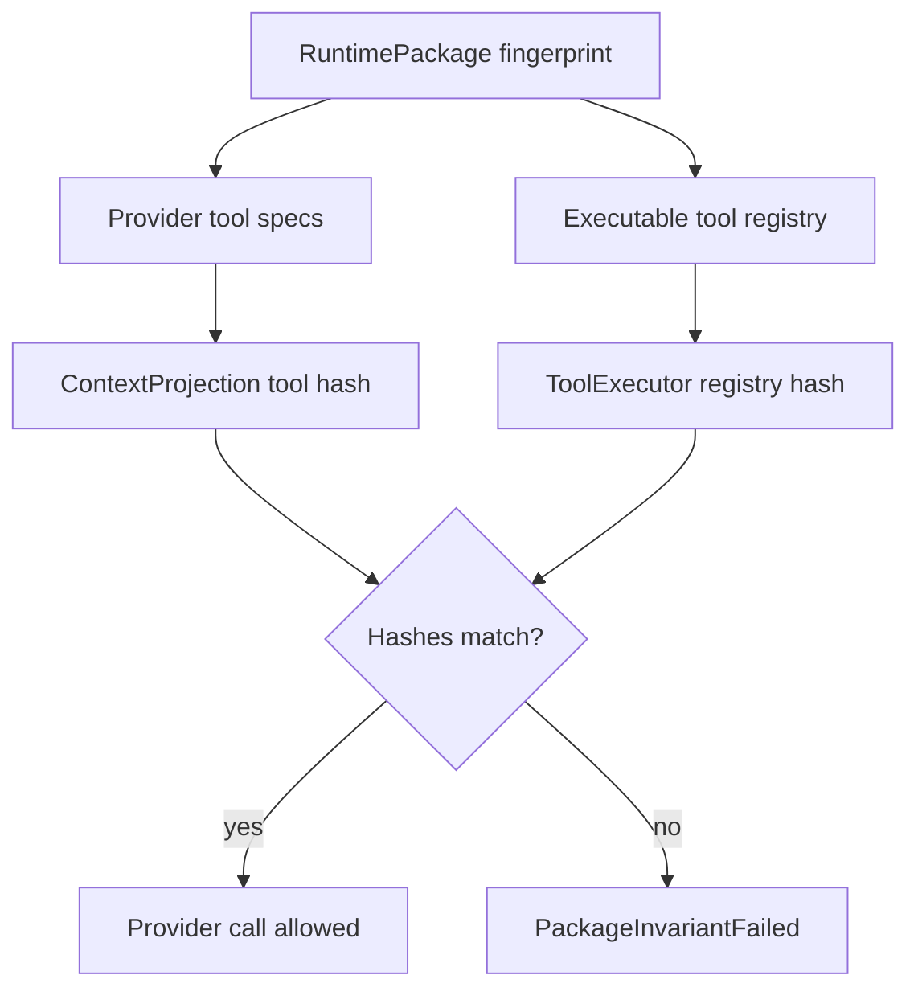

# Runtime Package Schema Contract

`RuntimePackage` is the immutable snapshot that binds what the model can see to what the runtime can execute. It prevents provider projection, tool execution, policy, hooks, and tracing from drifting during a run.

## Package And Capability Boundary

`RuntimePackage` is the canonical per-run snapshot. It should be small at the center and explicit at the edges:

- package fields hold provider route, policies, output contracts, delivery sinks, lifecycle defaults, and typed sidecar snapshots;
- `CapabilitySpec` describes callable or discoverable capabilities that may be projected to a provider or executed through a registry;
- feature-specific data lives in typed sidecar snapshots keyed by stable IDs;
- host-installed catalogs are captured as source-qualified snapshots before anything becomes active.

`CapabilitySpec` must not become the universal bag for every package concern. If a concept is not callable/discoverable, model-visible, or executable by a registry, it usually belongs in a typed package field or sidecar instead.

```rust
// Non-compiling contract sketch.
pub struct CapabilitySpec {
    pub capability_id: CapabilityId,
    pub kind: CapabilityKind,
    pub source: CapabilitySource,
    pub namespace: CapabilityNamespace,
    pub version: CapabilityVersion,
    pub visibility: CapabilityVisibility,
    pub projection: ProjectionMode,
    pub executor_ref: Option<ExecutorRef>,
    pub policy_ref: PolicyRef,
    pub sidecar_refs: Vec<PackageSidecarRef>,
    pub isolation_ref: Option<IsolationRequirementRef>,
    pub privacy: CapabilityPrivacy,
}

pub enum CapabilityKind {
    Tool,
    McpTool,
    McpResource,
    ToolDiscoveryCandidate,
    AgentAsTool,
    ExtensionAction,
    // Reserved feature-layer variants. They require typed sidecar contracts
    // before any adapter can project or execute them.
    StreamControl,
    RealtimeAction,
}

pub enum ProjectionMode {
    NotProjected,
    DescriptorOnly,
    ProviderToolSchema { schema_ref: SchemaRef },
    ProducesContextItems { allowed_kinds: Vec<ContextItemKind> },
    ProjectsContextRefs { allowed_ref_kinds: Vec<ContentRefKind> },
}
```

Rules:

- Provider-visible capabilities must use a projection mode other than `NotProjected`.
- Executable capabilities must have executor refs.
- Every capability has a policy ref.
- Hidden capabilities can be discovered but not projected until a next-package delta activates them.
- Namespaces prevent MCP, extension, host, built-in, and subagent collisions.
- `CapabilitySpec` is not an untyped bag. Each variant beyond the MVP profile must name a typed sidecar contract, owner role, fingerprint fields, emitted events, journal records, and acceptance tests before an adapter can emit or execute it.
- Variant-specific data lives in typed snapshots referenced by `CapabilitySpec`, not arbitrary per-feature maps.
- Provider route, output contracts, output delivery sinks, hook ordering, guardrails/policy checks, telemetry policy, child lifecycle defaults, and isolation requirements are package fields or sidecars unless they are exposed as callable/discoverable capabilities.

## Source-Qualified Catalog Snapshots

Catalog discovery is not package activation. Hosts may scan SDK tool packs, MCP servers, skills, extension manifests, package catalogs, or child-agent definitions, but the active runtime package records a bounded catalog snapshot before any candidate can be projected or executed.

```rust
// Non-compiling contract sketch.
pub struct CapabilityCatalogSnapshot {
    pub catalog_id: CatalogSnapshotId,
    pub source_kind: CapabilitySourceKind,
    pub source_ref: SourceRef,
    pub version: Option<CapabilityVersion>,
    pub content_hash: Option<ContentHash>,
    pub trust_state: TrustState,
    pub activation_policy_ref: PolicyRef,
    pub inherited_skill_policy: Option<InheritedSkillPolicy>,
    pub candidates: Vec<CapabilityId>,
}
```

Validation rejects stale static role/tool tables when a source-qualified catalog is required. Activation always creates a package delta for the next turn or run.

## MVP Capability Profile

The first Rust slice should support only the variants needed for a fake-provider text or typed run:

| Variant | Required in MVP | Purpose |
| --- | --- | --- |
| `Tool` | optional fake only | Proves provider-visible tool specs match executable routes. |
| `McpTool` / `McpResource` | reserved | Feature layer owned by tools/toolpack workstream. |
| `ToolDiscoveryCandidate` | reserved | Feature layer owned by tools/toolpack workstream. |
| `AgentAsTool` | reserved | Feature layer owned by subagent workstream. |
| `ExtensionAction` | reserved | Feature layer owned by extension workstream. |
| `StreamControl` | reserved | Feature layer owned by streaming workstream. |
| `RealtimeAction` | reserved | Feature layer owned by streaming/realtime workstream. |

Provider route is required in MVP, but it is a package field, not a `CapabilityKind`. Typed output is required for typed runs, but `OutputContract` is a package/run contract field, not a callable capability. Fake output delivery may be present through an output sink sidecar and `OutputSink` port, not a capability variant.

Reserved variants may appear in contract docs before implementation, but they cannot be projected, executed, or emitted by an adapter until their workstream supplies the typed sidecar contract and fixtures.

## Required Snapshot Fields

```rust
// Non-compiling contract sketch.
pub struct RuntimePackageCanonicalV1 {
    pub schema_version: u16,
    pub package_id: RuntimePackageId,
    pub agent: AgentSnapshot,
    pub provider_route: ProviderRouteSnapshot,
    pub provider_capabilities: ProviderCapabilitySnapshot,
    pub output_contracts: Vec<OutputContractSnapshot>,
    pub output_sinks: Vec<OutputSinkSnapshot>,
    pub capabilities: Vec<CapabilitySpec>,
    pub sidecars: Vec<PackageSidecarSnapshot>,
    pub catalogs: Vec<CapabilityCatalogSnapshot>,
    pub child_lifecycle: ChildLifecyclePolicySnapshot,
    pub policies: PolicySnapshot,
    pub fingerprint_inputs: FingerprintInputManifest,
}
```

The runtime may keep richer in-memory indexes for fast lookup, but this canonical DTO is the fingerprint source. Typed sidecars include, for example, tool-pack snapshots, isolation requirements, hook specs, stream rules, subagent definitions, extension core capability snapshots, telemetry policy, `PolicyStage` guardrail matrices, and output-delivery policy.

## Fingerprint Algorithm

1. Build `RuntimePackageCanonicalV1`.
2. Validate that provider-visible tool schemas have matching executable routes.
3. Sort maps and lists by stable keys:
   - provider route ID
   - canonical tool name
   - tool source ID
   - MCP server ID
   - hook ID
   - stream rule ID
   - subagent ID
   - extension ID
   - policy ID
   - sidecar ID
   - catalog snapshot ID
4. Serialize to canonical UTF-8 JSON or a named versioned canonical binary encoding.
5. Hash the bytes with an algorithm named in the fingerprint, for example `sha256:runtime-package-canonical-v1:<digest>`.

The algorithm name and schema version are part of the preimage.

## Included In Fingerprint

- Agent ID, name, and default behavior refs that change execution.
- Provider route ID, model ID, provider capability version, realtime capability version.
- Output contract schema IDs, validation policy, repair policy, and local validator version for typed runs.
- Output delivery sink IDs, delivery policy refs, dedupe policy, and sink capability versions.
- Provider-visible tool names, descriptions, input/output schemas, risk/effect metadata.
- Executable tool route IDs, source IDs, handler versions, and required permissions.
- Tool pack IDs, versions, and policies.
- MCP server IDs, exposed tool/resource/prompt names, namespace rules, and capability versions.
- Hook IDs, hook kinds, ordering, execution mode, queue/overflow policy, mutation rights, timeout policy, and source IDs.
- Stream rule IDs, versions, matchers, channels, actions, repeat policy, and privacy policy.
- Isolation requirement kind, required capability class/version, mount/network/secret policy hashes.
- Subagent IDs, route policy, context policy, tool policy, depth policy.
- Child lifecycle default policy, allowed policy refs, detach policy refs, and cleanup timeout policy.
- Extension IDs, versions, declared capabilities, action permissions, and browser-safe subpath declarations.
- Approval, permission, sandbox, autonomy, escalation, retention, and content-capture policy snapshots.
- Capability catalog source kind/ref/version/hash/trust/activation policy when catalog data affects active capabilities.

## Excluded From Fingerprint

- Run IDs, event IDs, timestamps, process IDs.
- Adapter health results.
- Cache hit state.
- Temporary paths.
- Telemetry sink health.
- Live approval request IDs.
- Provider token usage and dynamic model latency.
- Runtime-local queue sizes.

Host-specific workspace identity and mount policy may be included through stable host-provided IDs and policy hashes. Raw absolute paths should not make packages machine-unique unless the host explicitly chooses path-bound packages.

## Package Delta Contract

Active runtime packages are immutable. Discovery and activation create package deltas for next turn or next run.

```mermaid
sequenceDiagram
  participant Model
  participant Discovery as "ToolDiscoveryIndex"
  participant Package as "RuntimePackageBuilder"
  participant Journal as "RunJournal"
  participant Loop as "AgentLoop"

  Model->>Discovery: "search hidden tool"
  Discovery-->>Model: "candidate tool metadata"
  Model->>Loop: "request activation"
  Loop->>Journal: "PackageDeltaRequested"
  Loop->>Package: "build next snapshot"
  Package-->>Loop: "new fingerprint"
  Loop->>Journal: "PackageDeltaAccepted"
  Loop->>Loop: "apply next turn/run only"
```

Phase 2 may model package delta events as journal records before making them live events.

## Projection And Execution Invariant



If a tool is provider-visible, executable routing and policy must know how it will be handled. If a tool cannot execute, it must not be projected.

## Acceptance Tests

- `runtime_package_fingerprint_is_deterministic`
- `tool_schema_change_changes_fingerprint`
- `tool_route_change_changes_fingerprint`
- `policy_change_affecting_approval_changes_fingerprint`
- `stream_rule_change_changes_fingerprint`
- `isolation_policy_change_changes_fingerprint`
- `hook_spec_change_changes_fingerprint`
- `hook_execution_mode_or_queue_change_changes_fingerprint`
- `child_lifecycle_default_change_changes_fingerprint`
- `volatile_fields_do_not_change_fingerprint`
- `projection_and_execution_hashes_match`
- `projected_unexecutable_tool_fails_package_validation`
- `tool_discovery_activation_creates_next_snapshot_delta`
- `provider_visible_capability_requires_executor_and_policy_refs`
- `capability_projection_mode_controls_provider_visibility`
- `provider_route_is_package_field_not_capability_variant`
- `output_contract_is_package_or_run_field_not_capability_variant`
- `catalog_snapshot_records_source_trust_and_activation_policy`
- `mcp_extension_subagent_namespaces_do_not_collide`
- `hidden_discovery_candidate_is_not_projected_until_package_delta`
- `package_preset_lowers_to_canonical_capabilities`
- `package_builder_and_canonical_snapshot_have_same_fingerprint`
- `agent_on_hook_lowers_to_hook_spec_sidecar`
- `run_request_can_select_but_not_loosen_child_lifecycle_policy`
- `reserved_capability_variant_requires_sidecar_contract_before_execution`
- `mvp_package_profile_builds_without_reserved_feature_variants`

## Ergonomics

Simple API:

```rust
// Non-compiling contract sketch.
let package = RuntimePackage::for_agent(agent)
    .provider("openai:gpt-example")
    .output_contract(OutputContract::text())
    .output_sink(OutputSinkSpec::optional_fake())
    .tool_pack(ToolPackPreset::WorkspaceReadOnly)
    .stream_rule(StreamRule::mask_secret_defaults())
    .on(HookPoint::BeforeToolCall, AuditHook::new())
    .child_lifecycle(RunChildLifecyclePolicy::safe_defaults())
    .safe_defaults()
    .build()?;
```

Advanced API:

```rust
// Non-compiling contract sketch.
let package = RuntimePackageBuilder::new(RuntimePackageId::new("pkg_chat_1"))
    .agent(agent_snapshot)
    .provider_route(provider_route)
    .capability(read_tool_capability)
    .policy_snapshot(policy_snapshot)
    .build_canonical_v1()?;
```

Canonical lowering:

- `RuntimePackage::for_agent` creates a `RuntimePackageBuilder`.
- `.provider(...)` installs `ProviderRouteSnapshot` and provider capability metadata.
- `.output_contract(...)` installs an output contract snapshot or run-level override.
- `.output_sink(...)` installs an output sink sidecar.
- `.tool_pack(...)` expands into callable `CapabilitySpec` entries plus typed tool-pack sidecars.
- `.stream_rule(...)` installs a stream-rule sidecar and reserved stream-control capability only if the feature workstream has supplied its sidecar contract.
- `.on(...)` lowers into `HookSpec` sidecars and hook executor refs resolved before the run starts.
- `.child_lifecycle(...)` installs the package default and allowed run-level policy refs.
- `.safe_defaults()` installs conservative approval, content-capture, timeout, and telemetry policies.
- `.build()` returns the same `RuntimePackageCanonicalV1` used by the advanced builder.

Equivalence:

- Simple presets and advanced capabilities produce the same canonical snapshot shape.
- Fingerprinting, projection/execution validation, namespace checks, and package delta rules are identical.

SDK owns / Host owns:

- SDK owns preset lowering, canonical snapshot generation, validation, and fingerprinting.
- Host owns provider credentials, installed tools/extensions, and which presets are allowed for a product surface.

Tests:

- `package_preset_lowers_to_canonical_capabilities`
- `runtime_package_fingerprint_is_deterministic`
- `package_builder_and_canonical_snapshot_have_same_fingerprint`

## Complete Example

Typed shape:

```rust
// Non-compiling contract sketch.
let read_tool = CapabilitySpec {
    capability_id: CapabilityId::new("tool.workspace_read"),
    kind: CapabilityKind::Tool,
    source: CapabilitySource::SdkToolkit,
    namespace: CapabilityNamespace::new("sdk.workspace"),
    version: CapabilityVersion::semver("1.0.0"),
    visibility: CapabilityVisibility::Projected,
    projection: ProjectionMode::ProviderToolSchema { schema_ref: read_schema_ref },
    executor_ref: Some(ExecutorRef::tool("toolkit.workspace_read.v1")),
    policy_ref: PolicyRef::new("policy.readonly_workspace"),
    sidecar_refs: vec![PackageSidecarRef::tool_pack("sdk.workspace.readonly.v1")],
    isolation_ref: None,
    privacy: CapabilityPrivacy::ContentRefsOnly,
};

let package = RuntimePackageBuilder::new(RuntimePackageId::new("pkg_chat_1"))
    .agent(agent_snapshot)
    .provider_route(provider_route)
    .capability(read_tool)
    .policy_snapshot(policy_snapshot)
    .build_canonical_v1()?;
```

Replaceable ports:

- `RuntimePackageBuilder` accepts capabilities from SDK toolkit, MCP, extensions, host adapters, and subagent definitions.
- `ExecutorRef` points to a registry entry, not a concrete function pointer in the canonical snapshot.
- `ProjectionMode` can be swapped per provider capability while the executor route remains stable.

Wiring:

1. Host collects provider route, tools, hooks, stream rules, policies, and isolation requirements.
2. Builder validates projected capabilities have executor and policy refs.
3. Builder validates hook specs, child lifecycle defaults, and allowed detach policy refs.
4. Builder canonicalizes and fingerprints the snapshot.
5. Loop stores the fingerprint on every event and journal record.
6. Package deltas activate newly discovered capabilities only for the next turn/run.

Events:

- `InvariantFailed` if projection/execution hashes diverge.
- Package delta events may be modeled as journal records before becoming live events.

Journal:

- `RunRecord { runtime_package_fingerprint }`
- `ContextRecord { projection_id, projected_capability_hash }`
- `RecoveryRecord { invariant_id: PackageInvariantFailed }` if validation fails during resume.

Policies and failures:

- Hidden discovery candidates are not projected until a package delta is accepted.
- Namespace collision fails package validation.
- Fingerprint excludes volatile runtime state and includes every execution-affecting policy ref.
- Run requests may select or tighten child lifecycle policy only within package-declared bounds.
- Hook config and code-first hooks must lower into identical hook sidecar snapshots and executor refs.

SDK owns / Host owns:

- SDK owns canonical snapshot schema, deterministic fingerprinting, capability invariants, and package delta rules.
- Host owns which capabilities are installed, which provider credentials/routes exist, and when a discovered capability should be activated.

Tests:

- `runtime_package_fingerprint_is_deterministic`
- `projection_and_execution_hashes_match`
- `hidden_discovery_candidate_is_not_projected_until_package_delta`
- `hook_spec_change_changes_fingerprint`
- `child_lifecycle_default_change_changes_fingerprint`
