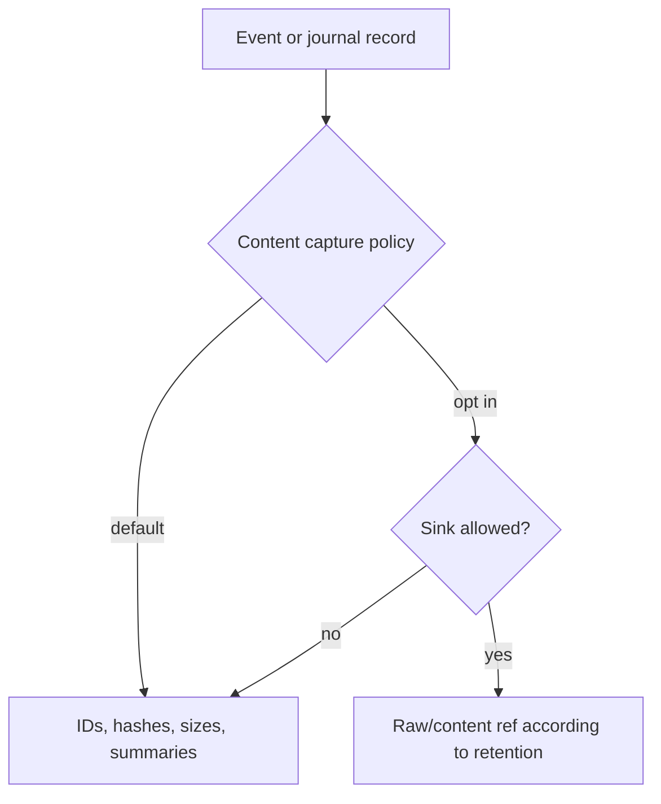

# Telemetry, Cost, And Privacy Contract

Telemetry is derived from events and journal records. It must be useful without raw prompt, model, tool, memory, or file content.

## External Lessons

OpenTelemetry GenAI separates traces, spans, events, metrics, usage, and errors. The SDK should use compatible naming where stable, but keep SDK-specific lineage fields under its own namespace until conventions settle.

## Sink Capability Matrix

| Sink | May receive raw content by default? | Durable? | Purpose |
| --- | --- | --- | --- |
| live UI event stream | no | no | immediate rendering |
| CLI renderer | no | no | terminal progress |
| RunJournal | content refs only | yes | audit/replay/recovery |
| OpenTelemetry exporter | no | sink-dependent | spans/metrics/logs |
| durable trace exporter | no | yes, host-owned | analytics and audit |
| local diagnostic log | no | bounded | debugging |
| content store | only by explicit policy | yes by retention | large/raw content refs |

A sink cannot request more raw content than the event/journal/content policy captured.

## Required Telemetry Fields

- run ID, trace ID, span ID
- runtime package fingerprint
- source/destination kinds
- provider/model IDs
- tool source/canonical name
- approval decision refs
- token/byte/media duration usage
- latency/duration
- retry classification
- terminal status
- cost units, currency, rate table version
- estimate vs provider-reported marker
- child-agent rollup refs

Provider account IDs, credential profile IDs, remote handles, and filesystem paths must be redacted, hashed, or replaced by host-approved stable aliases according to policy.

## Cost Accounting

Cost records are monotonic:

- initial estimates append `CostEstimated`
- provider-reported corrections append `CostCorrected`
- child-agent usage rolls up without losing child run IDs
- no record is silently mutated in place

Raw content is never required for cost accounting.

## Content Capture Policy



Opt-in capture must declare:

- scope
- retention window
- sink
- redaction policy
- approval marker if required
- whether child-agent and extension content is included

## Acceptance Tests

- `telemetry_sink_cannot_escalate_content_capture`
- `provider_account_ids_are_redacted_or_hashed_by_policy`
- `cost_accounting_runs_without_raw_prompt_tool_or_model_content`
- `model_usage_correction_appends_cost_corrected`
- `child_usage_rollup_preserves_child_run_id`
- `trace_export_uses_journal_records_not_display_events`
- `otel_sink_failure_does_not_fail_run`
- `safe_telemetry_defaults_lower_to_content_capture_off`
- `telemetry_helper_and_explicit_sink_emit_equivalent_usage_records`

## Ergonomics

Simple API:

```rust
// Non-compiling contract sketch.
let telemetry = TelemetryFanout::safe_defaults()
    .with_otel(otel_endpoint)
    .with_local_diagnostics()
    .build()?;
```

Advanced API:

```rust
// Non-compiling contract sketch.
let telemetry = TelemetryFanoutBuilder::new()
    .sink(TelemetrySinkSpec::otel(otel_endpoint).content_capture(ContentCaptureMode::Off))
    .sink(TelemetrySinkSpec::local_diagnostic().bounded_bytes(256 * 1024))
    .redactor(RedactionPolicyId::new("telemetry_default"))
    .cost_estimator(CostEstimatorRef::new("provider_rates_2026_05_23"))
    .build()?;
```

Canonical lowering:

- `safe_defaults()` lowers into `ContentCaptureMode::Off`, default redaction, bounded diagnostics, and non-blocking sink failure behavior.
- Sink helpers lower into `TelemetrySinkSpec` entries with content capability declarations.
- Cost helper lowers into explicit rate table and correction behavior.

Equivalence:

- Helper and explicit sink paths derive telemetry from the same events and journal records.
- Sink failure behavior, cost correction records, and raw-content denial are identical.

SDK owns / Host owns:

- SDK owns safe telemetry defaults, content-capture enforcement, usage/cost record semantics, and sink failure events.
- Host owns endpoints, rate tables, retention, trace storage, and dashboards.

Tests:

- `safe_telemetry_defaults_lower_to_content_capture_off`
- `telemetry_helper_and_explicit_sink_emit_equivalent_usage_records`
- `telemetry_sink_cannot_escalate_content_capture`

## Complete Example

Typed shape:

```rust
// Non-compiling contract sketch.
let telemetry = TelemetryRecordPayload {
    run_id,
    trace_id,
    span_id,
    runtime_package_fingerprint,
    source_kind: SourceKind::Desktop,
    destination_kind: DestinationKind::Provider,
    provider_id: Some(ProviderId::new("openai")),
    model_id: Some(ModelId::new("example-model")),
    usage: UsageUnits { input_tokens: 500, output_tokens: 80, media_ms: 0 },
    cost: CostUnits {
        amount: Decimal::new("0.0012"),
        currency: Currency::Usd,
        rate_table_version: RateTableVersion::new("2026-05-23"),
        estimate_status: EstimateStatus::ProviderReported,
    },
    content_capture: ContentCaptureMode::Off,
};

telemetry_fanout.record(telemetry).await;
```

Replaceable ports:

- `TelemetrySink` can be OTel, durable trace export, local diagnostic log, CLI summary, or test sink.
- `CostEstimator` can be provider-specific and can later append corrections.
- `Redactor` is policy-selected and runs before sink delivery.

Wiring:

1. Events and journal records produce telemetry projections.
2. Redaction/content policy strips raw content by default.
3. Cost estimator records initial estimate.
4. Provider usage correction appends a correction record.
5. Sink failures are recorded for repair replay.

Events:

- `UsageRecorded`
- `CostEstimated`
- `CostCorrected`
- `TelemetrySinkFailed`
- `TelemetrySinkRecovered`

Journal:

- `TelemetryRecord { usage }`
- `TelemetryRecord { cost estimate }`
- `TelemetryRecord { cost correction }`
- `RecoveryRecord { telemetry export repair }`

Policies and failures:

- Sink cannot request raw content that was not captured by policy.
- Account IDs, credential IDs, remote handles, and paths are hashed or aliased.
- Cost accounting works from usage metadata without prompt/tool/model content.

SDK owns / Host owns:

- SDK owns minimum telemetry fields, cost record semantics, content-capture enforcement, and sink failure events.
- Host owns rate tables, sink endpoints, trace storage, dashboard queries, and retention policy.

Tests:

- `telemetry_sink_cannot_escalate_content_capture`
- `model_usage_correction_appends_cost_corrected`
- `trace_export_uses_journal_records_not_display_events`
