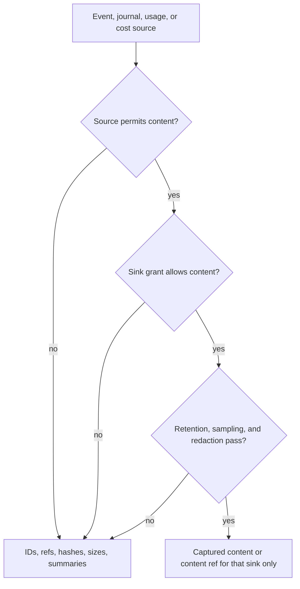

# Telemetry, Cost, And Privacy Contract

Telemetry is derived from `AgentEvent`, `RunJournal`, usage records, cost records, and `PolicyRef` / `PolicyDecisionRef` decisions. It must be useful without raw prompt, model, tool, memory, or file content, and it must never become durable run truth, a second event stream, or a second ledger.

## External Lessons

OpenTelemetry GenAI separates traces, spans, events, metrics, usage, and errors. The SDK should use compatible naming where stable, but keep SDK-specific lineage fields under its own namespace until conventions settle.

## Derived Authority Boundary

The SDK owns the derivation rules, not the sink's storage or dashboard semantics.

| Surface | Authority | Telemetry role |
| --- | --- | --- |
| `AgentEvent` | canonical live event vocabulary and envelope/filter surface | primary live projection input |
| `RunJournal` | durable run truth for replay, resume, recovery, terminal state, and side-effect audit | primary durable projection input and repair source |
| usage records | SDK-owned usage facts linked to model/tool/subagent attempts | metric and cost input |
| cost records | monotonic estimates, provider reports, corrections, and child rollups | cost metric/log input |
| policy decisions | source of approval, privacy, retention, redaction, and sink permission | export gate input |
| telemetry sink store | host or optional adapter storage | derived output only |

Rules:

- Telemetry can persist `TelemetryRecord` entries for usage, cost, sink health, correction, and export cursor repair.
- Telemetry cannot decide run state, terminal status, policy allow/deny, approval outcome, output delivery success, or side-effect completion.
- A telemetry projection must carry enough source refs to rederive or audit it: event IDs, journal cursors when available, usage/cost record refs, policy decision refs, redaction policy ID, privacy class, retention class, and runtime package fingerprint.
- Derived telemetry stores can be repaired or rebuilt from journals and source records. They cannot be used as the source of truth for replay or resume.

## Sink Capability Matrix

| Sink | Raw content by default? | Raw content opt-in? | Durable? | Purpose and authority |
| --- | --- | --- | --- | --- |
| live UI event stream | no | only if event policy and host UI sink permission allow it | no | immediate rendering; not analytics truth |
| CLI renderer | no | no for telemetry; CLI may separately render host-owned transcript content | no | terminal progress |
| RunJournal | no raw blobs; content refs only | content refs may point to policy-approved content store entries | yes | audit/replay/recovery authority |
| OpenTelemetry exporter | no | only with explicit content-capture grant for that sink | sink-dependent | spans/metrics/logs |
| durable trace exporter | no | only with explicit content-capture grant and retention | yes, host-owned | analytics/audit projection, not run truth |
| local diagnostic log | no | no unless a test-only policy opts in with bounded retention | bounded | debugging |
| content store | no implicit writes | yes by explicit content policy | yes by retention | large/raw content refs |

A sink cannot request more raw content than the event, journal, content, and sink policy captured. If policy is absent, ambiguous, expired, or narrower than the sink request, export falls back to IDs, refs, hashes, sizes, MIME hints, and redacted summaries.

## Content Capture Policy



Raw or large content capture is opt-in and denied unless every gate below passes:

- Source scope: event/journal/content source permits capture for the requested content class.
- Sink permission: `TelemetrySinkSpec` names the sink, content classes, and maximum access mode allowed.
- Redaction: a redaction policy runs before delivery and records `redaction_policy_id`.
- Retention: a retention class and retention window are declared before capture.
- Sampling: a deterministic sampling decision is recorded, including rate, key, and policy ref.
- Limits: byte, token, media-duration, media-count, and field-count limits are enforced before enqueue.
- Policy refs: privacy, retention, sink, redaction, and approval refs are carried in the projection.
- Child and extension scope: child-agent and extension content are excluded unless explicitly included.

Default capture includes IDs, roles, part kinds, MIME types, byte/token/media counts, hashes, policy decisions, status, latency, stop reasons, content refs, and bounded redacted summaries.

Default capture excludes raw user text, system/developer prompts, model output, hidden reasoning, tool arguments/results, memory bodies, remote message content, file bytes, process I/O, environment values, credentials, auth headers, and provider account identifiers.

Provider-redacted content stays redacted in every sink. Hidden chain-of-thought is not a telemetry content class.

## Fanout Backpressure

`TelemetryFanout` is a bounded, nonblocking projection path. Agent-loop code may enqueue telemetry projections, but it must not await network exporters or durable trace sinks on the hot path.

```rust
// Non-compiling contract sketch.
pub struct TelemetryFanoutConfig {
    pub queue_capacity: NonZeroUsize,
    pub terminal_reserve: NonZeroUsize,
    pub overflow: TelemetryOverflowPolicy,
    pub sink_isolation: TelemetrySinkIsolationPolicy,
    pub export_cursor: TelemetryExportCursorPolicy,
}

pub enum TelemetryOverflowPolicy {
    DropNonTerminalProgress,
    CoalesceProgressByRun,
    FailSinkNotRun,
}

pub enum TelemetrySinkIsolationPolicy {
    IsolateEachSink,
}
```

Rules:

- Terminal run status, terminal usage, cost correction, sink failure, sink recovery, and recovery cursor records get reserved queue capacity.
- Slow sinks can drop or coalesce non-terminal progress according to policy, but they cannot block provider streaming, tool execution, journal append, cancellation, or terminal sealing.
- Export workers drain fanout queues off-loop and append sink-health or repair records when export fails.
- Overflow emits `TelemetrySinkFailed` with `failure_kind = overflow` unless the stitching owner later accepts a separate `TelemetryOverflowed` event kind. The payload includes dropped counts, affected sink ID, terminal-preserved flag, and optional repair cursor.
- A sink cannot observe raw content merely because it is replaying a repair cursor; content capture remains policy-bound.
- One sink's queue overflow, network failure, serialization failure, or schema mismatch fails that sink only. Other sinks continue to drain from their own bounded queues.
- `BackpressureCaller` semantics are not allowed on the agent-loop telemetry hot path. Blocking export is allowed only in explicit host-owned maintenance or replay jobs.

## Terminal Preservation

Telemetry overflow policies can sacrifice progress detail, not terminal facts. The following projections are terminal-preserved:

- `RunCompleted`, `RunFailed`, and `RunCancelled` derived projections.
- final `ModelUsageRecorded` / `UsageRecorded` records for an attempt or run.
- `CostEstimated` and `CostCorrected` records that close a model/tool/subagent cost unit.
- `TelemetrySinkFailed` and `TelemetrySinkRecovered` sink health records.
- repair cursor records needed to re-export from a durable source.

If a terminal-preserved projection cannot be delivered to a sink queue, the SDK must append or derive a repairable sink-health record with the last acknowledged `TelemetryExportCursor` and an available `JournalCursor` / source record ref. The run continues.

## Retry And Repair Cursors

Telemetry uses a sink-scoped export cursor that is distinct from live event and journal cursors.

```rust
// Non-compiling contract sketch.
pub struct TelemetryExportCursor {
    pub sink_id: TelemetrySinkId,
    pub export_seq: u64,
    pub last_acknowledged_source: TelemetrySourceCursor,
    pub last_attempted_source: Option<TelemetrySourceCursor>,
    pub sink_dedupe_key: Option<DedupeKey>,
}

pub enum TelemetrySourceCursor {
    Journal(JournalCursor),
    Event(EventCursor),
    Archive(ArchiveCursor),
    Usage(UsageRecordRef),
    Cost(CostRecordRef),
}
```

Rules:

- Export cursors are acknowledged only after the sink reports success or idempotent duplicate acceptance.
- Retry starts after the last acknowledged source cursor and may replay from `RunJournal` or optional indexed archive when available.
- `EventCursor` can identify a live/buffered export source, but it is not a durable repair guarantee by itself; durable repair requires a `JournalCursor`, `ArchiveCursor`, usage record ref, or cost record ref.
- Repair replay may rebuild derived spans, metrics, logs, usage, cost, and sink health records. It must not execute providers, tools, output sends, memory writes, extension actions, workflow compensation, or product repairs.
- Raw/content-bearing repair export is allowed only while the original capture policy, redaction policy, sampling decision, sink permission, and retention window still allow it.
- If a sink cannot prove idempotent replay, repair emits a `TelemetrySinkFailed` record with `unsafe_pending_reason` and requires host action before re-export.

## Required Telemetry Fields

- run ID, trace ID, span ID
- event ID, event family/kind, and payload schema version when derived from an event
- journal cursor or source record ref when journal-backed
- runtime package fingerprint
- source/destination kinds
- privacy class, retention class, content-capture mode, redaction policy ID
- policy decision refs for privacy, retention, redaction, approval, sink permission, and sampling
- provider/model IDs
- tool source/canonical name
- approval decision refs
- token/byte/media duration usage
- latency/duration
- retry classification
- terminal status
- cost units, currency, rate table version
- estimate vs provider-reported marker
- child-agent rollup refs
- sink ID, sink kind, export cursor, export attempt ID, and sink failure/recovery state when relevant

Provider account IDs, credential profile IDs, remote handles, and filesystem paths must be redacted, hashed, or replaced by host-approved stable aliases according to policy.

## Cost Accounting

Cost records are monotonic:

- initial estimates append `CostEstimated`
- provider-reported corrections append `CostCorrected`
- child-agent usage rolls up without losing child run IDs
- no record is silently mutated in place

Raw content is never required for cost accounting.
Provider/tool cost records are SDK accounting primitives. Rate table ownership, billing UI, invoice reconciliation, budgets, alerts, and dashboards remain host-owned.

## Acceptance Tests

- `telemetry_sink_cannot_escalate_content_capture`
- `telemetry_content_capture_requires_redaction_retention_sampling_and_sink_permission`
- `telemetry_content_capture_denies_expired_retention_on_repair`
- `provider_account_ids_are_redacted_or_hashed_by_policy`
- `cost_accounting_runs_without_raw_prompt_tool_or_model_content`
- `model_usage_correction_appends_cost_corrected`
- `child_usage_rollup_preserves_child_run_id`
- `trace_export_uses_journal_records_not_display_events`
- `trace_export_cannot_replace_run_journal_truth`
- `otel_sink_failure_does_not_fail_run`
- `slow_telemetry_sink_overflow_does_not_block_run`
- `terminal_usage_record_survives_overflow`
- `telemetry_terminal_run_status_survives_overflow_or_gets_repair_cursor`
- `telemetry_export_cursor_is_distinct_from_event_and_journal_cursor`
- `telemetry_repair_replay_does_not_execute_side_effects`
- `telemetry_sink_failure_isolates_one_sink`
- `safe_telemetry_defaults_lower_to_content_capture_off`
- `telemetry_helper_and_explicit_sink_emit_equivalent_usage_records`

## Ergonomics

Simple API:

```rust
// Non-compiling contract sketch.
let telemetry = TelemetryFanout::safe_defaults()
    .with_otel(otel_endpoint)
    .with_local_diagnostics()
    .build()?;
```

Advanced API:

```rust
// Non-compiling contract sketch.
let telemetry = TelemetryFanoutBuilder::new()
    .sink(TelemetrySinkSpec::otel(otel_endpoint).content_capture(ContentCaptureMode::Off))
    .sink(TelemetrySinkSpec::local_diagnostic().bounded_bytes(256 * 1024))
    .redactor(RedactionPolicyId::new("telemetry_default"))
    .cost_estimator(CostEstimatorRef::new("provider_rates_2026_05_23"))
    .build()?;
```

Canonical lowering:

- `safe_defaults()` lowers into `ContentCaptureMode::Off`, default redaction, bounded diagnostics, sink-isolated queues, terminal reserve, and non-blocking sink failure behavior.
- Sink helpers lower into `TelemetrySinkSpec` entries with content capability declarations.
- Cost helper lowers into explicit rate table and correction behavior.

Equivalence:

- Helper and explicit sink paths derive telemetry from the same events, journal records, usage records, cost records, and policy decision refs.
- Sink failure behavior, cost correction records, and raw-content denial are identical.

SDK owns / Host owns:

- SDK owns safe telemetry defaults, content-capture enforcement, usage/cost record semantics, and sink failure events.
- Host owns endpoints, rate tables, retention, trace storage, and dashboards.

Tests:

- `safe_telemetry_defaults_lower_to_content_capture_off`
- `telemetry_helper_and_explicit_sink_emit_equivalent_usage_records`
- `telemetry_sink_cannot_escalate_content_capture`

## Complete Example

Typed shape:

```rust
// Non-compiling contract sketch.
let telemetry = TelemetryRecordPayload {
    run_id,
    trace_id,
    span_id,
    runtime_package_fingerprint,
    source_kind: SourceKind::Desktop,
    destination_kind: DestinationKind::Provider,
    provider_id: Some(ProviderId::new("openai")),
    model_id: Some(ModelId::new("example-model")),
    usage: UsageUnits { input_tokens: 500, output_tokens: 80, media_ms: 0 },
    cost: CostUnits {
        amount: Decimal::new("0.0012"),
        currency: Currency::Usd,
        rate_table_version: RateTableVersion::new("2026-05-23"),
        estimate_status: EstimateStatus::ProviderReported,
    },
    content_capture: ContentCaptureMode::Off,
};

telemetry_fanout.try_record(telemetry)?;
```

Replaceable ports:

- `TelemetrySink` can be OTel, durable trace export, local diagnostic log, CLI summary, or test sink.
- `CostEstimator` can be provider-specific and can later append corrections.
- `Redactor` is policy-selected and runs before sink delivery.
- `TelemetryExporter` and `TelemetryRepairJob` are replaceable sink workers over the same export cursor contract.

Wiring:

1. Events and journal records produce telemetry projections.
2. Redaction/content policy strips raw content by default.
3. Cost estimator records initial estimate.
4. Provider usage correction appends a correction record.
5. Export workers drain sink-isolated queues off-loop.
6. Sink failures are recorded with export cursors for repair replay.

Events:

- `UsageRecorded`
- `CostEstimated`
- `CostCorrected`
- `TelemetrySinkFailed`
- `TelemetrySinkRecovered`

Journal:

- `TelemetryRecord { usage }`
- `TelemetryRecord { cost estimate }`
- `TelemetryRecord { cost correction }`
- `RecoveryRecord { telemetry export repair }`

Policies and failures:

- Sink cannot request raw content that was not captured by policy.
- Raw content capture requires redaction, retention, sampling, and sink permission.
- Account IDs, credential IDs, remote handles, and paths are hashed or aliased.
- Cost accounting works from usage metadata without prompt/tool/model content.
- Slow sinks cannot block the run loop; overflow preserves terminal usage/cost records.
- Sink failure isolates the sink and records export cursor state for retry/repair.
- Repair replay never executes providers, tools, output sends, memory writes, extensions, or host compensation.

SDK owns / Host owns:

- SDK owns minimum telemetry fields, cost record semantics, content-capture enforcement, and sink failure events.
- Host owns rate tables, sink endpoints, trace storage, dashboard queries, retention policy configuration, billing UX, and trace-store storage policy.

Tests:

- `telemetry_sink_cannot_escalate_content_capture`
- `telemetry_content_capture_requires_redaction_retention_sampling_and_sink_permission`
- `model_usage_correction_appends_cost_corrected`
- `trace_export_uses_journal_records_not_display_events`
- `slow_telemetry_sink_overflow_does_not_block_run`
- `terminal_usage_record_survives_overflow`

## Phase 04c Validation Evidence And Review Packet

This packet is recorded in the contract because the Phase 04c launch and owner-role docs restrict writable files to this contract and [otel-mapping-contract.md](otel-mapping-contract.md); the launch doc itself remains read-only for this worker.

Changed files:

- `docs/contracts/otel-mapping-contract.md`
- `docs/contracts/telemetry-privacy-contract.md`

Tests/fixtures:

- Documentation-only goal; no Rust source, executable tests, package manifests, or fixtures were created.
- Future fixtures/tests named by this contract: OTel golden spans/logs, redaction/content-capture matrix tests, sink failure/overflow tests, usage/cost fixtures, fanout overflow tests, and export-cursor repair tests.

Commands run:

- `git diff --check -- docs/contracts/otel-mapping-contract.md docs/contracts/telemetry-privacy-contract.md` (passed)
- `git diff --check` (passed across current worktree diff)
- `git branch --show-current` (confirmed `main`; no branch created)
- `git diff --name-only -- docs/contracts/otel-mapping-contract.md docs/contracts/telemetry-privacy-contract.md` (confirmed only allowed contract files changed)
- `rg -n "Projection Authority|Phase 04 Emitted-Kind Mapping|Content Capture Policy|Terminal Preservation|Retry And Repair Cursors|TelemetryOverflowed|Phase 04c Validation Evidence" docs/contracts/otel-mapping-contract.md docs/contracts/telemetry-privacy-contract.md` (confirmed required sections and proposal marker)
- `command -v markdownlint` (not installed)

Skipped tests and why:

- Rust compile/unit/golden fixture commands are skipped because this task is documentation-only and no SDK crate or fixture tree is in scope for this goal.
- Markdown lint was not run because `markdownlint` is not installed in the workspace environment.

Events/journal/telemetry touched:

- `AgentEvent` remains the live event source.
- `RunJournal` remains durable run truth and repair source.
- `TelemetryRecord` is limited to usage, cost, sink health, correction, and export cursor repair.
- OTel projections map Phase 04 emitted kinds and defer Phase 05 feature-layer families to their owners.

SDK-owned boundaries preserved:

- SDK owns projection rules, redaction/content-capture enforcement, minimum usage/cost fields, sink failure events, fanout overflow semantics, and export cursor repair semantics.
- SDK does not delegate run truth, replay authority, side-effect status, policy decisions, or terminal state to telemetry sinks.

Host-owned boundaries preserved:

- Host owns sink endpoints, collector credentials, trace-store retention/storage, rate tables, billing/product dashboards, product UI, channel copy, and unsafe repair approval.

Primitive-lowering evidence:

- Telemetry derives from `AgentEvent`, `RunJournal`, usage/cost records, `RuntimePackage` fingerprint, `SourceRef` / `DestinationRef`, privacy/retention classes, and policy decision refs.
- Safe helpers lower into explicit `TelemetrySinkSpec`, redaction, content-capture, fanout queue, terminal reserve, and export cursor settings.
- No telemetry-only event stream, ledger, package registry, policy path, or side-effect path is introduced.

Simplicity notes:

- Common path remains `TelemetryFanout::safe_defaults().with_otel(...).build()?` with content capture off and sink-isolated nonblocking queues.
- Raw content capture is advanced-only and requires one explicit grant shape instead of sink-specific exceptions.

Cross-cutting proposal blocks:

- Proposal 04c-1: Reconcile `TelemetryOverflowed`. This contract uses existing `TelemetrySinkFailed` with `failure_kind = overflow` because `TelemetryOverflowed` is not in the stable event taxonomy. Stitching may either keep overflow as a payload reason or accept a new event kind with event-schema fixture requirements.
- Proposal 04c-2: Confirm Phase 05 emitted-kind mapping owners. OTel mapping defers `stream_rule`, `realtime`, `isolation`, `child_lifecycle`, `subagent`, and `extension` family projections until those owners provide emitted-kind fixtures and redaction cases.

Review packet:

Primitive decision:

- Reused kernel primitives: `AgentEvent`, `RunJournal`, `TelemetryRecord`, `UsageRecorded`, `CostEstimated`, `CostCorrected`, `PolicyRef`, `SourceRef`, `DestinationRef`, `ContentRef`, `EventCursor`, `JournalCursor`, `ArchiveCursor`, and sink-scoped `TelemetryExportCursor`.
- New feature-layer primitives: none.
- New capability variants: none.
- Host-owned behavior kept out: dashboards, trace storage, billing UX, collector credentials, retention configuration, and product repair/compensation.

Validation evidence:

- Contract/unit tests: named future tests for redaction, fanout, sink failure, usage/cost, and export cursor repair.
- Golden fixtures: named future OTel span/log fixtures and Phase 04 emitted-kind fixture audit.
- Smoke/scenario tests: named future repair replay and sink isolation tests.
- Docs audits: docs-only boundary, primitive-lowering, product-neutrality, raw-content opt-in, terminal preservation, and Phase 05 deferral audit.

Reviewer checklist:

- Simplicity: PASS. Safe defaults keep content off, queues bounded, and sinks isolated.
- Product-neutrality: PASS. No product host, dashboard, channel UX, or billing behavior enters SDK core.
- Event/journal durability: PASS. Telemetry remains derived and repairable from journal/source refs.
- Privacy/redaction: PASS. Raw content requires redaction, retention, sampling, sink permission, and policy refs.
- Replay/idempotency: PASS. Export cursors are sink-scoped and repair replay does not execute external side effects.
- Capability fingerprint impact: PASS. No new `CapabilitySpec` variant; telemetry policy remains package/policy sidecar material.
