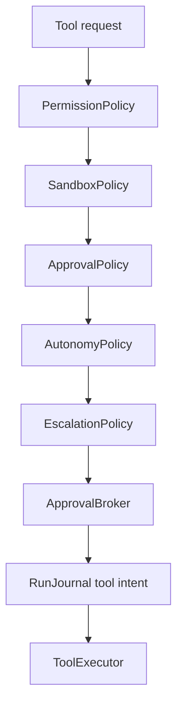
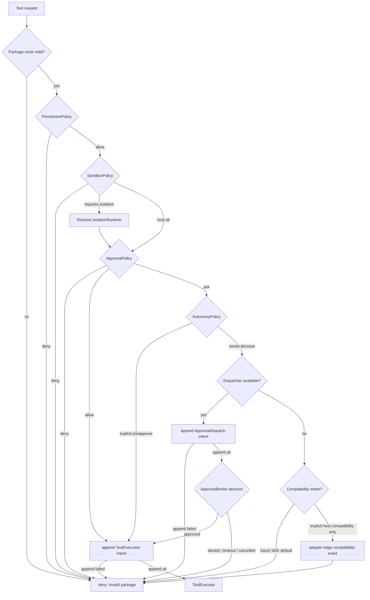
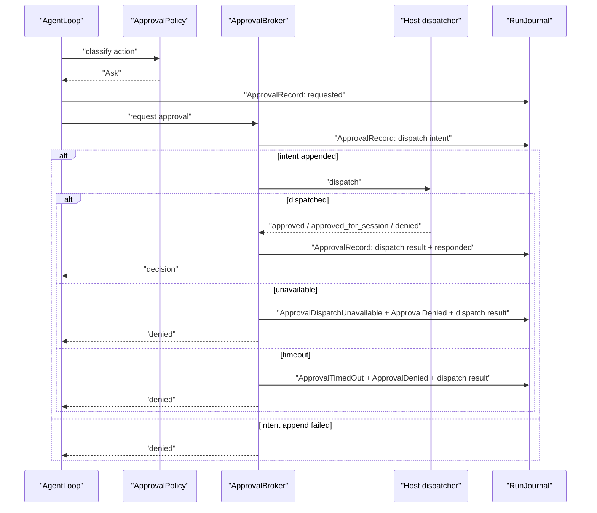

# Tool Approval And Policy Contract

Approval is a broker/policy contract, not a UI event. This contract defines one SDK decision model while preserving host-owned compatibility adapters.

## External Lessons

- Strands makes tool execution observable through before/after hooks and tool events. The SDK should keep that visibility but encode mutation rights as typed responses.
- Claude Agent SDK treats permission mode as explicit configuration. The SDK should do the same while keeping richer host approval transports behind ports.
- Cursor separates agent runs from product UI. The SDK should never assume desktop approval transport.
- Host products commonly have existing approval pipelines. Implementation should map those into SDK ports instead of inventing product prompt paths in core.

## Policy Layers



Layers are separate because they answer different questions:

| Layer | Question | Example |
| --- | --- | --- |
| `PermissionPolicy` | May this source use this capability at all? | extension cannot access filesystem |
| `SandboxPolicy` | Where and how may this action execute? | shell requires isolated container |
| `ApprovalPolicy` | Does this action need a decision? | write file asks user |
| `AutonomyPolicy` | Is this action preapproved by explicit mode/scope? | YOLO allows within policy |
| `EscalationPolicy` | Is a host dispatcher required, and what finite response policy applies? | source-scoped approval requires host dispatcher |
| `ApprovalDispatcher` | Host-owned delivery and reply collection port. | desktop prompt, CLI prompt, remote channel |
| `ApprovalBroker` | Own pending request lifecycle and decision attribution. | request/timeout/respond |

Tool execution is also an auditable effect path. Every resolved tool call, including read-only calls, must append an `EffectIntent { kind: ToolExecution }` or a `ToolRecord { intent }` that maps one-to-one to the common effect fields before the executor starts. Terminal tool records must contain or map to `EffectResult` for completed, failed, timed-out, cancelled, denied-before-execution, and unknown-status outcomes. Read-only status affects approval defaults and mutation metadata; it does not remove the intent/result audit requirement.

Approval dispatch is an externally visible side-effect path when it contacts a host/user channel. `ApprovalRecord { dispatch_intent }` must contain or map one-to-one to `EffectIntent { kind: ApprovalDispatch }` before an `ApprovalDispatcher` is called. `ApprovalRecord { dispatch_result }` must contain or map one-to-one to `EffectResult` for dispatched, unavailable, timed-out, cancelled, denied, and unknown dispatcher outcomes. A policy preapproval that does not contact a dispatcher records a policy decision but does not create an approval-dispatch effect.

## Tool Call Lifecycle

A model, host, extension, MCP, or subagent tool request is not executable until it resolves against the active `RuntimePackage` snapshot. Resolution requires typed IDs and refs from the package, not string matching or ambient lookup:

- `ToolCallId`, `CapabilityId`, canonical tool name, namespace, and schema refs from the provider-visible `CapabilitySpec`;
- `SourceRef` for the requester and tool source, plus `DestinationRef::tool(...)` for the executor boundary;
- `ExecutorRef`, `PolicyRef`s, optional `IsolationRequirementRef`, and package sidecar refs from the same runtime-package fingerprint;
- requested argument `ContentRef`s or redacted argument summaries, never raw default telemetry payloads.

The canonical lifecycle is:

1. Resolve the provider/host request against the active `RuntimePackage` and append a `ToolRecord { requested }` plus an `AgentEvent` such as `ToolRequested` with typed subject and related refs.
2. Run `PreTool` policy stages using package policy snapshots. Missing policy snapshot, missing `PolicyRef`, missing permission/sandbox evaluator, unknown capability, or missing executor ref fails closed before any approval prompt or executor start.
3. When policy returns `Ask`, use the `ApprovalBroker` and host `ApprovalDispatcher` rules below. Dispatcher calls are approval-dispatch effects: missing dispatcher, dispatch-intent append failure, timeout, cancellation, invalid finite token, or extension self-response records denial and prevents executor start.
4. Append `ToolRecord { intent }` containing or mapping to `EffectIntent { kind: ToolExecution }` after allow/approval and after any dispatcher terminal result is durably recorded, before any executor, adapter, file, process, network, memory, MCP, or extension call. Intent append failure fails closed and the executor is not invoked.
5. Invoke only the package-resolved `ToolExecutor` route. No tool pack, MCP server, extension, hook, or host helper may call a side-effecting implementation outside this route.
6. Append `ToolRecord { result }` containing or mapping to `EffectResult` for every terminal outcome. If the executor reports an external operation but terminal append fails, recovery treats the run as pending/unsafe before another non-idempotent side effect can start.
7. Run `PostTool` policy before tool output becomes a `ContextContribution`, final output, telemetry detail, or delivery payload. Tool output with inspectable content is represented by `ContentRef` plus redacted summary until a later policy-admitted projection uses it.

Mutating tools additionally record side-effect family metadata such as `EffectKind::FileWrite`, `EffectKind::ProcessStart`, `EffectKind::ProcessSignal`, `EffectKind::MemoryWrite`, or `EffectKind::OutputDelivery` when applicable, but those records wrap or map to the same `EffectIntent` / `EffectResult` spine. They must include idempotency or dedupe keys where available, reconciliation metadata for unknown/crash windows, and explicit non-reversible markers when no safe inverse candidate exists.

## Policy Stages

Guardrails and policy checks are stage-scoped. A package may install stage policy sidecars, but all stages use the same finite `PolicyDecision` model and journaled decision records.

```rust
// Non-compiling contract sketch.
pub enum PolicyStage {
    Input,
    ModelInputProjection,
    PreTool,
    PostTool,
    Output,
    Handoff,
    Stream,
    Delivery,
}
```

Rules:

- `Input` gates host/user input before it becomes an `AgentMessage`.
- `ModelInputProjection` gates `ContextProjection` before provider calls.
- `PreTool` gates tool execution before approval/executor paths.
- `PostTool` gates tool results before they become context candidates or output.
- `Output` gates final messages and typed output before terminal result publication.
- `Handoff` gates subagent, extension, or parent/child context handoff.
- `Stream` gates stream-rule interventions and realtime interruption decisions.
- `Delivery` gates externally visible output sink dispatch.
- Every stage decision records `PolicyDecision`, `PolicyStage`, subject/related `EntityRef`s, policy refs, privacy/retention class, and redacted summary.
- Stage policy cannot be provider-owned. Provider-native guardrails may be useful signals, but the SDK/host policy record remains authoritative.

Acceptance tests must include a policy-stage matrix for each implemented feature path. At minimum, tool work must cover `PreTool` and `PostTool`; context projection work must cover `ModelInputProjection`; output delivery must cover `Delivery`; subagent work must cover `Handoff`; streaming work must cover `Stream`.

## Policy Precedence And Compatibility

Precedence is deterministic:

1. Validate runtime package, capability route, executor ref, sidecar refs, and policy refs.
2. `PermissionPolicy` denies unavailable capabilities before any autonomy/preapproval.
3. `SandboxPolicy` denies or requires isolation before any approval prompt.
4. `ApprovalPolicy` classifies allow/deny/ask/modify/defer/interrupt.
5. `AutonomyPolicy` may preapprove only actions that passed permission and sandbox checks.
6. `EscalationPolicy` decides whether a host `ApprovalDispatcher` is required and which finite tokens are valid.
7. `RunJournal` appends approval dispatch intent when a dispatcher is required.
8. Host `ApprovalDispatcher` delivers the request and collects replies when configured.
9. `ApprovalBroker` owns pending decision lifecycle and terminal dispatch result recording.
10. `RunJournal` appends the tool execution intent.
11. `ToolExecutor` runs only after allow or approval and successful intent append.



Fail-open behavior is a host compatibility mode, not an SDK default. A host adapter must make the mode explicit with a policy ID, event, and compatibility note.

SDK core validation rejects absent policy snapshots, absent policy refs, missing dispatchers when escalation requires one, missing executor refs, unresolved isolation requirements, and journal append failures. Compatibility modes can be adapter-owned bridges for existing hosts, but they cannot turn a missing SDK dispatcher or policy into an allow decision inside core. A compatibility adapter that chooses to preserve older behavior must synthesize an explicit policy/dispatcher result at the adapter edge before the request enters the SDK path, emit its compatibility event, and still use the journaled approval-dispatch and tool intent/result paths before any executor starts.

Compatibility fields:

- `compatibility_mode_id`
- `current_behavior`
- `target_behavior`
- `owner`
- `kill_switch`
- `compatibility_gate`
- `event_kind_on_use`

## Decision Enum

The SDK decision enum is finite:

```rust
// Non-compiling contract sketch.
pub enum PolicyDecision {
    Allow { reason: DecisionReason },
    Deny { reason: DecisionReason },
    Ask { approval: ApprovalRequestSpec },
    Modify { modification: ToolRequestModification },
    Defer { resume_policy: ResumePolicy },
    Interrupt { reason: DecisionReason },
}
```

Compatibility adapter mapping:

| Current term | SDK mapping |
| --- | --- |
| `Allow` | `PolicyDecision::Allow` |
| `Deny` | `PolicyDecision::Deny` |
| `Ask` | `PolicyDecision::Ask` |
| `approve` | `ApprovalDecision::Approved` |
| `approve_for_session` | `ApprovalDecision::ApprovedForSession` |
| `deny` | `ApprovalDecision::Denied` |
| `toolApprovalMode: yolo` | `AutonomyPolicy` yields explicit allow with risk/audit metadata |

The SDK target is fail-closed for missing dispatchers. Any compatibility path that fails open must stay in host adapters until a reviewed compatibility plan flips it.

## Approval Request Schema

Required fields:

- `approval_request_id`
- `approval_dispatch_effect_id` when a dispatcher is required
- `run_id`
- `turn_id`
- `tool_call_id`
- `source`
- `destination`
- `canonical_tool_name`
- `tool_source`
- `effect_class`
- `risk_class`
- `requested_args_ref`
- `redacted_args_summary`
- `policy_refs`
- `dispatcher_scope`
- `timeout_ms`
- `allowed_decisions`
- `created_at`
- `runtime_package_fingerprint`

Extensions may submit or observe an action, but they cannot answer their own approval.

## Dispatcher Semantics



Rules:

- Missing dispatcher denies in the future SDK.
- Missing policy, missing policy ref, missing executor ref, approval-dispatch intent append failure, approval-dispatch terminal-result append failure, or tool intent append failure denies/fails closed before executor start.
- Dispatcher timeout denies.
- If a dispatcher may have contacted a host/user channel but its terminal result cannot be appended, the run enters recovery and no tool execution intent may be appended until the approval dispatch is reconciled or denied by policy.
- Cancellation closes pending request and prevents tool execution.
- Source-scoped remote runs use the source-approved channel or configured host escalation only.
- Voice/out-of-band decisions require exact finite tokens. No synonym guessing.
- UI copy is host-owned. The SDK supplies structured request data.

## Acceptance Tests

- `approval_precedence_denies_before_autonomy_and_dispatch`
- `missing_policy_ref_denies_before_tool_start`
- `missing_executor_ref_denies_before_tool_start`
- `tool_intent_append_failure_prevents_executor_start`
- `approval_dispatch_intent_append_failure_prevents_dispatch_and_tool_start`
- `approval_dispatch_result_append_failure_blocks_tool_start_until_reconciled`
- `approval_dispatch_records_effect_intent_and_result_before_tool_intent`
- `read_tool_records_intent_and_result_even_without_approval`
- `headless_no_escalation_uses_configured_compatibility_mode_not_ambient_fail_open`
- `headless_missing_dispatcher_denies`
- `agent_sdk_core_cannot_send_out_of_band_approval`
- `dispatcher_timeout_records_timeout_then_denied`
- `extension_cannot_answer_own_approval`
- `voice_approval_accepts_only_exact_finite_tokens`
- `autonomy_mode_still_records_policy_decision`
- `approval_cancel_prevents_tool_start`
- `compat_approve_for_session_maps_at_adapter_edge`
- `tool_risk_comes_from_metadata_not_name_matching`
- `desktop_transport_failure_uses_explicit_compat_policy_not_sdk_default`

## Complete Example

Typed shape:

```rust
// Non-compiling contract sketch.
let request = ApprovalRequestSpec {
    approval_request_id: ApprovalRequestId::new(),
    approval_dispatch_effect_id: Some(EffectId::new()),
    run_id,
    turn_id,
    tool_call_id,
    source: SourceRef::remote_channel("channel_1"),
    destination: DestinationRef::tool("workspace_write"),
    canonical_tool_name: CanonicalToolName::new("workspace_write"),
    tool_source: SourceRef::sdk_toolkit("workspace_edit_pack"),
    effect_class: EffectClass::Write,
    risk_class: RiskClass::High,
    requested_args_ref: ContentRef::new("tool_args/redacted_1"),
    redacted_args_summary: "write docs/notes.md".into(),
    policy_refs: vec![PolicyRef::new("approval.write_file")],
    dispatcher_scope: DispatcherScope::SourceScoped,
    timeout_ms: 120_000,
    allowed_decisions: vec![ApprovalDecisionKind::Approved, ApprovalDecisionKind::Denied],
    created_at,
    runtime_package_fingerprint,
};

let decision = approval_broker.request(request).await?;
```

Replaceable ports:

- `PermissionPolicy`, `SandboxPolicy`, `ApprovalPolicy`, `AutonomyPolicy`, and `EscalationPolicy` are independent evaluators.
- `ApprovalDispatcher` is a host-owned transport port for desktop, CLI, remote, or headless delivery.
- `ApprovalBroker` owns pending lifecycle, timeout, attribution, and finite decision validation; it does not send out-of-band messages itself.
- Host compatibility modes are explicit policies, not core defaults.

Wiring:

1. Tool request resolves against the active runtime package and records `ToolRequested`.
2. Permission and sandbox rules run before autonomy.
3. Approval policy returns `Ask`.
4. Broker appends `ApprovalRecord { dispatch_intent }` with `EffectIntent { kind: ApprovalDispatch }`.
5. Broker dispatches to source-scoped host channel only after the dispatch intent append succeeds.
6. Broker appends `ApprovalRecord { dispatch_result }` with `EffectResult` and the finite decision.
7. Approved decision releases journal tool-intent append.
8. Successful tool-intent append releases `ToolExecutor`; denied/timeout/append failure returns a denied or failed tool result by policy.

`AgentEvent` variants:

- `ToolRequested`
- `ToolApprovalRequired`
- `ApprovalRequested`
- `ApprovalDispatched`
- `ApprovalResponded` or `ApprovalTimedOut`
- `ApprovalDenied`
- `ToolStarted` only after allow/approval and effect intent append

`RunJournal` records:

- `ToolRecord { requested }` for every resolved call
- `ApprovalRecord { requested }`
- `ApprovalRecord { dispatch_intent }` with `EffectIntent { kind: ApprovalDispatch }` before host dispatcher access
- `ApprovalRecord { dispatch_result }` with `EffectResult` for dispatched, responded, timed out, unavailable, cancelled, denied, or unknown dispatcher outcome
- `ApprovalRecord { responded | timed_out | denied }` after the terminal dispatch result
- `ToolRecord { intent }` with `EffectIntent { kind: ToolExecution }` only after allow/approval and before executor start
- `ToolRecord { result }` with `EffectResult` after executor completion, failure, timeout, cancellation, or unknown status

Policies and failures:

- Missing dispatcher denies in the SDK default.
- Missing policy snapshots, policy refs, executor refs, approval-dispatch append, approval terminal-result append, or tool-intent journal append denies/fails closed before executor start.
- Headless runs require configured escalation or explicit compatibility mode.
- Cancellation closes pending approval and prevents tool start.
- Extensions cannot answer approvals for their own actions.

SDK owns / Host owns:

- SDK owns policy precedence, approval request schema, finite decision model, approval-dispatch intent/result mapping, timeout/cancel semantics, and journal/event records.
- Host owns approval UI/copy, remote yes/no transport, source-scoped identity proof, and any temporary fail-open compatibility policy.

Tests:

- `approval_precedence_denies_before_autonomy_and_dispatch`
- `headless_missing_dispatcher_denies`
- `missing_policy_ref_denies_before_tool_start`
- `tool_intent_append_failure_prevents_executor_start`
- `approval_dispatch_records_effect_intent_and_result_before_tool_intent`
- `approval_dispatch_result_append_failure_blocks_tool_start_until_reconciled`
- `read_tool_records_intent_and_result_even_without_approval`
- `approval_cancel_prevents_tool_start`
