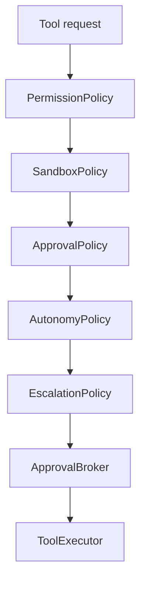
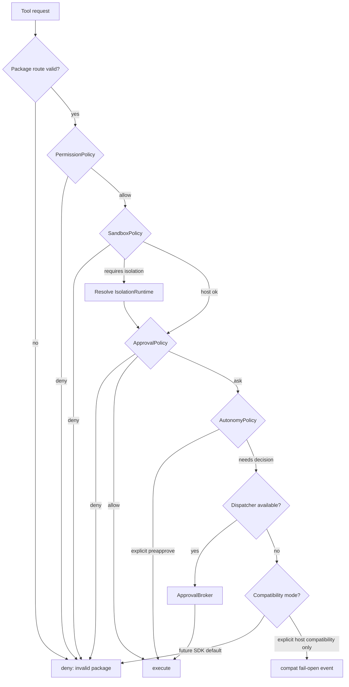
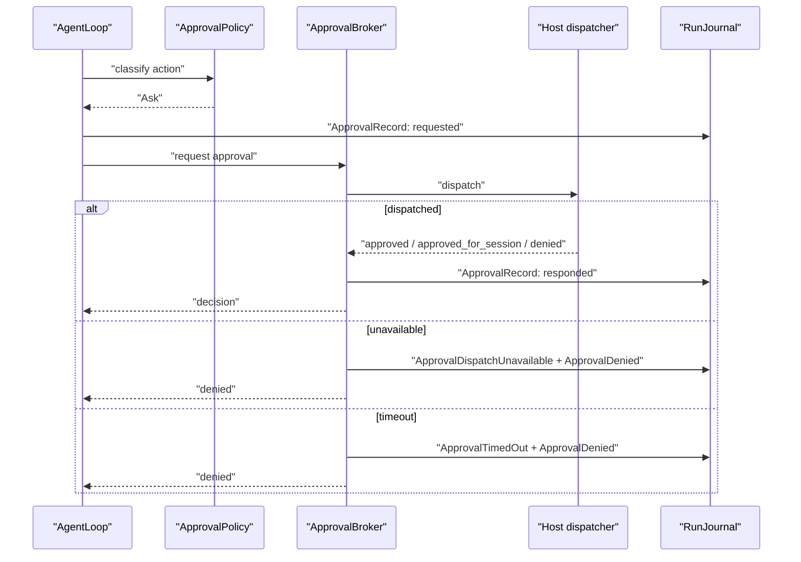

# Tool Approval And Policy Contract

Approval is a broker/policy contract, not a UI event. This contract defines one SDK decision model while preserving host-owned compatibility adapters.

## External Lessons

- Strands makes tool execution observable through before/after hooks and tool events. The SDK should keep that visibility but encode mutation rights as typed responses.
- Claude Agent SDK treats permission mode as explicit configuration. The SDK should do the same while keeping richer host approval transports behind ports.
- Cursor separates agent runs from product UI. The SDK should never assume desktop approval transport.
- Host products commonly have existing approval pipelines. Phase 2 should map those into SDK ports instead of inventing product prompt paths in core.

## Policy Layers



Layers are separate because they answer different questions:

| Layer | Question | Example |
| --- | --- | --- |
| `PermissionPolicy` | May this source use this capability at all? | extension cannot access filesystem |
| `SandboxPolicy` | Where and how may this action execute? | shell requires isolated container |
| `ApprovalPolicy` | Does this action need a decision? | write file asks user |
| `AutonomyPolicy` | Is this action preapproved by explicit mode/scope? | YOLO allows within policy |
| `EscalationPolicy` | Is a host dispatcher required, and what finite response policy applies? | source-scoped approval requires host dispatcher |
| `ApprovalDispatcher` | Host-owned delivery and reply collection port. | desktop prompt, CLI prompt, remote channel |
| `ApprovalBroker` | Own pending request lifecycle and decision attribution. | request/timeout/respond |

Tool execution is also a side effect. Once policy allows execution, the tool path must append an `EffectIntent { kind: ToolExecution }` or a `ToolRecord { intent }` that maps one-to-one to the common effect fields before the executor starts. Terminal tool records must contain or map to `EffectResult`.

## Policy Stages

Guardrails and policy checks are stage-scoped. A package may install stage policy sidecars, but all stages use the same finite `PolicyDecision` model and journaled decision records.

```rust
// Non-compiling contract sketch.
pub enum PolicyStage {
    Input,
    ModelInputProjection,
    PreTool,
    PostTool,
    Output,
    Handoff,
    Stream,
    Delivery,
}
```

Rules:

- `Input` gates host/user input before it becomes an `AgentMessage`.
- `ModelInputProjection` gates `ContextProjection` before provider calls.
- `PreTool` gates tool execution before approval/executor paths.
- `PostTool` gates tool results before they become context candidates or output.
- `Output` gates final messages and typed output before terminal result publication.
- `Handoff` gates subagent, extension, or parent/child context handoff.
- `Stream` gates stream-rule interventions and realtime interruption decisions.
- `Delivery` gates externally visible output sink dispatch.
- Every stage decision records `PolicyDecision`, `PolicyStage`, subject/related `EntityRef`s, policy refs, privacy/retention class, and redacted summary.
- Stage policy cannot be provider-owned. Provider-native guardrails may be useful signals, but the SDK/host policy record remains authoritative.

Acceptance tests must include a policy-stage matrix for each implemented feature path. At minimum, tool work must cover `PreTool` and `PostTool`; context projection work must cover `ModelInputProjection`; output delivery must cover `Delivery`; subagent work must cover `Handoff`; streaming work must cover `Stream`.

## Policy Precedence And Compatibility Migration

Precedence is deterministic:

1. Validate runtime package and tool route.
2. `PermissionPolicy` denies unavailable capabilities before any autonomy/preapproval.
3. `SandboxPolicy` denies or requires isolation before any approval prompt.
4. `ApprovalPolicy` classifies allow/deny/ask/modify/defer/interrupt.
5. `AutonomyPolicy` may preapprove only actions that passed permission and sandbox checks.
6. `EscalationPolicy` decides whether a host `ApprovalDispatcher` is required and which finite tokens are valid.
7. Host `ApprovalDispatcher` delivers the request and collects replies when configured.
8. `ApprovalBroker` owns pending decision lifecycle.
9. `ToolExecutor` runs only after allow or approval.



Fail-open behavior is a host compatibility mode, not an SDK default. A host adapter must make the mode explicit with a policy ID, event, and migration note.

Compatibility fields:

- `compatibility_mode_id`
- `current_behavior`
- `target_behavior`
- `owner`
- `kill_switch`
- `migration_gate`
- `event_kind_on_use`

## Decision Enum

The SDK decision enum is finite:

```rust
// Non-compiling contract sketch.
pub enum PolicyDecision {
    Allow { reason: DecisionReason },
    Deny { reason: DecisionReason },
    Ask { approval: ApprovalRequestSpec },
    Modify { modification: ToolRequestModification },
    Defer { resume_policy: ResumePolicy },
    Interrupt { reason: DecisionReason },
}
```

Compatibility adapter mapping:

| Current term | SDK mapping |
| --- | --- |
| `Allow` | `PolicyDecision::Allow` |
| `Deny` | `PolicyDecision::Deny` |
| `Ask` | `PolicyDecision::Ask` |
| `approve` | `ApprovalDecision::Approved` |
| `approve_for_session` | `ApprovalDecision::ApprovedForSession` |
| `deny` | `ApprovalDecision::Denied` |
| `toolApprovalMode: yolo` | `AutonomyPolicy` yields explicit allow with risk/audit metadata |

The SDK target is fail-closed for missing dispatchers. Any compatibility path that fails open must stay in host adapters until a reviewed migration flips it.

## Approval Request Schema

Required fields:

- `approval_request_id`
- `run_id`
- `turn_id`
- `tool_call_id`
- `source`
- `destination`
- `canonical_tool_name`
- `tool_source`
- `effect_class`
- `risk_class`
- `requested_args_ref`
- `redacted_args_summary`
- `policy_refs`
- `dispatcher_scope`
- `timeout_ms`
- `allowed_decisions`
- `created_at`
- `runtime_package_fingerprint`

Extensions may submit or observe an action, but they cannot answer their own approval.

## Dispatcher Semantics



Rules:

- Missing dispatcher denies in the future SDK.
- Dispatcher timeout denies.
- Cancellation closes pending request and prevents tool execution.
- Source-scoped remote runs use the source-approved channel or configured host escalation only.
- Voice/out-of-band decisions require exact finite tokens. No synonym guessing.
- UI copy is host-owned. The SDK supplies structured request data.

## Acceptance Tests

- `approval_precedence_denies_before_autonomy_and_dispatch`
- `headless_no_escalation_uses_configured_migration_mode_not_ambient_fail_open`
- `headless_missing_dispatcher_denies`
- `agent_sdk_core_cannot_send_out_of_band_approval`
- `dispatcher_timeout_records_timeout_then_denied`
- `extension_cannot_answer_own_approval`
- `voice_approval_accepts_only_exact_finite_tokens`
- `autonomy_mode_still_records_policy_decision`
- `approval_cancel_prevents_tool_start`
- `compat_approve_for_session_maps_at_adapter_edge`
- `tool_risk_comes_from_metadata_not_name_matching`
- `desktop_transport_failure_uses_explicit_compat_policy_not_sdk_default`

## Complete Example

Typed shape:

```rust
// Non-compiling contract sketch.
let request = ApprovalRequestSpec {
    approval_request_id: ApprovalRequestId::new(),
    run_id,
    turn_id,
    tool_call_id,
    source: SourceRef::remote_channel("channel_1"),
    destination: DestinationRef::tool("workspace_write"),
    canonical_tool_name: CanonicalToolName::new("workspace_write"),
    effect_class: EffectClass::Write,
    risk_class: RiskClass::High,
    requested_args_ref: ContentRef::new("tool_args/redacted_1"),
    redacted_args_summary: "write docs/notes.md".into(),
    policy_refs: vec![PolicyRef::new("approval.write_file")],
    dispatcher_scope: DispatcherScope::SourceScoped,
    timeout_ms: 120_000,
    allowed_decisions: vec![ApprovalDecisionKind::Approved, ApprovalDecisionKind::Denied],
    runtime_package_fingerprint,
};

let decision = approval_broker.request(request).await?;
```

Replaceable ports:

- `PermissionPolicy`, `SandboxPolicy`, `ApprovalPolicy`, `AutonomyPolicy`, and `EscalationPolicy` are independent evaluators.
- `ApprovalDispatcher` is a host-owned transport port for desktop, CLI, remote, or headless delivery.
- `ApprovalBroker` owns pending lifecycle, timeout, attribution, and finite decision validation; it does not send out-of-band messages itself.
- Host compatibility modes are explicit policies, not core defaults.

Wiring:

1. Tool request enters policy pipeline.
2. Permission and sandbox rules run before autonomy.
3. Approval policy returns `Ask`.
4. Broker dispatches to source-scoped host channel.
5. Approved decision releases `ToolExecutor`; denied/timeout returns a denied tool result or failure by policy.

Events:

- `ToolApprovalRequired`
- `ApprovalRequested`
- `ApprovalDispatched`
- `ApprovalResponded` or `ApprovalTimedOut`
- `ApprovalDenied`
- `ToolStarted` only after allow/approval and effect intent append

Journal:

- `ApprovalRecord { requested }`
- `ApprovalRecord { dispatched }`
- `ApprovalRecord { responded | timed_out | denied }`
- `ToolRecord { intent }` with `EffectIntent { kind: ToolExecution }` only after allow/approval and before executor start
- `ToolRecord { result }` with `EffectResult` after executor completion, failure, timeout, cancellation, or unknown status

Policies and failures:

- Missing dispatcher denies in the SDK default.
- Headless runs require configured escalation or explicit compatibility mode.
- Cancellation closes pending approval and prevents tool start.
- Extensions cannot answer approvals for their own actions.

SDK owns / Host owns:

- SDK owns policy precedence, approval request schema, finite decision model, timeout/cancel semantics, and journal/event records.
- Host owns approval UI/copy, remote yes/no transport, source-scoped identity proof, and any temporary fail-open compatibility policy.

Tests:

- `approval_precedence_denies_before_autonomy_and_dispatch`
- `headless_missing_dispatcher_denies`
- `approval_cancel_prevents_tool_start`
