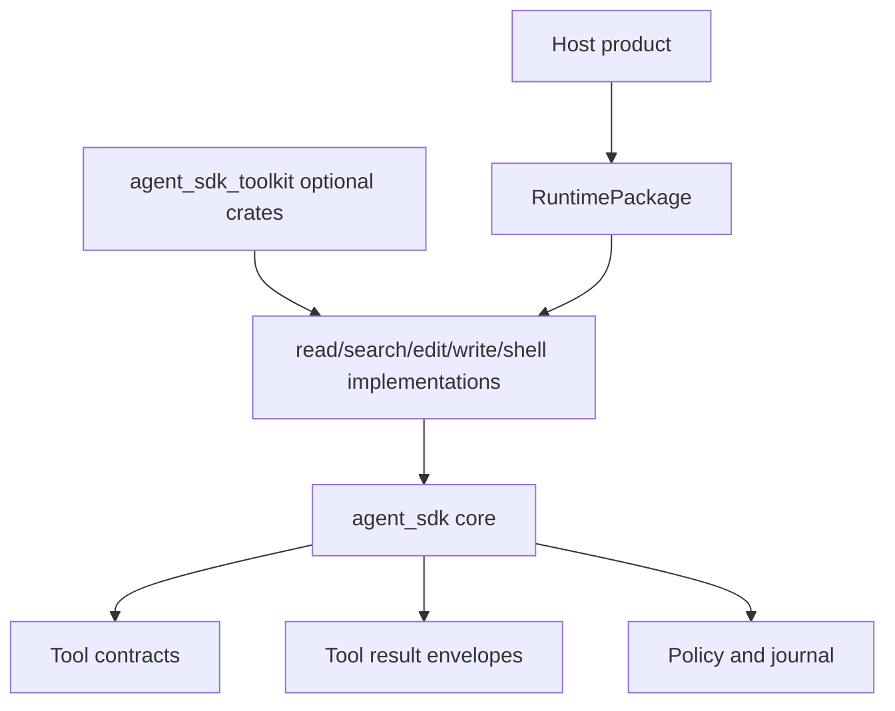
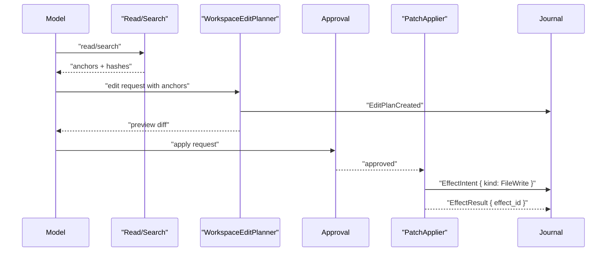

# Tool Pack Contract

Built-in tool packs are optional SDK toolkit surfaces. They are not a coding-agent product.

## External Lessons

- oh-my-pi proves high-quality read/search/edit/write/shell tools make agents much easier to build.
- Pi keeps agent core separate from coding harness UI. The SDK should follow that boundary: contracts and optional toolkit crates, not a bundled product.
- Cursor/Claude expose MCP/tools as extension surfaces. The SDK should keep source, namespace, permission, and approval explicit.

## Placement



Core owns contracts. Optional toolkit crates own broad tool implementations. Hosts decide which packs enter each runtime package.

Acceptance boundary:

- `agent_sdk_core` must build without broad toolkit implementations.
- Runtime packages can accept any external tool pack that satisfies the `ToolPack` contract.
- Test fakes in core can exercise the loop without file, shell, URL, SQLite, or AST dependencies.

## Common Tool Spec Fields

- canonical tool name
- source kind and source ID
- input schema
- output schema
- effect class: read, write, network, process, memory, remote send, child run
- risk class
- required permissions
- sandbox/isolation requirement
- idempotency hint
- timeout
- cancellation support
- process ownership policy when the tool can start child processes
- privacy policy
- result redaction policy

## Pack Contracts

| Pack | Required semantics |
| --- | --- |
| `workspace_readonly` | path policy, symlink policy, hidden-file policy, max bytes, truncation, anchors, hashes, MIME type |
| `workspace_search` | regex dialect, glob rules, gitignore behavior, max matches, context lines, pagination cursor |
| `workspace_edit` | read snapshot ref, hashline-style anchor validation, preview diff, apply phase, stale-anchor handling, inverse candidate |
| `workspace_write` | create/overwrite scope, parent dir policy, before/after hash, destructive approval |
| `shell` | structured argv by default, cwd/env policy, network policy, timeout, PTY mode, cancellation, isolation requirement, process ownership, detach policy |
| `resource_readers` | resource URI source, sensitivity, content ref, parser version, truncation, retention |
| `tool_discovery` | search hidden tools, activation policy, package delta, no ambient mutation |

Out of scope for the first SDK toolkit slice:

- LSP operations.
- Debugger/DAP operations.
- Browser automation.
- Product-specific code-review agents.
- Broad AST rewrite engines.

The core must leave room for hosts or later optional crates to add those, but implementation should start with read/search/hash-anchored edit/write/shell/resource primitives only.

## Per-Resource Permission Matrix

| Resource | Required permission | Extra policy |
| --- | --- | --- |
| workspace file | filesystem read in workspace scope | symlink/external mount policy |
| workspace directory | filesystem list in workspace scope | hidden/ignored file policy |
| URL | network egress permission | host allowlist, timeout, content type |
| archive | file read plus archive parser permission | decompression limits, path traversal guard |
| SQLite | file read plus structured DB reader permission | query limits, schema privacy |
| notebook/document | file read plus parser permission | embedded media handling |
| image/audio/video | media read permission | derived metadata only by default |
| memory URI | memory read permission | memory retention/sensitivity policy |
| artifact URI | artifact read permission | artifact owner/scope |
| MCP resource | MCP allowlist permission | server/tool namespace policy |
| skill/plugin URI | skill/plugin read permission | installed source trust |

## Effect Class, Intent, And Reversibility Matrix

Every tool call, including reads, records auditable tool execution intent/result. Mutation and external visibility are separate from approval defaults and reversibility metadata.

| Effect class | External mutation? | Requires approval by default | Reversibility metadata |
| --- | --- | --- | --- |
| read | no | no, if in read scope | source/hash/truncation |
| anchored edit | yes | yes | before/after hash, diff, inverse candidate |
| write/overwrite | yes | yes | before/after hash, created/deleted path, non-reversible marker if needed |
| broad AST apply | yes | yes, second decision after preview | later optional crate only; preview ref, changed paths, inverse candidates |
| shell/process | yes | yes | command summary, stdout/stderr refs, exit/status, non-reversible marker |
| network send | yes | yes | dedupe key, ack ref, non-reversible marker |
| memory write | yes | policy-dependent | memory write receipt, idempotency key |
| remote message send | yes | yes/source-scoped | dedupe key, channel ack |

The shared `ToolRecord` must contain or map one-to-one to `EffectIntent { kind: ToolExecution }` before executor start and `EffectResult` after terminal status for all rows. Mutating file/process/network/memory behavior adds the relevant effect metadata; read tools still record request, source, bounds, hashes, truncation, policy refs, and result refs for audit and replay.

## Edit Flow



## Reversibility Boundary

The SDK records effect lineage. It does not promise universal undo.

Required effect metadata:

- before hash
- after hash
- diff summary
- created/deleted paths
- idempotency key
- inverse patch candidate when safe
- formatter/diagnostic output ref
- external side-effect warning

Tool-pack journal records may add file, process, network, or memory-specific fields, but every tool call must embed or map one-to-one to tool execution intent/result records. Mutating packs additionally use `EffectKind::FileWrite`, `EffectKind::ProcessStart`, `EffectKind::ProcessSignal`, or the relevant memory/output kind as appropriate; they must not invent a separate file/process effect spine.

Evolution/product undo UX remains host-owned.

## Shell Process Ownership And Detach

Shell/process tools start agent-owned child artifacts by default.

```rust
// Non-compiling contract sketch.
pub struct ShellToolSpec {
    pub argv: Vec<String>,
    pub cwd: WorkspaceRef,
    pub env: RedactedEnv,
    pub timeout_ms: u64,
    pub isolation_requirement: Option<IsolationRequirementRef>,
    pub ownership: ProcessOwnershipPolicy,
    pub detach: Option<DetachRequest>,
}
```

Rules:

- A shell process that starts and exits during the tool call is recorded as normal `ToolRecord` and `IsolationRecord` state.
- A long-running process that continues after tool completion requires `detach: Some(...)`, allowed `DetachPolicy`, explicit user or host intent when configured, host acknowledgement, and `ChildLifecycleRecord` detach records.
- Without explicit detach, returning success while a process continues running is denied as an implicit orphan.
- Manual run cancellation terminates or interrupts agent-owned shell processes by default.
- `BeforeToolCall` hooks may deny or narrow shell requests through typed responses, but cannot silently change process ownership from agent-owned to detached or host-managed.
- Process output uses content refs/redacted summaries by default, including for detached processes.

## Acceptance Tests

- `read_output_includes_anchor_hash_truncation_and_mime`
- `edit_anchor_uses_hashline_snapshot_not_plain_line_number`
- `grep_respects_limits_and_reports_regex_compile_error`
- `symlink_policy_blocks_out_of_workspace_target`
- `edit_preview_does_not_write`
- `edit_apply_fails_on_stale_anchor_without_known_before_state`
- `write_requires_create_or_overwrite_scope`
- `shell_requires_timeout_and_sandbox_policy`
- `raw_shell_string_requires_high_risk_approval`
- `tool_discovery_activation_creates_package_delta`
- `mutating_tool_records_effect_metadata`
- `read_tool_records_execution_intent_and_result`
- `agent_sdk_core_builds_without_toolkit_features`
- `runtime_package_accepts_external_tool_pack_contract_without_core_tool_impl`
- `url_read_requires_network_permission`
- `memory_uri_read_requires_memory_permission`
- `mcp_resource_read_requires_allowlist`
- `non_idempotent_mutation_requires_intent_record_before_execute`
- `write_without_inverse_candidate_is_marked_non_reversible`
- `broad_ast_apply_requires_preview_and_second_policy_decision`
- `lsp_debugger_and_browser_tools_are_out_of_core_toolkit_slice`
- `tool_pack_preset_lowers_to_explicit_tool_specs`
- `tool_pack_helper_and_explicit_specs_emit_equivalent_tool_events`
- `shell_process_defaults_to_agent_owned_cleanup`
- `start_script_detach_requires_explicit_policy_and_journal_record`
- `manual_cancel_terminates_agent_owned_shell_process_by_default`
- `implicit_orphan_shell_process_is_denied`
- `before_tool_hook_cannot_silently_detach_process`

## Ergonomics

Simple API:

```rust
// Non-compiling contract sketch.
let package = RuntimePackage::for_agent(agent)
    .tool_pack(ToolPackPreset::WorkspaceReadOnly)
    .tool_pack(ToolPackPreset::WorkspaceEditWithApproval)
    .build()?;
```

Advanced API:

```rust
// Non-compiling contract sketch.
let pack = ToolPackBuilder::new(ToolPackId::new("workspace_safe"))
    .tool(edit_tool_spec)
    .policy(PolicyRef::new("approval.write_file"))
    .permission(Permission::WorkspaceWrite)
    .build()?;
```

Canonical lowering:

- `ToolPackPreset::WorkspaceReadOnly` expands into explicit read/list/search tool specs, executor refs, permission refs, and redaction policy refs.
- `ToolPackPreset::WorkspaceEditWithApproval` expands into preview/apply specs with approval and effect-lineage requirements.
- Runtime package fingerprint includes the lowered specs and policy refs, not the preset display name.

Equivalence:

- Preset tools and manually declared tool specs emit the same tool/approval events and journal records.
- Presets cannot bypass approval, sandbox, effect metadata, or package projection/execution checks.

SDK owns / Host owns:

- SDK owns preset definitions for optional toolkit crates and their lowering into tool specs.
- Host owns whether a preset is installed, which workspace roots are trusted, and whether product-specific undo UI exists.

Tests:

- `tool_pack_preset_lowers_to_explicit_tool_specs`
- `tool_pack_helper_and_explicit_specs_emit_equivalent_tool_events`
- `mutating_tool_records_effect_metadata`

## Complete Example

Typed shape:

```rust
// Non-compiling contract sketch.
let edit_tool = ToolSpec {
    canonical_name: CanonicalToolName::new("workspace_edit"),
    source: ToolSourceRef::sdk_toolkit("workspace_edit"),
    input_schema: SchemaRef::content("schemas/workspace_edit_input_v1"),
    output_schema: SchemaRef::content("schemas/workspace_edit_output_v1"),
    effect_class: EffectClass::AnchoredEdit,
    risk_class: RiskClass::High,
    required_permissions: vec![Permission::WorkspaceWrite],
    isolation_requirement: None,
    idempotency_hint: IdempotencyHint::RequiresAnchorHash,
    timeout_ms: 10_000,
    cancellation: CancellationSupport::BestEffort,
    process_ownership: Some(ProcessOwnershipPolicy::agent_owned(parent_run_id)),
    privacy: ToolPrivacyPolicy::ContentRefsOnly,
    result_redaction: RedactionPolicyId::new("tool_result_default"),
};

let request = WorkspaceEditRequest {
    path: WorkspacePath::new("docs/notes.md"),
    anchor: HashLineAnchor { line: 42, before_hash: ContentHash::sha256("...") },
    replacement_ref: ContentRef::new("patch/replacement_1"),
    preview_only: false,
};
```

Replaceable ports:

- `ToolPack` registers specs and executors through the core tool contract.
- `WorkspaceReader`, `WorkspaceSearcher`, `PatchPlanner`, `PatchApplier`, and `ShellExecutor` are swappable toolkit ports.
- Host products can supply their own tool packs if they satisfy the same spec, effect, approval, and journal rules.

Wiring:

1. Runtime package includes the tool spec and executor ref.
2. Model sees projected schema only if the package validates.
3. Edit planner produces preview diff without mutation.
4. Approval policy gates apply.
5. Applier verifies anchor hash, writes, records before/after hashes, and returns effect metadata.

Events:

- `ToolRequested`
- `ToolApprovalRequired`
- `ApprovalRequested`
- `ToolStarted`
- `ToolCompleted` or `ToolFailed`

Journal:

- `ToolRecord { edit plan preview }`
- `ApprovalRecord { apply decision }`
- `ToolRecord { effect intent }`
- `ToolRecord { effect completed, before_hash, after_hash, inverse_candidate }`

Policies and failures:

- Stale anchors fail without writing.
- Shell commands require timeout and sandbox policy.
- Shell processes are agent-owned by default and cannot outlive the run without explicit detach records.
- Non-reversible writes are marked explicitly.
- LSP/debugger/browser tools stay out of the first core toolkit slice.

SDK owns / Host owns:

- SDK owns tool spec schema, effect metadata contract, process ownership/detach contract, optional toolkit boundaries, and reversible lineage fields.
- Host owns workspace trust, mounted roots, concrete file/process access, detached process inspection/reclaim UI, product undo UX, and whether optional tool packs are installed.

Tests:

- `edit_anchor_uses_hashline_snapshot_not_plain_line_number`
- `edit_apply_fails_on_stale_anchor_without_known_before_state`
- `mutating_tool_records_effect_metadata`
- `start_script_detach_requires_explicit_policy_and_journal_record`
