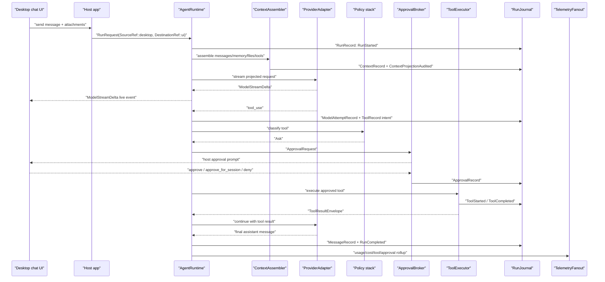

# Desktop Chat With Tool Approval

This example shows a normal desktop or web chat path as SDK contracts.

## Sequence

## Event Families

- `run_lifecycle`
- `turn_lifecycle`
- `message`
- `model`
- `memory_context`
- `tool`
- `approval`
- `telemetry_cost`
- `output_delivery`

## Journal Records

- `RunRecord`
- `TurnRecord`
- `ContextRecord`
- `MessageRecord`
- `ModelAttemptRecord`
- `ApprovalRecord`
- `ToolRecord`
- `TelemetryRecord`

## Host-Owned Boundaries

- UI prompt copy and rendering.
- Desktop or web event transport.
- Conversation persistence.
- Any temporary compatibility fail-open policy, if enabled, lives in the host adapter and emits compatibility events.

## Acceptance Tests

- `desktop_chat_tool_approval_sequence_matches_contract`
- `desktop_transport_failure_uses_explicit_compat_policy_not_sdk_default`
- `tool_started_never_precedes_approval_when_policy_asks`
- `projection_audit_precedes_provider_call`
