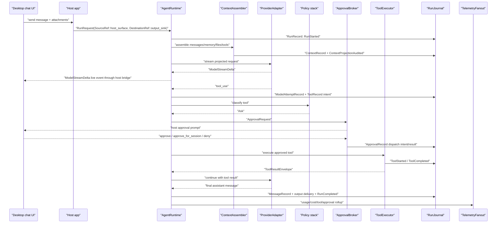

# Desktop Chat With Tool Approval

This example shows a normal desktop or web chat path as SDK contracts.

## Sequence

## Event Families

- `run_lifecycle`
- `turn_lifecycle`
- `message`
- `model`
- `memory_context`
- `tool`
- `approval`
- `telemetry_cost`
- `output_delivery`

## Journal Records

- `RunRecord`
- `TurnRecord`
- `ContextRecord`
- `MessageRecord`
- `ModelAttemptRecord`
- `ApprovalRecord`
- `ToolRecord`
- `OutputDispatchRecord`
- `TelemetryRecord`
- `RecoveryRecord` when tool/result/output terminal append is unsafe

## Policy, Telemetry, And Recovery

- Policy decisions: context projection policy, tool permission policy, approval/escalation policy, redaction/content-capture policy, and output delivery policy.
- Telemetry/cost: model usage, tool attempts, approval latency, output delivery status, and final run status are derived from journal-backed events.
- Recovery: if a tool or output send may have happened but terminal append fails, the run enters recovery before another non-idempotent side effect starts. UI event loss never becomes run truth.

## Host-Owned Boundaries

- UI prompt copy and rendering.
- Desktop or web event transport.
- Conversation persistence.
- Any temporary compatibility fail-open policy, if enabled, lives in the host adapter and emits compatibility events.

## Acceptance Tests

- `desktop_chat_tool_approval_sequence_matches_contract`
- `desktop_transport_failure_uses_explicit_compat_policy_not_sdk_default`
- `tool_started_never_precedes_approval_when_policy_asks`
- `projection_audit_precedes_provider_call`
