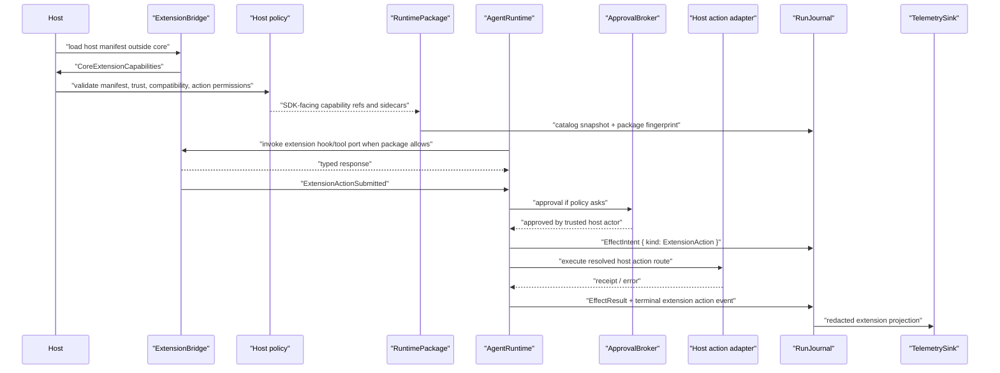

# Extension Action Boundary

This example shows an extension contributing capabilities without becoming SDK authority for approvals, memory, provider routing, telemetry, app-event storage, or host UI actions.

## Capability Resolution

## Scenario Mapping

| Scenario piece | SDK primitives | Host-owned boundary |
| --- | --- | --- |
| declared capabilities | `CoreExtensionCapabilities`, `CapabilityCatalogSnapshot`, package sidecars, source refs | host manifest, install metadata, runtime compatibility, marketplace identity |
| extension hook/tool | core `HookSpec`, `ToolRecord`, bridge executor refs, policy refs | subprocess lifecycle, JSON-RPC transport, stderr draining, runtime restart |
| app-event observation | `AgentEvent` projection with metadata refs and redacted summaries | app-event transport, fanout, storage, replay, product UI display |
| extension action | `ApprovalBroker`, `EffectIntent`, `EffectResult`, `ExtensionAction*` events | host action adapter, action permission store, UI side effect, trusted actor registry |

## Events, Journals, And Telemetry

- Events: `ExtensionCapabilityLoaded`, `ExtensionHookInvoked`, `ExtensionToolRequested`, `ExtensionEventObserved`, `ExtensionActionSubmitted`, `ExtensionActionStarted`, `ExtensionActionCompleted`, `ExtensionActionFailed`, `ExtensionActionDenied`, plus approval events when policy asks.
- Journal records: package catalog snapshot records, `HookRecord`, `ToolRecord`, `ApprovalRecord`, extension action effect intent/result records, and `RecoveryRecord` when the action route may have executed but terminal append failed.
- Policy decisions: capability activation policy, hook mutation-right policy, tool/action approval policy, redaction/content-capture policy, and self-approval denial.
- Telemetry/cost: OTel spans/logs export SDK-facing extension IDs, capability IDs, action IDs, effect refs, policy refs, and redacted summaries only. Host manifest runtime fields, install paths, marketplace data, trust enums, browser-safe export lists, raw app-event payloads, and transport state are excluded.
- Recovery: denied actions produce no host action call. Unknown terminal action status blocks further non-idempotent extension actions until reconciled.

## Host-Owned Boundaries

- Extension installation, packaging, marketplace, trust, and compatibility checks.
- Extension subprocess lifecycle, JSON-RPC transport, and runtime resource placement.
- App-event storage, replay, fanout, and product display.
- Host action execution, credentials, UI copy, and side-effect transport.
- Browser-safe export validation and package smoke tests in optional extension packaging.

## Acceptance Tests

- `host_extension_manifest_never_enters_core_as_authority`
- `core_capabilities_resolve_to_runtime_package_sidecars`
- `extension_action_records_intent_before_host_action`
- `extension_cannot_self_approve_action`
- `extension_action_terminal_status_records_effect_result`
- `extension_otel_projection_excludes_host_manifest_fields`
