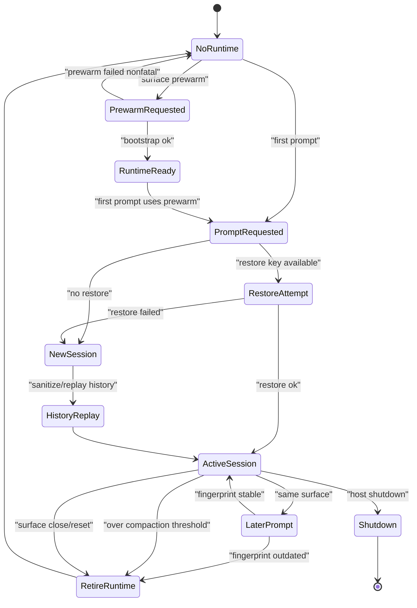
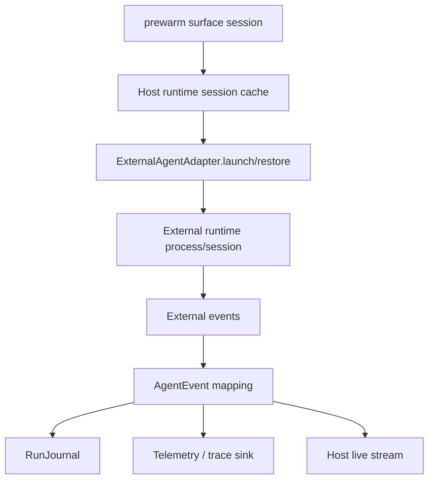

# External Runtime Session Lifecycle

External runtimes can preserve state across prompts, but their process/session lifecycle is host-owned. The SDK should expose portable launch, restore, send, receive, retire, event mapping, package fingerprint, and journal contracts without owning any specific runtime cache or UI surface.

## State Diagram

## ID Boundaries

| Concept | Owner | Must stay distinct |
| --- | --- | --- |
| `SurfaceSessionId` | host UI or channel surface | conversation ID |
| `RestoreKey` | host external-runtime adapter | runtime session ID |
| `ExternalRuntimeSessionId` | external runtime | SDK run ID |
| `RunId` | SDK run | surface session |
| `RuntimePackageFingerprint` | SDK/host package builder | external process ID |

## Adapter Event Flow

## Host-Owned Boundaries

- External command resolution and install bootstrap.
- Live runtime cache.
- Restore key policy.
- Prewarm timing.
- Retirement scheduling.
- Process cleanup.
- Surface UI and product retry messaging.

## Events, Journals, Telemetry, And Recovery

- Events: run lifecycle events, mapped model/tool events from the external runtime, `RunResumeRequested`, `RunResumeFailed`, recovery events, and telemetry sink health events.
- Journal records: `RunRecord`, `ModelAttemptRecord`, `MessageRecord`, `ContextRecord` for replayed/compacted history, `RecoveryRecord`, and `TelemetryRecord`.
- Policy decisions: restore-key policy, runtime package fingerprint compatibility, redaction/content-capture policy, runtime retirement policy, and output delivery policy for any host reply.
- Telemetry/cost: runtime launch/restore latency, model/tool usage reported through SDK records, retirement reason, and trace export cursor are projections from mapped events and journal records.
- Recovery: fingerprint mismatch retires the runtime before the next prompt; failed restore falls back to a new session with sanitized history replay; process cleanup remains host-owned but must be linked to SDK recovery records.

## Acceptance Tests

- `surface_session_restore_key_runtime_session_ids_do_not_collapse`
- `fingerprint_mismatch_retires_live_runtime`
- `over_threshold_external_turn_replays_compacted_history_on_next_bootstrap`
- `prewarm_failure_is_nonfatal_and_actionable`
- `surface_close_retires_runtime_without_sealing_conversation`
