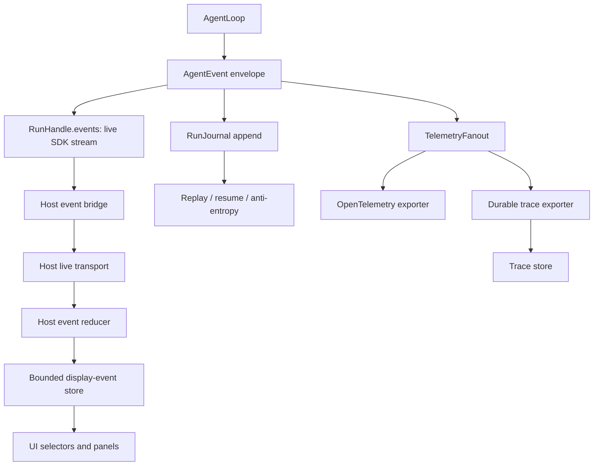

# Live Vs Durable Event Flow

This example prevents a common failure: treating "events" as one blob. Hosts may have live display events, app-local event stores, journal records, telemetry exports, and durable trace rows. They are linked, but not interchangeable.

## Data Flow



## ID Links

| Concept | SDK ID | Host ID | Durable owner |
| --- | --- | --- | --- |
| Conversation | linked metadata | `conversation_id` / chat session ID | conversation store |
| Run | `RunId` | trace run ref | run journal |
| Trace | `TraceId` / `SpanId` | trace-store run ID | trace store |
| Live app event | `EventId` | display event ID | bounded host store |
| Runtime session | external runtime session ref | runtime session ID | host adapter |
| Remote source | `SourceRef` | remote message ID | remote message DB |

IDs must be cross-linked, not collapsed.

## Live Drop Does Not Lose Truth

```mermaid
sequenceDiagram
  participant Loop as "AgentLoop"
  participant Live as "Live event stream"
  participant Display as "Bounded display events"
  participant Journal as "RunJournal"
  participant Trace as "Trace sink"

  Loop->>Journal: "ToolStarted journal record"
  Loop-->>Live: "ToolStarted AgentEvent"
  Live--x Display: "subscriber overflow drops UI event"
  Loop->>Journal: "ToolCompleted journal record"
  Loop->>Trace: "tool row export from journal/telemetry"
  Display->>Journal: "reconnect from cursor if host supports replay"
```

Display-event loss is a UI concern. Journal and durable trace exports remain recoverable from authoritative records.

## Host-Owned Boundaries

- Host display-event stores are bounded and ephemeral.
- Durable trace stores are host telemetry sinks, not SDK storage.
- The SDK emits events and journal records; hosts decide which live projections enter product UI.
- UI selectors never become approval, replay, or analytics source of truth.

## Acceptance Tests

- `display_event_loss_does_not_affect_journal_or_trace_sink`
- `trace_ingest_refuses_display_event_id_as_run_truth`
- `ids_remain_distinct_across_conversation_trace_runtime_app_event`
- `ui_reconnect_uses_journal_cursor_not_display_history`
