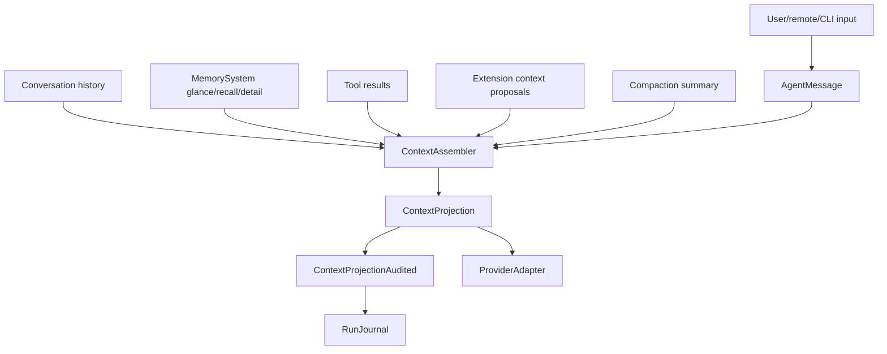
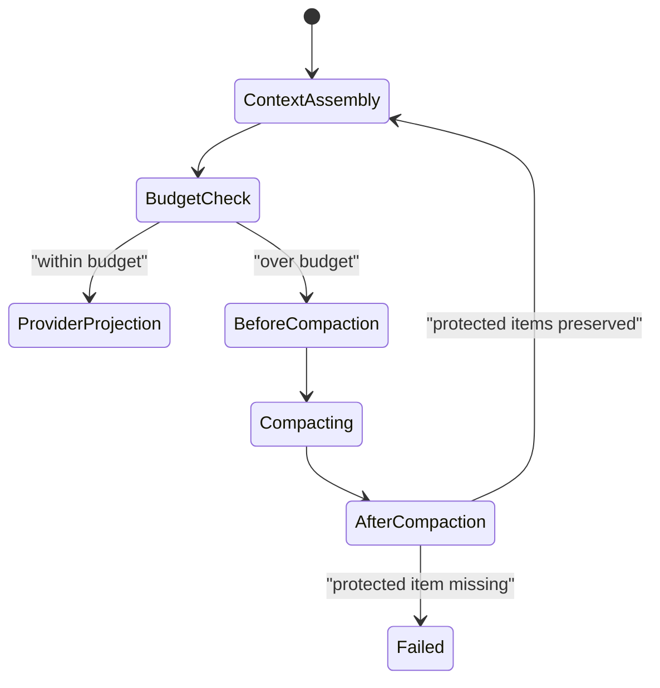

# Memory, Context, And Compaction Workflow

This example shows how memory, history, compaction, projection audit, and replay stay observable without making memory a UI or extension-owned feature.

## Context Assembly



## Compaction State Machine



## Projection Audit Fields

Every projection records:

- projection ID
- run and turn IDs
- provider/model route
- runtime package fingerprint
- included counts by kind/source
- omitted counts by reason
- redaction policy
- content-capture mode
- budget limits
- memory policy refs
- extension/hook policy refs
- provider-facing tool hash and executable registry hash

## Resume After Context Pressure

```mermaid
sequenceDiagram
  participant Loop
  participant Journal
  participant Checkpoint
  participant Memory
  participant Provider

  Loop->>Journal: "ContextCompactionStarted"
  Loop->>Memory: "retrieve protected memory refs"
  Loop->>Journal: "ContextCompactionCompleted"
  Loop->>Checkpoint: "save checkpoint with projection/content refs"
  alt crash after checkpoint
    Loop->>Journal: "RunResumeRequested"
    Loop->>Checkpoint: "load latest"
    Checkpoint-->>Loop: "loop state + content ref manifest"
    Loop->>Journal: "ReplayCompleted"
    Loop->>Provider: "continue from projection"
  end
```

## Host-Owned Boundaries

- Memory backend and wiki UI.
- Memory ingestion product.
- Extension context proposals.
- UI memory browsing.

## Acceptance Tests

- `context_projection_audit_records_omitted_sensitive_memory`
- `compaction_preserves_protected_context_items`
- `extension_context_proposal_cannot_bypass_projection_policy`
- `resume_after_compaction_requires_content_ref_manifest`
- `memory_store_event_uses_memory_policy_not_ui_state`

