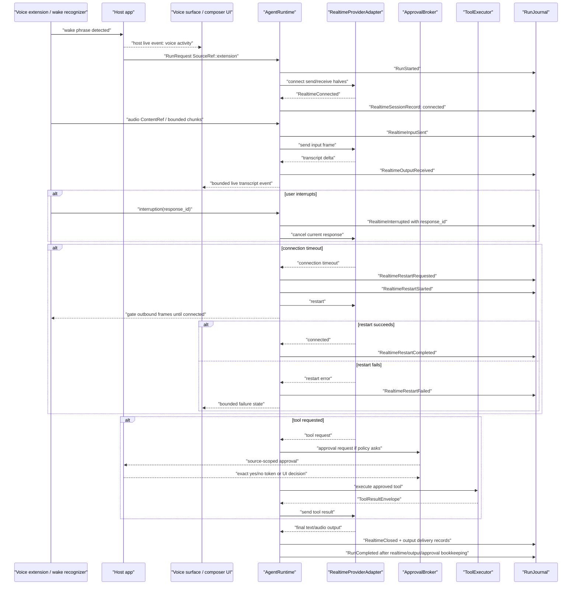
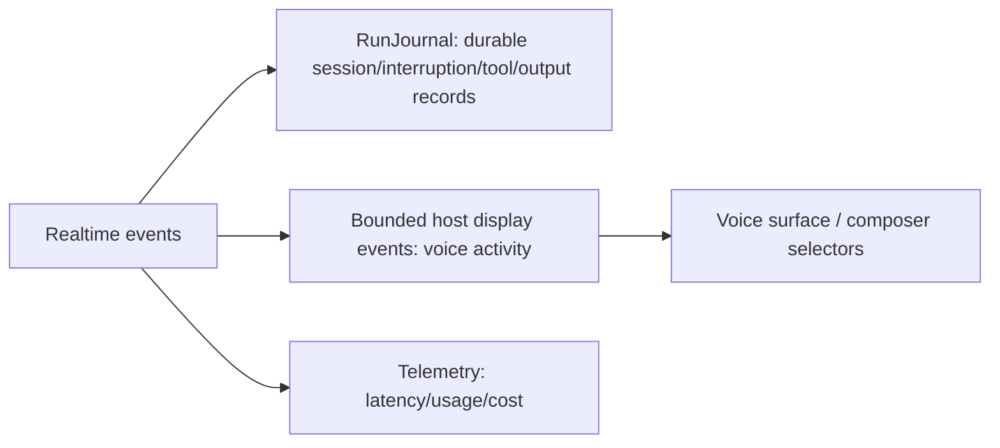

# Realtime Voice Workflow

Voice is not "chat with audio." It has send/receive halves, connection lifecycle, wake/listening UI, transcript finality, interruptions, and source-scoped approval.

## Wake To Final Output

## Live Vs Durable

Transcript UI events can drop. Journaled response IDs and interruption records cannot.

## Policy, Telemetry, And Recovery

- Policy decisions: media capture policy, realtime send/receive policy, stream intervention policy, source-scoped approval policy, restart/backpressure policy, and output delivery policy.
- Journal records: `RealtimeSessionRecord`, `StreamRuleRecord` when a stream rule intervenes, `ApprovalRecord`, `ToolRecord`, `OutputDispatchRecord`, `TelemetryRecord`, and `RecoveryRecord` when a connection or terminal append is unsafe.
- Telemetry/cost: latency, restart count, backpressure state, usage, tool calls, and output delivery status are derived from journal-backed events.
- Recovery: restart failure is observable before retry policy acts; raw audio is content-ref-only by default; terminal run completion waits for realtime close or explicit detach plus output/approval bookkeeping.

## Host-Owned Boundaries

- Wake phrase detection.
- Microphone permission.
- Voice extension settings.
- Voice activity rendering.
- Exact approval token transport.

## Acceptance Tests

- `realtime_restart_gates_outbound_audio_frames`
- `realtime_restart_records_requested_started_completed_in_order`
- `realtime_restart_failure_is_observable_before_retry_policy`
- `voice_tool_approval_cannot_use_source_extension_as_authority`
- `interruption_records_response_id_before_cancelling_output`
- `voice_app_event_loss_does_not_drop_realtime_journal_records`
