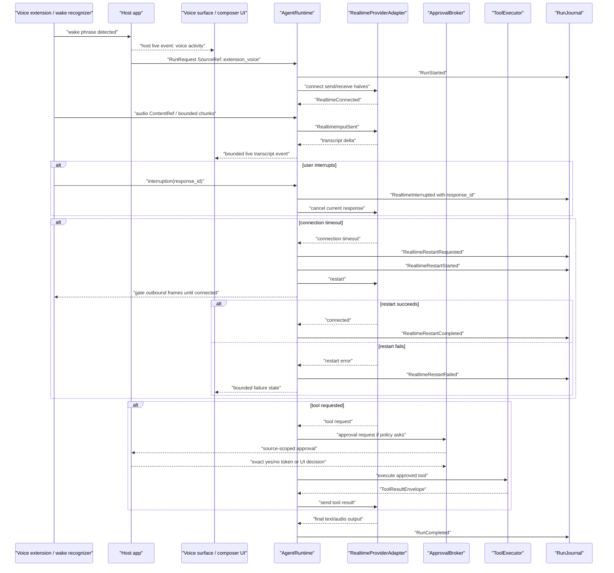
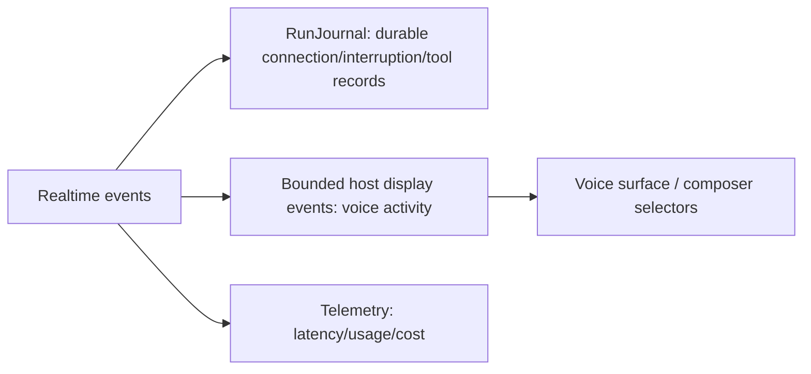

# Realtime Voice Workflow

Voice is not "chat with audio." It has send/receive halves, connection lifecycle, wake/listening UI, transcript finality, interruptions, and source-scoped approval.

## Wake To Final Output

## Live Vs Durable

Transcript UI events can drop. Journaled response IDs and interruption records cannot.

## Host-Owned Boundaries

- Wake phrase detection.
- Microphone permission.
- Voice extension settings.
- Voice activity rendering.
- Exact approval token transport.

## Acceptance Tests

- `realtime_restart_gates_outbound_audio_frames`
- `realtime_restart_records_requested_started_completed_in_order`
- `realtime_restart_failure_is_observable_before_retry_policy`
- `voice_tool_approval_cannot_use_source_extension_as_authority`
- `interruption_records_response_id_before_cancelling_output`
- `voice_app_event_loss_does_not_drop_realtime_journal_records`
