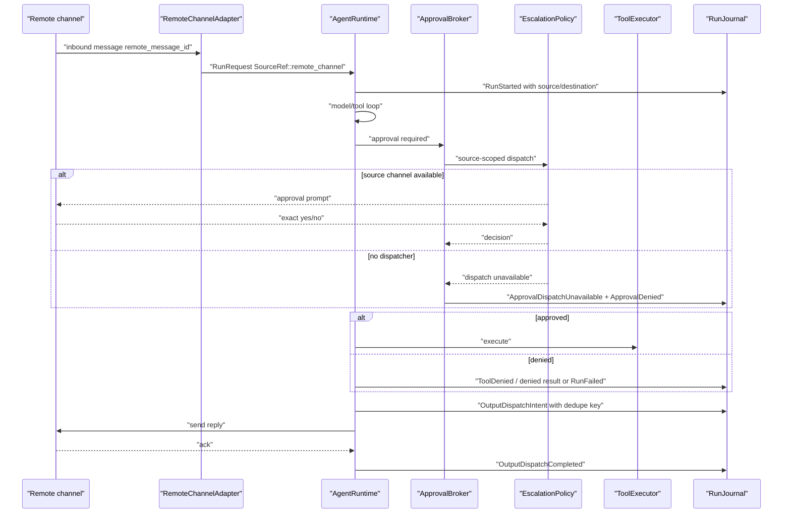

# Remote And Headless Approval Workflow

Remote messages and scheduled runs must preserve source scope. Missing dispatchers deny by default; temporary fail-open behavior is host compatibility only.

## Remote Message Run

## Approval Matrix

| Source | Dispatcher | Missing dispatcher target | Compatibility mode | SDK default |
| --- | --- | --- | --- | --- |
| desktop chat | desktop prompt | explicit compat policy only | some fail-open paths | deny |
| CLI | terminal prompt | deny | host-specific | deny |
| scheduled/headless | escalation manager | explicit compat policy only | host-specific | deny |
| remote channel | source channel or escalation | explicit compat policy only | out-of-band manager | deny |
| voice extension | host-owned voice approval | deny | exact yes/no plan | deny |
| extension-submitted | host dispatcher | deny | extension cannot approve | deny |
| external runtime | host adapter broker | explicit compat policy only | adapter-specific | deny |
| stream-rule pause | same broker | deny | none | deny |

## Host-Owned Boundaries

- Remote channel adapters and credentials.
- Out-of-band escalation channel implementation.
- Current compatibility fail-open mode, if temporarily enabled.
- Remote message persistence and ack lookup.
- User-facing approval copy.

## Acceptance Tests

- `headless_no_dispatcher_denies`
- `headless_no_escalation_uses_configured_compatibility_mode_not_ambient_fail_open`
- `extension_submitted_action_cannot_self_approve`
- `remote_output_uses_dedupe_key_before_resend`
- `source_scoped_approval_uses_source_channel_or_denies`
