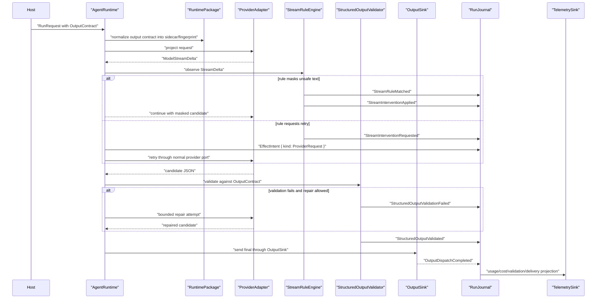

# Structured Output And Stream Rules

This example shows typed output, output delivery, and stream rules sharing the same run loop. Stream rules can mask, stop, ask for approval, or request a retry, but they do not publish final typed data or deliver output outside the normal validation, journal, and sink contracts.

## Typed Output Flow

## Scenario Mapping

| Scenario piece | SDK primitives | Host-owned boundary |
| --- | --- | --- |
| typed result request | `OutputContract`, schema refs, validation policy, repair policy, `RuntimePackage` sidecar | product form rendering, downstream business interpretation |
| stream safeguard | `StreamRuleSidecar`, `StreamDelta`, `StreamRuleRecord`, `PolicyStage::Stream` | rule authoring UI, custom matcher sandbox, provider transport |
| validation | `StructuredOutputValidator`, `ValidatedOutput`, `StructuredOutputRecord` | product-specific scoring, approval copy, rendered widgets |
| delivery | `DestinationRef`, `OutputSink`, `OutputDeliveryPolicy`, `EffectIntent`, `EffectResult` | channel credentials, notification copy, ack lookup |

## Events, Journals, And Telemetry

- Events: `StreamRuleMatched`, `StreamInterventionRequested`, `StreamInterventionApplied`, `StructuredOutputRequested`, `StructuredOutputValidationStarted`, `StructuredOutputValidationFailed`, `StructuredOutputRepairRequested`, `StructuredOutputValidated`, `OutputDispatchRequested`, `OutputDispatchCompleted`, `RunCompleted`.
- Journal records: `RunRecord`, `ModelAttemptRecord`, `StreamRuleRecord`, `StructuredOutputRecord`, `OutputDispatchRecord`, `TelemetryRecord`, and `RecoveryRecord` when terminal append or delivery reconciliation is unsafe.
- Policy decisions: stream intervention policy, schema validation/repair policy, redaction/content-capture policy, and output delivery policy.
- Telemetry/cost: validation attempts, repair attempts, model usage, output delivery status, and stream-rule intervention counts are derived from journal-backed events.
- Recovery: final typed value is not published until `StructuredOutputValidated` is durable. Output delivery replay uses dedupe keys and never resends from raw model output alone.

## Host-Owned Boundaries

- Schema authoring UI and product form rendering.
- Business scoring or workflow routing after a typed value exists.
- Custom matcher runtime and rule-management UI.
- Output destination credentials, copy, ack storage, and retry scheduling.
- Any product notification, ticket, document, or dashboard created from the typed result.

## Acceptance Tests

- `structured_output_validation_precedes_publication`
- `repair_attempts_are_bounded_by_policy`
- `stream_rule_mask_applies_before_validation_and_delivery`
- `stream_rule_retry_uses_provider_effect_intent`
- `output_dispatch_uses_dedupe_key_after_validation`
- `replay_never_publishes_unvalidated_candidate`
