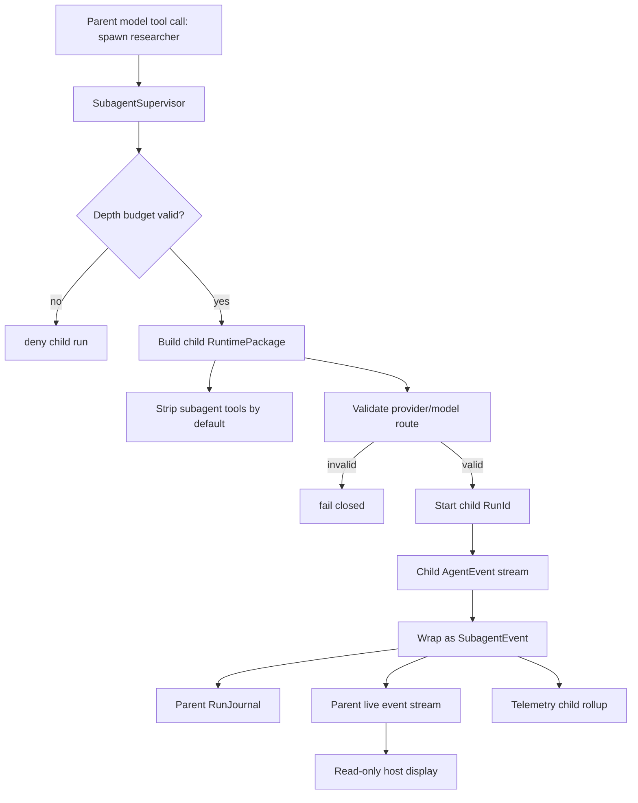
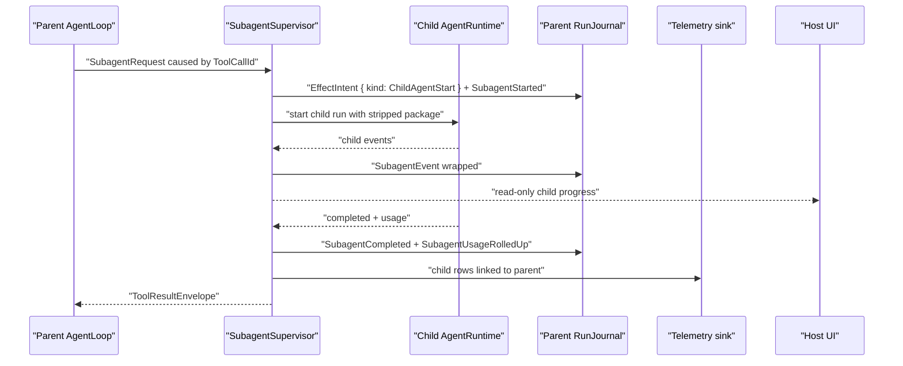
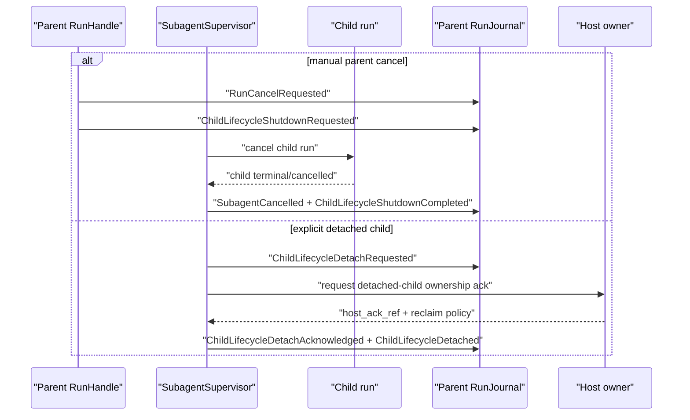

# Subagent Supervision Workflow

Subagents are parent-owned child runs, not user-chatable conversations.

## Supervision Tree

## Sequence

## Cancellation And Detach

Default behavior is parent-owned cleanup. A child run can outlive its parent only after explicit detach policy, acknowledgement, and reclaim metadata.

## Compatibility Boundary

Provider narrative text claiming it spawned a subagent is not a child run. Only `SubagentSupervisor` can create SDK child runs.

External runtime compatibility notifications can be ingested as external runtime events, but they are not promoted to SDK child runs unless a host adapter maps them through the supervisor contract.

## Host-Owned Boundaries

- Host UI display of child progress.
- Promotion of child transcript to a normal conversation.
- External runtime compatibility notification ingestion.
- Provider/model route registry.
- Telemetry dashboard presentation.

## Events, Journals, Telemetry, And Recovery

- Events: `SubagentStarted`, `SubagentHandoff`, `SubagentEvent`, agent-pool run-message/wake events, `SubagentCompleted`, `SubagentFailed`, `SubagentCancelled`, `SubagentUsageRolledUp`, and shared `ChildLifecycle*` events.
- Journal records: child-start `EffectIntent` / `EffectResult`, `SubagentStartedRecord`, handoff/wrapped-event records, linked `RunMessageRecord` / `WakeRecord` entries, `SubagentUsageRolledUpRecord`, child `RunJournal` refs, `ChildLifecycleRecord`, and `RecoveryRecord`.
- Policy decisions: agent-pool membership/depth policy, route policy, `ContextHandoffPolicy`, child tool policy, message/wake policy, child lifecycle policy, redaction/content-capture policy, and detach/reclaim policy.
- Telemetry/cost: child run spans, child event links, usage/cost rollup, handoff counts, and terminal status are derived from parent and child journals.
- Recovery: parent completion cannot seal while a non-detached child is running, unreconciled, or missing usage rollup; duplicate subscribers cannot duplicate child runs or rollups.

## Acceptance Tests

- `child_package_strips_subagent_tools`
- `provider_narrative_subagent_text_is_ignored`
- `unknown_child_provider_route_fails_closed`
- `child_events_roll_up_usage_without_creating_chat_tab`
- `parent_cancel_cancels_child_run`
- `child_run_cannot_outlive_parent_without_detach_policy`
- `detached_child_run_records_parent_detach_intent`
- `child_journal_not_promoted_to_conversation_by_default`
