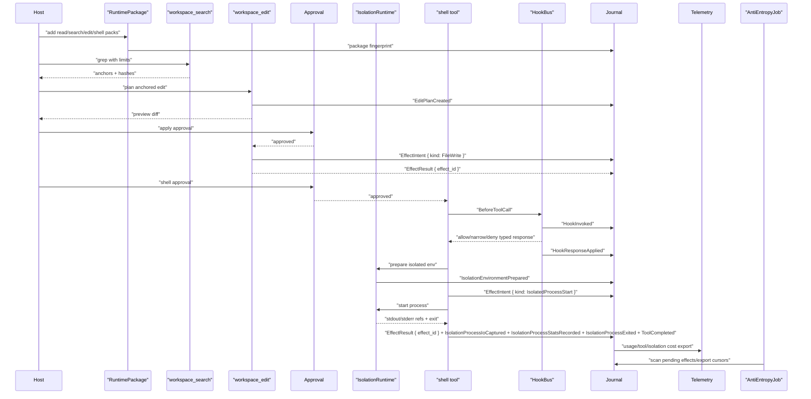
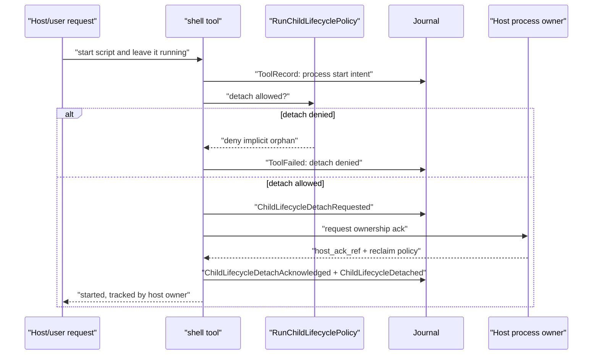
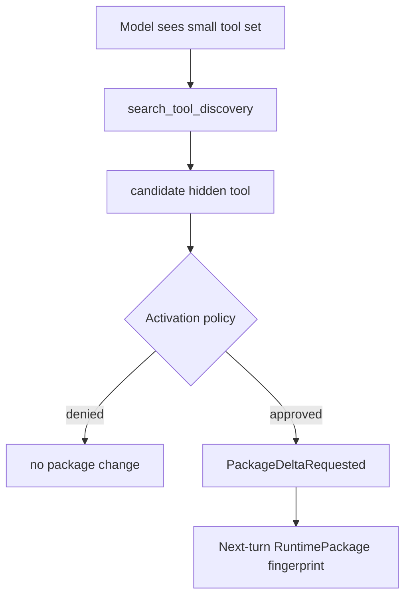
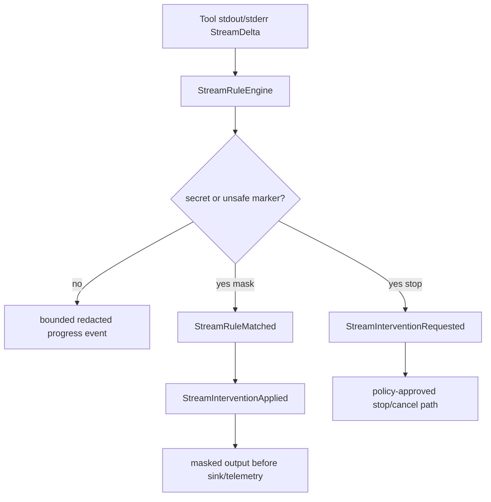
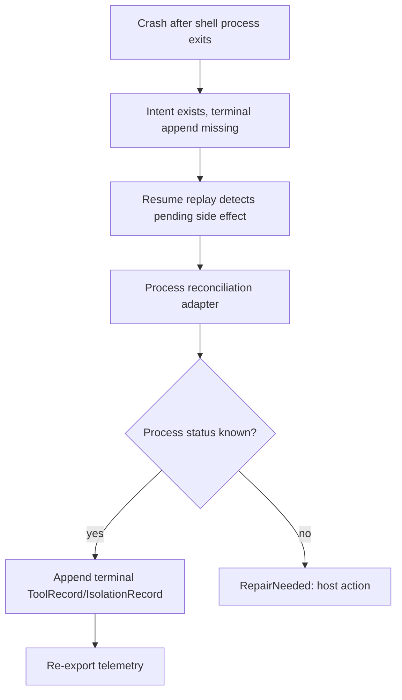

# Tool Pack, Isolation, And Anti-Entropy Workflow

This example shows a complex coding-agent-style workflow without turning the SDK into a coding product.

## Workflow

## Long-Running Process Detach

Manual cancellation of the parent run uses the same policy but defaults to shutdown: non-detached shell processes receive signal/terminate intent before the adapter is called, then terminal cleanup or recovery records are appended.

## Package Delta For Tool Discovery

Tool discovery never mutates the active package ambiently.

## Stream Rule Safety

Stream rules observe bounded stream deltas and content refs. They cannot read hidden reasoning, bypass tool policy, or deliver output directly.

## Anti-Entropy Repair

## Host-Owned Boundaries

- Which optional tool packs are installed or enabled.
- Workspace roots, symlink policy, and mount policy.
- Approval UI and autonomy settings.
- Concrete isolation runtime adapter.
- Host analytics exporter and repair scheduling.
- Product UX for review, undo, or recommendation flows.

## Events, Journals, Telemetry, And Recovery

- Events: tool, approval, hook, stream-rule, isolation, child-lifecycle, output-delivery, telemetry, and recovery families.
- Journal records: `ToolRecord`, `ApprovalRecord`, `HookRecord`, `StreamRuleRecord`, `IsolationRecord`, `ChildLifecycleRecord`, `OutputDispatchRecord`, `TelemetryRecord`, and `RecoveryRecord`.
- Policy decisions: tool permission, approval/autonomy/escalation, hook mutation rights, stream intervention, isolation class/capability/trust downgrade, child lifecycle detach/reclaim, redaction/content-capture, and telemetry sink policy.
- Telemetry/cost: tool attempts, hook latency, isolated process stats, stream-rule interventions, output delivery, and repair cursor status are projections from journal-backed events.
- Recovery: anti-entropy can append terminal records or require host action, but it never reruns file writes, shell processes, output sends, provider calls, memory writes, extension actions, or detached process ownership transfers without idempotency or explicit repair policy.

## Acceptance Tests

- `anchored_edit_rejects_stale_anchor_before_write`
- `tool_discovery_activation_creates_next_snapshot_only`
- `non_idempotent_mutation_requires_intent_record_before_execute`
- `container_required_denies_hostprocess_fallback`
- `journal_terminal_append_failure_after_side_effect_enters_recovery_and_blocks_more_side_effects`
- `anti_entropy_repairs_telemetry_summary_cursor_without_rerunning_agent`
- `start_script_detach_requires_explicit_policy_and_journal_record`
- `manual_cancel_terminates_agent_owned_shell_process_by_default`
- `before_tool_hook_cannot_silently_detach_process`
- `stream_rule_masks_secret_before_tool_output_delivery`
