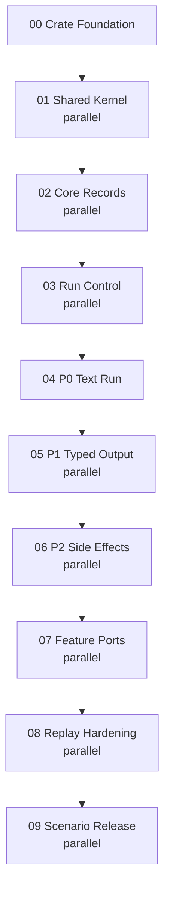

# Agent SDK Implementation Workstreams

Use this folder to launch future Rust implementation work after the contract packet exits through [Phase 07](../workstreams/07-final-review/README.md).

The rule is strict: **run phases in numeric order, and run every launch target inside the current numbered phase folder in parallel**. If one item needs another item's output, it belongs in a later phase. Sibling launch targets are parallel-safe by contract.

Launch targets use short titles such as `typed-ids`, `event-frames`, or `text-run`; they are not generic numbered labels.

## Launch Order

| Phase | Run Pattern | Purpose |
| --- | --- | --- |
| [00 Crate Foundation](00-crate-foundation/README.md) | one target | Create the Rust workspace, crate skeletons, CI/test harness, and package boundaries. |
| [01 Shared Kernel](01-shared-kernel/README.md) | all targets in parallel | Implement typed IDs, refs, errors, policy enums, fakes, and fixture harnesses used by every later phase. |
| [02 Core Records](02-core-records/README.md) | all targets in parallel | Build package, event, journal, content/context, and provider-port records over the shared kernel. |
| [03 Run Control](03-run-control/README.md) | all targets in parallel | Implement runtime ownership, loop state transitions, and reconnectable run handles. |
| [04 P0 Text Run](04-p0-text-run/README.md) | one target | Integrate the first fake-provider text run through package, context, provider, events, and journal. |
| [05 P1 Typed Output](05-p1-typed-output/README.md) | all targets in parallel | Add output contracts, local validation/repair, and typed result publication over the P0 loop. |
| [06 P2 Side Effects](06-p2-side-effects/README.md) | all targets in parallel | Add approval, tool execution, output delivery, hooks, and core telemetry over the shared effect spine. |
| [07 Feature Ports](07-feature-ports/README.md) | all targets in parallel | Add reserved feature-layer ports and optional crates without making them P0/P1 requirements. |
| [08 Replay Hardening](08-replay-hardening/README.md) | all targets in parallel | Fill golden fixtures, replay/recovery coverage, performance, and privacy hardening. |
| [09 Scenario Release](09-scenario-release/README.md) | all targets in parallel | Prove generic scenarios, public API readiness, docs, and release packaging. |

Do not start a later phase until the previous phase README exit gate is checked and the phase exit report records reviewer PASS.

## Testing And Parallelism Strategy

The phase graph is shaped around test seams:

- Phase 00 creates the workspace, cargo commands, fixture layout, and optional-crate boundaries.
- Phase 01 creates deterministic fakes and shared types before any domain service depends on them.
- Phase 02 splits independent durable record families so package, event, journal, context, and provider DTOs can each get their own fixtures.
- Phase 03 keeps runtime control independent from the first complete run so state-machine and reconnect tests can fail locally.
- Phase 04 is the first integration gate: P0 must pass one fake-provider text run before typed output or side effects start.
- Phase 05 proves typed output over the same run loop, with local validation and repair fixtures.
- Phase 06 proves P2 side effects with policy matrices and intent-before-effect journal tests.
- Phase 07 adds optional feature ports only after P2, keeping streaming, isolation, subagents, extensions, and tool packs out of the minimal core profiles.
- Phase 08 exists specifically to close cross-cutting fixture, replay, privacy, and performance gaps before release scenarios.
- Phase 09 runs scenario, API, and release checks in parallel after the hardening phase has made the evidence stable.

If a future implementer finds a hidden dependency between two sibling launch targets, do not coordinate through shared mutable work. Move the dependent work into the next numbered phase and update this launch map.

## Phase Graph



## Launch Protocol

For a phase folder, launch one Codex run per non-README markdown file directly inside that folder. Point each run at one launch target:

```text
/goal Work in /Users/clawdia/clawdia_sdk using docs/implementation-workstreams/<NN-phase>/<short-title>.md as the launch doc.
Read README.md, docs/start-here.md, coding_standards.md, docs/implementation-workstreams/README.md, docs/workstreams/validation-gates.md, docs/reference/sdk-review-checklist.md, docs/architecture/primitive-map.md, the phase README, the launch doc, and all named contract inputs.
Do not create a branch.
Edit only the implementation surfaces named in the launch doc. If a named path does not exist yet, create it only when that launch doc owns it.
Preserve the primitive kernel: layer features over Agent/RunRequest/RuntimePackage/AgentEvent/RunJournal/PolicyRef/SourceRef/DestinationRef/ContentRef/EffectIntent/typed ports instead of inventing parallel concepts.
Finish with tests/fixtures, commands, primitive-lowering evidence, host-owned boundary evidence, and a review packet using docs/workstreams/validation-gates.md.
```

## Phase Exit Protocol

Each phase must leave a reviewable packet:

1. Every launch target finishes with the required handoff from [validation-gates.md](../workstreams/validation-gates.md).
2. The integration owner creates `docs/implementation-workstreams/<NN-phase>/_phase/phase-exit-report.md`.
3. Phase-level tests and audits pass, including `cargo fmt --check`, relevant `cargo test` commands, golden fixtures, scenario tests where named, link/path audits, product-neutrality checks, and no-mini-SDK checks.
4. A dedicated reviewer returns PASS or blocking findings.
5. The phase README exit gate is checked only after the reviewer PASS is recorded.

## Folder Contract

- Numbered folders are dependency phases.
- Non-README markdown files directly inside a numbered folder are launch targets.
- Launch targets in the same numbered folder are parallel-safe.
- A target that depends on a sibling's output belongs in the next phase.
- `_phase/` folders are for phase execution plans and exit reports.
- Do not add product-specific host adapters to this implementation plan unless the user explicitly asks for a separate external task.

## Required Proof

Implementation phases must produce real code evidence, not prose-only confidence:

- compile and public export checks for touched crates;
- deterministic fake-adapter unit tests;
- golden fixtures for events, journals, package fingerprints, OTel projections, and extension protocols;
- property/table tests for reducers, fingerprints, filters, validators, and policy matrices;
- smoke tests for optional crates and packaging boundaries;
- scenario tests for generic workflows; and
- docs audits for links, ownership, product-neutrality, primitive layering, and host-owned boundaries.

The first implementation slice must prove P0 before P1, and P1 before P2.
