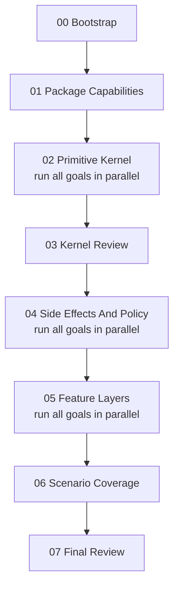

# Agent SDK Phase Workstreams

Use this folder to launch SDK planning and coding goals.

The rule is intentionally simple: **run phases in numeric order, and run every goal file inside the current numbered phase folder in parallel**. If a goal depends on another goal, it belongs in a later numbered folder.

## Launch Order

| Phase | Run Pattern | Purpose |
| --- | --- | --- |
| [00 Bootstrap](00-bootstrap/README.md) | one goal | Prepare the launch structure, primitive decision ladder, source audit, and feature matrix. |
| [01 Package Capabilities](01-package-capabilities/README.md) | one goal | Freeze runtime-package, capability, sidecar, catalog, and fingerprint primitives first. |
| [02 Primitive Kernel](02-primitive-kernel/README.md) | all goals in parallel | Freeze core API, events/journal, and context/output projection over the package spine. |
| [03 Kernel Review](03-kernel-review/README.md) | one goal | Reconcile Phase 01 and Phase 02 outputs before side-effect work starts. |
| [04 Side Effects And Policy](04-side-effects-policy/README.md) | all goals in parallel | Align tools, output delivery, telemetry/privacy, and hooks on the shared effect/policy spine. |
| [05 Feature Layers](05-feature-layers/README.md) | all goals in parallel | Layer streaming, isolation, subagents, and extensions over the frozen kernel. |
| [06 Scenario Coverage](06-scenario-coverage/README.md) | one goal | Prove generic scenarios compose from the primitives without importing product behavior. |
| [07 Final Review](07-final-review/README.md) | one goal | Run whole-packet review and decide readiness for coding. |

Do not run a later phase until the previous phase README exit gate passes. Phases 04, 05, and 06 include explicit stitching checkpoints: blocking cross-cutting proposals must be accepted, rejected, or deferred with an owner before the next phase starts.

## How To Launch A Goal

For a phase folder, launch one Codex goal per non-README goal file in that folder; all sibling goals are parallel-safe by contract. Point each Codex run at one goal file directly:

```text
/goal Work in /Users/clawdia/clawdia_sdk using docs/workstreams/<NN-phase>/<goal>.md as the launch doc.
Read README.md, docs/start-here.md, coding_standards.md, docs/workstreams/validation-gates.md, docs/reference/sdk-review-checklist.md, docs/architecture/primitive-map.md, the phase README, the goal doc, the owner role doc, and its read-only dependencies.
Do not create a branch. For documentation-only work, do not create Rust source, executable tests, package manifests, or fixtures.
Edit only the writable files listed in the goal doc and owner role doc.
Preserve the primitive kernel: layer features over Agent/RunRequest/RuntimePackage/AgentEvent/RunJournal/PolicyRef/SourceRef/DestinationRef/ContentRef/EffectIntent/typed ports instead of inventing parallel concepts.
Finish with the required validation evidence and a review packet using docs/workstreams/validation-gates.md.
```

## Folder Contract

- Numbered folders are dependency phases.
- Goal files directly inside a numbered folder are parallel-safe with each other.
- A `README.md` inside each numbered folder defines the phase exit gate.
- `_roles/` contains ownership and writable-scope authority. These are not launch targets.
- `_templates/` contains templates only. These are not launch targets.
- [validation-gates.md](validation-gates.md) defines shared validation and review evidence.

## Owner Roles

Owner role docs keep writable scopes and future implementation scopes disjoint. A phase goal points to exactly one owner role.

| Role | Owns |
| --- | --- |
| [00 Integration And Stitching](_roles/00-integration-stitching.md) | Shared names, IDs, indices, phase docs, runtime-package schema, feature matrix, final validation. |
| [01 Core API And Runtime](_roles/01-core-api-runtime.md) | Core API, run handle/reconnect, hook lifecycle. |
| [02 Events, Journal, And Replay](_roles/02-events-journal-replay.md) | Event schema, journal/replay schema. |
| [03 Context, Memory, And Structured Output](_roles/03-context-structured-output.md) | Context/memory contract and structured output. |
| [04 Tools, Approval, And Tool Packs](_roles/04-tools-approval-toolpacks.md) | Tool approval and tool-pack contracts. |
| [05 Streaming And Realtime Rules](_roles/05-streaming-realtime-rules.md) | Stream-rule contract. |
| [06 Isolation And Execution](_roles/06-isolation-execution.md) | Isolation runtime contract. |
| [07 Subagents And Coordination](_roles/07-subagents-coordination.md) | Subagent contract. |
| [08 Extension SDK And Packaging](_roles/08-extension-sdk-packaging.md) | Extension SDK contract. |
| [09 Telemetry, Privacy, And Cost](_roles/09-telemetry-privacy-cost.md) | OTel mapping and telemetry/privacy contracts. |
| [10 Generic Scenario Coverage](_roles/10-generic-scenario-coverage.md) | Generic examples. |
| [11 Output Delivery And Channels](_roles/11-output-delivery-channels.md) | Output delivery contract. |

## Execution Graph



## Parallel Agent Rules

- Edit only files listed in the goal doc and owner role doc.
- Treat every other file as read-only unless the goal explicitly delegates a narrow stitching reconciliation.
- Shared architecture docs under `docs/architecture/` and shared reference docs under `docs/reference/` are writable only by the integration role unless a goal explicitly says otherwise.
- If a goal needs a shared rename, new event family, new ID type, changed runtime-package fingerprint input, or new primitive, include a proposal block in the handoff unless the goal is an integration/stitching goal.
- Keep product-specific behavior out of active SDK handoff docs unless the user explicitly asks for a separate external host-adapter task.
- End with changed files, validation performed, primitive-lowering evidence, unresolved risks, and cross-cutting proposal blocks.
